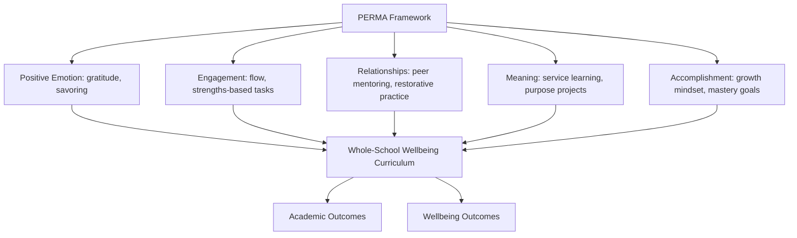

## The Positive Education Movement

### Overview

Positive education is the application of positive psychology principles and empirical findings to educational settings, with the stated goal of promoting both academic achievement and student wellbeing simultaneously, rather than treating these as competing priorities. The movement emerged largely from Martin Seligman's work extending positive psychology (originally focused on adult flourishing) into K-12 and higher-education contexts, formalized in part through the "Geelong Grammar School" project in Australia, often cited as one of the first large-scale, whole-school implementations.

### Foundational Premise: Wellbeing and Achievement as Complementary

**Key Points**

- Traditional education systems have historically prioritized academic/cognitive skill development, often treating wellbeing (or its absence, e.g., anxiety, disengagement) as a secondary concern to be addressed only when it interferes with academic performance
- Positive education inverts this framing, treating wellbeing skills (emotional regulation, resilience, positive relationships, character strengths) as a *co-equal curricular goal* alongside traditional academic subjects, on the premise that these are complementary rather than competing outcomes
- The empirical justification draws heavily on findings that student wellbeing is positively associated with academic engagement, attendance, and achievement, and that wellbeing skills can be explicitly taught rather than left to incidental development

### The PERMA Framework as Curricular Foundation

Seligman's PERMA model (Positive Emotion, Engagement, Relationships, Meaning, Accomplishment) is the most commonly used organizing framework for positive education curricula:

| PERMA Element | Educational Application |
| --- | --- |
| Positive Emotion | Gratitude practices, savoring exercises, classroom climate interventions |
| Engagement | Flow-oriented pedagogy, strengths-based task design, challenge-skill matching |
| Relationships | Peer mentoring structures, restorative practice, social-emotional learning (SEL) curricula |
| Meaning | Service learning, values clarification exercises, purpose-oriented projects |
| Accomplishment | Growth mindset framing, mastery-oriented goal structures, strengths-based feedback |

**[Unverified]** Some positive education programs use extended or modified versions of PERMA (e.g., adding "Health" to form "PERMA-H"); the specific model variant used varies by program and should be checked against the specific curriculum's documentation rather than assumed uniform across all positive education implementations.

### Whole-School Implementation Models

**Key Points**

- **Geelong Grammar School (Australia)**: widely cited as the first major whole-school implementation, involving staff-wide training in positive psychology concepts, embedding wellbeing content across the curriculum (not as a standalone subject), and staff modeling of wellbeing practices, developed in collaboration with Seligman's research group
- Implementation models generally fall along a spectrum from **standalone wellbeing curriculum** (a dedicated class period, similar to how SEL is often implemented) to **fully embedded/infused approach** (wellbeing principles integrated into the teaching of existing subjects — e.g., using literature analysis to explore character strengths, or framing mathematics challenges through growth-mindset language)
- **[Inference]** The embedded/infused approach is generally argued by proponents to produce more durable behavior change than standalone curricula, on the theory that skills practiced across contexts generalize better than skills taught in an isolated period; however, rigorous comparative trials directly testing embedded versus standalone approaches head-to-head are less common than program-evaluation studies of either approach in isolation, so this comparative claim should be treated as a reasoned argument rather than a settled empirical finding

### Character Strengths in Educational Contexts

- The VIA Classification of Character Strengths (Peterson & Seligman) is frequently used as a foundation for strengths-based pedagogy, in which students identify their signature strengths and are taught to apply them deliberately to academic and social challenges
- **Strengths-spotting** practices (teachers and peers explicitly naming strengths they observe in a student's behavior) are commonly used as a classroom-level intervention, theorized to build self-efficacy and positive self-concept through externally validated recognition
- **[Unverified]** Comparative effect sizes of strengths-based interventions versus deficit-focused/remediation-based approaches vary considerably across published studies, and the field has not converged on a single consistent effect-size estimate; specific numeric claims should be checked against current meta-analytic sources rather than treated as fixed

### Overlap and Distinction from Social-Emotional Learning (SEL)

**Key Points**

- Positive education and SEL (Social-Emotional Learning, associated with frameworks like CASEL's five competencies: self-awareness, self-management, social awareness, relationship skills, responsible decision-making) share substantial conceptual overlap and are sometimes used interchangeably in practice
- A common distinction drawn in the literature: SEL frameworks historically emphasize competency development and problem prevention (e.g., reducing bullying, improving emotional regulation to prevent dysregulation), while positive education frameworks place additional emphasis on the deliberate cultivation of flourishing and positive states (not merely the absence of dysfunction) — reflecting positive psychology's broader distinction between treating pathology and building flourishing
- **[Speculation]** Whether this distinction reflects a substantive difference in outcomes or primarily a difference in framing/marketing between overlapping program traditions is a matter of ongoing debate among researchers in both fields, and should not be treated as a settled taxonomic boundary

### Growth Mindset Integration

- Carol Dweck's growth mindset theory (the belief that abilities can be developed through effort, as opposed to a fixed mindset viewing abilities as static) is frequently incorporated into positive education curricula under the "Accomplishment" pillar of PERMA
- Common classroom applications include process-praise (praising effort and strategy rather than innate ability), normalizing productive struggle, and reframing failure as diagnostic feedback rather than a verdict on ability
- **[Unverified]** Large-scale replication efforts for growth mindset interventions have produced mixed results, with some large studies finding smaller effect sizes than earlier smaller-scale studies suggested; current meta-analytic and replication literature should be consulted directly for an accurate picture of effect-size confidence, rather than relying on earlier enthusiastic single-study findings

### Measurement and Evaluation Challenges

**Key Points**

- Whole-school wellbeing programs are difficult to evaluate with the same rigor as pharmacological or narrowly-targeted psychological interventions, since implementation fidelity varies substantially by school, teacher buy-in, and cultural context
- Common outcome measures include student self-report wellbeing scales (e.g., adapted versions of PERMA-based wellbeing measures, life satisfaction scales), academic performance metrics, attendance/disciplinary records, and teacher-reported classroom climate measures
- **[Inference]** Because whole-school interventions are rarely subject to randomized controlled designs (schools self-select into implementation, and randomizing whole schools is logistically and ethically complex), causal claims about program effectiveness are generally weaker than claims in more tightly controlled experimental positive psychology research; this is a structural limitation of the field's evidence base rather than a flaw specific to any one program

### Criticisms and Open Debates

- **Individualization critique**: some critics argue positive education risks placing the burden of wellbeing on individual students and their mindsets, potentially deflecting attention from structural issues in education systems (underfunding, class size, curriculum overload, standardized-testing pressure) that may be primary drivers of student distress
- **Cultural applicability**: much foundational positive education research originates from Western, English-speaking, and specifically Australian/American contexts; **[Unverified]** the degree to which specific curricular content (e.g., particular gratitude or strengths exercises) transfers effectively to different cultural and educational contexts without adaptation is an open empirical question, and adaptation studies for a given target context should be reviewed directly rather than assuming direct transferability
- **Commercialization concerns**: the rapid growth of positive education as a marketable school brand/program category has led some researchers to caution that program adoption sometimes outpaces the evidence base supporting specific commercial curricula

### Common Pitfalls

- Treating positive education as synonymous with "just being positive" or suppressing negative emotions, rather than as a structured skill-building and curriculum-integration approach
- Assuming any program branded as "positive education" has equivalent evidentiary support; program quality and evaluation rigor vary substantially
- Implementing standalone wellbeing lessons without staff buy-in or embedding, which tends to produce weaker and less durable effects than whole-school cultural integration
- Overlooking structural/systemic contributors to student distress in favor of purely individual-level skill interventions

### Related Topics

- PERMA model and its application beyond educational contexts
- VIA Classification of Character Strengths and strengths-spotting pedagogy
- Social-Emotional Learning (SEL) and the CASEL framework
- Growth mindset theory (Dweck) and replication debates
- Geelong Grammar School positive education case study
- Whole-school intervention design and implementation fidelity research
- Resilience curricula in K-12 education (e.g., Penn Resiliency Program)
- Student flourishing measurement instruments