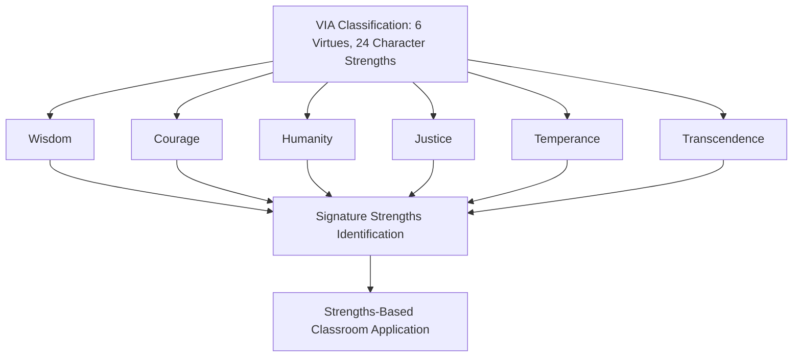

## Character Education and Social-Emotional Learning Frameworks

### Overview

Character education and social-emotional learning (SEL) represent two historically distinct but increasingly convergent traditions for developing non-academic competencies in students. Character education emphasizes the cultivation of virtues and moral character (often with roots in Aristotelian virtue ethics), while SEL emphasizes the development of specific, measurable psychosocial competencies (self-awareness, self-management, social awareness, relationship skills, responsible decision-making). Positive psychology intersects with both traditions primarily through the VIA Classification of Character Strengths and through PERMA-aligned wellbeing frameworks, providing an empirically grounded taxonomy that bridges the moral-philosophical language of character education with the competency-based language of SEL.

### Character Education: Historical and Conceptual Roots

**Key Points**

- Character education traces conceptually to Aristotelian virtue ethics, which frames good character as habituated virtuous action (practical wisdom, courage, temperance, justice) rather than adherence to abstract rules
- Modern character education movements in the U.S. context surged in the 1990s–2000s partly in response to concerns about moral development, civic engagement, and school violence, often organized around explicit "core values" curricula (e.g., respect, responsibility, honesty)
- **[Unverified]** Different character education programs vary substantially in theoretical grounding — some are explicitly values-transmission models (teaching a fixed list of virtues), while others are more developmental/constructivist (helping students reason through moral dilemmas); a given program's approach should be checked directly rather than assumed from the "character education" label alone, since the term covers a wide range of pedagogical philosophies

### The VIA Classification as a Bridge Framework

**Key Points**

- The VIA (Values in Action) Classification of Character Strengths, developed by Christopher Peterson and Martin Seligman, identifies 24 character strengths organized under 6 broad virtue categories: Wisdom, Courage, Humanity, Justice, Temperance, and Transcendence
- Unlike earlier values-transmission character education models, the VIA framework was explicitly developed as an empirically-derived, cross-culturally validated taxonomy (drawing on comparative review of religious, philosophical, and cultural traditions), intended to function as a "positive" counterpart to the DSM's classification of pathology
- The concept of **signature strengths** (the 3–7 strengths an individual most identifies with and enacts) is central to VIA-based educational applications, with interventions typically focused on identifying and deliberately deploying signature strengths rather than uniformly instilling all 24 strengths equally

### The CASEL Framework for SEL

The Collaborative for Academic, Social, and Emotional Learning (CASEL) framework is the most widely referenced SEL structure in U.S. education policy and research, organized around five core competencies:

| Competency | Description |
| --- | --- |
| Self-awareness | Recognizing one's own emotions, thoughts, and their influence on behavior; accurate self-assessment |
| Self-management | Regulating emotions, thoughts, and behaviors in different situations; impulse control, stress management, goal-setting |
| Social awareness | Understanding perspectives of and empathizing with others, including those from diverse backgrounds |
| Relationship skills | Establishing and maintaining healthy relationships; communication, cooperation, conflict resolution |
| Responsible decision-making | Making constructive choices about personal behavior based on ethical standards, safety, and social norms |

**[Unverified]** CASEL periodically revises its framework and implementation guidance (e.g., adding explicit emphasis on equity and systemic context in more recent framework iterations); the current official framework details should be checked against CASEL's published materials directly rather than relied upon from general background knowledge, since specific competency definitions and implementation guidance can be updated.

### Comparing Character Education and SEL Traditions

**Key Points**

- **Theoretical lineage**: character education draws primarily from moral philosophy and virtue ethics; SEL draws primarily from developmental psychology and social-cognitive theory
- **Measurement orientation**: character education has historically been less standardized in measurement (given its roots in values rather than discrete skills); SEL frameworks like CASEL's were developed with an explicit emphasis on measurable, teachable competencies, facilitating more standardized assessment instrument development
- **Scope of moral content**: character education typically incorporates explicit moral/ethical content (what is right or good); SEL frameworks are often framed as ethically neutral skill-building (e.g., "self-management" is presented as a universally beneficial skill regardless of the goals it serves), though this framing itself is debated, since critics note that "responsible decision-making" inherently embeds value judgments
- **[Inference]** In practice, many implemented programs blend both traditions substantially, using SEL's competency-based measurement infrastructure to operationalize outcomes that are conceptually rooted in character education's virtue language (e.g., measuring "kindness" as a discrete, assessable behavior); the degree of blending varies by specific program and should not be assumed uniform

### Positive Psychology's Integration Points

- **PERMA alignment**: SEL's "relationship skills" and "social awareness" competencies map conceptually onto PERMA's "Relationships" pillar; "self-management" partially overlaps with emotional regulation content relevant to "Positive Emotion"
- **Strengths-based reframing of SEL delivery**: some integrated programs deliver SEL competency content through the lens of character strengths (e.g., teaching "responsible decision-making" by connecting it to a student's signature strength of "prudence" or "judgment"), theorized to increase student engagement and personal relevance compared to abstract competency instruction
- **Growth and flourishing emphasis**: consistent with positive psychology's broader distinction between remediating deficits and building flourishing, integrated character-SEL programs often explicitly frame competency development as building toward flourishing outcomes, not merely preventing negative outcomes (bullying, substance use, disciplinary incidents)

### Implementation Approaches

**Example**

Common implementation models across both traditions include:

1. **Standalone curriculum**: a dedicated class period or advisory block delivering structured character/SEL lessons (common in many U.S. elementary programs)
2. **Infusion model**: embedding character/SEL content into existing academic subject instruction (e.g., analyzing character strengths of protagonists in literature, using historical case studies to explore ethical decision-making)
3. **Schoolwide culture model**: character/SEL language and expectations integrated into disciplinary policy, school mission statements, and staff modeling, extending beyond discrete lesson delivery into ambient school culture
4. **Restorative practices integration**: using restorative justice/circle processes (which address relationship repair after conflict) as an applied setting for practicing relationship-skills and social-awareness competencies

### Evidence Base and Evaluation Considerations

**Key Points**

- Meta-analyses of SEL programs (notably work associated with CASEL-affiliated researchers, e.g., Durlak and colleagues) have reported positive average effects on academic performance, prosocial behavior, and reduced conduct problems across multiple studies, though **[Unverified]** specific effect-size figures vary by meta-analysis, publication year, and inclusion criteria, and current meta-analytic sources should be consulted for up-to-date estimates rather than relying on any single historical figure
- Character education program evaluation has historically been less consistent in rigor than SEL evaluation, partly due to the greater diversity of theoretical approaches and outcome definitions across character education programs, making cross-program comparison more difficult
- **[Speculation]** Long-term (multi-year, into-adulthood) outcome tracking for either tradition is comparatively sparse relative to short-term academic-year outcome studies; claims about durable adult-life impact of school-based character/SEL programs should be treated as more speculative than claims about near-term in-school outcomes, pending stronger longitudinal evidence

### Common Pitfalls

- Treating "character education" and "SEL" as fully interchangeable terms, obscuring their different theoretical starting points and the value-neutrality debates specific to SEL framing
- Assuming a program's use of trendy language (e.g., "growth mindset," "grit," "character strengths") indicates rigorous grounding in the underlying research, when program quality and fidelity to the source framework vary widely
- Evaluating character/SEL programs using purely short-term behavioral or academic proxies without capturing durable competency or virtue development
- Overlooking the values embedded in ostensibly "neutral" SEL competencies (e.g., what counts as a "responsible" decision is not culturally or ethically neutral)

### Related Topics

- VIA Classification of Character Strengths and signature strengths interventions
- CASEL framework and SEL competency assessment instruments
- Aristotelian virtue ethics and its influence on modern character education
- Restorative practices and circle processes in school discipline
- Positive education movement and whole-school wellbeing integration
- Growth mindset theory and its relationship to self-management competencies
- Longitudinal outcome research design challenges in school-based intervention evaluation