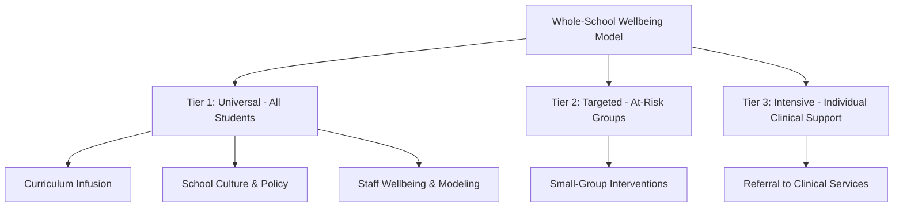

## Whole-School Well-Being Models

### Overview

Whole-school wellbeing models are systemic frameworks for embedding student and staff wellbeing across every level of a school's structure — curriculum, pedagogy, policy, physical environment, and culture — rather than confining wellbeing efforts to a discrete class period or isolated program. These models represent the primary implementation architecture through which positive education principles (see: the positive education movement) are operationalized at scale, and they draw on organizational change theory and systems thinking as much as on positive psychology content itself.

### Core Premise: Systemic Integration vs. Program Bolt-On

**Key Points**

- The central distinguishing feature of whole-school models is that wellbeing is treated as a property of the *entire system* (curriculum design, teacher practice, leadership behavior, physical space, disciplinary policy, family engagement) rather than as a supplementary program layered onto an otherwise unchanged school
- This contrasts with a "bolt-on" approach, in which a wellbeing curriculum, guest-speaker series, or single course is added without corresponding changes to teaching practice, assessment structures, or school culture
- **[Inference]** Bolt-on approaches are widely argued in the implementation literature to produce weaker and less durable effects than systemic approaches, on the theory that isolated programs can be undermined by contradictory signals elsewhere in the system (e.g., a wellbeing lesson on stress reduction delivered in a school culture that simultaneously valorizes overwork); however, rigorous controlled comparisons directly testing bolt-on versus systemic implementation are less common than descriptive case studies, so the *magnitude* of this difference should be treated as a reasoned inference rather than a precisely quantified finding

### Common Structural Frameworks

Several structural models are used to organize whole-school wellbeing implementation:

| Framework | Organizing Logic |
| --- | --- |
| PERMA-based whole-school model | Curriculum and culture organized around the five PERMA pillars (Positive Emotion, Engagement, Relationships, Meaning, Accomplishment) |
| Multi-tiered System of Support (MTSS) for wellbeing | Tiered intervention: universal (Tier 1, whole-school) → targeted (Tier 2, at-risk groups) → intensive (Tier 3, individual clinical support) |
| Ecological/systems model | Wellbeing addressed at nested levels: classroom, whole-school, family, and community, echoing Bronfenbrenner's ecological systems theory |
| Health-Promoting Schools framework (WHO-associated) | Wellbeing integrated with physical health promotion, school environment, and community/family partnership, historically predating positive-psychology-specific frameworks but conceptually overlapping |

### Multi-Tiered System of Support (MTSS) Applied to Wellbeing

**Key Points**

- Adapted from the MTSS/Response-to-Intervention framework originally developed for academic and behavioral support, this model organizes wellbeing provision into three tiers by intensity and target population
- **Tier 1 (universal)**: wellbeing content delivered to the entire student body, typically through curriculum infusion, classroom practices (e.g., gratitude routines, strengths-spotting), and schoolwide policy (e.g., anti-bullying frameworks, restorative discipline)
- **Tier 2 (targeted)**: small-group interventions for students showing early signs of difficulty (e.g., social skills groups, resilience-building groups for students experiencing family transition)
- **Tier 3 (intensive)**: individualized clinical or counseling support for students with significant mental health needs, typically involving referral to school psychologists, counselors, or external clinical providers
- This tiered structure allows whole-school models to allocate resources proportionally, reserving intensive individual support for students who need it while still providing universal wellbeing exposure to the full population

### Staff Wellbeing as a Structural Prerequisite

**Key Points**

- A recurring finding across whole-school model implementations is that staff wellbeing and teacher modeling of wellbeing behaviors function as a precondition for effective student-facing implementation, not merely a parallel concern
- The reasoning (frequently articulated in program design documents) is that teachers cannot authentically model or teach emotional regulation, resilience, or positive relational skills while experiencing unaddressed burnout or chronic stress themselves — connecting whole-school models conceptually to the caregiver resilience and compassion fatigue literature
- Some whole-school frameworks (e.g., the Geelong Grammar School model) explicitly sequence implementation so that staff receive wellbeing training and support *before* student-facing curriculum rollout, on the premise that staff buy-in and authentic modeling substantially affect implementation fidelity

### School Culture and Physical/Policy Environment

- **Disciplinary policy alignment**: restorative practices (structured processes for repairing relational harm after conflict, as opposed to purely punitive discipline) are frequently integrated into whole-school wellbeing models as the disciplinary-policy expression of relationship-skill and social-awareness competencies
- **Physical environment**: some frameworks (particularly those aligned with Health-Promoting Schools models) extend wellbeing considerations to physical space design (natural light, outdoor space access, sensory-friendly areas) and nutrition/physical activity policy, reflecting a broader embodied-wellbeing perspective beyond purely psychological content
- **Family and community engagement**: ecological/systems-oriented whole-school models typically include structured family engagement components (parent workshops, shared language/framework communication with families) on the premise that wellbeing skills reinforced only at school but contradicted at home show weaker generalization

### Implementation Sequencing

**Example**

A commonly described implementation sequence for whole-school wellbeing models follows roughly these phases:

1. **Needs assessment and baseline measurement**: survey student and staff wellbeing, review existing disciplinary/attendance data
2. **Leadership and staff buy-in building**: securing administrative commitment and staff training, often before any student-facing changes
3. **Staff wellbeing and professional development**: training staff in the framework's core concepts and practices, with attention to staff's own wellbeing needs
4. **Curriculum and culture integration**: embedding framework language and practices into existing subjects, classroom routines, and schoolwide policy (rather than only adding a standalone class)
5. **Ongoing measurement and iteration**: repeated wellbeing surveys and outcome tracking to identify implementation gaps and adjust practice

**[Unverified]** The specific sequencing, timeline, and staffing requirements vary considerably across published program models, and any claim about a "standard" implementation timeline (e.g., "full implementation typically takes X years") should be checked against the specific program's documentation rather than treated as a fixed industry norm.

### Measurement Approaches

- **Student-level wellbeing surveys**: adapted PERMA-based instruments, life satisfaction scales, or validated child/adolescent wellbeing measures administered at baseline and follow-up intervals
- **Systemic/proxy indicators**: attendance rates, disciplinary referral rates, suspension rates, and academic engagement metrics are commonly used as indirect indicators of whole-school climate change, though **[Inference]** these proxies can be affected by many factors beyond the wellbeing intervention itself (e.g., concurrent policy changes, staffing changes), so attributing shifts in these metrics solely to a wellbeing program requires caution about confounding variables
- **Staff climate surveys**: measuring teacher-reported burnout, sense of support, and perceived administrative backing, given the structural-prerequisite role of staff wellbeing discussed above

### Evaluation Challenges Specific to Whole-School Designs

**Key Points**

- Randomized controlled trial designs are difficult to apply at the whole-school level, since randomizing entire schools to intervention/control conditions is logistically complex, expensive, and raises ethical/practical concerns about withholding a wellbeing program from a control group of students
- Most whole-school program evaluations therefore rely on quasi-experimental designs (matched comparison schools, pre-post designs within a single school, or staggered rollout designs), which provide weaker causal inference than individual-level randomized studies
- **[Speculation]** This structural evaluation limitation means the whole-school model evidence base, while extensive in descriptive case-study form, is comparatively thinner in high-confidence causal evidence than more narrowly-scoped, individually randomized positive psychology interventions (e.g., single gratitude-journal studies); this is a reasonable inference from the methodological landscape rather than a claim drawn from a specific meta-analytic source, and should be checked against current systematic reviews if precision is required

### Common Pitfalls

- Implementing wellbeing curriculum content without corresponding attention to school culture, disciplinary policy, or staff wellbeing, resulting in a "bolt-on" program vulnerable to being undermined by contradictory systemic signals
- Neglecting staff wellbeing as a prerequisite, expecting teachers to authentically deliver wellbeing content while experiencing unaddressed burnout
- Relying solely on proxy metrics (attendance, discipline referrals) without direct wellbeing measurement, risking misattribution of unrelated changes to the wellbeing program
- Assuming whole-school model outcomes from one cultural/institutional context (e.g., an Australian independent school) transfer directly to a different educational and cultural context without adaptation

### Related Topics

- The positive education movement and PERMA-based curricular design
- Multi-Tiered System of Support (MTSS) in academic and behavioral contexts
- Health-Promoting Schools framework (WHO)
- Restorative practices and school disciplinary policy reform
- Compassion fatigue and staff/caregiver resilience as an implementation prerequisite
- Character education and SEL frameworks as curricular content sources
- Quasi-experimental design challenges in whole-institution program evaluation