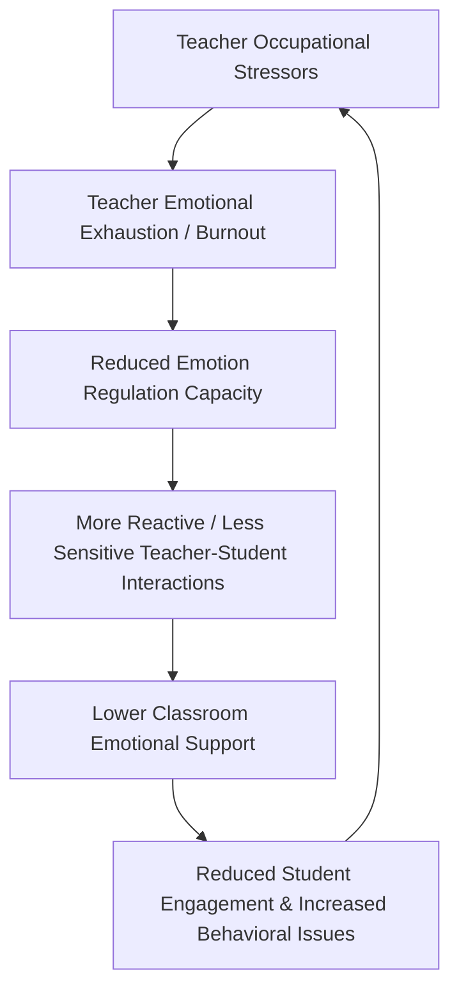

## Teacher Well-Being and Classroom Emotional Climate

### Overview

Teacher wellbeing and classroom emotional climate are treated in positive education research as causally linked rather than independent phenomena: a teacher's own emotional state, regulation capacity, and stress level directly shape the affective quality of the classroom environment, which in turn influences student engagement, behavior, and learning outcomes. This chapter addresses the mechanisms connecting teacher wellbeing to classroom climate, the structural and occupational stressors specific to teaching, and intervention approaches operating at both the individual-teacher and systemic level.

### Conceptualizing Classroom Emotional Climate

**Key Points**

- **Classroom emotional climate (CEC)** refers to the aggregate emotional tone of a classroom — the extent to which interactions are characterized by warmth, respect, and positive affect versus tension, criticism, or negative affect — and is typically assessed through observational protocols rather than self-report alone
- The **Classroom Assessment Scoring System (CLASS)**, developed by Robert Pianta and colleagues, is among the most widely used observational frameworks, assessing classrooms across domains including Emotional Support, Classroom Organization, and Instructional Support, with Emotional Support further broken into dimensions like positive climate, negative climate, teacher sensitivity, and regard for student perspectives
- **[Unverified]** Specific CLASS domain structures and scoring procedures vary somewhat by grade-band version (e.g., Pre-K, K-3, upper elementary, secondary); current official CLASS manual documentation should be consulted for the precise dimension set and scoring criteria for a given grade band rather than assuming a single universal structure

### The Mechanism Linking Teacher Wellbeing to Classroom Climate

**Key Points**

- **Emotional contagion**: student affect and behavior are theorized to partially mirror teacher affect through emotional contagion processes, meaning a dysregulated or exhausted teacher's stress can propagate into student behavior and classroom tone
- **Reduced regulatory capacity**: chronic occupational stress depletes teachers' self-regulatory resources (consistent with ego-depletion and related ecological-momentary-assessment findings on stress and self-control), leading to more reactive, less patient responses to classroom disruptions
- **Feedback loop**: the diagram above reflects a commonly described *cyclical* relationship — low classroom climate produces more student behavioral challenges, which in turn increases teacher stress, creating a potentially self-reinforcing negative spiral absent intervention; the same logic applies in reverse for positive cycles, where teacher wellbeing supports positive climate, which reduces behavioral demands and further supports teacher wellbeing

### Teacher-Specific Occupational Stressors

- **Emotional labor**: teaching is a paradigmatic emotional-labor occupation (per Arlie Hochschild's foundational framework), requiring teachers to display specific emotions (patience, enthusiasm, warmth) regardless of their internal state; **surface acting** (displaying an emotion without genuinely feeling it) is associated with greater emotional exhaustion than **deep acting** (genuinely working to feel the required emotion), a distinction frequently applied to teacher burnout research
- **Classroom management demands**: student behavioral challenges are consistently identified as one of the strongest predictors of teacher stress and burnout, particularly for early-career teachers with less-developed classroom management repertoires
- **Administrative and accountability pressure**: standardized testing accountability regimes, curriculum pacing mandates, and administrative compliance burden are frequently cited structural stressors distinct from classroom-level interpersonal stress
- **Role overload**: teachers frequently report role expansion beyond instructional duties (informal counseling, administrative tasks, extracurricular supervision) without corresponding time or compensation adjustment

### Teacher Self-Efficacy as a Protective Factor

**Key Points**

- **Teacher self-efficacy** (a domain-specific application of Bandura's self-efficacy construct, referring to a teacher's belief in their capacity to effectively manage classroom challenges and support student learning) is one of the most consistently identified protective factors against burnout in the teacher-wellbeing literature
- High self-efficacy teachers are associated with more effective classroom management, greater persistence with challenging students, and — per multiple studies — better classroom emotional climate ratings, plausibly because efficacious teachers approach disruptions with a problem-solving orientation rather than a threat-appraisal response
- **[Inference]** Self-efficacy appears to function partly as a buffer against the stress-exhaustion-reactivity cycle described above, by supporting more deliberate/regulated responses to classroom challenges rather than purely reactive ones; this is a coherent theoretical account consistent with the broader stress-appraisal literature but should be understood as an inferred mechanism rather than a fully isolated causal pathway confirmed by controlled experimentation

### Intervention Approaches for Teacher Wellbeing

**Example**

Interventions targeting teacher wellbeing and, by extension, classroom climate generally cluster into three levels:

1. **Individual-level interventions**: mindfulness-based stress reduction programs adapted for educators (e.g., CARE — Cultivating Awareness and Resilience in Education — a program specifically developed and studied for teacher populations), emotion-regulation skills training, and self-compassion practices
2. **Classroom-practice interventions**: training in specific classroom management and relationship-building strategies (e.g., responsive classroom approaches, restorative practices) that reduce the frequency and intensity of disruptive interactions, thereby reducing a major stressor source
3. **Organizational/systemic interventions**: reducing role overload, improving administrative support and instructional autonomy, and building collegial support structures (professional learning communities, peer mentoring) at the school level

**[Unverified]** Comparative effectiveness data across these three intervention levels is limited by the same evaluation challenges affecting whole-school wellbeing programs generally (difficulty of randomization at scale, variable implementation fidelity); specific program evidence (e.g., for CARE or similar named interventions) should be checked against current published evaluation studies rather than assumed uniformly effective across contexts.

### Teacher-Child/Student Relationship Quality

- Teacher-student relationship quality is frequently assessed using instruments like the **Student-Teacher Relationship Scale (STRS)**, which measures dimensions including closeness (warmth, open communication) and conflict (negativity, unpredictability in interaction)
- High-closeness, low-conflict teacher-student relationships are associated with better student academic and behavioral outcomes across multiple studies, and are theorized to function partly through increased student sense of safety and belonging (connecting to the "Relationships" pillar of PERMA and to attachment-theory-informed accounts of the teacher as a secondary attachment figure in the classroom context)
- **[Speculation]** Some researchers frame the teacher-student relationship as functioning similarly to attachment relationships in supporting student emotional regulation and exploration behavior in the classroom; this attachment-theory extension to teacher-student dynamics is a theoretically motivated framing used by some researchers rather than a fully established empirical consensus, and its explanatory scope relative to non-attachment accounts (e.g., purely social-learning-based explanations) remains debated

### Measurement Approaches

| Instrument/Method | What It Assesses |
| --- | --- |
| CLASS (Classroom Assessment Scoring System) | Observational rating of classroom emotional support, organization, instructional support |
| Student-Teacher Relationship Scale (STRS) | Teacher-reported closeness and conflict in individual teacher-student relationships |
| Maslach Burnout Inventory — Educators Survey | Teacher-specific burnout: emotional exhaustion, depersonalization, personal accomplishment |
| Teacher Self-Efficacy Scale (various versions, e.g., Tschannen-Moran & Woolfolk Hoy) | Teacher belief in capacity to manage instruction, classroom management, and student engagement |

### Common Pitfalls

- Framing classroom climate improvement purely as a matter of teacher training in classroom management techniques, while ignoring the upstream role of teacher wellbeing and occupational stress in enabling or undermining consistent application of those techniques
- Treating teacher self-care recommendations as a substitute for addressing structural stressors (role overload, inadequate administrative support, high-stakes accountability pressure) rather than a complement to structural change
- Relying solely on student outcome data (test scores, behavior referrals) to infer classroom climate quality without direct observational or relational measurement
- Assuming intervention approaches validated with experienced teachers transfer directly to early-career teachers, who typically face a different stressor profile (classroom management skill development, professional identity formation) than more experienced colleagues

### Related Topics

- Compassion fatigue, vicarious trauma, and resilience in caregivers (occupational parallel to teacher burnout)
- Whole-school wellbeing models and staff wellbeing as an implementation prerequisite
- Emotional labor theory (Hochschild) and surface/deep acting in service and caregiving occupations
- Teacher self-efficacy theory (Bandura-derived, Tschannen-Moran & Woolfolk Hoy)
- Attachment theory extensions to teacher-student relationship quality
- CLASS observational framework and its grade-band variants
- Restorative practices as a classroom-climate intervention