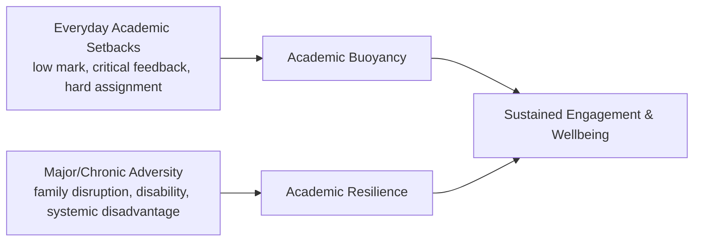

## Academic Buoyancy and Student Resilience

### Overview

Academic buoyancy and student resilience are related but empirically distinguished constructs in educational psychology. **Academic buoyancy**, introduced by Andrew Martin and Herbert Marsh, refers to a student's capacity to successfully navigate the everyday setbacks and challenges typical of ordinary academic life (a low mark, critical feedback, a difficult assignment). **Academic resilience** refers to the capacity to overcome more acute, chronic, or severe adversity (major life disruption, significant learning difficulty, sustained disadvantage) that threatens educational engagement or completion. The distinction matters because the two constructs are theorized to draw on overlapping but not identical psychological resources, and interventions calibrated to everyday setbacks may be insufficient for students facing more severe adversity, and vice versa.

### The Buoyancy–Resilience Distinction

**Key Points**

- Martin and Marsh explicitly proposed academic buoyancy as conceptually and empirically distinct from academic resilience, arguing that resilience research (drawn substantially from clinical/at-risk populations) does not fully capture the psychological processes relevant to the much larger population of students who face everyday, non-acute academic setbacks
- **Everyday adversity** (buoyancy's domain) includes things like a poor test result, challenging homework, negative feedback, or a difficult class — high-frequency, lower-severity stressors virtually all students encounter regularly
- **Major adversity** (resilience's domain) includes things like family disruption, significant learning disability, chronic health conditions, or systemic disadvantage — lower-frequency, higher-severity stressors affecting a narrower subset of students
- **[Unverified]** The degree of psychological/mechanistic overlap between buoyancy and resilience constructs (i.e., whether they share a common underlying trait or represent more distinct processes) remains an area of ongoing empirical investigation, and specific overlap correlations from any single study should be checked against current literature rather than treated as a fixed, universally replicated figure

### The 5C's Model of Academic Buoyancy

Martin's research identifies five key psychosocial factors ("the 5 C's") associated with academic buoyancy:

| Factor | Description |
| --- | --- |
| Confidence (self-efficacy) | Belief in one's capacity to understand and perform well academically |
| Coordination (planning) | Ability to plan, organize, and manage study time and tasks effectively |
| Commitment (persistence) | Willingness to persist with tasks despite difficulty or setbacks |
| Composure (low anxiety) | Capacity to manage academic anxiety and maintain emotional regulation under pressure |
| Control | A sense of having control/agency over one's academic outcomes, as opposed to feeling outcomes are externally determined |

**[Inference]** These five factors substantially overlap with broader self-regulated learning and motivation constructs found elsewhere in educational psychology (e.g., self-efficacy theory, locus of control theory); the 5C's framework can be understood as an integrative synthesis of established motivational constructs specifically applied to the buoyancy context, rather than an entirely novel discovery of previously unidentified factors, though Martin and colleagues have argued for its distinct utility as an applied, buoyancy-specific measurement framework.

### Academic Resilience: Risk and Protective Factor Models

**Key Points**

- Academic resilience research typically follows the same general risk/protective-factor logic as general resilience research (see: developmental resilience frameworks), applied specifically to educational outcomes (achievement, retention, graduation) in the presence of identified risk factors (poverty, family instability, disability, discrimination)
- Commonly identified protective factors specific to the academic-resilience literature include: at least one stable supportive adult relationship (often a teacher or mentor), a sense of school belonging, academic self-concept robust to setback, and extracurricular/community engagement providing an alternative domain of competence and belonging
- **Academically resilient students** are often operationally defined in research as students who achieve outcomes exceeding statistical expectation given their risk-factor profile (e.g., high-risk students who nonetheless achieve at or above average academic outcomes), a definitional approach that requires researchers to establish a comparison/expectation baseline, introducing some methodological variability across studies in how "resilient" is operationally defined

### Measurement Instruments

- **Academic Buoyancy Scale**: a brief self-report instrument developed by Martin and colleagues, typically assessing a small number of items capturing a student's perceived capacity to bounce back from everyday academic setbacks
- **[Unverified]** Multiple academic resilience scales exist across the literature (rather than one single dominant instrument), often adapted to specific populations or age groups (e.g., some instruments developed specifically for use with populations facing socioeconomic disadvantage); a specific instrument's psychometric validation for a given population should be checked directly rather than assumed generalizable across all populations and age ranges

### Relationship to Growth Mindset and Attributional Style

- Academic buoyancy is theoretically linked to **attributional style** (how students explain academic setbacks): students who attribute setbacks to controllable, specific, and unstable causes (e.g., "I didn't study enough for this particular test") tend to show more adaptive buoyancy responses than students who attribute setbacks to uncontrollable, global, and stable causes (e.g., "I'm just not smart"), drawing on Bernard Weiner's attribution theory framework
- **Growth mindset** (Dweck) is conceptually complementary: a growth mindset supports the *controllable/specific/unstable* attributional pattern associated with buoyant responses, since believing ability is developable makes setback attribution to insufficient effort or strategy (rather than fixed inability) more psychologically available
- **[Speculation]** Whether growth mindset functions as a direct causal input to academic buoyancy, or whether the two constructs are better understood as parallel expressions of a shared underlying motivational orientation, is not fully resolved in the literature, and researchers have proposed both framings; this should be treated as an open theoretical question rather than a settled causal claim

### Classroom and School-Level Interventions

**Example**

Interventions targeting academic buoyancy and resilience commonly include:

1. **Attributional retraining**: structured interventions teaching students to reframe setback explanations toward controllable, effort/strategy-based attributions rather than fixed-ability attributions
2. **Formative feedback practices**: feedback structured to emphasize process and strategy (consistent with growth-mindset-aligned "process praise") rather than purely evaluative, ability-implying feedback
3. **Structured goal-setting and planning support**: explicit instruction in study planning and time management, targeting the "Coordination" factor in the 5C's model
4. **Relationship-based mentoring programs**: pairing at-risk students with a consistent supportive adult, targeting the relationship-based protective factor identified in academic resilience research
5. **Belonging interventions**: brief social-belonging interventions (sometimes called "belonging uncertainty" interventions, associated with researchers like Gregory Walton) that address students' uncertainty about whether they belong in an academic environment, shown in some studies to have effects that persist beyond the immediate intervention period, particularly for students from underrepresented or historically marginalized groups

**[Unverified]** The durability and generalizability of brief social-belonging interventions across different institutional contexts and student populations has been debated in replication and meta-analytic literature; current systematic reviews should be consulted for an accurate picture of effect consistency rather than relying on early influential single-study findings.

### Common Pitfalls

- Conflating academic buoyancy (everyday setback response) with academic resilience (response to major/chronic adversity), leading to mismatched intervention design (e.g., applying resilience-level clinical support to a general student population's everyday-setback needs, or applying buoyancy-level coaching to students facing severe structural adversity)
- Treating the 5C's model as an exhaustive or entirely novel framework rather than recognizing its substantial conceptual overlap with established self-regulation and motivation constructs
- Defining "resilient" students purely by outcome (achieving despite risk) without accounting for measurement and baseline-setting methodology, which varies across studies
- Assuming a single intervention type (e.g., a mindset workshop) addresses both buoyancy and resilience needs equally, when the two constructs may respond to different intervention emphases (skill/strategy-based for buoyancy; relationship and structural-support-based for resilience)

### Related Topics

- Growth mindset theory (Dweck) and attributional style (Weiner)
- General developmental resilience frameworks and risk/protective factor models
- Social-belonging interventions in educational settings (Walton and colleagues)
- Self-regulated learning and academic self-efficacy theory
- Teacher-student relationship quality as a protective factor
- Whole-school wellbeing models and Tier 2 targeted student supports