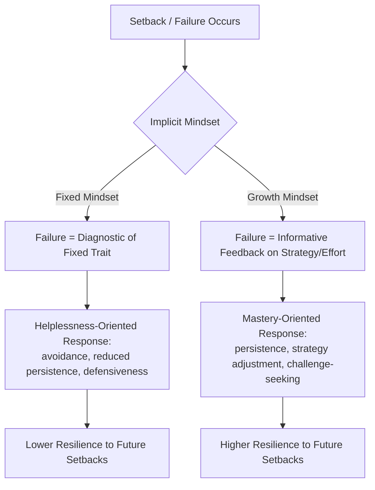

## Growth Mindset and Its Relationship to Resilience and Achievement

### Overview

Growth mindset theory, developed by Carol Dweck, proposes that individuals hold implicit beliefs about the malleability of ability (intelligence, talent, skill) that fall along a continuum from **fixed mindset** (belief that ability is a static, largely unchangeable trait) to **growth mindset** (belief that ability can be developed through effort, strategy, and learning from setbacks). This chapter addresses the theoretical mechanism linking mindset to resilience and achievement, the empirical evidence base including major replication findings, and practical/pedagogical applications, along with a candid treatment of where the evidence is stronger versus more contested.

### Core Theoretical Model

**Key Points**

- Mindset theory proposes that implicit beliefs about ability shape how individuals interpret and respond to challenge, effort, and failure — not directly determining outcomes, but shaping the psychological *meaning* assigned to setbacks
- A student with a fixed mindset facing failure is theorized to interpret the failure as diagnostic of a stable, unchangeable trait ("I failed because I'm not smart enough"), which predicts helplessness-oriented responses: avoidance of challenge, reduced persistence, and defensive strategies (e.g., avoiding effort to preserve a "smart" self-image, since visible effort implies the outcome required effort rather than confirming innate talent)
- A student with a growth mindset facing failure is theorized to interpret the failure as informative feedback about current strategy or effort level ("I need to try a different approach or put in more effort"), which predicts mastery-oriented responses: persistence, strategy adjustment, and seeking challenge as a growth opportunity
- This model draws directly on Dweck's earlier work on **learned helplessness** and **attribution theory**, extending Weiner's framework about controllable/uncontrollable and stable/unstable causal attributions into a broader implicit-theory framework

### Domain-Specificity of Mindset

**Key Points**

- Mindset beliefs are typically measured and theorized as **domain-specific** rather than fully global traits — an individual might hold a growth mindset about intelligence generally but a fixed mindset about a specific skill (e.g., "I can improve at most things, but I'm just not a math person")
- The original and most widely used measurement instrument, the **Implicit Theories of Intelligence Scale** (and its variants), typically asks respondents to rate agreement with statements like "You have a certain amount of intelligence and you can't really do much to change it," with responses aggregated into a fixed-to-growth continuum score
- **[Unverified]** Domain-specific mindset instruments for particular subjects (e.g., a "math mindset" scale distinct from a general intelligence mindset scale) exist in the literature but vary in validation quality and adoption; a specific instrument's psychometric properties should be checked directly rather than assumed comparable to the original, more thoroughly validated general-intelligence scale

### Process Praise vs. Ability Praise

**Example**

A foundational experimental paradigm in this literature (originating in Mueller & Dweck's studies) demonstrates differential effects of praise framing:

- **Ability/person praise** ("You're so smart!") is associated with subsequent helplessness-oriented responses when children face failure: reduced persistence, preference for easier tasks over challenging ones, and lower reported enjoyment of the task
- **Process/effort praise** ("You worked really hard on that!" or "You found a great strategy!") is associated with subsequent mastery-oriented responses: greater persistence, preference for challenging tasks, and more resilient responses to failure feedback
- This finding has substantially influenced pedagogical guidance recommending that teachers and parents praise process/strategy rather than innate ability, even when the underlying performance is genuinely strong

### The Relationship to Academic Resilience and Buoyancy

- Growth mindset connects directly to **academic buoyancy**'s attributional dimension: a growth-mindset-consistent attribution (setback due to insufficient effort/strategy, both controllable and specific) supports the same adaptive response pattern identified in the buoyancy literature's 5C's model, particularly the "Confidence" and "Commitment" factors
- In academic resilience contexts (major/chronic adversity), growth mindset is theorized to support the reframing of significant setbacks (e.g., a major academic failure, being held back a grade) as surmountable rather than identity-defining, though **[Speculation]** the relative contribution of mindset versus other resilience factors (social support, structural resource access) in high-adversity contexts is less thoroughly isolated in existing intervention research than mindset's role in lower-adversity, everyday-setback contexts, and should not be assumed equally influential across adversity severity levels without checking context-specific studies

### The Replication and Effect-Size Debate

**Key Points**

- Early single-study and smaller-sample findings on growth mindset interventions (particularly brief, single-session online interventions) generated substantial public and educational-policy enthusiasm, in some cases leading to claims of large achievement effects
- Subsequent large-scale replication efforts — most notably the **National Study of Learning Mindsets** (a large, nationally representative U.S. study) — have generally found **smaller average effect sizes** than earlier enthusiastic reporting suggested, while also finding that effects are not uniform: some studies report larger effects concentrated among specific subgroups (e.g., lower-achieving students, students in schools with growth-mindset-supportive peer norms) rather than a uniform effect across the entire student population
- **[Unverified]** The precise magnitude of average effect sizes reported in large-scale studies, and the specific subgroup-moderation findings, should be checked against the current published version of these studies directly, since this is an actively studied area where numeric claims can become outdated or are sometimes cited imprecisely in secondary sources
- The overall state of the evidence is best characterized as: the theoretical mechanism (attributional response to setback) remains broadly supported, but claims of large, universal, and easily-achieved improvement from brief mindset interventions are more contested than earlier popularizations suggested — this is a case where **the mechanism and the intervention-magnitude claim should be evaluated separately**, since a plausible underlying mechanism does not by itself establish that any given brief intervention reliably produces the population-level effect size sometimes claimed for it

### Common Critiques

- **False/superficial mindset adoption**: some critics (including Dweck herself in later writing) have noted that some "growth mindset" classroom implementations reduce to superficial praise-language changes (e.g., mechanically adding "yet" to failure statements) without genuine changes in task design, challenge level, or teacher response to student struggle — sometimes termed "false growth mindset"
- **Structural/resource critique**: similar to critiques of positive education broadly, some researchers argue that mindset-focused interventions risk placing the responsibility for overcoming structural educational inequities (under-resourced schools, systemic disadvantage) onto individual student belief change, potentially deflecting attention from structural reform
- **Overgeneralization from lab to classroom**: effects observed in controlled laboratory paradigms (e.g., the Mueller & Dweck praise studies) do not automatically transfer at the same magnitude to complex, multi-factor real classroom environments, where teacher-student relationship quality, curriculum design, and peer culture interact with mindset messaging in ways not captured by the original lab paradigms

### Practical Classroom Applications

**Key Points**

- **Process-oriented feedback**: structuring feedback around strategy and effort description rather than global ability judgments, applicable across both praise and constructive criticism contexts
- **Normalizing productive struggle**: explicitly framing difficulty and initial failure as an expected and valuable part of the learning process rather than a sign of inadequacy
- **Task design supporting growth-mindset-consistent attribution**: providing genuine opportunities for revision, iteration, and strategy adjustment (rather than one-shot, high-stakes assessment only), since growth-mindset messaging without corresponding structural opportunity to actually apply improved strategy has limited practical effect
- **Teacher mindset modeling**: teachers' own implicit mindset beliefs (about their own teaching ability, and about student ability) have been studied as an influence on classroom practice and student outcomes, connecting to the broader teacher-wellbeing and classroom-climate literature

### Common Pitfalls

- Treating "growth mindset" interventions as a simple, low-cost, universally effective lever for improving achievement, given the more nuanced and effect-size-moderate picture from large-scale replication studies
- Implementing only surface-level language changes ("false growth mindset") without corresponding changes to task design, feedback structure, or genuine opportunity for iterative improvement
- Assuming mindset is a fully global, context-independent trait rather than measuring and addressing its domain-specific variation
- Using mindset framing to individualize responsibility for outcomes substantially shaped by structural/resource inequities

### Related Topics

- Attribution theory (Weiner) and learned helplessness (Seligman, Dweck)
- Academic buoyancy and the 5C's model (Martin & Marsh)
- Process praise vs. ability praise experimental paradigms (Mueller & Dweck)
- National Study of Learning Mindsets and large-scale replication findings
- Academic resilience and risk/protective factor frameworks
- Teacher wellbeing and implicit belief transmission in classroom practice