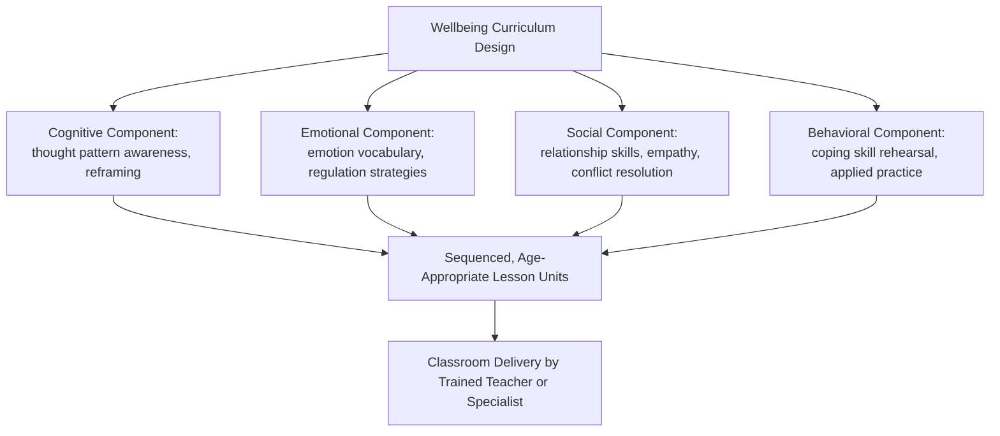

## Well-Being Curricula and National School Well-Being Initiatives

### Overview

Beyond individual school-level implementation, wellbeing education has increasingly been formalized into structured curricula and, in a number of countries, incorporated into national education policy and standards. This chapter surveys prominent packaged curricula used across schools, contrasts curriculum-level implementation with national policy-level mandates, and examines the distinct challenges of scaling wellbeing education from individual classrooms to entire education systems.

### Distinguishing Curricula from Policy Initiatives

**Key Points**

- A **wellbeing curriculum** is a specific instructional program or set of materials (lesson plans, activities, assessment tools) that a school or teacher can adopt, typically developed by a research team, nonprofit, or commercial education provider
- A **national wellbeing initiative** is a policy-level mandate or framework issued by a national or regional education authority, which may require, recommend, or incentivize the inclusion of wellbeing content in schools, without necessarily specifying a single curriculum (schools may retain choice among approved options, or use locally developed content aligned to a national framework)
- **[Unverified]** The degree of specificity and enforcement in national initiatives varies substantially by country — some function as detailed statutory curricula with assessment requirements, while others function as advisory frameworks with substantial local implementation discretion; the current status and specific requirements of any named national initiative should be verified against current official government/ministry documentation rather than assumed static, since education policy in this area has been subject to ongoing revision in multiple jurisdictions

### Notable Packaged Curricula

**Example**

Several widely referenced packaged wellbeing/resilience curricula illustrate common design patterns:

- **Penn Resiliency Program (PRP)**: developed at the University of Pennsylvania (associated with Martin Seligman's research group), a cognitive-behavioral-informed curriculum originally designed to prevent adolescent depression by teaching cognitive restructuring skills (identifying and disputing unhelpful thought patterns) alongside social problem-solving and assertiveness skills; one of the more extensively researched school-based resilience curricula, with multiple published evaluation studies
- **MindUP**: a curriculum combining mindfulness practices with neuroscience-informed content about brain function, emotional regulation, and social-emotional skills, typically delivered through structured lesson units across a school year
- **Zippy's Friends / Passport programs**: internationally used (originating in Denmark, subsequently adapted across many countries) early-childhood/primary-level coping and resilience curricula focused on building young children's emotional vocabulary and coping strategies
- **[Unverified]** Comparative effectiveness data across these named curricula (i.e., head-to-head trials comparing one against another) is limited; most published evaluation studies assess a single curriculum against a no-intervention or business-as-usual control condition rather than against a competing wellbeing curriculum, meaning claims about one curriculum being more effective than another should be treated cautiously and checked against current published comparative literature

### Design Patterns Across Curricula

**Key Points**

- Most packaged curricula share a common structural logic: sequenced, age-graded lesson units combining a cognitive component (recognizing and evaluating thought patterns), an emotional component (naming and regulating emotional states), a social component (relationship and communication skills), and a behavioral/applied component (rehearsing coping strategies in structured or role-play contexts)
- Delivery models vary between **teacher-delivered** (existing classroom teachers trained to deliver the curriculum, generally lower-cost and easier to scale but dependent on teacher training quality and buy-in) and **specialist-delivered** (school psychologists or trained specialists deliver the curriculum, potentially higher fidelity but harder to scale across a full school system due to specialist staffing constraints)

### National-Level Initiatives: Illustrative Examples

**[Unverified]** Because national education policy changes over time and varies by jurisdiction, the following are illustrative examples of the *type* of national initiative that has existed, rather than a current, verified policy inventory; current status should be confirmed against official sources for any specific country of interest:

- Some countries have incorporated wellbeing or SEL-related learning outcomes into national curriculum frameworks as a required or recommended component alongside traditional academic subjects
- Some national health/education ministries have issued cross-sectoral frameworks (combining health, education, and social service policy) addressing student mental health and wellbeing at a systems level, extending beyond curriculum content into service-provision and referral-pathway policy
- International organizations (e.g., UNESCO, WHO) have published guidance frameworks intended to inform national policy development, though adoption and implementation fidelity vary considerably by country and are not centrally enforced

### Scaling Challenges: Classroom to System Level

**Key Points**

- **Training and fidelity at scale**: a curriculum validated in a research trial with carefully trained and monitored implementers often shows reduced effect sizes when scaled to system-wide delivery by a much larger and more variably trained teacher workforce — a common finding across educational intervention scaling research generally, not unique to wellbeing curricula specifically
- **Cultural and contextual adaptation**: curricula developed and validated in one national/cultural context (e.g., the Penn Resiliency Program's origins in a U.S. context) require adaptation when transferred to different cultural, linguistic, and educational-system contexts; adaptation quality affects outcome replication
- **Resource and assessment burden**: national-level mandates requiring wellbeing curriculum delivery can create additional resource demands (teacher training time, materials, assessment infrastructure) competing with existing academic curriculum time and accountability pressures, a tension frequently noted in policy implementation literature
- **[Inference]** The general pattern in educational intervention scaling research — that effect sizes attenuate somewhat as programs move from tightly controlled research trials to large-scale, real-world system implementation — plausibly applies to wellbeing curricula as much as to academic interventions, though the specific magnitude of attenuation for any given named wellbeing program at national scale should be checked against that program's specific large-scale evaluation data rather than assumed from the general pattern alone

### Measurement and Accountability at the National Level

- National initiatives that include wellbeing outcome measurement face additional methodological questions beyond individual school evaluation: comparability of wellbeing measures across schools and regions, potential incentive effects if wellbeing metrics become tied to school accountability or funding (creating potential for measurement gaming, analogous to concerns raised about high-stakes academic testing), and the practical challenge of administering standardized wellbeing assessment at national scale
- **[Speculation]** Whether wellbeing metrics should be incorporated into high-stakes school accountability systems (similar to academic test-score accountability) is a genuinely contested policy question, with credible arguments on multiple sides (proponents arguing it ensures wellbeing is taken seriously as a priority; critics arguing it risks the same gaming and narrowing-of-focus problems documented in high-stakes academic testing accountability); this is presented here as an open policy debate rather than a settled recommendation

### Common Pitfalls

- Assuming a curriculum's research-trial effect sizes will hold at full population/national scale without accounting for typical effect attenuation in scaling
- Adopting a curriculum developed for one cultural/national context without adaptation, assuming content and framing transfer directly
- Treating "national wellbeing initiative" as implying a single verified, current, uniformly enforced policy, when actual specificity and enforcement vary considerably by jurisdiction and change over time
- Introducing high-stakes accountability tied to wellbeing metrics without anticipating measurement-gaming dynamics analogous to those documented in academic testing accountability systems

### Related Topics

- Penn Resiliency Program and cognitive-behavioral school-based prevention curricula
- Whole-school wellbeing models and implementation fidelity
- Implementation science and effect-size attenuation in scaled educational interventions
- UNESCO and WHO international guidance frameworks for school health and wellbeing
- High-stakes accountability design and measurement-gaming risk
- Cross-cultural adaptation methodology for imported educational interventions