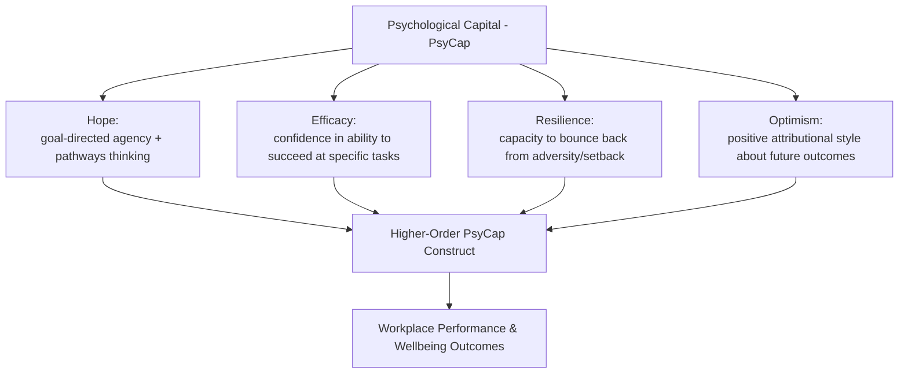

## Positive Organizational Scholarship and Positive Organizational Behavior

### Overview

Positive organizational scholarship (POS) and positive organizational behavior (POB) are two related but distinct academic traditions applying positive psychology principles to organizational and workplace contexts. Both emerged in the early 2000s, roughly contemporaneous with positive psychology's broader academic establishment, but developed from different disciplinary starting points: POS from organizational studies/sociology with an emphasis on positive organizational *states and dynamics*, and POB from industrial-organizational (I-O) psychology and management with an emphasis on measurable, developable individual-level *psychological capacities*.

### Positive Organizational Scholarship (POS)

**Key Points**

- POS, associated primarily with researchers at the University of Michigan (notably Kim Cameron, Jane Dutton, and Robert Quinn), focuses on understanding positive dynamics in organizations that lead to extraordinary outcomes — phenomena such as thriving, flourishing, resilience, virtuousness, and positive deviance (performance substantially exceeding normal or expected standards)
- POS explicitly positions itself as studying phenomena that are understudied precisely because they represent positive extremes, arguing that management research had historically focused disproportionately on organizational dysfunction (conflict, turnover, poor performance) relative to organizational excellence and flourishing
- Key POS constructs include **organizational virtuousness** (collective enactment of virtues like compassion, integrity, and forgiveness at the organizational level), **high-quality connections** (brief workplace interactions characterized by mutual positive regard, associated with increased vitality and reduced fatigue), and **positive deviance** (performance so far above normal expectation that it requires distinct explanation from ordinary performance-improvement models)

### Positive Organizational Behavior (POB)

**Key Points**

- POB, associated primarily with Fred Luthans and colleagues, is explicitly scoped to psychological capacities that meet specific inclusion criteria: they must be **positive**, **theory and research based**, **valid and reliably measurable**, **state-like** (developable and open to change through intervention, as opposed to fixed traits), and **linked to performance outcomes**
- This state-like/trait-like distinction is central to POB's identity: POB deliberately excludes stable personality traits (e.g., the Big Five personality dimensions), even positive ones, because traits are not considered malleable through short-term organizational intervention; POB instead focuses on psychological states that organizations can plausibly develop through training, leadership practice, or intervention design
- The most prominent POB construct is **Psychological Capital (PsyCap)**, an aggregate higher-order construct combining four components, often referenced by the acronym **HERO**

### Psychological Capital (PsyCap) Components in Detail

| Component | Theoretical Origin | Core Definition |
| --- | --- | --- |
| Hope | Snyder's hope theory | Goal-directed determination (agency) combined with the perceived capacity to generate multiple pathways to achieve goals |
| Efficacy | Bandura's self-efficacy theory | Confidence in one's ability to mobilize the motivation, cognitive resources, and courses of action needed to succeed at a specific task |
| Resilience | Developmental/clinical resilience research, adapted to organizational context | The capacity to bounce back from adversity, failure, or even positive but overwhelming change, and continue striving toward goals |
| Optimism | Seligman's explanatory style theory | A positive attributional style attributing positive events to internal, stable, and pervasive causes, and negative events to external, temporary, and situation-specific causes |

**[Unverified]** PsyCap is typically measured using the Psychological Capital Questionnaire (PCQ), developed by Luthans and colleagues; specific psychometric properties, factor structure validation across different cultural and occupational samples, and current recommended scoring procedures should be checked against the current published instrument documentation rather than assumed static, since measurement instruments in this area have been subject to ongoing psychometric refinement and cross-cultural validation studies.

### PsyCap as a Higher-Order (Synergistic) Construct

**Key Points**

- A defining theoretical claim in the PsyCap literature is that the four components combine synergistically into a higher-order construct that predicts outcomes (performance, job satisfaction, organizational commitment, reduced turnover intention) *better* than any single component predicts those outcomes in isolation
- This synergy claim is analogous to arguments made in other multi-component psychological constructs (e.g., emotional intelligence models combining multiple sub-abilities), where the combined construct is argued to have incremental predictive validity beyond its individual parts
- **[Unverified]** The magnitude and consistency of this incremental predictive validity (PsyCap as a composite vs. sum of individually-measured components) varies across published meta-analyses, and the specific comparative statistics should be checked against current meta-analytic sources rather than treated as a fixed, universally replicated figure

### Distinguishing POS and POB

**Key Points**

- **Level of analysis**: POS tends toward organizational and relational-level phenomena (organizational culture, collective virtuousness, interpersonal connection quality); POB tends toward individual-level psychological states and their direct measurement
- **Disciplinary lineage**: POS draws more heavily from organizational sociology, positive psychology's virtue-and-flourishing tradition, and qualitative/case-study methods; POB draws more heavily from I-O psychology's psychometric and quantitative-measurement tradition, with closer integration into human resource management and leadership development practice
- **Intervention orientation**: POB's state-like/developable criterion makes it more directly amenable to structured, trainable interventions (PsyCap development programs, often delivered as brief structured workshops); POS's more culture/relational-level constructs are typically addressed through leadership practice and organizational design changes rather than discrete trainable interventions
- **[Inference]** In practice, these two traditions are frequently cited together and treated as complementary rather than competing frameworks within the broader "positive organizational psychology" umbrella, since they address different levels of analysis (organizational culture and individual psychological capacity) that plausibly interact rather than substitute for one another; this integrative framing is common in review literature but reflects a synthesizing interpretation rather than a formally unified single theory

### Applied Interventions

**Example**

Organizations drawing on POB/PsyCap research commonly implement:

1. **PsyCap Intervention (PCI)**: a structured, typically brief (2–4 hour) workshop-format intervention developed by Luthans and colleagues, using goal-setting exercises (targeting hope pathways/agency), success-recall exercises (targeting efficacy), and structured reflection on overcoming past obstacles (targeting resilience and optimism)
2. **High-quality connection practices**: drawing on POS research, practices such as structured peer recognition programs, active-constructive responding training (a communication style associated with strengthening relational bonds when responding to others' positive news), and compassion-organizing practices during organizational crises
3. **Strengths-based leadership development**: applying VIA character strengths identification to leadership training, on the premise that leaders leveraging their signature strengths show more authentic and effective leadership behavior than leaders attempting to conform to a generic leadership-competency template

### Criticisms and Open Questions

- **Construct proliferation concern**: some critics note that positive-organizational research has generated a large number of related constructs (PsyCap, employee engagement, thriving, flourishing, work-related wellbeing) with substantial conceptual overlap, raising jangle-fallacy concerns (different names for substantially overlapping constructs) that complicate cross-study comparison
- **Managerial-interest critique**: some organizational scholars have raised concern that POB/POS research, by linking positive psychological states to performance and profitability outcomes, risks framing employee wellbeing primarily as an instrument for organizational productivity rather than as an end valuable in itself — a critique paralleling concerns raised about positive education's individualization of structural issues
- **[Speculation]** Whether PsyCap-style brief interventions produce durable (multi-month or multi-year) change in the underlying psychological states, as opposed to short-term post-workshop effects that fade without reinforcement, remains a genuinely open empirical question, since much of the published intervention evaluation literature emphasizes shorter follow-up windows; longer-term durability claims should be treated as more speculative pending stronger longitudinal intervention-evaluation evidence

### Common Pitfalls

- Treating POS and POB as fully interchangeable terms, obscuring their different levels of analysis and disciplinary lineages
- Assuming PsyCap functions identically to a stable personality trait, when its defining theoretical feature is state-like malleability, distinguishing it explicitly from trait-based constructs
- Overstating the durability of brief PsyCap-style interventions without accounting for the generally shorter follow-up windows common in this literature
- Framing employee wellbeing interventions purely in terms of performance/profitability linkage, without acknowledging wellbeing's independent value and the critique this framing has drawn

### Related Topics

- Psychological Capital Questionnaire (PCQ) and PsyCap measurement
- Hope theory (Snyder), self-efficacy theory (Bandura), and explanatory style (Seligman) as PsyCap's component theories
- Organizational virtuousness and high-quality connections (Dutton and colleagues)
- Employee engagement and job crafting as related organizational-wellbeing constructs
- VIA Classification of Character Strengths applied to leadership development
- Active-constructive responding and relational capitalization research