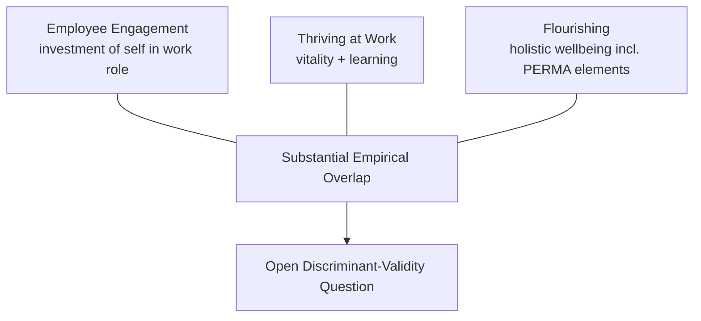

## Employee Engagement, Thriving, and Flourishing at Work

### Overview

Employee engagement, thriving at work, and workplace flourishing are three related but conceptually and empirically distinct constructs used to characterize positive states of employee functioning, each with its own measurement tradition and theoretical lineage. This chapter differentiates the three constructs, surveys their dominant theoretical models, and addresses the practical and measurement challenges — including some genuine construct-proliferation concerns — involved in applying them in organizational settings.

### Defining and Differentiating the Three Constructs

**Key Points**

- **Employee engagement**: most influentially defined by William Kahn as the harnessing of organizational members' selves to their work roles, involving the simultaneous employment and expression of a person's physical, cognitive, and emotional energies in role performance; engagement is fundamentally about *investment of self in the work role*
- **Thriving at work**: defined by Spreitzer and colleagues as a psychological state involving the joint experience of **vitality** (a sense of aliveness and energy) and **learning** (a sense of acquiring and applying knowledge and skill); thriving is distinguished by its dual-component structure — vitality alone or learning alone does not constitute thriving, both must be present
- **Flourishing**: the broadest of the three constructs, typically drawing on general wellbeing frameworks (e.g., Seligman's PERMA, or Diener's flourishing scale) applied to the work context, encompassing not just work-role investment or vitality/learning but a more holistic assessment of overall functioning and wellbeing, sometimes extending beyond work-specific experience into general life wellbeing as it intersects with work
- **[Unverified]** These three constructs show substantial empirical correlation with each other in published studies, and some researchers have questioned whether they represent genuinely distinct constructs or overlapping operationalizations of a similar underlying positive-work-state; this discriminant-validity question is actively debated rather than fully resolved, and specific inter-construct correlation figures should be checked against current literature rather than assumed fixed

### The Job Demands-Resources (JD-R) Model

**Key Points**

- The Job Demands-Resources model, developed by Bakker and Demerouti, is among the most widely used frameworks for explaining engagement (and, by extension, burnout as its inverse-adjacent construct) in organizational research
- **Job demands**: aspects of the job requiring sustained physical, cognitive, or emotional effort (workload, time pressure, emotionally demanding client interactions), which — when excessive relative to available resources — predict exhaustion and burnout
- **Job resources**: aspects of the job that help achieve work goals, reduce the psychological/physiological cost of demands, or stimulate personal growth (autonomy, social support, feedback, skill variety), which predict engagement and motivation
- The model's central proposition is a **dual-pathway process**: an *energetic/health-impairment pathway* (excessive demands → exhaustion → burnout → negative outcomes) and a *motivational pathway* (adequate resources → engagement → positive outcomes), operating somewhat independently, meaning an employee can simultaneously experience both high demands (driving some exhaustion) and high resources (driving engagement)
- **[Inference]** The JD-R model's flexibility (demands and resources can be specified differently for different occupations and contexts) has contributed to its wide adoption across many occupational settings, though this same flexibility means the model functions more as a general organizing framework than a precisely falsifiable theory with fixed universal parameters, a point noted by some methodological critics of overly flexible organizational-behavior frameworks generally

### Utrecht Work Engagement Scale (UWES) and Engagement Measurement

- The most widely used engagement measurement instrument, the **Utrecht Work Engagement Scale (UWES)** developed by Schaufeli and Bakker, operationalizes engagement across three sub-dimensions: **vigor** (high energy and mental resilience while working), **dedication** (a sense of significance, enthusiasm, and pride in one's work), and **absorption** (being fully concentrated and engrossed in one's work, such that time seems to pass quickly)
- **[Unverified]** The UWES exists in multiple versions with different item counts (e.g., a longer original version and shorter validated versions); the specific current recommended version and its psychometric validation data for a given population should be checked against current published sources rather than assumed uniform across all UWES citations in the literature

### Thriving at Work: The Socially Embedded Model

**Key Points**

- Spreitzer and colleagues' thriving model is explicitly framed as **socially embedded**: thriving is theorized to emerge from features of the work context (decision-making discretion, information-sharing practices, climate of trust and respect) rather than being purely an individual disposition
- This social-embeddedness framing distinguishes thriving conceptually from some engagement models that place greater relative emphasis on individual psychological investment, though in practice organizational context (job resources in JD-R terms) plays a role in both frameworks
- The **vitality-learning dual structure** is argued by proponents to capture something engagement alone does not: an employee could theoretically report high engagement (strong investment in role) while experiencing stagnation (no active learning or growth), which the thriving construct would not classify as full thriving given its explicit learning requirement

### Antecedents and Organizational Drivers

**Key Points**

- Commonly identified antecedents across the engagement/thriving/flourishing literature include: perceived organizational support, quality of leader-member relationships (drawing on Leader-Member Exchange theory), job autonomy and decision-making latitude, opportunities for skill development and growth, meaningful work (perceived alignment between work tasks and personally significant values or purpose), and fair/transparent organizational processes (organizational justice)
- **Meaningful work** specifically connects to PERMA's "Meaning" pillar and to broader positive-psychology meaning-in-life research, and is frequently identified as one of the stronger predictors of sustained engagement relative to purely extrinsic factors (compensation, benefits) beyond a baseline adequacy threshold
- **[Speculation]** The relative causal weight of intrinsic factors (autonomy, meaning, growth opportunity) versus extrinsic factors (compensation, job security) in driving engagement likely varies by economic context, occupational sector, and individual circumstance (e.g., financial precarity plausibly increases the relative salience of extrinsic factors); this moderation is a reasonable theoretical expectation but is not fully mapped in a single unified predictive model across all contexts, and specific claims about factor importance should be checked against studies matching the population and context of interest

### Organizational Interventions

**Example**

Common intervention approaches targeting engagement, thriving, or flourishing include:

1. **Job crafting programs**: structured processes enabling employees to proactively reshape aspects of their job tasks, relationships, or cognitive framing of their role to better align with personal strengths and values (drawing on job crafting theory, Wrzesniewski and Dutton)
2. **Leadership development targeting LMX quality**: training managers in relationship-building practices associated with higher-quality leader-member exchange, given the consistent association between supervisor relationship quality and subordinate engagement
3. **Resource-building interventions**: organizational changes increasing job resources specifically (e.g., increasing autonomy, improving feedback systems, enhancing social support structures), directly targeting the JD-R model's motivational pathway
4. **Strengths-based role design**: aligning task assignment with employees' identified strengths (connecting to VIA character strengths and signature-strengths research), on the theory that strengths-aligned work supports both engagement and thriving's learning component through more effective skill deployment

### Measurement and Practical Challenges

**Key Points**

- **Survey fatigue and self-report limitations**: engagement and thriving are typically measured via employee self-report surveys, which are subject to common self-report limitations (social desirability bias, particularly if survey results are known to inform management decisions or compensation)
- **Aggregation and unit-of-analysis issues**: engagement is measured at the individual level but often reported and acted upon at the team or organizational level; aggregation can obscure meaningful within-team variation and does not by itself establish that team-level averages reflect a genuinely shared team-level climate rather than an artifact of averaging heterogeneous individual scores
- **Distinguishing engagement from mere compliance or overwork**: some critics note the risk of engagement metrics inadvertently rewarding overwork or an inability to disengage (sometimes discussed under concerns about "workaholism" or boundary-blurring), since high engagement scores could in principle reflect unhealthy over-investment rather than sustainable positive engagement; **[Unverified]** the degree to which standard engagement instruments successfully distinguish healthy engagement from compulsive overwork is a matter of some debate in the measurement literature and should be checked against specific instrument validation studies addressing this discriminant question

### Common Pitfalls

- Treating engagement, thriving, and flourishing as fully interchangeable constructs, when they carry distinct theoretical definitions and measurement traditions, even given their substantial empirical overlap
- Using engagement survey results primarily as a compliance or performance-management tool without addressing underlying job design and resource factors identified by the JD-R model
- Assuming high engagement scores are unambiguously positive without considering the possibility of unhealthy over-investment or compulsive overwork patterns
- Applying organization-wide engagement interventions without accounting for occupational and contextual variation in which antecedents (intrinsic vs. extrinsic factors) most strongly predict engagement for a given workforce segment

### Related Topics

- Job Demands-Resources (JD-R) model and dual-pathway process (Bakker & Demerouti)
- Utrecht Work Engagement Scale (UWES) and its vigor/dedication/absorption structure
- Job crafting theory (Wrzesniewski & Dutton)
- Leader-Member Exchange (LMX) theory
- Psychological Capital (PsyCap) and its relationship to engagement outcomes
- Meaningful work and meaning-in-life research applied to organizational contexts
- Positive organizational scholarship and positive organizational behavior (parent chapter concepts)