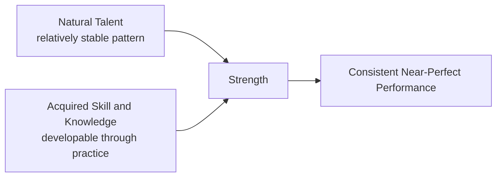

## Strengths-Based Management and Talent Development

### Overview

Strengths-based management and talent development is an approach to organizational human capital practice premised on the argument that developing employees' existing strengths produces greater performance and engagement gains than the traditional deficit-remediation approach of identifying and correcting weaknesses. This chapter covers the theoretical basis for strengths-based approaches, prominent commercial and research assessment instruments, application to performance management and talent development, and a candid treatment of the debate over how strong the underlying evidence actually is.

### The Core Argument for Strengths-Based Approaches

**Key Points**

- The foundational argument, most prominently associated with Donald Clifton (whose work at the Gallup organization substantially shaped this tradition) and later popularized alongside positive psychology's broader emergence, holds that individuals have substantially greater capacity for growth in areas of natural talent than in areas of natural weakness, making strengths-investment a higher-return development strategy than weakness-remediation
- This is explicitly framed as a *management philosophy shift*: from traditional performance management's emphasis on identifying gaps against a competency model and remediating them, toward identifying what an individual already does exceptionally well and designing roles/development plans to leverage and deepen that capability
- **[Unverified]** The strong-form version of this claim — that strengths investment produces categorically greater returns than weakness remediation across all contexts — is more of a guiding organizational philosophy than a precisely quantified, universally validated empirical law; the actual comparative return on strengths-investment versus weakness-remediation likely varies by role, skill type (e.g., a safety-critical minimum competency versus a differentiating excellence area), and individual, and specific claims about relative effect magnitude should be checked against current research rather than treated as a fixed rule

### Talent, Skill, and Strength: A Definitional Framework

Gallup's strengths-based framework (which has substantially shaped corporate strengths-based talent development practice) distinguishes three related terms:

| Term | Definition |
| --- | --- |
| Talent | A naturally recurring pattern of thought, feeling, or behavior that can be productively applied — theorized to be relatively stable and difficult to develop from scratch |
| Skill | The capacity to perform the steps of an activity, typically acquired through knowledge transfer and practice |
| Strength | The ability to consistently provide near-perfect performance in an activity, produced by combining talent with acquired skill and knowledge |

**[Inference]** This framework implies that "strength" is not a raw, fixed quality but a *developed* combination of underlying talent (relatively fixed) with skill/knowledge investment (developable); this reframes the debate somewhat, since critics sometimes characterize strengths-based approaches as claiming people cannot improve at anything outside natural talent, when the framework as formally defined actually still requires deliberate skill development — it simply argues development is more productive when built on existing talent rather than attempting to build a new talent pattern from scratch.

### Prominent Assessment Instruments

**Example**

Several instruments are widely used in corporate strengths-based talent development:

- **CliftonStrengths (formerly StrengthsFinder)**: developed by Gallup, identifies an individual's top talent themes from a set of 34 defined themes (e.g., Achiever, Strategic, Empathy, Woo, Deliberative), typically reported as a "Top 5" ranked list from a longer assessment; among the most commercially widespread instruments in this space
- **VIA Classification of Character Strengths**: as covered in prior chapters, the academically-originated 24-strengths/6-virtues framework, increasingly used in workplace strengths-based development alongside its educational applications, distinguished from CliftonStrengths by its more explicitly virtue/character-oriented (rather than talent/productivity-oriented) theoretical framing
- **[Unverified]** Direct psychometric comparison between CliftonStrengths and the VIA Classification (e.g., convergent/discriminant validity between the two instruments) is not extensively published in independent peer-reviewed literature relative to the commercial prominence of CliftonStrengths specifically; claims comparing the two instruments' validity should be checked against available independent psychometric literature rather than assumed equivalent based on conceptual similarity alone

### Application to Performance Management

**Key Points**

- **Strengths-based performance conversations**: reframing regular performance review conversations to begin with, and substantially emphasize, an employee's demonstrated strengths and how they can be further leveraged, rather than beginning with a gap analysis against a generic competency model
- **Role and task redesign**: proactively restructuring role responsibilities so that a greater proportion of an employee's regular tasks align with their identified strengths — connecting conceptually to **job crafting** research (see: employee engagement/thriving chapter), though strengths-based role redesign is often organizationally initiated (top-down) whereas classic job crafting research emphasizes employee-initiated proactive behavior
- **Team composition and complementary strengths**: some strengths-based team-development approaches explicitly map team members' strength profiles to identify complementary coverage (ensuring a team collectively covers a needed range of strength themes) and potential gaps or redundancies

### Talent Development and Career Pathing

**Key Points**

- Strengths-based talent development typically informs career pathing decisions by favoring role trajectories that build on demonstrated strength patterns rather than purely following traditional hierarchical promotion tracks that may require competencies misaligned with an individual's natural talent pattern
- **Individual development plans (IDPs)** in strengths-based organizations are commonly structured around deepening and applying top strength themes in progressively more complex or higher-responsibility contexts, rather than a generic competency-gap-closing template applied uniformly across all employees
- **[Speculation]** Whether strengths-based career pathing produces better long-term retention and performance outcomes compared to traditional competency-model-based career pathing is a reasonable hypothesis consistent with the broader strengths-based argument, but head-to-head longitudinal comparative studies isolating career-pathing methodology specifically (as opposed to studying strengths-awareness interventions generally) are less common in the published literature than the popularity of strengths-based career-development programs might suggest, so confident comparative claims here should be treated cautiously

### The Evidence Base and Critical Debate

**Key Points**

- Gallup and Gallup-affiliated research has published a substantial body of internal and applied research linking strengths-based management practices (particularly "strengths awareness" interventions, where employees learn and discuss their CliftonStrengths results) to improved engagement metrics and, in some studies, performance and retention outcomes
- **Independent replication and methodological critique**: some independent researchers and meta-analytic reviewers have raised concerns about the evidence base for strengths-based interventions, including: reliance on correlational rather than experimental designs in some studies, publication and dissemination substantially through the assessment-instrument vendor itself (raising potential conflict-of-interest concerns regarding research independence), and effect sizes that are more modest in independent replications than in some vendor-affiliated research
- **[Unverified]** The specific comparative effect-size figures from vendor-affiliated versus independent studies should be checked against current, specific meta-analytic sources rather than treated as settled, since this is an area where the strength of evidence is genuinely contested between proponents and critics, and characterizing the debate accurately requires citing the actual current state of independent replication literature rather than either an uncritical endorsement or an uncritical dismissal
- This pattern — strong practitioner/vendor enthusiasm and internally-generated supportive evidence, combined with more cautious or mixed findings in independent academic replication — is not unique to strengths-based management and echoes similar evidence-base debates seen elsewhere in applied organizational psychology (and, notably, in the growth mindset debate covered in the education chapters), suggesting a useful general heuristic: proponent-generated intervention research should generally be weighted alongside, not instead of, independent replication when assessing an applied psychological intervention's evidentiary support

### Strengths-Based Development vs. Necessary Minimum Competency

**Key Points**

- A frequently raised practical caveat, including from some strengths-based practitioners themselves, is that strengths-based development does not eliminate the need for minimum competency in certain "must-have" skill areas, particularly those related to safety, compliance, or baseline role requirements
- The recommended practical synthesis in much applied guidance is a **hybrid approach**: address genuine skill deficits that fall below a necessary minimum threshold (particularly safety-critical or role-essential competencies) through targeted remediation, while directing the *majority* of discretionary development investment and role-design effort toward strength amplification rather than pursuit of excellence in naturally weaker areas
- This hybrid framing addresses one of the more substantive critiques of strengths-based philosophy taken to an extreme (i.e., "never address any weakness"), which even prominent strengths-based practitioners generally do not endorse as stated in its most absolute form

### Common Pitfalls

- Treating strengths-based development as license to ignore genuine, role-critical skill deficits, rather than as a relative emphasis/prioritization framework alongside necessary minimum competency maintenance
- Relying primarily on vendor-generated research to evaluate a specific commercial strengths assessment's validity and organizational impact, without seeking independent replication evidence
- Assuming CliftonStrengths and VIA Classification are interchangeable or directly comparable instruments without checking independent psychometric comparison literature
- Implementing "strengths awareness" as a one-time assessment event without follow-through into actual role redesign, development planning, or management practice change, reducing the intervention to a novelty exercise with limited durable organizational impact

### Related Topics

- CliftonStrengths (Gallup) and VIA Classification of Character Strengths as comparative instruments
- Job crafting theory and employee-initiated versus organization-initiated role redesign
- Positive organizational scholarship and positive organizational behavior (parent chapter concepts)
- Employee engagement, thriving, and flourishing at work
- Evidence-base and replication debates in applied organizational psychology (paralleling the growth mindset replication debate)
- Individual development plan (IDP) design in talent management practice