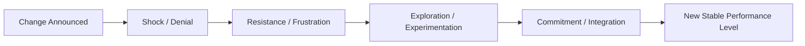

## Organizational Resilience and Change Adaptation

### Overview

This chapter addresses organizational resilience specifically in the context of deliberate or externally imposed *change* — mergers, restructuring, technology transitions, market disruption, leadership transitions — as distinct from the more general organizational resilience concepts covered earlier (see: organizational and community-level resilience) that addressed resilience to acute shocks and disruptions generally. Change adaptation research draws substantially from change management theory, occupational stress research, and positive-psychology-informed models of individual and collective adaptation to sustained organizational transition.

### Distinguishing Change-Specific Resilience from General Organizational Resilience

**Key Points**

- General organizational resilience (covered previously) emphasizes capacity to absorb and recover from *disruptive shocks* (crises, disasters, sudden market shifts) — often framed around restoring or improving function relative to a prior stable state
- Change-adaptation resilience specifically addresses capacity to navigate *deliberate, often prolonged, transitions* (restructuring, mergers, technology rollouts, strategic pivots) where there is frequently no return to a prior stable state, and success is measured by successful establishment of a *new* stable state rather than recovery of the old one
- **[Inference]** This distinction matters practically because shock-resilience interventions (crisis response protocols, redundancy building) are not directly equivalent to change-adaptation interventions (change communication strategy, stakeholder engagement, incremental implementation sequencing); organizations sometimes conflate the two, applying crisis-response thinking to planned change initiatives in ways that may not address change-specific psychological and structural needs, though this is a reasoned distinction drawn from the literature's differing emphases rather than a formally established taxonomic separation

### Individual-Level Change Reactions: The Transition Curve

**Key Points**

- Individual reactions to organizational change are commonly modeled using **transition curve** frameworks (drawing conceptually from Kübler-Ross's stage model of grief, adapted for organizational change contexts by various change-management theorists), typically depicting an initial dip in morale/performance before eventual recovery and adaptation to a new stable state
- **[Unverified]** The specific stage labels, sequencing, and whether stages are strictly linear or more fluid/recursive vary across different transition-curve models in the change management literature (which is a more practitioner-oriented tradition than a single unified academic theory); a specific named model's stage structure should be checked against its original source rather than assumed identical across all transition-curve frameworks encountered
- **Change fatigue**: cumulative psychological depletion from repeated or overlapping change initiatives, distinct from resistance to any single change, is increasingly recognized as a distinct organizational phenomenon, particularly relevant in organizations undergoing frequent restructuring or continuous digital transformation initiatives

### Psychological Capital and Change Resilience

- **PsyCap** (Hope, Efficacy, Resilience, Optimism — covered in the POS/POB chapter) has been specifically studied as a predictor of individual adaptation to organizational change, with the theoretical argument that each PsyCap component addresses a specific change-adaptation challenge: hope supports generating alternative pathways when initial change-adaptation strategies fail, efficacy supports confidence in learning new required skills/processes, resilience directly supports bouncing back from change-related setbacks, and optimism supports maintaining a positive outlook about the eventual outcome of the transition
- **[Inference]** This mapping between PsyCap components and specific change-adaptation functions is a coherent theoretical extension of PsyCap's general framework rather than a finding uniquely derived from change-specific research; the general PsyCap-outcome literature provides the underlying empirical support, and the change-specific application represents a reasoned theoretical extension that should be understood as such

### Sense-Making and Communication in Change Processes

**Key Points**

- **Organizational sense-making** (drawing on Karl Weick's foundational work on sense-making in organizations) is frequently applied to change contexts: employees actively construct meaning and narrative around a change event, and the *narrative* an employee constructs (e.g., "this change threatens my role" versus "this change creates a growth opportunity for me") substantially shapes their adaptive response, independent of the objective content of the change itself
- **Change communication strategy** is consistently identified across the change-management literature as a critical lever for shaping employee sense-making: transparent, consistent, and two-way (as opposed to purely top-down/one-directional) communication is associated with better change-adaptation outcomes, plausibly by reducing uncertainty (a well-established stress amplifier) and providing employees a voice in shaping the change narrative
- **Psychological safety** (Edmondson, covered in the community/organizational resilience chapter) is also relevant here: teams with higher psychological safety are theorized to surface change-related concerns, questions, and implementation problems earlier and more openly, supporting faster organizational learning and course-correction during the change process compared to teams where such concerns remain unvoiced

### Leadership Behaviors Supporting Change Resilience

**Example**

Commonly recommended leadership practices during organizational change include:

1. **Consistent and transparent communication cadence**: regular, predictable updates even when there is limited new information to share, addressing uncertainty-driven stress directly
2. **Visible leader modeling of adaptive behavior**: leaders demonstrating their own engagement with and adaptation to the change, rather than appearing exempt from or unaffected by the transition
3. **Structured feedback and voice mechanisms**: formal channels (surveys, structured listening sessions, change-champion networks) allowing employee concerns and implementation-level problems to reach decision-makers
4. **Incremental and reversible implementation where feasible**: sequencing changes to allow learning and adjustment (connecting to change management principles around piloting and phased rollout) rather than irreversible, all-at-once implementation, which reduces the psychological stakes of any single implementation misstep

### Change Resilience at the Team and Organizational Level

**Key Points**

- Team-level resilience during change draws on many of the same social-capital and collective-efficacy constructs covered in the organizational/community resilience chapter: teams with stronger pre-existing bonding capital (trust, cohesion) generally show more effective collective adaptation than teams with weaker pre-existing relational infrastructure, since the change process itself typically does not allow time to build this infrastructure from scratch
- **Absorptive capacity** (a construct from organizational learning theory, referring to an organization's ability to recognize, assimilate, and apply new external information/knowledge) is relevant to organizational-level change adaptation, particularly for technology-driven or market-driven change requiring the organization to integrate genuinely new knowledge or capability rather than simply reallocating existing resources
- **[Speculation]** Whether resilience-focused change interventions (e.g., building PsyCap, strengthening psychological safety) produce meaningfully better *business* outcomes (successful change implementation, retained productivity) compared to purely structural/process-focused change management approaches (e.g., rigorous project management, stakeholder mapping) — or whether the two approaches are better understood as complementary rather than competing — is not fully resolved by head-to-head comparative research, and most published evidence addresses each approach's effectiveness somewhat separately rather than in direct comparison

### Measurement Approaches

| Measurement Focus | Common Methods |
| --- | --- |
| Individual change readiness/adaptation | Self-report surveys assessing perceived change self-efficacy, openness to change, and change-related stress |
| PsyCap during change | Psychological Capital Questionnaire (PCQ), sometimes administered pre/post major change initiatives |
| Team-level change climate | Aggregated team surveys on psychological safety, communication quality, and perceived leadership support during transition |
| Implementation/business outcomes | Project milestone tracking, productivity metrics during and after transition, turnover/retention rates during change periods |

**[Unverified]** As with other organizational-intervention evaluation contexts, rigorous experimental (randomized) designs are difficult to apply to real organizational change initiatives (since organizations undergoing a live merger or restructuring cannot ethically or practically be randomized into intervention/control conditions), meaning most evidence in this specific sub-area relies on quasi-experimental, longitudinal, or case-study designs with correspondingly more limited causal certainty than tightly controlled experimental research; this should be factored into confidence in any specific quantitative claim from this literature.

### Common Pitfalls

- Applying crisis/shock-resilience thinking (redundancy, rapid response protocols) to planned change initiatives without addressing change-specific needs like sense-making, communication, and incremental implementation
- Treating resistance to change as purely an individual attitude problem to be overcome, rather than potentially valid signal about implementation flaws, insufficient communication, or genuine unaddressed concerns
- Underestimating change fatigue in organizations undergoing frequent or overlapping change initiatives, treating each new initiative as though employees have unlimited adaptive capacity
- Relying solely on top-down communication without structured feedback/voice mechanisms, missing early signals of implementation problems that team-level psychological safety could otherwise surface

### Related Topics

- Organizational and community-level resilience (general shock-resilience frameworks, prior chapter)
- Psychological Capital (PsyCap) and its four HERO components
- Organizational sense-making theory (Weick)
- Psychological safety and team-level adaptive performance (Edmondson)
- Absorptive capacity and organizational learning theory
- Change management theory and transition-curve models
- Employee engagement, thriving, and flourishing at work (JD-R model relevance to change-related demands)