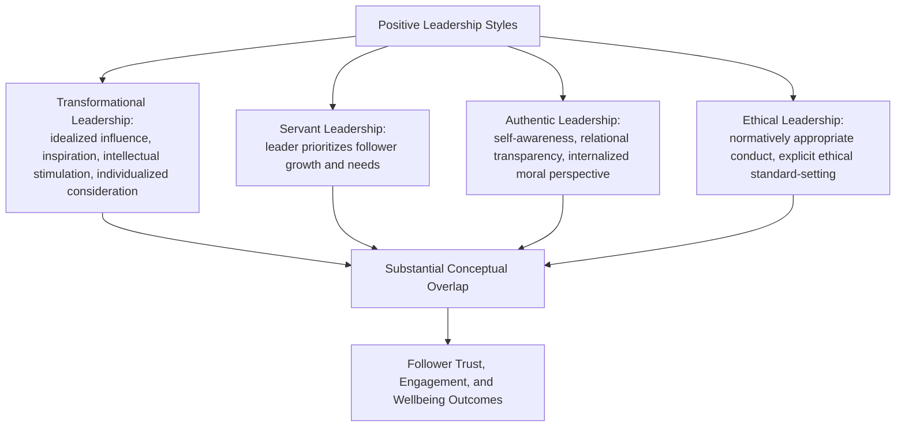

## Positive Leadership Styles and Their Effects on Teams

### Overview

Positive leadership research examines leadership styles theorized to actively cultivate follower wellbeing, growth, and flourishing, in contrast to leadership models focused primarily on task performance, compliance, or purely transactional exchange. This chapter surveys the major positive leadership style frameworks — transformational, servant, authentic, and ethical leadership — their theoretical distinctions and overlaps, mechanisms by which they affect team outcomes, and measurement and evidentiary considerations.

### The Leadership Style Landscape: Overview and Relationships

**Key Points**

- These four styles are the most prominent frameworks in the positive-leadership literature, and they share substantial conceptual overlap (e.g., all emphasize some form of follower-centered orientation and ethical/moral grounding), which has generated ongoing academic debate about the degree of genuine discriminant validity between them
- **[Unverified]** Meta-analytic work examining inter-correlations among these leadership style measures has found substantial overlap in some studies, raising jangle-fallacy concerns similar to those noted in the employee engagement/thriving/flourishing chapter; the specific correlation magnitudes and the current state of discriminant-validity debate should be checked against current meta-analytic sources rather than assumed from general familiarity with the styles' conceptual descriptions

### Transformational Leadership

**Key Points**

- Transformational leadership, most influentially developed by Bernard Bass (building on James MacGregor Burns's earlier conceptual distinction between transactional and transformational leadership), is typically operationalized across four components, often summarized as the "Four I's": **Idealized Influence** (serving as an admired role model, associated with a leader's charisma), **Inspirational Motivation** (articulating an appealing and motivating vision), **Intellectual Stimulation** (encouraging followers to question assumptions and approach problems creatively), and **Individualized Consideration** (attending to individual followers' unique developmental needs)
- Contrasted with **transactional leadership** (leadership based on contingent reward and exchange — followers perform in exchange for specified rewards, with limited emphasis on inspiring intrinsic motivation or personal development), transformational leadership is theorized to produce outcomes beyond what a purely exchange-based relationship would predict, sometimes termed the "augmentation effect"
- Transformational leadership is among the most extensively researched leadership styles, with a large associated meta-analytic literature linking it to follower engagement, job satisfaction, and — in many though not all studies — team and organizational performance outcomes

### Servant Leadership

**Key Points**

- Servant leadership, a concept originating with Robert Greenleaf, inverts the traditional leader-follower power hierarchy conceptually: the leader's primary orientation is toward serving followers' growth, wellbeing, and development, with organizational performance outcomes theorized to follow as a downstream consequence of genuinely prioritizing follower flourishing rather than being the leader's primary explicit goal
- Commonly cited servant leadership behaviors include: empowering and developing followers, expressing humility, providing authentic and direct communication, creating value for the community beyond the immediate organization, and prioritizing follower needs ahead of the leader's own self-interest
- **[Inference]** Servant leadership shows conceptual overlap with individualized consideration (a component of transformational leadership) and with authentic leadership's relational transparency component, but is distinguished by its more explicit normative emphasis on follower-need-prioritization as the leader's primary orientation, rather than positioning follower development as one component among several equally-weighted leadership behaviors; this distinction is drawn from comparing the frameworks' stated theoretical emphases rather than from a single definitive discriminant-validity study establishing servant leadership as fully separable in practice

### Authentic Leadership

**Key Points**

- Authentic leadership, associated with researchers including Bruce Avolio and William Gardner, is typically operationalized across four components: **self-awareness** (understanding one's own values, strengths, and limitations), **relational transparency** (presenting one's authentic self to followers, including appropriate self-disclosure), **balanced processing** (objectively analyzing relevant information, including information that challenges one's own position, before making decisions), and **internalized moral perspective** (self-regulation guided by internal moral standards rather than external pressure)
- Authentic leadership theory emerged partly in response to a series of high-profile corporate ethical failures in the early 2000s, with proponents arguing that leader authenticity and moral grounding function as a protective factor against organizational ethical breakdown
- **[Unverified]** The precise discriminant validity of authentic leadership relative to ethical leadership (given their substantial overlap in "internalized moral perspective" / normative-conduct emphasis) is actively debated in the literature, and researchers have not fully converged on whether these represent meaningfully distinct constructs or substantially overlapping operationalizations of a similar underlying leader quality

### Ethical Leadership

**Key Points**

- Ethical leadership, as operationalized by Brown, Treviño, and Harrison in one of the most widely cited definitions, involves the demonstration of normatively appropriate conduct through personal actions and interpersonal relationships, combined with the explicit promotion of such conduct to followers through communication, reinforcement, and decision-making
- Distinguished somewhat from authentic leadership by its more explicit emphasis on *active promotion and reinforcement* of ethical standards among followers (e.g., through reward/discipline systems and explicit communication of ethical expectations), rather than authentic leadership's greater relative emphasis on the leader's own internal self-awareness and transparency processes
- Ethical leadership research has documented associations with reduced follower unethical behavior, increased follower voice (willingness to raise concerns), and increased trust in leadership, with proposed mechanisms including social learning (followers modeling observed ethical leader behavior) and social exchange (followers reciprocating perceived fair and ethical treatment with positive discretionary behavior)

### Mechanisms Linking Positive Leadership to Team Outcomes

**Key Points**

- **Social learning/modeling**: followers observe and internalize leader behavior patterns (a mechanism common across multiple positive leadership styles, particularly emphasized in ethical and authentic leadership theory), extending role-modeled behaviors (ethical conduct, transparency, developmental orientation) into follower behavior and team norms
- **Social exchange and reciprocity**: followers who perceive genuine leader investment in their development or wellbeing (servant leadership, individualized consideration) reciprocate with increased discretionary effort, organizational citizenship behavior, and reduced turnover intention, consistent with social exchange theory's broader predictions about reciprocal treatment in workplace relationships
- **Psychological need satisfaction**: several positive leadership styles are theorized to satisfy basic psychological needs identified in Self-Determination Theory (autonomy, competence, relatedness — see also: general SDT-based motivation frameworks), with need satisfaction mediating the relationship between leadership style and follower engagement/wellbeing outcomes
- **Trust as a mediating mechanism**: across multiple positive leadership styles, follower trust in the leader is frequently identified as a key mediating variable explaining the relationship between leadership behavior and downstream team performance and wellbeing outcomes

### Team-Level Effects and Climate

**Key Points**

- Positive leadership styles are theorized to shape team-level climate variables (psychological safety, team cohesion, collective efficacy) which in turn mediate effects on team performance, extending individual-follower-level effects to collective team functioning
- **[Speculation]** The relative importance of leader style versus other team-level factors (team composition, task interdependence, organizational context) in determining overall team climate and performance is not fully isolated in a single unified predictive model; leadership style is a substantial and well-studied predictor, but should not be treated as the sole or even necessarily dominant driver of team outcomes relative to structural and compositional factors, a point that is sometimes underemphasized in leadership-focused popular management literature relative to the more multi-factor picture found in careful academic reviews

### Measurement Instruments

| Instrument | Style Measured |
| --- | --- |
| Multifactor Leadership Questionnaire (MLQ) | Transformational and transactional leadership |
| Servant Leadership Survey / Servant Leadership Questionnaire | Servant leadership behaviors |
| Authentic Leadership Questionnaire (ALQ) | Authentic leadership's four components |
| Ethical Leadership Scale (ELS, Brown et al.) | Ethical leadership behaviors |

**[Unverified]** As with other leadership and organizational-behavior instruments, current psychometric validation status, factor structure debates, and cross-cultural adaptation quality for any specific instrument should be checked against current published validation literature rather than assumed static, given that measurement refinement in this area is ongoing.

### Common Pitfalls

- Treating the four major positive leadership styles as fully distinct, non-overlapping categories, when substantial empirical and conceptual overlap exists and discriminant validity remains actively debated
- Assuming leadership style alone determines team climate and performance without accounting for team composition, task structure, and organizational context as co-determining factors
- Selecting a leadership development framework based primarily on popular-management-literature framing rather than checking the framework's specific empirical support and measurement validation status
- Overlooking transactional leadership's continued relevance (e.g., in contexts requiring clear performance-contingent structure) in favor of assuming transformational/positive styles are universally superior across all organizational contexts and follower populations

### Related Topics

- Multifactor Leadership Questionnaire (MLQ) and the transformational/transactional distinction
- Self-Determination Theory and psychological need satisfaction in workplace motivation
- Psychological safety and team climate (Edmondson)
- Positive organizational scholarship and high-quality connections research
- Employee engagement, thriving, and flourishing at work (leadership as an antecedent)
- Organizational resilience and change adaptation (leadership behaviors during transition)