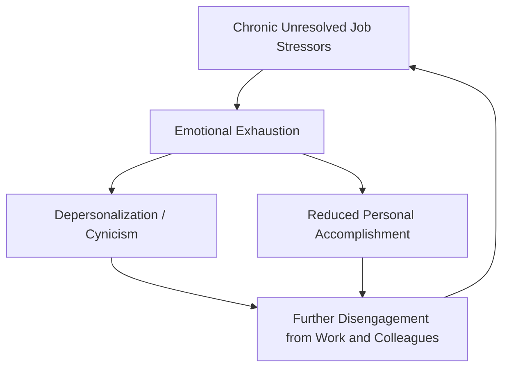

## Burnout Prevention and Sustainable High Performance

### Overview

Burnout prevention and sustainable high performance addresses how organizations and individuals can pursue demanding, high-achievement work without the cumulative exhaustion and dysfunction characteristic of burnout. This chapter covers the dominant clinical/occupational model of burnout (Maslach's tripartite model), its organizational and individual antecedents, the distinction between sustainable and unsustainable high performance, and evidence-based prevention approaches operating at both levels.

### The Maslach Burnout Model

**Key Points**

- Burnout, as operationalized by Christina Maslach and colleagues (the dominant framework in occupational burnout research), consists of three core dimensions: **emotional exhaustion** (depletion of emotional resources, feeling overextended and drained), **depersonalization/cynicism** (detached, negative, or callous responses to one's work, colleagues, or the people one serves), and **reduced personal accomplishment** (a decline in feelings of competence and successful achievement in one's work)
- Burnout is explicitly conceptualized in this model as a response to *chronic, unresolved* workplace stressors, distinguishing it from acute or transient work stress; a stressful week does not constitute burnout under this framework, but chronic exposure to unmanaged stressors over an extended period does
- The **Maslach Burnout Inventory (MBI)** is the dominant measurement instrument, with variants for different occupational contexts (the original Human Services Survey, the Educators Survey, and a General Survey applicable to non-human-services occupations)

### Burnout as a Person-Job Misfit: The Six Areas of Worklife Model

**Key Points**

- Maslach and Leiter's later work reframes burnout not simply as an individual response to stress, but as arising from a **misfit** between the individual and six key areas of their work environment: **workload** (demands exceeding capacity), **control** (insufficient autonomy or influence over one's work), **reward** (insufficient recognition, financial or social, for contribution), **community** (poor quality of workplace social relationships and support), **fairness** (perceived inequity in decisions and resource allocation), and **values** (a mismatch between organizational and personal values)
- This model shifts intervention emphasis from purely individual-level coping strategies toward organizational-level diagnosis and redesign, since it explicitly frames burnout risk as substantially a function of job/organizational design rather than purely individual resilience or coping deficiency
- **[Inference]** This reframing is consistent with, and largely predates in emphasis, similar arguments made in the Job Demands-Resources (JD-R) model (covered in the employee engagement chapter), and the two frameworks are frequently cited together in contemporary burnout-prevention literature as complementary lenses on the same underlying phenomenon — job-design and resource/demand balance as the primary levers, rather than individual disposition alone

### Distinguishing Sustainable High Performance from Burnout Trajectory

**Key Points**

- A central practical question in this literature is how sustained high effort and achievement-orientation can be maintained *without* triggering the exhaustion-depersonalization-reduced-accomplishment cycle; this is not simply a matter of "working less," since some high performers report thriving under sustained demanding conditions
- The **Job Demands-Resources** framework's dual-pathway logic is directly relevant: high job demands paired with correspondingly high job resources (autonomy, support, meaning, recognition) predict engagement and sustainable high performance, while high demands paired with inadequate resources predict the exhaustion/burnout pathway — meaning the presence of high demands alone does not determine outcome; the demand-to-resource ratio is the more relevant predictor
- **Recovery research**: a distinct body of occupational health psychology research (associated with researchers like Sabine Sonnentag) emphasizes the role of **psychological detachment** from work during off-hours, and other recovery experiences (relaxation, mastery experiences in non-work domains, control over leisure time), as critical moderating factors — high performers who achieve genuine psychological detachment during recovery periods show better sustained performance and lower burnout risk than those who remain cognitively engaged with work concerns during nominal off-hours, even when total working hours are similar

### The Role of Meaning and Values Alignment

- Consistent with the "values" dimension of the Six Areas of Worklife model, several studies suggest that perceived meaning and values-alignment can support sustained high effort without proportionally increased burnout risk — a mechanism sometimes summarized as meaningful work providing psychological "fuel" that partially offsets the depleting effect of high demands
- **[Speculation]** Whether meaning/values-alignment functions as a true buffer against burnout at very high or prolonged demand levels (i.e., whether meaning can fully offset burnout risk at extreme workload levels) or merely delays and somewhat reduces burnout onset without preventing it entirely under sufficiently extreme conditions, is not fully resolved; most supportive research examines moderate-to-high demand ranges rather than testing meaning's protective effect at the most extreme workload levels, so claims of meaning as a complete burnout antidote at any demand level should be treated with caution

### Organizational-Level Prevention Strategies

**Example**

Organizational interventions targeting burnout prevention, informed by the Six Areas of Worklife and JD-R frameworks, commonly include:

1. **Workload auditing and redistribution**: systematic assessment of role workload relative to available capacity/resources, with redesign of role scope or staffing levels where chronic overload is identified
2. **Increasing job control/autonomy**: expanding decision-making latitude and flexibility in how work is accomplished, directly targeting the "control" dimension
3. **Recognition and reward system review**: ensuring recognition and reward structures are perceived as proportionate and fair relative to contribution, addressing both the "reward" and "fairness" dimensions
4. **Community-building investments**: structured opportunities for positive workplace relationship development (team-building, peer support structures, reduced isolation in remote/hybrid contexts), targeting the "community" dimension
5. **Values clarification and alignment communication**: transparent communication about organizational mission and values, and genuine (not merely rhetorical) alignment between stated values and actual organizational practice, targeting the "values" dimension

### Individual-Level Prevention Strategies

**Key Points**

- **Recovery practices**: deliberate psychological detachment strategies during off-hours (as identified in recovery research), including boundary-setting practices around work communication access outside working hours
- **Self-compassion and realistic goal-setting**: reducing self-critical response patterns to setbacks or unmet goals, connecting to self-compassion research covered in the caregiver resilience chapter, with similar theoretical mechanisms applicable to high-performance occupational contexts generally
- **Mindfulness-based interventions**: present-moment awareness practices are associated with reduced burnout symptoms across multiple occupational populations in published intervention studies, though **[Unverified]** as with other mindfulness-intervention literature, effect sizes and durability vary by study and population, and current meta-analytic sources should be consulted for a precise current effect-size picture rather than relying on a single frequently-cited early study
- **Proactive resource-seeking behavior**: individual-level job crafting toward increased resource access (seeking feedback, building supportive relationships, negotiating increased autonomy where possible) as an individual complement to organizational-level resource provision

### Sustainable High Performance in Elite/High-Stakes Contexts

**[Inference]** Some research on sustainable high performance in elite contexts (competitive athletics, high-stakes professional fields) has drawn on similar demand-resource balance logic, examining periodized effort/recovery cycling (structured alternation between high-intensity effort periods and genuine recovery periods, rather than continuous uniform high effort) as a model potentially transferable to non-athletic high-performance occupational contexts; the degree to which findings from elite athletic performance research generalize directly to typical knowledge-work occupational contexts is an extrapolation with some plausibility (both involve managing finite physiological/psychological resources under demand) but is not a fully validated direct transfer, and specific claims about periodization's applicability to a given occupational context should be evaluated with that caveat in mind.

### Common Pitfalls

- Framing burnout prevention purely as an individual responsibility (self-care, resilience training) while neglecting the substantial job-design and organizational-fit factors identified in the Six Areas of Worklife and JD-R models
- Assuming that high performance necessarily implies elevated burnout risk, when the demand-to-resource ratio, not demand level alone, is the more relevant predictor of sustainable versus unsustainable high effort
- Neglecting recovery and psychological detachment as legitimate performance-supporting practices, treating any non-working time as unproductive rather than functionally necessary for sustained performance
- Applying burnout-prevention approaches uniformly across roles without accounting for role-specific demand profiles and which of the six worklife areas (workload, control, reward, community, fairness, values) is the primary driver of risk for that specific role or population

### Related Topics

- Maslach Burnout Inventory (MBI) and its occupational variants
- Job Demands-Resources (JD-R) model (covered in the employee engagement chapter)
- Recovery research and psychological detachment (Sonnentag)
- Self-compassion theory applied to occupational contexts (paralleling the caregiver resilience chapter)
- Compassion fatigue and vicarious trauma in caregivers (a related occupational-burnout-adjacent domain)
- Psychological Capital (PsyCap) as a resource-side buffer against burnout
- Periodization and effort/recovery cycling in elite performance research