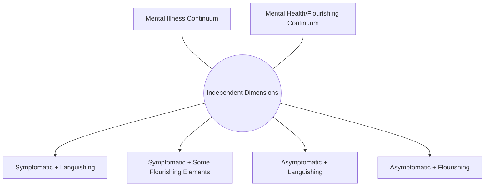

## Integrating Positive Psychology into Psychotherapy

### Overview

Integrating positive psychology into psychotherapy addresses how clinicians incorporate strengths-focused, wellbeing-oriented, and flourishing-promoting techniques alongside or within traditional symptom-reduction-focused psychotherapeutic models. This chapter covers the theoretical rationale for integration (the "two continua" model of mental health), specific therapeutic modalities that formalize this integration (notably Well-Being Therapy and Positive Psychotherapy), practical integration into existing evidence-based treatments like CBT, and a candid discussion of evidentiary status and clinical scope-of-practice considerations.

### The Two Continua Model of Mental Health

**Key Points**

- A foundational conceptual justification for integrating positive psychology into clinical practice is the **two continua model** (most associated with Corey Keyes), which proposes that mental illness and mental health/flourishing are **related but distinct dimensions**, rather than opposite ends of a single continuum
- Under this model, an individual can be free of diagnosable mental illness while still **languishing** (low wellbeing, absence of flourishing), and conversely — though less commonly emphasized — some research has examined whether individuals with diagnosed conditions can nonetheless report elements of flourishing in some domains, complicating a simple single-continuum view
- **Clinical implication**: symptom-reduction-focused treatment (the traditional focus of most evidence-based psychotherapy) may successfully move a client out of diagnosable illness without necessarily moving them toward flourishing — the two continua model provides the theoretical rationale for why *additional*, explicitly wellbeing-focused intervention may be clinically warranted even after symptom remission, rather than positive psychology techniques being merely a supplementary "nice-to-have"

### Well-Being Therapy (WBT)

**Key Points**

- Well-Being Therapy, developed by Giovanni Fava, is a structured, typically short-term therapeutic protocol explicitly designed to promote psychological wellbeing, drawing substantially on Carol Ryff's **six-dimension model of psychological wellbeing** (autonomy, environmental mastery, personal growth, positive relations with others, purpose in life, self-acceptance) as its target constructs
- WBT was originally developed and researched as a **relapse-prevention adjunct** following successful symptom-focused treatment (e.g., for mood and anxiety disorders), based on the theoretical premise that low psychological wellbeing (even after symptom remission) may represent a residual vulnerability factor for relapse — directly operationalizing the two continua model's clinical implication
- The protocol structure typically involves self-monitoring of wellbeing-relevant experiences across Ryff's six dimensions, followed by cognitive-behaviorally-informed techniques to identify and modify thoughts/behaviors that interfere with wellbeing in each dimension, structurally resembling CBT's self-monitoring and cognitive restructuring techniques but applied to wellbeing promotion rather than symptom reduction

### Positive Psychotherapy (PPT)

**Key Points**

- Positive Psychotherapy, developed by Tayyab Rashid and Martin Seligman, is a more explicitly positive-psychology-content-driven structured therapy protocol (distinct from Well-Being Therapy's Ryff-based framework), incorporating techniques directly drawn from positive psychology research: gratitude exercises (e.g., structured gratitude letter/visit exercises), character strengths identification and application (drawing on the VIA Classification), savoring practices, and forgiveness-focused interventions
- PPT was originally developed and studied specifically as a treatment for depression, with published trials examining its effectiveness both as a standalone treatment and (in some study designs) compared against or alongside traditional treatment approaches
- **[Unverified]** The comparative effectiveness of PPT relative to well-established, more extensively researched treatments (such as standard CBT or interpersonal therapy for depression) is an area where the evidence base, while growing, is generally considered less extensive than for these longer-established treatments; specific current comparative effect-size and trial-quality data should be checked against current systematic reviews rather than assumed equivalent to more extensively validated approaches based on the existence of any individual supportive trial

### Integrating Positive Techniques into Existing Evidence-Based Treatments

**Example**

Rather than adopting a wholly separate positive-psychology-specific protocol, many clinicians integrate discrete positive psychology techniques into established evidence-based frameworks (most commonly CBT):

1. **Positive data logs / positive event tracking**: structured homework tracking positive experiences and their associated thoughts, functioning similarly to CBT thought records but oriented toward reinforcing accurate recognition of positive events, which some clients (particularly those with depression-related negative attentional bias) may otherwise underattend to or discount
2. **Strengths-spotting and application exercises**: identifying a client's signature character strengths and structuring behavioral activation-style homework around deploying those strengths in daily life, combining positive psychology content with behavioral activation's established evidence base for depression
3. **Gratitude interventions**: structured gratitude journaling or gratitude-letter exercises, often used as an adjunctive homework technique within an otherwise standard CBT or other evidence-based treatment framework
4. **Savoring interventions**: techniques for deliberately prolonging and deepening positive experience (as opposed to the more passive experience of positive events), drawing on savoring research (Bryant and Veroff) as an adjunct to standard mood-monitoring techniques

**[Inference]** This "integration into existing evidence-based frameworks" approach is more common in described clinical practice than adoption of wholly separate positive-psychology-specific protocols (like standalone WBT or PPT), likely because it allows clinicians to retain the more extensive evidence base of established treatments like CBT while incorporating specific techniques with their own supportive (if generally smaller) evidence base; this is a reasonable inference about practice patterns based on how the integration literature is typically framed, rather than a finding from a specific survey of clinician practice patterns that this content has direct access to.

### Evidentiary Status and Clinical Scope Considerations

**Key Points**

- The evidence base for positive-psychology-specific clinical protocols (WBT, PPT) is generally smaller in trial volume and, for some conditions, more mixed in effect-size consistency compared to the extensively validated evidence base for established treatments like CBT for conditions such as major depressive disorder and various anxiety disorders
- **[Unverified]** Meta-analytic reviews of positive psychology interventions in clinical (as opposed to non-clinical/general population) samples have found variable effect sizes depending on intervention type, delivery format, and population studied; current meta-analytic sources specific to clinical populations should be consulted directly for an accurate current picture, since blanket claims about "positive psychology interventions" as a single undifferentiated category obscure meaningful variation across the specific techniques and protocols being referenced
- **Scope-of-practice consideration**: positive psychology techniques are generally understood in the clinical literature as most appropriately used as **adjuncts** to, rather than replacements for, established evidence-based treatment for diagnosable conditions, particularly for higher-severity presentations (e.g., severe depression, active suicidality) where the evidence base strongly favors established first-line treatments; using positive-psychology-only approaches as a sole treatment for higher-severity presentations would represent a departure from the evidence-based standard of care for those conditions

### Common Techniques Summary Table

| Technique | Theoretical Basis | Common Clinical Use |
| --- | --- | --- |
| Gratitude letter/journal | Positive emotion broadening (Fredrickson), gratitude research | Adjunct to depression/anxiety treatment, general wellbeing enhancement |
| Character strengths application | VIA Classification (Peterson & Seligman) | Behavioral activation adjunct, self-concept and identity work |
| Savoring practices | Savoring theory (Bryant & Veroff) | Mood-monitoring adjunct, anhedonia-relevant intervention |
| Well-Being Therapy protocol | Ryff's six-dimension psychological wellbeing model | Relapse-prevention adjunct following symptom remission |
| Positive Psychotherapy protocol | Integrated PERMA/character-strengths content | Standalone or adjunctive depression treatment |

### Common Pitfalls

- Treating positive psychology techniques as a substitute for established first-line evidence-based treatment in higher-severity clinical presentations, rather than as an adjunct within or alongside such treatment
- Assuming symptom remission is equivalent to flourishing, overlooking the two continua model's implication that low wellbeing can persist independently of diagnosable symptoms
- Applying gratitude, savoring, or strengths-based techniques without clinical judgment about client readiness — some positive-psychology techniques (e.g., gratitude exercises) can be experienced as invalidating or premature by clients experiencing acute distress if introduced without adequate clinical rapport and timing
- Overgeneralizing efficacy findings across the diverse range of specific techniques and protocols grouped under "positive psychology interventions," when effect sizes and evidence quality vary meaningfully by specific technique, population, and delivery format

### Related Topics

- Two continua model of mental health (Keyes) and its clinical implications
- Ryff's six-dimension model of psychological wellbeing
- VIA Classification of Character Strengths in clinical application
- Savoring theory (Bryant & Veroff)
- Broaden-and-build theory of positive emotions (Fredrickson) as a mechanism for positive-technique effects
- Behavioral activation and its integration with strengths-based homework design
- Depression treatment evidence base and adjunctive versus standalone intervention design