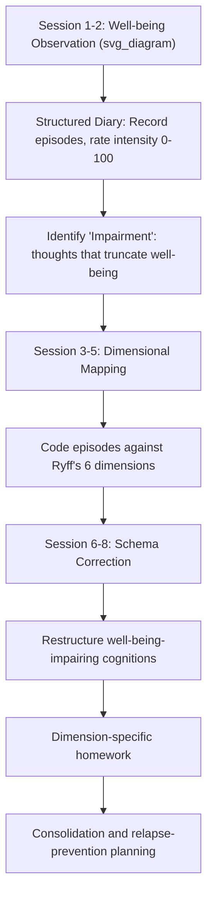

## Well-being Therapy and Its Clinical Protocol

### Overview

Well-Being Therapy (WBT) is a short-term, structured psychotherapeutic protocol developed by Giovanni Fava in the early 1990s at the University of Bologna. It was designed as a complement or sequential extension to cognitive-behavioral therapy (CBT), explicitly targeting the promotion of psychological well-being rather than solely the reduction of symptoms and distress. WBT operationalizes Carol Ryff's multidimensional model of psychological well-being, converting an academic model of eudaimonic functioning into a clinical, session-by-session treatment protocol.

The therapy emerged from the observation that symptom remission does not necessarily equate to the restoration of positive functioning. A patient may no longer meet criteria for a depressive or anxiety disorder yet still exhibit impaired autonomy, poor environmental mastery, or an absence of purpose in life. WBT addresses this residual deficit.

### Theoretical Foundations

**Ryff's Six-Dimensional Model**

WBT is built directly on Ryff's model of psychological well-being, which identifies six distinct dimensions of positive functioning:

1. **Autonomy** — self-determination, independence, and the capacity to resist social pressure
2. **Environmental Mastery** — the ability to manage one's life and surrounding context effectively
3. **Personal Growth** — a sense of continued development and openness to new experience
4. **Positive Relations with Others** — warm, trusting, and satisfying interpersonal connections
5. **Purpose in Life** — a sense of directedness and meaning
6. **Self-Acceptance** — a positive attitude toward oneself, including past life and limitations

**Relationship to Cognitive Behavioral Therapy**

WBT does not replace CBT; it is typically sequenced after acute-phase CBT or pharmacotherapy has reduced symptomatic distress. The rationale draws on Fava's broader work on residual symptomatology and the sequential model of treatment, which holds that distinct treatment phases (symptom reduction, then well-being promotion) yield more durable outcomes than symptom-focused treatment alone, particularly for relapse prevention in mood and anxiety disorders.

**Distinction from Purely Positive Interventions**

Unlike generic positive psychology exercises (e.g., gratitude journaling, signature strengths use), WBT retains a clinical, idiographic structure: it uses a structured diary, therapist-guided cognitive restructuring of well-being-impairing thoughts, and a fixed session sequence. It is explicitly a **therapy**, not a self-help program, and is intended for delivery by a trained clinician.

### Clinical Protocol Structure

WBT is traditionally delivered over **8 sessions**, though extended versions (up to 12 sessions) exist for more complex or chronic presentations. Sessions are typically 30–50 minutes, conducted weekly or biweekly.

**Phase 1 — Observation of Well-Being (Sessions 1–2)**

- Patients are introduced to a structured self-monitoring diary, structurally similar to Beck's dysfunctional thought record but inverted in focus.
- The diary requires the patient to record: (1) situations associated with episodes of well-being, however brief, (2) the intensity of the well-being experience (typically rated 0–100), and (3) thoughts or circumstances that led to premature termination of the well-being state.
- A central technique here is identifying "impairment," a specific WBT construct — the tendency for positive affective states to be curtailed by intrusive negative thoughts, superstitious fears about not "deserving" well-being, or premature self-criticism.

**Phase 2 — Identification of the Six Dimensions (Sessions 3–5)**

- The diary is refined and episodes of well-being (and their disruption) are explicitly coded against Ryff's six dimensions.
- The therapist helps the patient recognize which dimension(s) are chronically underdeveloped or specifically vulnerable to disruption.
- Cognitive restructuring techniques adapted from CBT are applied, but the target cognition is not a distorted negative belief about a stressor; it is a belief that *undermines or truncates a positive state* (e.g., "I don't deserve to feel this good," "This will not last, so it doesn't count").

**Phase 3 — Schema Identification and Correction (Sessions 6–8)**

- Focus shifts to correcting cognitive schemas that systematically interfere with each of the six well-being dimensions.
- Homework assignments become dimension-specific (e.g., graded exposure to autonomous decision-making for a patient with an Autonomy deficit).
- Therapy concludes with consolidation, relapse-prevention planning, and an explicit review of gains across all six dimensions.

**Session Structure Summary Table**

| Phase | Sessions | Primary Focus | Key Technique |
| --- | --- | --- | --- |
| Observation | 1–2 | Detecting and rating well-being episodes | Structured diary (0–100 intensity scale) |
| Dimensional Mapping | 3–5 | Linking episodes to Ryff's 6 dimensions | Diary coding + Socratic dialogue |
| Schema Correction | 6–8 | Modifying well-being-impairing cognitions | CBT-style restructuring, graded homework |

### Diagram: WBT Session Flow (svg_diagram)

### The Well-Being Diary: Practical Example

A simplified diary entry, as used in Phase 1:

| Field | Patient Entry |
| --- | --- |
| Situation | Had coffee with an old friend after months of isolation |
| Well-being intensity (0–100) | 65 |
| Duration | Approx. 20 minutes |
| Interrupting thought | "She's just being polite; she probably doesn't actually want to see me" |
| Dimension implicated (Phase 2+) | Positive Relations with Others |

In session, the therapist would not challenge the interrupting thought as "irrational" in the classic CBT sense of catastrophizing about a threat; instead, the therapist highlights how the thought **functions to shorten a genuine positive experience**, and explores the schema underlying it (e.g., a belief of unworthiness of connection).

### Clinical Applications and Evidence Base

WBT has been studied primarily as a **sequential/residual-phase treatment** in the following contexts:

- **Recurrent depressive disorder**: Used after acute-phase treatment to reduce residual symptoms and lower relapse rates over follow-up periods extending several years in controlled studies.
- **Generalized Anxiety Disorder (GAD)**: Applied as an alternative or adjunct to CBT, with some controlled trials reporting comparable or superior outcomes on well-being measures relative to CBT alone.
- **Cyclothymic disorder and mood dysregulation**: Adapted protocols have been tested in bipolar-spectrum populations, particularly cyclothymia.
- **Eating disorders and somatic conditions**: Exploratory applications exist, generally as an adjunct rather than a standalone treatment.

[Inference] Effect sizes across these applications vary considerably by population, comparator condition, and outcome measure, and WBT is generally better supported as a relapse-prevention and residual-symptom intervention than as a first-line monotherapy for acute major psychiatric disorders.

### Outcome Measurement

WBT trials and clinical applications typically use:

- **Psychological Well-Being Scales (PWB)** — Ryff's own instrument, directly mapped to the six protocol dimensions
- **Symptom Questionnaire (SQ)** or comparable distress measures, to track residual symptomatology in parallel
- **Clinical Interview for Depression (CID)** or structured diagnostic interviews, in trials assessing relapse

Well-being gains are typically assessed as **change scores on each of the six PWB subscales**, allowing clinicians to verify that improvement is not confined to a single dimension (e.g., improved Self-Acceptance without corresponding gains in Autonomy).

### Differentiating WBT from Related Protocols

**Key Points**

- **WBT vs. Positive Psychotherapy (PPT, Seligman/Rashid)**: PPT is organized around the PERMA model (Positive emotion, Engagement, Relationships, Meaning, Accomplishment) and uses a broader menu of positive-psychology exercises; WBT is more narrowly structured around Ryff's six dimensions and retains a tighter diary-based, CBT-adjacent methodology.
- **WBT vs. standard CBT**: CBT targets distorted cognitions that generate or maintain distress; WBT targets cognitions that suppress or curtail positive affective states, even in the absence of clinical distress.
- **WBT vs. Mindfulness-Based Cognitive Therapy (MBCT)**: MBCT emphasizes present-moment, non-judgmental awareness as a relapse-prevention mechanism; WBT emphasizes active cognitive restructuring specifically oriented toward eudaimonic functioning.

### Contraindications and Limitations

- WBT is not typically used as a **first-line, standalone treatment** for acute major depressive episodes or severe anxiety; it functions best in the sequential model, after acute symptom stabilization.
- [Unverified] There is limited large-scale RCT evidence in some populations (e.g., psychotic-spectrum disorders), and its application there should be considered exploratory rather than protocol-standard.
- The therapy requires a clinician trained in both CBT technique and the Ryff dimensional framework; informal or self-administered use lacks the same evidence base as clinician-delivered protocols.
- Behavior of the protocol in naturalistic (non-trial) clinical settings may vary depending on therapist fidelity to the manualized session structure.

### Training and Implementation Requirements

- Clinicians typically require foundational competence in CBT before training in WBT, given the shared technical vocabulary (thought records, Socratic questioning, homework assignments).
- Formal WBT training programs and manuals originate largely from Fava's research group and affiliated institutions; fidelity to the 8-session structure and diary format is considered central to reproducing trial-demonstrated outcomes.
- Supervision is recommended during the transition from Phase 1 (observation) to Phase 2 (dimensional coding), as accurate mapping of patient material onto Ryff's six dimensions requires clinical judgment.

**Next Steps**

- Ryff's Psychological Well-Being model: theoretical origins and psychometrics
- Sequential model of treatment in mood disorders (Fava's residual symptom framework)
- Positive Psychotherapy (Seligman & Rashid) as a comparative protocol
- Mindfulness-Based Cognitive Therapy (MBCT) for relapse prevention
- Structured self-monitoring diaries in CBT-derived interventions
- Cyclothymic disorder: adapted WBT protocols
- Relapse prevention frameworks in recurrent major depressive disorder