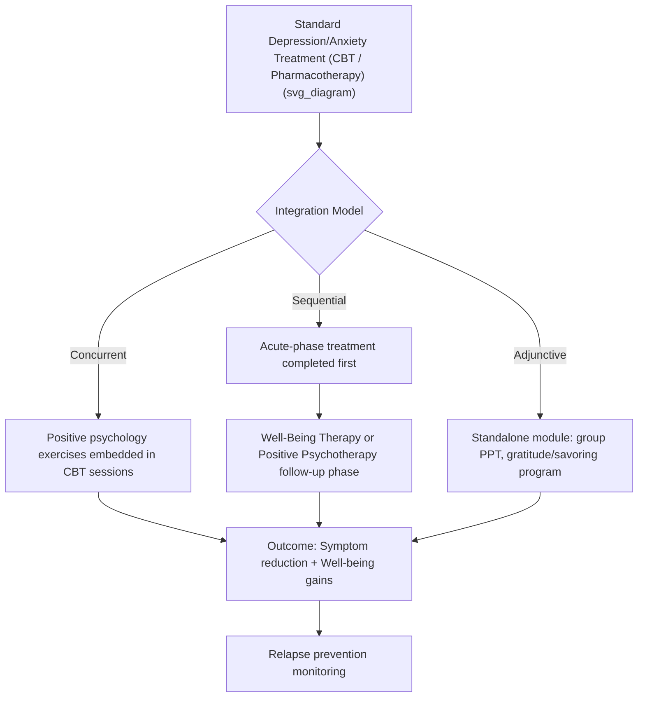

## Positive Psychology Alongside Treatment for Depression and Anxiety

### Overview

The integration of positive psychology into the treatment of depression and anxiety represents a shift from a purely deficit-reduction model of mental health care toward a dual-continuum approach. This framework, most explicitly articulated by Corey Keyes, treats mental illness and mental health (well-being) as two related but distinct continua rather than opposite poles of a single axis. Consequently, the absence of depressive or anxious symptoms (languishing) does not automatically indicate the presence of flourishing. Clinical protocols that add positive psychology components alongside standard depression/anxiety treatment aim to build positive resources — positive affect, meaning, engagement, and adaptive coping — concurrently with or sequentially after symptom-focused intervention.

### Theoretical Rationale

**The Dual-Continua Model**

- Mental illness (symptom presence/absence) and mental health (flourishing/languishing) are statistically and conceptually separable.
- A patient can be symptom-free yet languishing (absence of illness without presence of well-being), or symptomatic yet report moderate well-being in specific domains.
- This model justifies treatment protocols that explicitly target well-being building, since symptom reduction alone does not guarantee movement into a flourishing state.

**Broaden-and-Build Theory**

- Developed by Barbara Fredrickson, this theory posits that positive emotions broaden an individual's momentary thought-action repertoire (e.g., increased creativity, social approach behavior) and, over time, build durable psychological, social, and physical resources.
- Clinically, this provides a mechanism for why cultivating positive affect during depression/anxiety treatment may counteract the narrowing and avoidance patterns characteristic of these disorders (e.g., depressive rumination, anxious hypervigilance).

**Undoing Hypothesis**

- Also from Fredrickson's research program, this hypothesis proposes that positive emotions can help the cardiovascular and psychological system return to baseline more quickly following stress-induced arousal, offering a plausible mechanism for anxiety-symptom reduction via positive-affect induction.

### Clinical Rationale for Concurrent/Sequential Integration

**Key Points**

- Standard CBT and pharmacotherapy primarily target negative cognitions, avoidance behaviors, and neurochemical dysregulation; they are not explicitly designed to build positive emotional capacity.
- Residual symptoms and incomplete remission are common after first-line depression/anxiety treatment; unaddressed deficits in well-being are associated with elevated relapse risk.
- Positive psychology components are typically introduced in one of three structural arrangements:
  1. **Concurrent/Integrated** — positive psychology exercises are woven into standard CBT sessions from the outset
  2. **Sequential** — well-being-focused work follows acute-phase symptom-reduction treatment (as in Well-Being Therapy)
  3. **Adjunctive/Standalone module** — a distinct positive-psychology protocol (e.g., Positive Psychotherapy) is delivered alongside or after standard care, sometimes by a different provider or in a group format

### Major Clinical Protocols and Interventions

**Positive Psychotherapy (PPT) — Seligman & Rashid**

- Organized around the PERMA model: Positive emotion, Engagement, Relationships, Meaning, Accomplishment.
- Delivered as a structured, typically 14-session protocol (individual or group format) with specific exercises per session (e.g., "three good things," gratitude visit, signature strengths identification and application, active-constructive responding).
- Originally validated in trials for mild-to-moderate depression, with the explicit aim of increasing well-being and life satisfaction alongside symptom reduction, rather than symptom reduction as the sole outcome.

**Well-Being Therapy (WBT) — Fava**

- As detailed in prior clinical protocol coverage, WBT operationalizes Ryff's six-dimension model and is most commonly used in the sequential model, following acute-phase CBT or pharmacotherapy for residual symptom reduction and relapse prevention in recurrent depression and GAD.

**Mindfulness-Based Cognitive Therapy (MBCT)**

- While rooted in mindfulness rather than positive psychology per se, MBCT shares the goal of shifting patients' relationship to internal experience (thoughts, emotions) rather than solely eliminating symptoms, and is frequently discussed alongside positive-psychology-informed relapse-prevention approaches.

**Positive Affect Treatment (PAT)**

- A more recent, transdiagnostic protocol targeting anhedonia and blunted positive affect specifically, developed for individuals with depression and anxiety who show marked deficits in reward responsiveness.
- Employs behavioral activation variants specifically calibrated to savoring and amplifying positive events, alongside cognitive strategies to counter positive-affect dampening (e.g., the belief that feeling good will be "punished" by subsequent disappointment).

**Positive-Emotion-focused adjuncts to CBT**

- Discrete exercise-based additions to standard CBT protocols, such as:
  - **Gratitude interventions**: structured gratitude journaling or letter-writing, typically 1–3x weekly
  - **Savoring interventions**: deliberate attentional and cognitive strategies to prolong and intensify positive experiences
  - **Best Possible Self exercise**: guided imagery/writing task envisioning an optimal future self, associated with short-term increases in optimism and positive affect
  - **Strengths-based interventions**: identification (via instruments such as the VIA Survey) and deliberate use of character strengths in daily life

### Protocol Integration Diagram

### Practical Example: Session Integration

A concurrent-model CBT session for a patient with mild-moderate depression might structure as follows:

| Segment | Standard CBT Component | Positive Psychology Addition |
| --- | --- | --- |
| Check-in | Mood rating, symptom review | "Three good things" review from homework |
| Main work | Cognitive restructuring of a negative automatic thought | Identify a signature strength that could counter the belief |
| Homework | Behavioral activation task | Savoring exercise attached to the activation task (e.g., deliberately noting sensory details during a pleasant walk) |
| Close | Symptom-focused summary | Brief gratitude or accomplishment reflection |

### Evidence Base and Outcome Patterns

- Meta-analytic findings generally indicate that positive-psychology interventions produce small-to-moderate effect sizes on well-being measures and somewhat smaller effects on depressive/anxious symptom measures directly, when compared to waitlist or treatment-as-usual controls.
- [Inference] Effects tend to be more robust for subclinical or mild-to-moderate presentations than for severe major depressive disorder, where positive psychology components are generally recommended as adjunctive rather than substitutive for evidence-based first-line treatments (CBT, SSRIs, etc.).
- Combining positive-psychology components with standard treatment has shown some evidence of superior relapse-prevention outcomes compared to symptom-focused treatment alone, consistent with the dual-continua rationale.
- [Unverified] Long-term (multi-year) comparative effectiveness data across different integration models (concurrent vs. sequential vs. adjunctive) remains relatively sparse, and optimal sequencing may be population- and severity-dependent.

### Measurement Instruments Used in Integrated Protocols

| Instrument | Construct Measured | Typical Use |
| --- | --- | --- |
| Beck Depression Inventory (BDI-II) | Depressive symptom severity | Standard symptom tracking |
| Generalized Anxiety Disorder 7-item scale (GAD-7) | Anxiety symptom severity | Standard symptom tracking |
| Ryff Psychological Well-Being Scales (PWB) | Six-dimension eudaimonic well-being | WBT-aligned protocols |
| Satisfaction with Life Scale (SWLS) | Global life satisfaction | PPT-aligned protocols |
| PERMA-Profiler | Multidimensional flourishing (PERMA) | PPT-aligned protocols |
| Positive and Negative Affect Schedule (PANAS) | State/trait positive and negative affect | Positive Affect Treatment, savoring studies |
| Snaith-Hamilton Pleasure Scale (SHAPS) | Anhedonia | Positive Affect Treatment |

### Clinical Considerations and Cautions

- **Toxic positivity risk**: Poorly implemented positive psychology exercises can inadvertently invalidate a patient's distress if framed as "just think positive"; competent integration requires acknowledging symptoms and difficulty rather than bypassing them.
- **Severity matching**: Positive-psychology-forward protocols are generally not recommended as monotherapy for severe depression with suicidal ideation, psychotic features, or significant functional impairment; standard evidence-based acute treatment remains first-line in these cases.
- **Cultural and individual variability**: Exercises such as gratitude journaling or strengths-based work may interact differently with cultural background, and rigid application of Western-normed positive psychology constructs (e.g., individualist framings of autonomy or self-acceptance) should be adapted to the patient's context.
- **Therapist training**: Effective integration requires the clinician to hold both symptom-focused clinical competence and familiarity with specific positive-psychology protocols; ad hoc addition of exercises without a structured framework is less well-supported by the evidence base than manualized approaches (WBT, PPT).

If you or someone you know is experiencing suicidal thoughts or a mental health crisis, this is a sensitive area and professional support is important — a licensed clinician or a local crisis line can help address this directly.

**Next Steps**

- PERMA model: theoretical structure and the PERMA-Profiler instrument
- Positive Psychotherapy (PPT) session-by-session protocol detail
- Well-Being Therapy: clinical protocol (companion topic)
- Broaden-and-Build Theory: mechanisms and empirical support
- Behavioral activation and Positive Affect Treatment for anhedonia
- Dual-continua model of mental health (Keyes)
- Cultural adaptation of positive psychology interventions
- Relapse prevention frameworks combining CBT and well-being-focused therapy