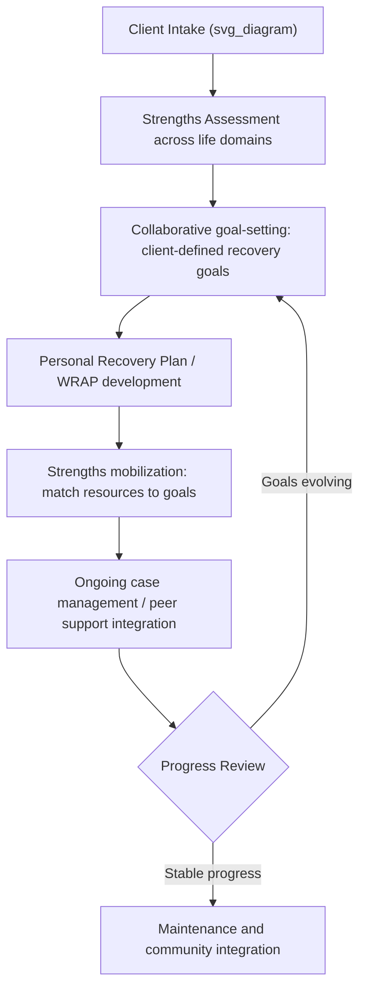

## Recovery-Oriented and Strengths-Based Clinical Practice

### Overview

Recovery-oriented practice and strengths-based practice are two closely related, often overlapping paradigms within clinical mental health care that shift the organizing frame of treatment away from pathology management alone and toward the person's capacities, self-determination, and lived experience of a meaningful life. Recovery-oriented practice originated largely within the psychiatric rehabilitation and consumer/survivor movements (particularly for serious mental illness such as schizophrenia and bipolar disorder), while strengths-based practice has roots in social work (notably the Strengths Model developed by Charles Rapp and colleagues at the University of Kansas) and in positive psychology's emphasis on identifying and mobilizing character strengths. In contemporary clinical settings, the two frameworks are frequently integrated into a single practice orientation.

### Theoretical Foundations

**Recovery as a Personal, Non-Linear Process**

- Distinguishes **clinical recovery** (symptom remission, as defined by clinicians) from **personal recovery** (a self-defined, ongoing process of living a satisfying, hopeful, and contributing life, even in the continued presence of symptoms or disability).
- The most widely cited definition, from William Anthony (1993), frames recovery as a way of living a satisfying life with hope and contribution, regardless of the limitations caused by illness.
- Personal recovery is understood as non-linear, individualized, and not equivalent to "cure."

**CHIME Framework**

A commonly cited conceptual framework, derived from systematic review of personal recovery narratives, organizes recovery around five processes:

- **C**onnectedness — supportive relationships and social inclusion
- **H**ope and optimism — belief in the possibility of change
- **I**dentity — rebuilding a positive sense of self beyond the illness
- **M**eaning in life — purpose, spirituality, or life goals
- **E**mpowerment — personal responsibility and control over one's life

**The Strengths Model (Rapp & Goscha)**

- Built on six operating principles, including: focus on individual strengths rather than pathology; the community is viewed as an oasis of resources, not an obstacle; interventions are based on client self-determination; the case manager-client relationship is primary and essential; assertive outreach is the preferred mode of intervention; and people with severe mental illness can continue to learn, grow, and change.
- Employs structured tools such as the **Strengths Assessment** (mapping strengths across life domains: daily living, finances, social supports, health, leisure, spirituality, employment/education) and **Personal Recovery Plans** built collaboratively from that assessment.

**Character Strengths (VIA Classification)**

- Peterson and Seligman's VIA (Values in Action) Classification identifies 24 character strengths organized under six broad virtues (Wisdom, Courage, Humanity, Justice, Temperance, Transcendence).
- In clinical strengths-based work, the VIA Survey is used as an assessment instrument, with strengths identified and deliberately applied as coping resources and identity-affirming practices, distinct from (but complementary to) the Strengths Model's broader life-domain focus.

### Core Principles Comparison

| Dimension | Recovery-Oriented Practice | Strengths-Based Practice |
| --- | --- | --- |
| Primary origin | Psychiatric rehabilitation, consumer movement | Social work (Strengths Model), positive psychology (VIA) |
| Primary population | Historically, serious mental illness (SMI) | Broadly applicable across populations |
| Core unit of focus | The recovery journey and lived experience | Individual capacities and resources |
| Typical setting | Community mental health, case management, psychiatric rehabilitation | Case management, therapy, social work, coaching |
| Key outcome | Hope, meaning, self-defined quality of life | Identification and mobilization of strengths for goal attainment |

### Clinical Practice Elements

**Person-Centered Planning**

- Treatment goals are generated collaboratively and are explicitly the client's own goals, not clinician-imposed treatment targets.
- Language shifts from diagnostic/deficit terms ("noncompliant," "low insight") toward descriptive, non-pathologizing language.

**Strengths Assessment Process**

A structured strengths-based intake typically covers domains such as:

1. Daily living skills and functioning
2. Financial resources and management
3. Social supports and relationships
4. Health and wellness
5. Leisure and recreational interests
6. Spirituality and meaning-making
7. Employment, education, and vocational history

For each domain, the clinician documents: current status, the client's own desires/aspirations, and past strengths or resources that have been successfully used before (a "resource history").

**Motivational and Empowerment Techniques**

- Use of Motivational Interviewing (MI) principles is common, given its inherent alignment with autonomy support and eliciting the client's own change talk rather than clinician-directed persuasion.
- Peer support workers (individuals with lived experience of mental illness/recovery) are frequently integrated into recovery-oriented service teams, operationalizing the empowerment and connectedness elements of CHIME.

**Wellness Recovery Action Plan (WRAP)**

- A structured, self-management tool developed by Mary Ellen Copeland, widely used within recovery-oriented systems.
- Consists of sections including: a Wellness Toolbox (list of self-care strategies), Daily Maintenance Plan, Identifying Triggers and an Action Plan, Identifying Early Warning Signs, a Crisis Plan (advance directive-style), and a Post-Crisis Plan.

### Process Flow Diagram

### Practical Example: Strengths-Based Goal Translation

| Deficit-Framed Clinical Note | Strengths-Based Reframe | Resulting Collaborative Goal |
| --- | --- | --- |
| "Patient has poor social functioning and social withdrawal" | "Patient values close, one-on-one relationships and has successfully maintained a friendship with a former coworker for 10 years" | Reconnect with the former coworker as a first step toward rebuilding a small support network |
| "Patient is unemployed and lacks motivation" | "Patient previously held a job in landscaping for three years and describes enjoying outdoor, physical work" | Explore supported employment options in outdoor/physical labor roles |
| "Patient is noncompliant with medication" | "Patient has expressed a goal of feeling more like 'himself' and has ideas about what helps and doesn't help him feel that way" | Collaborative medication review incorporating patient's own observations about side effects and benefits |

### Settings and Applications

- **Community Mental Health Centers (CMHCs)**: Case management models built directly on the Strengths Model, particularly for individuals with schizophrenia-spectrum and other serious mental illness diagnoses.
- **Psychiatric Rehabilitation Programs**: Vocational and social skills programming explicitly organized around recovery goals rather than symptom checklists.
- **Inpatient/Crisis Services**: Increasing incorporation of recovery-oriented language and practices (e.g., collaborative safety planning rather than purely clinician-directed risk management), though full strengths-based case management is less common in acute inpatient settings due to length-of-stay constraints.
- **Substance Use Treatment**: Strengths-based and recovery-oriented frameworks are also foundational in addiction treatment, where "recovery" carries a parallel but historically distinct meaning tied to sobriety/harm-reduction movements.
- **Social Work and Case Management Training**: The Strengths Model is a core curricular component in many MSW programs internationally.

### Evidence Base

- Systematic reviews of the CHIME framework indicate consistent identification of its five processes across recovery narratives internationally, supporting its use as an assessment and program-evaluation framework, though [Inference] evidence for CHIME as a direct causal treatment mechanism (rather than a descriptive framework) is less robust than its descriptive validity.
- Strengths Model case management has demonstrated positive outcomes in several controlled and quasi-experimental studies on measures such as housing stability, hospitalization reduction, and goal attainment for individuals with serious mental illness, though effect sizes vary by study design and fidelity to the model.
- WRAP has an evidence base primarily from quasi-experimental and pre-post studies showing improvements in self-reported hope, self-perceived recovery, and symptom self-management; [Unverified] fully powered RCT evidence with long-term follow-up is more limited compared to some standard psychiatric interventions.
- [Inference] Much of the recovery-oriented practice literature emphasizes qualitative and mixed-methods outcomes (meaning, hope, quality of life) that are methodologically harder to quantify via traditional RCT symptom-endpoint designs, which affects how this evidence base is typically compared to symptom-focused treatment trials.

### Implementation Considerations and Critiques

**Key Points**

- **Fidelity vs. adaptation tension**: Manualized fidelity to models like the Strengths Model can be difficult to sustain within high-caseload public mental health systems; organizational buy-in and adequate training/supervision are cited as major implementation barriers.
- **Risk of superficial adoption**: Critics note that recovery-oriented *language* can be adopted by services without corresponding structural change (e.g., continued coercive practices, inadequate resources for genuine choice), sometimes termed "recovery-washing."
- **Balancing strengths focus with clinical risk management**: Strengths-based practice does not mean ignoring risk (e.g., suicidality, psychosis-related safety concerns); competent practice integrates strengths orientation with rigorous clinical risk assessment rather than replacing it.
- **Cultural and systemic context**: Definitions of a "meaningful life" and appropriate strengths vary across cultural contexts; recovery-oriented frameworks developed primarily in Western, individualist mental health systems require thoughtful adaptation elsewhere.
- Outcomes and fidelity of implementation may vary considerably depending on organizational resources, staff training, and system-level supports.

**Next Steps**

- CHIME framework: detailed component review and measurement tools
- The Strengths Model (Rapp & Goscha): full six-principle framework and case manager training
- Wellness Recovery Action Plan (WRAP): detailed component breakdown
- VIA Classification of Character Strengths: assessment and clinical application
- Peer support specialist roles in recovery-oriented systems
- Motivational Interviewing as a complementary clinical technique
- Recovery-oriented practice in substance use treatment settings
- Person-centered planning methodologies in psychiatric rehabilitation