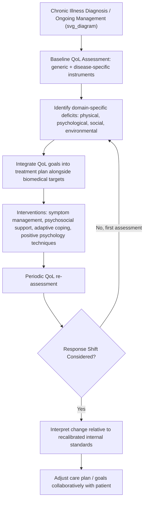

## Quality of Life Considerations in Chronic and Clinical Populations

### Overview

Quality of life (QoL) has become a central outcome construct in the clinical management of chronic illness, disability, and long-term mental health conditions, operating alongside — and sometimes independently of — traditional biomedical outcome measures such as symptom severity, disease markers, or mortality. The World Health Organization defines quality of life as an individual's perception of their position in life within the context of their culture and value systems, in relation to their goals, expectations, standards, and concerns. In clinical and positive-psychology-informed practice, QoL considerations reflect the recognition that disease burden and subjective well-being are related but distinct dimensions, and that treatment success cannot be fully captured by symptom or biomarker reduction alone.

### Theoretical Foundations

**Health-Related Quality of Life (HRQoL)**

- A narrower, clinically operationalized subset of general QoL, focused specifically on the impact of health status, disease, and treatment on functioning and well-being.
- Typically organized into core domains: physical functioning, psychological/emotional well-being, social functioning, and role functioning (occupational/domestic), sometimes with disease-specific additional domains (e.g., cognitive functioning in neurological conditions, body image in oncology).

**The Disability Paradox**

- A well-documented phenomenon, first named in the literature by Albrecht and Devlieger (1999), describing the finding that a substantial proportion of people with serious and persistent disabilities report a good or excellent quality of life, despite the presence of significant functional limitation — a finding that challenges purely functionalist or medical assumptions equating impairment with poor QoL.
- [Inference] This paradox is generally attributed to psychological adaptation processes (hedonic adaptation, response shift, cognitive reappraisal) rather than to the absence of genuine hardship.

**Response Shift Theory**

- Describes the phenomenon whereby individuals recalibrate their internal standards, values, or conceptualization of QoL over the course of chronic illness, meaning that a patient's QoL rating at two time points may reflect a genuinely changed internal metric rather than a stable, externally comparable scale.
- This has significant methodological implications for longitudinal QoL research: a stable QoL score over time in a person with a progressively worsening chronic condition may reflect adaptation (response shift) rather than an absence of actual decline in objective functioning.

**Dual-Continua and Well-Being Amid Illness**

- Consistent with the broader dual-continua model discussed in positive psychology's clinical applications, QoL frameworks explicitly allow for the coexistence of significant symptom burden and meaningful well-being — reinforcing that chronic illness management should target QoL as a parallel, not subordinate, treatment goal.

### Domains of Quality of Life

A commonly used multidimensional structure includes:

1. **Physical domain** — pain, energy/fatigue, mobility, sleep, activities of daily living
2. **Psychological domain** — positive/negative affect, self-esteem, body image, cognitive functioning, spirituality/meaning
3. **Social relationships domain** — personal relationships, social support, sexual activity
4. **Environmental domain** — financial resources, physical safety, access to healthcare, home environment, opportunities for information/recreation

### Standard Assessment Instruments

| Instrument | Type | Typical Application |
| --- | --- | --- |
| WHOQOL-BREF | Generic, 26-item | Cross-condition, cross-cultural QoL assessment |
| SF-36 (Short Form-36) | Generic, 36-item | General health status across physical/mental domains |
| EQ-5D | Generic, 5-dimension | Health economics, utility-based QoL (used in cost-effectiveness analysis) |
| FACT-G (Functional Assessment of Cancer Therapy-General) | Disease-specific | Oncology, with tumor-specific modules (FACT-B for breast, FACT-L for lung, etc.) |
| SGRQ (St. George's Respiratory Questionnaire) | Disease-specific | Chronic respiratory disease (COPD, asthma) |
| KDQOL (Kidney Disease Quality of Life) | Disease-specific | End-stage renal disease, dialysis populations |
| QOLIE-31 | Disease-specific | Epilepsy |
| Quality of Life Enjoyment and Satisfaction Questionnaire (Q-LES-Q) | Psychiatric | Depression, anxiety, and other psychiatric populations |

Generic instruments (e.g., WHOQOL-BREF, SF-36) allow cross-condition and cross-population comparison; disease-specific instruments capture clinically meaningful nuances that generic measures may miss (e.g., breathlessness in COPD, neuropathy in diabetes) but sacrifice comparability across conditions.

### Clinical Assessment and Integration Process

### Practical Example: QoL-Informed Care Planning

| Domain | Assessment Finding (Patient with Type 2 Diabetes) | QoL-Informed Intervention |
| --- | --- | --- |
| Physical | Fatigue and neuropathic pain limiting daily activity | Graded activity pacing, pain management referral |
| Psychological | Elevated diabetes-related distress, low self-efficacy | Diabetes-specific CBT or positive psychology-informed coping skills (e.g., savoring, strengths use) |
| Social | Reduced social participation due to dietary restrictions at gatherings | Social problem-solving, peer support group referral |
| Environmental | Limited access to fresh food in current living situation | Referral to community nutrition/social work resources |

### Positive Psychology Integration in QoL-Focused Care

- **Meaning-making interventions**: Particularly relevant in life-limiting or progressive conditions (e.g., cancer, ALS), where interventions such as Dignity Therapy or Meaning-Centered Psychotherapy (Breitbart) explicitly target the Purpose/Meaning domain of QoL rather than symptom reduction alone.
- **Benefit-finding and post-traumatic growth**: Some patients report positive psychological change following diagnosis of serious illness (e.g., reprioritized values, deepened relationships); clinical approaches may support, without artificially inducing, this process.
- **Adaptive coping and strengths mobilization**: Consistent with strengths-based practice, chronic illness care increasingly incorporates identification of patient strengths and resources (rather than exclusively deficit/limitation documentation) to support QoL domains alongside disease management.
- **Savoring and positive affect interventions**: Used to counteract the tendency of chronic symptom burden to dominate attentional focus, supporting psychological domain scores even when physical domain limitations persist.

### Applications Across Clinical Populations

**Oncology**

- QoL is now a standard co-primary or secondary endpoint in most cancer clinical trials, alongside survival and progression-free survival metrics, reflecting recognition that treatment burden (side effects) must be weighed against survival benefit.

**Cardiovascular and Respiratory Disease**

- QoL measures inform decisions in conditions where treatment involves significant lifestyle or symptom trade-offs (e.g., heart failure, COPD), and are used in pulmonary/cardiac rehabilitation program evaluation.

**Chronic Pain**

- QoL frameworks are central to biopsychosocial pain management models, given the well-documented dissociation between pain intensity and functional/psychological impact.

**Serious Mental Illness**

- QoL assessment in psychiatric populations (e.g., schizophrenia, bipolar disorder) parallels the recovery-oriented practice emphasis on subjective well-being and social/occupational functioning, not solely symptom remission.

**Pediatric and Geriatric Populations**

- Age-adapted instruments (e.g., PedsQL for children, specific geriatric QoL measures accounting for cognitive impairment) are required, as standard adult self-report instruments may not be valid or feasible across the lifespan.

### Methodological and Clinical Considerations

**Key Points**

- **Proxy vs. self-report discrepancy**: In populations with cognitive impairment or severe illness, caregiver/clinician proxy ratings of patient QoL often diverge from patient self-report, typically underestimating patient-reported QoL; self-report should be prioritized whenever feasible.
- **Cultural validity**: Generic instruments developed in one cultural context require careful cross-cultural validation (not simple translation) before use in different populations, given cultural variation in what constitutes a "good life."
- **Distinguishing QoL from mood/depression measures**: While correlated, QoL and depression are conceptually distinct; a purely symptom-focused depression screen may miss meaningful QoL deficits (e.g., in social or environmental domains) that require different interventions than antidepressant treatment alone.
- **Utility-based measures in health economics**: Instruments like the EQ-5D generate quality-adjusted life year (QALY) values used in cost-effectiveness analysis and health policy decisions, distinct from the more descriptive, multidimensional QoL instruments used in direct clinical care.
- Clinical interpretation of QoL scores and their responsiveness to intervention may vary by condition, disease stage, and instrument used, and individual patient results should be interpreted with appropriate clinical judgment.

**Next Steps**

- WHOQOL-BREF: full domain and item structure
- Response shift theory: methodological approaches (e.g., then-test, individualized QoL measures)
- Meaning-Centered Psychotherapy (Breitbart) for advanced illness
- Post-traumatic growth and benefit-finding in chronic illness
- Health economics and QALY-based utility measurement
- Disease-specific QoL instrument selection criteria
- Proxy-report validity in cognitive impairment populations
- Integrating strengths-based practice with chronic disease management