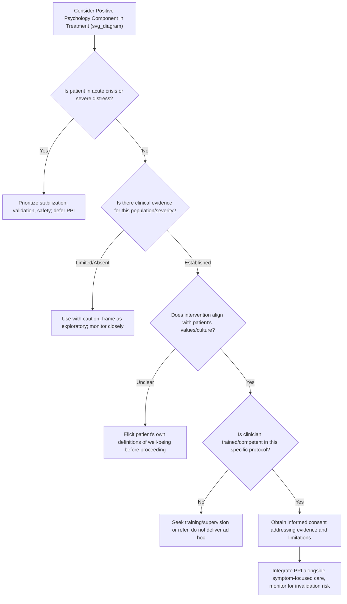

## Ethical Considerations When Combining Positive Psychology and Therapy

### Overview

The integration of positive psychology interventions (PPIs) into clinical therapeutic practice raises a distinct set of ethical considerations beyond those governing standard psychotherapy. Because positive psychology techniques originated substantially outside clinical/medical contexts — in educational, organizational, and general well-being settings — their translation into treatment for individuals experiencing psychiatric symptoms, trauma, grief, or chronic illness requires careful ethical scrutiny regarding informed consent, competence boundaries, cultural validity, potential harm, and the risk of minimizing genuine distress.

### Core Ethical Principles Applied to Positive Psychology Integration

**Beneficence and Non-Maleficence**

- Positive psychology interventions are not inherently benign; poorly timed or poorly matched interventions can cause harm (e.g., asking a severely depressed patient to list "three good things" during an acute crisis may increase feelings of failure or invalidation if the exercise fails or feels forced).
- Clinicians bear responsibility for evaluating whether a given PPI is appropriately matched to the patient's current clinical state, not merely whether the technique has general evidence support in non-clinical populations.

**Autonomy and Informed Consent**

- Patients should understand when and why a treatment plan shifts toward or incorporates positive-psychology-oriented components (e.g., Well-Being Therapy, Positive Psychotherapy, gratitude/savoring exercises) as distinct from, or supplementary to, standard symptom-focused treatment.
- Informed consent should address the evidence base and limitations of these approaches for the patient's specific presentation, rather than presenting them as uniformly validated for all conditions and severities.

**Justice and Access**

- Positive psychology protocols requiring specialized training (e.g., Well-Being Therapy, Meaning-Centered Psychotherapy) may not be equitably available across care settings, raising access and equity considerations, particularly in under-resourced or public mental health systems.
- Some positive psychology constructs (e.g., specific culturally-normed ideas of "flourishing," strengths, or optimism) may not translate equitably across diverse cultural, socioeconomic, or linguistic patient populations without adaptation.

**Fidelity and Scientific Integrity**

- Clinicians should distinguish between well-validated, manualized protocols (e.g., Well-Being Therapy, Positive Psychotherapy) and popularized but less rigorously tested positive psychology exercises, avoiding overstatement of efficacy to patients.

### Key Ethical Risk Areas

**1. Toxic Positivity and Invalidation of Distress**

- Toxic positivity refers to the excessive or inappropriate promotion of a positive mindset in contexts where it dismisses, minimizes, or invalidates legitimate negative emotional experiences.
- In a clinical context, this risk manifests when positive psychology exercises are applied without first validating the patient's distress, or when a therapist implicitly or explicitly communicates that the patient's negative emotions are a problem to be immediately corrected rather than legitimate experiences to be processed.
- [Inference] This risk is particularly salient in grief, trauma, and serious illness contexts, where negative emotions may be an appropriate and necessary part of adaptive processing rather than a deficit to be resolved.

**2. Premature or Mismatched Positive Reframing**

- Introducing meaning-making, benefit-finding, or gratitude-oriented interventions too early in treatment — before a patient has had adequate space to process acute distress — can be experienced as pressure to "move on" prematurely.
- Ethical practice requires clinical judgment regarding sequencing (e.g., stabilization and validation phases preceding positive-psychology-oriented work), consistent with staged/sequential treatment models such as Well-Being Therapy's placement after acute-phase symptom treatment.

**3. Overgeneralization from Non-Clinical Evidence**

- A substantial portion of positive psychology's evidence base derives from studies in non-clinical, subclinical, or general population samples.
- Applying findings from these populations directly to patients with major psychiatric diagnoses, personality disorders, or severe trauma histories without clinical evidence specific to those populations represents a form of evidence misapplication that clinicians should actively guard against.

**4. Cultural and Individual Value Imposition**

- Constructs such as optimism, individual autonomy, self-acceptance, or specific definitions of "the good life" carry cultural assumptions (often rooted in Western, individualist frameworks) that may not align with a given patient's cultural values, religious framework, or personal definition of well-being.
- Ethical practice requires eliciting the patient's own values and definitions of flourishing rather than imposing a standardized model (e.g., Ryff's six dimensions, PERMA) as a universal template.

**5. Competence Boundaries**

- Delivering manualized positive psychology protocols (WBT, PPT, Meaning-Centered Psychotherapy) without adequate training risks both reduced efficacy and inadvertent harm, particularly given that several of these protocols involve structured cognitive and emotional work with clinical populations.
- Professional ethical codes (e.g., APA Ethical Principles, Standard 2.01 on Boundaries of Competence) require clinicians to practice within the boundaries of their training and to obtain appropriate supervision/consultation when integrating newer or adjunctive techniques.

**6. Conflation of Well-Being Promotion with Symptom Suppression**

- Ethical risk arises when positive-affect-building techniques are used, implicitly or explicitly, as a substitute for adequately addressing underlying pathology, trauma, or environmental/social stressors (e.g., using gratitude exercises in place of addressing a patient's genuine socioeconomic hardship or unsafe living situation).
- Positive psychology techniques are appropriately framed as complementary to, not a replacement for, addressing legitimate external stressors or unmet clinical needs.

### Ethical Decision-Making Process

### Practical Example: Ethical Reasoning in Case Context

| Clinical Scenario | Ethical Risk | Recommended Approach |
| --- | --- | --- |
| Patient recently bereaved, therapist considers a gratitude journaling assignment in session 2 | Premature positive reframing; toxic positivity risk | Prioritize grief processing and validation first; consider gratitude/meaning work only later, if and when clinically appropriate and patient-initiated interest emerges |
| Patient from a collectivist cultural background is assigned a "signature strengths" exercise emphasizing individual achievement | Cultural value imposition | Adapt strengths exploration to include relational/communal strengths and involve family-oriented framing if consistent with patient's values |
| Clinician without WBT training attempts to deliver WBT's dimensional-mapping technique after a single conference workshop | Competence boundary violation | Pursue formal training/supervision before delivering the manualized protocol, or refer to a trained provider |
| Patient facing genuine financial hardship and unsafe housing is offered savoring exercises as the primary intervention | Conflating well-being promotion with addressing external stressors | Prioritize case management/social work referral for concrete stressors; position savoring as adjunctive, not primary |

### Professional and Regulatory Context

- Professional ethics codes governing psychotherapy (e.g., APA Ethical Principles of Psychologists and Code of Conduct, and equivalent bodies internationally) apply fully to positive-psychology-integrated treatment; there is no separate, relaxed ethical standard for "well-being" work as opposed to "clinical" work.
- Standards regarding competence, informed consent, cultural competence, and avoidance of harm apply identically regardless of whether the intervention is framed as symptom-reduction or well-being-promotion focused.
- [Unverified] Formal licensing board guidance specific to positive psychology integration (as opposed to general psychotherapy ethics) remains limited in most jurisdictions; clinicians generally apply general psychotherapy ethical frameworks to this specific content area rather than a distinct regulatory structure.

### Considerations for Special Populations

**Key Points**

- **Severe mental illness (e.g., psychosis, bipolar disorder)**: Positive psychology techniques require careful adaptation and are generally adjunctive rather than primary treatment; overly ambitious goal-setting exercises (relevant to Purpose/Meaning domains) require attention to avoid contributing to manic-spectrum symptom escalation in bipolar populations.
- **Trauma populations**: Meaning-making and post-traumatic growth work should follow, not precede, adequate trauma processing and safety establishment, consistent with phase-based trauma treatment models.
- **Terminal or life-limiting illness**: Meaning-centered approaches (e.g., Breitbart's Meaning-Centered Psychotherapy) require particular sensitivity to avoid implying that patients who do not achieve "growth" or positive meaning from their diagnosis have failed in some way.
- **Children and adolescents**: Strengths-based and positive psychology exercises require developmentally appropriate adaptation and particular attention to avoiding pressure toward performative positivity in a population still developing emotional regulation capacity.
- Ethical application in each of these populations may require case-by-case clinical judgment beyond generic protocol guidelines, and outcomes may vary based on individual presentation and context.

**Next Steps**

- Toxic positivity: definitions, clinical markers, and differentiation from adaptive coping
- Phase-based trauma treatment models and appropriate sequencing of meaning-work
- Cultural adaptation frameworks for positive psychology constructs
- APA Ethical Principles: competence and informed consent standards applied to novel interventions
- Meaning-Centered Psychotherapy in palliative and terminal illness care
- Post-traumatic growth: ethical considerations in clinical elicitation
- Positive psychology adaptations for pediatric and adolescent populations
- Supervision and training pathways for manualized positive psychology protocols (WBT, PPT)