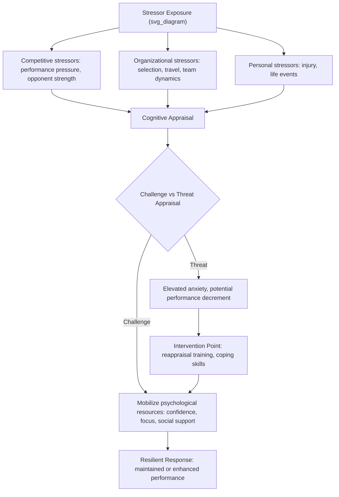

## Mental Toughness and Psychological Resilience in Athletes

### Overview

Mental toughness and psychological resilience are closely related but conceptually distinct constructs within sport and performance psychology, both concerned with athletes' capacity to sustain performance and well-being under conditions of stress, adversity, and pressure. Mental toughness is generally understood as a relatively stable personal resource or disposition enabling consistent high performance and coping across a range of demands, while resilience is more specifically framed as the process of effectively negotiating, adapting to, or bouncing back from specific adverse or stressful events. Both constructs have generated substantial theoretical and applied literature in sport psychology, alongside ongoing debate regarding their precise definitions and measurement.

### Theoretical Foundations

**Mental Toughness: The 4Cs Model (Clough, Earle, and Sewell)**

One of the most widely used frameworks, adapted from Kobasa's hardiness construct, organizes mental toughness into four components:

1. **Control** — a belief in one's ability to influence events and manage one's own emotions (subdivided into life control and emotional control)
2. **Commitment** — the capacity to set goals and remain involved/deeply engaged despite difficulties
3. **Challenge** — perceiving potential threats or difficulties as opportunities for growth rather than threats to be avoided
4. **Confidence** — a strong belief in one's own abilities (self-confidence) and the capacity to remain assertive in interpersonal/competitive situations (interpersonal confidence)

**Mental Toughness: Alternative Conceptual Models**

- **Jones, Hanton, and Connaughton's framework**: Defines mental toughness as a natural or developed psychological edge enabling athletes to cope better than opponents with the demands of competition and to be more consistent and superior in maintaining determination, focus, confidence, and control under pressure.
- **Gucciardi's Differentiated Model**: Emphasizes mental toughness as domain-specific and behaviorally expressed (rather than purely a fixed trait), focusing on the interaction between personal characteristics and situational demands.

**Psychological Resilience in Sport**

- Fletcher and Sarkar's model of psychological resilience in Olympic champions identifies resilience as the product of the dynamic interaction between personal qualities (e.g., positive personality traits, motivation, confidence, focus, perceived social support) and the environment, resulting in the maintenance of a "resilient" performance response despite exposure to significant stressors.
- Resilience is generally framed as a **process** involving stressors (competitive, organizational, personal), psychological mechanisms (meta-cognitions, challenge appraisals), and outcomes (thriving despite adversity), distinguishing it from mental toughness as a broader dispositional construct.

**Distinguishing the Constructs**

| Aspect | Mental Toughness | Psychological Resilience |
| --- | --- | --- |
| Conceptual nature | Relatively stable trait/disposition | Dynamic process in response to specific adversity |
| Temporal focus | Ongoing/consistent across situations | Specific to a stressor-response-recovery sequence |
| Primary theoretical origin | Personality/hardiness psychology | Developmental psychopathology, positive psychology |
| Typical outcome measured | Consistent high performance under pressure generally | Effective adaptation/recovery following a specific setback |

[Inference] Considerable conceptual overlap exists between the two constructs in the applied sport psychology literature, and some researchers treat resilience as a component or subdimension of broader mental toughness, while others maintain a strict conceptual separation; no fully unified consensus definition currently exists across the field.

### Key Related Constructs

- **Grit** (Duckworth): Perseverance and passion for long-term goals; related to but distinct from mental toughness, with greater emphasis on sustained effort toward distal goals rather than moment-to-moment competitive coping.
- **Self-efficacy** (Bandura): Situation-specific confidence in one's capability to execute a required course of action; a component of both toughness and resilience frameworks but narrower in scope.
- **Hardiness** (Kobasa): The original personality construct (control, commitment, challenge) from which the 4Cs mental toughness model was directly adapted.
- **Psychological flexibility**: The capacity to remain in contact with the present moment and adjust behavior according to context and values, increasingly integrated into applied resilience-building work in sport (e.g., via Acceptance and Commitment Therapy-informed approaches).

### Assessment Instruments

| Instrument | Construct | Notes |
| --- | --- | --- |
| Mental Toughness Questionnaire 48 (MTQ48) | Mental toughness (4Cs model) | Widely used commercial and research instrument |
| Sports Mental Toughness Questionnaire (SMTQ) | Mental toughness | Shorter, sport-specific measure |
| Psychological Performance Inventory (PPI) | Mental toughness | Earlier instrument, some psychometric criticism in literature |
| Connor-Davidson Resilience Scale (CD-RISC) | General resilience (not sport-specific) | Frequently adapted for athlete populations |
| Brief Resilience Scale (BRS) | General resilience | Measures perceived ability to bounce back from stress |
| Resilience in Sport Questionnaire | Sport-specific resilience | Domain-adapted instrument |

[Unverified] Psychometric critique in the sport psychology literature has raised concerns about construct validity and factor structure for several mental toughness instruments (particularly earlier versions), and researchers should consult current validation literature before instrument selection for specific applied or research purposes.

### Process Model: Resilience Under Competitive Stress

### Practical Example: Applied Intervention Sequence

A sport psychology consultant working with an athlete recovering from a poor competitive performance might apply the following sequence, integrating both toughness-building and resilience-specific techniques:

| Stage | Technique | Target Construct |
| --- | --- | --- |
| Immediate post-event | Structured debrief, cognitive reappraisal of the setback as informational rather than identity-threatening | Resilience (challenge appraisal) |
| Short-term | Goal-setting review, reaffirming commitment to training plan | Mental toughness (Commitment) |
| Ongoing | Self-talk and emotional regulation training for competitive anxiety | Mental toughness (Emotional Control) |
| Ongoing | Building/reinforcing social support network (coaches, teammates, sport psychologist) | Resilience (protective factor) |
| Pre-competition | Confidence-building through mastery imagery and past-success recall | Mental toughness (Confidence) |

### Common Applied Interventions

- **Goal-setting frameworks** (process, performance, and outcome goals) to build the Commitment component of mental toughness.
- **Self-talk interventions** (instructional and motivational self-talk) to support emotional control and confidence under pressure.
- **Imagery/mental rehearsal** for both confidence-building and stress-inoculation purposes.
- **Pressure training/simulation training**: deliberately exposing athletes to simulated high-pressure conditions in training to build both toughness and resilience through controlled stress exposure.
- **Mindfulness and Acceptance-based approaches** (e.g., Mindfulness-Acceptance-Commitment, MAC, approach developed by Gardner and Moore): an alternative to purely cognitive-control-based toughness training, emphasizing acceptance of internal states rather than suppression or elimination of anxiety.
- **Social support structuring**: deliberate cultivation of coach, peer, and organizational support systems, identified as a key protective factor in Fletcher and Sarkar's resilience model.

### Developmental and Contextual Factors

**Key Points**

- **Talent development environments**: Research (e.g., Collins and MacNamara's work on the "Rocky Road" to the top) suggests that exposure to manageable, appropriately-scaffolded challenges and setbacks during athletic development may contribute to the formation of both mental toughness and resilience, as opposed to environments that shield young athletes from all adversity.
- **Coach and organizational climate**: Autonomy-supportive coaching styles and psychologically safe team climates are associated with better resilience outcomes; conversely, controlling or purely outcome-focused coaching environments may undermine athlete well-being even where short-term performance metrics appear favorable.
- **Injury and career transitions**: Resilience research has specific applied relevance to injury rehabilitation and retirement/career-transition periods, where athletes face significant identity and role-based adversity distinct from in-competition stressors.
- **Overtraining and burnout risk**: [Inference] An excessive or rigid emphasis on toughness (e.g., "pushing through" all forms of distress) without adequate attention to recovery and psychological safety may contribute to burnout or overtraining syndrome; contemporary sport psychology increasingly frames genuine toughness as compatible with, rather than opposed to, appropriate rest and help-seeking behavior.

### Critiques and Limitations

- Definitional inconsistency across the mental toughness literature has drawn sustained critique, with some researchers arguing the construct risks becoming a catch-all term for "whatever helps athletes perform well," reducing its scientific precision.
- Overemphasis on mental toughness in athletic culture has been criticized for potentially reinforcing stigma around help-seeking and emotional expression, particularly regarding athlete mental health disclosure.
- Most mental toughness and resilience instruments rely on self-report methodology, which carries standard limitations (social desirability bias, limited capture of in-the-moment psychological states during competition).
- Applied outcomes of any given intervention (goal-setting, imagery, mindfulness-based training) may vary considerably by sport, competitive level, individual athlete characteristics, and quality of implementation.

**Next Steps**

- 4Cs Model of Mental Toughness: detailed subcomponent breakdown and MTQ48 use
- Fletcher and Sarkar's resilience model in Olympic-level athletes
- Mindfulness-Acceptance-Commitment (MAC) approach in sport psychology
- Grit and deliberate practice in long-term athletic development
- Talent development environments and the "Rocky Road" framework
- Athlete mental health disclosure and toughness-culture stigma
- Injury rehabilitation psychology and resilience
- Autonomy-supportive coaching and team psychological safety