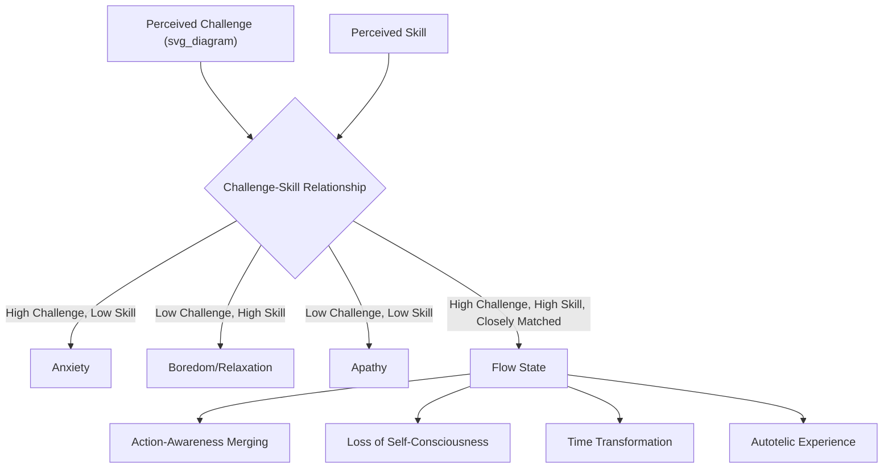

## Flow States and Peak Performance in Sport

### Overview

Flow is a psychological state characterized by complete absorption in an activity, marked by intense focus, a merging of action and awareness, and a subjective distortion of time perception, typically accompanied by intrinsically rewarding experience. The construct was developed by Mihaly Csikszentmihalyi through research initially conducted with artists, chess players, and rock climbers, and has since become a central construct in sport and performance psychology, closely associated with — but conceptually distinct from — the broader notion of "peak performance."

### Theoretical Foundations

**Csikszentmihalyi's Flow Model**

Csikszentmihalyi identified nine dimensions commonly associated with the flow experience:

1. **Challenge-skill balance** — the perceived challenge of the task closely matches the individual's perceived skill level
2. **Action-awareness merging** — activity becomes spontaneous, near-automatic
3. **Clear goals** — the individual knows exactly what needs to be accomplished
4. **Unambiguous feedback** — immediate, clear information about performance is available
5. **Concentration on the task at hand** — total focus, exclusion of irrelevant stimuli
6. **Sense of control** — a feeling of being in command of the situation and one's actions
7. **Loss of self-consciousness** — reduced concern about self-presentation or ego-related evaluation
8. **Transformation of time** — subjective time distortion (commonly time feeling accelerated, though deceleration is also reported)
9. **Autotelic experience** — the activity is experienced as intrinsically rewarding, worth doing for its own sake

**The Challenge-Skill Balance Model**

- Central to flow theory is the proposition that flow occurs specifically at the intersection of high perceived challenge and high perceived skill.
- When challenge exceeds skill, the individual is theorized to experience anxiety; when skill exceeds challenge, boredom; flow is the specific channel where both are high and closely matched.
- This model is frequently depicted as a quadrant or channel diagram in the sport psychology literature.

**Distinguishing Flow from Peak Performance and Peak Experience**

| Construct | Definition | Key Distinguishing Feature |
| --- | --- | --- |
| Flow | Absorbed state matching Csikszentmihalyi's nine dimensions | Defined by the subjective quality of the experience itself |
| Peak Performance | An episode of functioning that represents an individual's personal best or near-best objective performance | Defined by performance outcome, not necessarily subjective state |
| Peak Experience (Maslow) | A profound, often transcendent moment of self-actualization or joy | Broader humanistic construct, not sport- or task-specific |

[Inference] Flow and peak performance frequently co-occur and are often conflated in popular usage, but they are not identical: an athlete can achieve a peak (objectively excellent) performance without reporting the full subjective flow experience, and conversely can report flow-like absorption without necessarily achieving an objective personal best.

### Flow Model Diagram

### Assessment Instruments

| Instrument | Purpose | Notes |
| --- | --- | --- |
| Flow State Scale-2 (FSS-2) | Measures flow retrospectively after a specific sport performance | Widely used 36-item, nine-dimension measure aligned with Csikszentmihalyi's model |
| Dispositional Flow Scale-2 (DFS-2) | Measures general tendency/disposition to experience flow across sport participation | Trait-level counterpart to the FSS-2 |
| Experience Sampling Method (ESM) | Real-time sampling of subjective state during activity via random prompts | Used in original Csikszentmihalyi research; less common in in-competition sport due to interruption concerns |

### Antecedents and Facilitating Conditions

Sport psychology research has identified several factors that increase the likelihood of flow occurrence in athletic contexts:

- **Optimal preparation**: Thorough physical and mental preparation, including pre-performance routines, is associated with higher flow likelihood.
- **Confidence and positive mental attitude**: Self-belief and a positive outlook heading into performance are consistently identified as flow antecedents in qualitative athlete interview studies.
- **Focus and concentration**: The ability to narrow attention to task-relevant cues, excluding distraction, directly supports the concentration dimension of flow.
- **Optimal arousal/activation level**: Physiological arousal in a task-appropriate range (related to but distinct from the Yerkes-Dodson law) supports flow onset; excessive or insufficient arousal is associated with flow disruption.
- **Environmental and situational factors**: Familiar competitive environments, supportive crowd conditions, and absence of major situational disruption are commonly cited facilitators.
- **Team/interactive factors** (in team sport): Positive team interaction, unified focus, and effective communication have been identified as facilitators of collective or shared flow experiences.

### Common Disruptors of Flow

- Unexpected external interruptions or environmental changes (e.g., equipment failure, weather disruption, rule interruptions)
- Physical problems (injury, fatigue, illness)
- Non-optimal environmental/situational conditions (crowd hostility, poor field/venue conditions)
- Excessive outcome-focus or evaluative self-consciousness during performance ("choking" -related self-focus)
- Interpersonal conflict or communication breakdown in team settings

### Practical Example: Applied Flow-Facilitation Protocol

| Phase | Intervention | Target Flow Antecedent |
| --- | --- | --- |
| Pre-competition (days before) | Structured physical preparation, tactical review, confirming clear performance goals | Preparation, Clear Goals |
| Pre-competition (immediate) | Individualized pre-performance routine (physical and cognitive) | Optimal arousal regulation, Confidence |
| In-competition | Attentional cue words to redirect focus to task-relevant stimuli when distraction occurs | Concentration, Action-Awareness Merging |
| In-competition | Process-goal focus rather than outcome/scoreboard focus | Reduced self-consciousness, Sense of Control |
| Post-competition | Structured reflection using FSS-2 or similar reflective tool | Building disposition toward future flow occurrence |

### Applied Interventions to Facilitate Flow

- **Pre-performance routines**: Consistent, individualized behavioral and cognitive sequences performed before competition to establish optimal arousal and attentional focus.
- **Goal-setting (process-oriented)**: Emphasis on process and performance goals over outcome goals is theorized to support the "clear goals" and "unambiguous feedback" dimensions while reducing evaluative anxiety associated with outcome focus.
- **Attentional control training**: Techniques to narrow and redirect attention to task-relevant cues, directly targeting the concentration dimension.
- **Mental imagery and rehearsal**: Used to build the automaticity associated with the action-awareness merging dimension.
- **Mindfulness-based approaches**: Increasingly applied in sport psychology as a means of cultivating present-moment attention and reducing self-conscious evaluation, both directly relevant to flow facilitation; frameworks such as Mindfulness-Acceptance-Commitment (MAC) explicitly target these mechanisms.
- **Task/challenge calibration**: In training design, deliberately calibrating drill difficulty to individual skill level (avoiding tasks too far above or below current capability) to create conditions conducive to flow during practice.

### Relationship to Performance Outcomes

- Flow states are consistently associated with self-reported enjoyment, intrinsic motivation, and subjective performance satisfaction across the sport psychology literature.
- [Inference] The direct causal relationship between flow and objective performance outcome (e.g., winning, achieving a personal best time) is less definitively established than the flow-enjoyment relationship, given that most flow research relies on retrospective self-report following performance, introducing potential recall bias linked to performance outcome itself (athletes may be more likely to recall flow following a good outcome).
- Some researchers have proposed a bidirectional or reciprocal relationship: flow may facilitate good performance, and good performance may in turn increase the subjective likelihood of reporting flow retrospectively.

### Considerations Across Sport Contexts

**Key Points**

- **Individual vs. team sport**: Flow research originated largely with individual-sport and solo-activity populations; team sport introduces additional facilitators and disruptors related to interpersonal dynamics, sometimes studied under the related construct of "team flow" or shared flow experience.
- **Skill level and experience**: Novice athletes may find it more difficult to achieve flow due to the cognitive demands of skill execution interfering with the automaticity central to action-awareness merging; flow may become more accessible as skill consolidates and execution becomes more automatic.
- **High-risk/extreme sports**: Flow has been particularly well-documented in extreme and adventure sport contexts (e.g., rock climbing, in Csikszentmihalyi's original research), where the stakes of losing focus are unusually high, potentially amplifying both the challenge-skill balance and the concentration dimension.
- **Applicability across performance domains**: While this coverage focuses on sport, flow theory has parallel application in music performance, surgery, programming, and other skilled-performance domains, sharing the same core challenge-skill balance mechanism.
- Individual athlete experience of flow facilitators and disruptors may vary considerably, and applied intervention effectiveness should be evaluated on an individualized basis rather than assumed uniform across athletes or sports.

**Next Steps**

- Csikszentmihalyi's original flow research methodology and Experience Sampling Method
- Attentional control theory and its application to sport performance
- Pre-performance routines: structure and individualization principles
- Team flow and shared flow states in collective sport contexts
- Mindfulness-based interventions in sport psychology (MAC approach)
- Choking under pressure: mechanisms and relationship to flow disruption
- Process vs. outcome goal-setting frameworks in athletic performance
- Flow theory applications beyond sport (music, surgery, skilled performance domains)