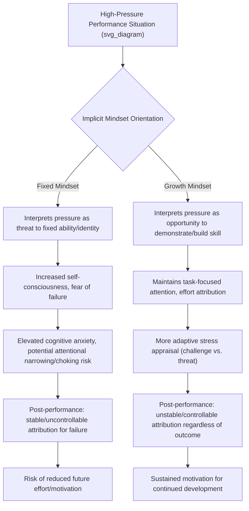

## Growth Mindset and Performance Under Pressure

### Overview

Growth mindset, developed by Carol Dweck through decades of research in social-cognitive and developmental psychology, refers to the implicit belief that abilities, intelligence, and talent can be developed through effort, strategy, and learning, as contrasted with a "fixed mindset," the belief that such traits are largely innate and unchangeable. In sport and performance contexts, mindset theory has been applied extensively to understand how athletes interpret setbacks, respond to competitive pressure, and sustain long-term development, with direct implications for coaching practice, talent development systems, and applied performance psychology under high-stakes conditions.

### Theoretical Foundations

**Implicit Theories of Ability (Dweck's Mindset Theory)**

- **Fixed mindset**: The belief that ability/talent is a stable, largely unchangeable trait. Individuals holding this belief tend to view challenges as threats to their self-image (since failure implies a fixed lack of ability) and often avoid situations that risk exposing perceived inadequacy.
- **Growth mindset**: The belief that ability can be developed through dedication, effort, and effective strategy use. Individuals holding this belief tend to view challenges as opportunities for growth and interpret setbacks as informative rather than identity-threatening.
- Dweck's original research demonstrated that these implicit theories are domain-specific (an individual may hold a growth mindset about athletic ability but a fixed mindset about, e.g., artistic ability) and are malleable through targeted intervention.

**Achievement Goal Theory Connection**

- Mindset theory is closely linked to achievement goal orientations:
  - **Mastery/task-oriented goals** (improvement, learning, personal progress) align with growth mindset
  - **Performance/ego-oriented goals** (demonstrating superiority relative to others, avoiding appearing incompetent) align more closely with fixed mindset
- Athletes with strong performance-avoidance orientations (fear of appearing incompetent) combined with fixed mindset beliefs are theorized to be particularly vulnerable to pressure-induced performance decrements.

**Mindset and Attribution Theory**

- Mindset shapes how athletes causally attribute success and failure (Weiner's attribution theory): growth-mindset athletes are more likely to attribute failure to controllable, unstable factors (insufficient effort, ineffective strategy — both changeable), while fixed-mindset athletes are more likely to attribute failure to uncontrollable, stable factors (lack of ability), a pattern associated with learned helplessness responses following repeated setbacks.

### Mindset and Pressure Response Mechanism

### Relationship to Challenge vs. Threat Appraisal

- Mindset theory intersects with the biopsychosocial model of challenge and threat (Blascovich and colleagues), which distinguishes between challenge states (perceived resources meet or exceed perceived demands, associated with more adaptive cardiovascular and performance responses) and threat states (perceived demands exceed resources, associated with less adaptive physiological and performance responses).
- [Inference] Growth mindset is theorized to promote challenge-state appraisal under pressure by reframing the demand (a high-stakes performance) as an opportunity for skill demonstration/development rather than a fixed-trait evaluation, though the mindset-appraisal-performance causal pathway in elite competitive sport specifically warrants continued empirical scrutiny given the complexity of real-world competitive pressure.

### Assessment Instruments

| Instrument | Purpose | Notes |
| --- | --- | --- |
| Implicit Theories of Ability Scale (Dweck) | General mindset measurement | Original scale, adaptable to sport-specific ability domains |
| Conceptions of the Nature of Athletic Ability Questionnaire (CNAAQ-2) | Sport-specific mindset measurement | Distinguishes incremental (growth) vs. entity (fixed) beliefs about athletic ability, with subdimensions for stable/unstable and specific/general ability beliefs |
| Achievement Goal Questionnaire for Sport (AGQ-S) | Mastery/performance goal orientation | Frequently used alongside mindset measures given theoretical overlap |

### Applied Interventions

**Mindset-Language Coaching Practices**

- **Process praise over person/ability praise**: Praising effort, strategy, and process ("You worked really hard on that transition") rather than fixed traits ("You're a natural") is associated in Dweck's developmental research with more resilient responses to subsequent failure; this principle has been extended into applied sport coaching practice.
- **Reframing failure/setback language**: Coaches and sport psychology consultants often work explicitly on reframing competitive losses or errors as specific, actionable information ("what does this tell us to work on") rather than global evaluations of ability.

**Structured Mindset Interventions**

- Brief, structured psychoeducational interventions explaining the neuroscience of skill development (e.g., brain plasticity, the role of deliberate practice) have been used in educational contexts to shift mindset, with some adaptation into sport and performance settings.
- [Unverified] The magnitude and durability of brief mindset interventions specifically within elite/competitive athletic populations (as opposed to educational/academic contexts, where most large-scale mindset intervention research has been conducted) remains a less thoroughly established area, and applied claims of large effect sizes in elite sport specifically should be treated with appropriate caution pending further population-specific replication.

**Goal-Setting Alignment**

- Structuring goal-setting frameworks around process and mastery goals (rather than purely outcome/ego goals) operationalizes growth-mindset principles in day-to-day training design.

**Attribution Retraining**

- Structured post-performance debrief protocols that guide athletes toward controllable, unstable attributions for setbacks (effort, strategy, preparation) rather than uncontrollable, stable attributions (fixed ability, talent) are used to reinforce growth-oriented interpretation patterns following both successes and failures.

### Practical Example: Pre- and Post-Competition Mindset Coaching

| Situation | Fixed-Mindset-Consistent Response | Growth-Mindset-Consistent Coaching Reframe |
| --- | --- | --- |
| Athlete says, "I'm just not a clutch performer" | Reinforces the statement as accurate self-assessment | "What specific skills or routines could you develop to perform better in high-pressure moments?" |
| Athlete loses a close match and says, "I choked, I always do this under pressure" | Validates fixed, stable, uncontrollable attribution | Guide toward specific, controllable factors: "What part of your pre-match routine or in-match decision-making could be adjusted?" |
| Coach praises a win with, "You're just naturally talented" | Reinforces fixed/ability-based self-concept | "Your preparation and in-game adjustments really paid off there" |
| Athlete faces a tough new opponent and expresses anxiety about the challenge | Avoidance encouraged, or pressure framed purely as threat | Frame the match explicitly as an opportunity to test and develop specific skills against a strong opponent |

### Considerations and Nuance in Applied Practice

**Key Points**

- **Mindset is domain- and belief-specific, not a fixed personal label**: An athlete is not simply "a growth-mindset athlete" or "a fixed-mindset athlete" as a global trait; mindset beliefs can vary by specific skill domain and can shift situationally, which has implications for how interventions are targeted (skill- or situation-specific rather than purely global).
- **Avoiding mindset-as-panacea framing**: [Inference] Mindset is one contributing factor among many (physical preparation, tactical skill, situational factors, team dynamics) influencing performance under pressure; over-attributing pressure-performance outcomes solely to mindset risks oversimplifying a multidetermined phenomenon and can itself become a form of fixed, blame-oriented attribution if misapplied ("you failed because you have a bad mindset").
- **False growth mindset**: Dweck herself has cautioned against superficial application of growth mindset language (e.g., simply praising effort regardless of outcome or strategy quality) without genuine engagement with strategy adjustment and skill development; effort alone, absent effective strategy, does not reliably produce improved outcomes.
- **Interaction with mental toughness and resilience constructs**: Growth mindset overlaps conceptually with elements of mental toughness (particularly the "Challenge" component of the 4Cs model) and psychological resilience (particularly challenge-appraisal mechanisms), and applied sport psychology practice often integrates mindset-language work alongside these broader frameworks rather than treating it as a wholly separate intervention domain.
- Individual athlete response to mindset-based coaching language and interventions may vary by age, competitive level, prior experience with failure, and broader team/organizational culture.

**Next Steps**

- Dweck's original fixed/growth mindset research and developmental origins
- Achievement Goal Theory: mastery vs. performance orientations in sport
- Weiner's Attribution Theory and its application to post-competition analysis
- Challenge vs. threat appraisal (biopsychosocial model) under competitive pressure
- Process praise vs. person praise in youth sport coaching
- Mental toughness (4Cs model) and its conceptual overlap with growth mindset
- Choking under pressure: cognitive and attentional mechanisms
- Deliberate practice and skill acquisition theory in athletic development