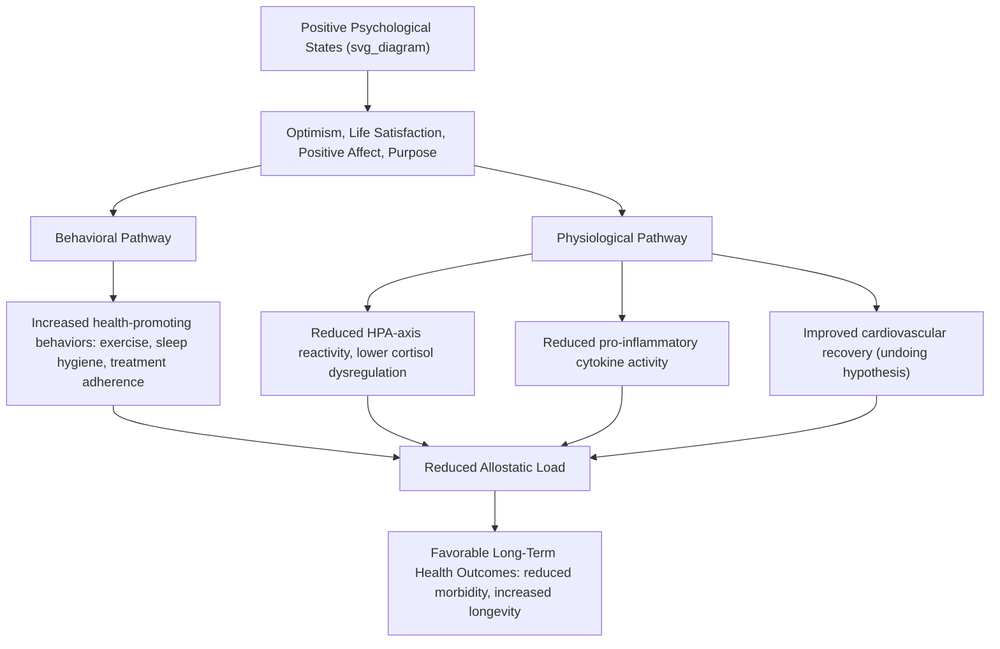

## Positive Health and the Physical Correlates of Well-Being

### Overview

Positive health is a conceptual framework, most explicitly articulated by Martin Seligman and colleagues, proposing that health should be defined and measured not merely as the absence of disease but as a positive state encompassing biological, subjective, and functional assets that predict superior physical health outcomes, greater longevity, and lower healthcare costs. This framework extends positive psychology's broader dual-continua logic (illness and wellness as related but distinct dimensions) into the domain of physical health, examining the bidirectional relationship between psychological well-being and physiological functioning.

### Theoretical Foundations

**The Positive Health Model (Seligman et al.)**

Positive health is proposed to comprise three interconnected categories of assets:

1. **Biological assets** — physiological markers associated with favorable health trajectories (e.g., high heart rate variability, favorable lipid profiles, optimal telomere length, robust immune markers)
2. **Subjective assets** — self-reported positive states, including optimism, life satisfaction, positive affect, and sense of purpose
3. **Functional assets** — behavioral and social resources supporting health, including strong social relationships, regular physical activity, and health-promoting habits

The model proposes that these assets are not merely the inverse of risk factors but function as independent predictors of health outcomes, meaning that positive health assets can predict favorable outcomes even after controlling for the absence of illness or risk factors.

**Psychoneuroimmunology (PNI)**

- The interdisciplinary field examining interactions between psychological processes, the nervous system, and the immune system provides a key mechanistic foundation for positive-health research.
- Chronic stress and negative affect are associated with dysregulated cortisol patterns, increased pro-inflammatory cytokine activity (e.g., IL-6, CRP), and impaired immune function; conversely, positive affect and effective stress management are associated with more favorable immune and inflammatory profiles.

**Allostatic Load**

- A framework describing the cumulative physiological wear resulting from chronic or repeated stress-response activation across multiple systems (cardiovascular, metabolic, immune, neuroendocrine).
- Positive psychological states and effective coping resources are theorized to reduce allostatic load accumulation, providing one mechanistic pathway linking well-being to long-term physical health outcomes.

**Broaden-and-Build Theory Applied to Physical Health**

- Fredrickson's broaden-and-build theory (previously discussed regarding depression/anxiety treatment) extends to physical health via the proposition that positive emotions, by building durable psychological and social resources over time, indirectly support health-promoting behaviors and stress-buffering, contributing to the undoing hypothesis (faster cardiovascular recovery from stress-induced arousal following positive emotion induction).

### Mechanistic Pathway Diagram

### Key Physical Correlates of Psychological Well-Being

**Cardiovascular Health**

- Optimism and positive affect have been associated in prospective cohort studies with reduced incidence of coronary heart disease and improved cardiovascular recovery following acute events (e.g., post-myocardial infarction outcomes).
- Hostility and chronic negative affect, conversely, have a longer-established association with elevated cardiovascular risk in the health psychology literature.

**Immune Function**

- Positive affect has been associated with more robust antibody response to vaccination and, in some studies, reduced susceptibility to upper respiratory infection following experimental viral exposure (notably in Sheldon Cohen's line of research on stress, social support, and common cold susceptibility).
- Chronic stress and negative affect are consistently associated with impaired wound healing and dysregulated inflammatory markers across multiple study designs.

**Endocrine/Neuroendocrine Function**

- Well-being and effective coping are associated with more adaptive diurnal cortisol patterns (e.g., appropriate morning cortisol awakening response paired with typical decline across the day), while chronic distress is associated with flatter or dysregulated diurnal cortisol slopes.

**Longevity**

- Multiple longitudinal studies (including well-known analyses of nuns' autobiographical writings and various large cohort studies) have found associations between higher trait positive affect/life satisfaction earlier in life and increased longevity, though [Inference] causal interpretation of these longitudinal correlational findings requires caution given the possibility of reverse causation (better underlying health enabling both greater well-being and longer life) and unmeasured confounding variables.

**Sleep**

- Positive affect and lower psychological distress are associated with better subjective and objective sleep quality; sleep, in turn, functions as a bidirectional mediator, given sleep's own well-documented influence on mood regulation and immune/metabolic function.

### Assessment Instruments Relevant to Positive Health Research

| Instrument/Marker | Domain | Notes |
| --- | --- | --- |
| Life Orientation Test-Revised (LOT-R) | Dispositional optimism | Commonly used predictor variable in positive-health outcome studies |
| Satisfaction with Life Scale (SWLS) | Subjective well-being | Frequently paired with biomarker outcomes in PNI research |
| Heart Rate Variability (HRV) | Biological asset/autonomic regulation | Indexes parasympathetic regulatory capacity |
| Diurnal cortisol slope | Biological asset/HPA-axis function | Salivary sampling across the day |
| C-Reactive Protein (CRP), Interleukin-6 (IL-6) | Inflammatory markers | Common biomarkers in PNI and allostatic load research |
| Allostatic Load Index | Composite biological risk | Aggregates multiple physiological system markers |

### Practical Example: Positive Health Assessment in a Clinical/Wellness Context

| Domain | Assessment Approach | Sample Finding | Potential Intervention |
| --- | --- | --- | --- |
| Subjective | LOT-R, SWLS administration | Moderate-low dispositional optimism | Optimism-building cognitive techniques (e.g., Best Possible Self exercise) |
| Biological | Resting HRV measurement, lipid panel | Reduced HRV relative to age-matched norms | Referral for stress-management program, physical activity counseling |
| Functional | Social network assessment, physical activity log | Limited social support, sedentary behavior pattern | Social connectedness intervention, graded physical activity plan |

### Applied Interventions Bridging Well-Being and Physical Health

- **Positive psychology interventions with health outcome measurement**: Some trials of gratitude, optimism-building, and savoring interventions have incorporated physiological or health-behavior outcome measures (e.g., blood pressure, self-reported health behaviors) alongside standard well-being measures.
- **Behavioral health integration**: Health coaching and behavioral medicine programs increasingly incorporate positive-psychology-informed techniques (strengths identification, values clarification) to support sustained health-behavior change (exercise adherence, dietary modification, smoking cessation) rather than relying solely on risk-based fear appeals.
- **Cardiac and pulmonary rehabilitation programs**: Some programs have incorporated positive affect and optimism-building components alongside standard physical rehabilitation protocols, reflecting recognition of psychological state as a contributor to rehabilitation adherence and outcome.
- **Workplace wellness programs**: Positive health frameworks have informed organizational wellness initiatives that combine physical health screening with well-being assessment and psychological resource-building components.

### Considerations and Limitations

**Key Points**

- **Directionality and confounding**: A substantial portion of the positive health evidence base relies on observational and longitudinal correlational designs; while plausible mechanistic pathways exist (PNI, allostatic load, health behavior mediation), definitive causal claims regarding well-being's direct physiological impact should be made cautiously, and reverse-causation (health affecting well-being) and third-variable confounding remain live methodological concerns in this literature.
- **Effect size and clinical significance**: [Inference] Even where statistically significant associations between well-being measures and physical health outcomes are found, effect sizes are frequently modest, and positive health assets should be understood as one contributing factor among many (genetics, socioeconomic status, access to care, health behaviors) rather than a dominant or sufficient determinant of health outcomes.
- **Risk of oversimplified "positive thinking cures illness" narratives**: The positive health framework does not support claims that psychological positivity can substitute for medical treatment, and popularized oversimplifications of this research risk promoting harmful narratives (e.g., implying that patients who develop serious illness somehow lacked sufficient positivity) — a framing explicitly at odds with the evidence base and with sound clinical ethics.
- **Population and measurement heterogeneity**: Findings regarding specific biomarkers (e.g., cortisol patterns, inflammatory markers) can vary considerably based on measurement timing, population characteristics, and methodological approach, and results should be interpreted within the context of the specific study design rather than generalized uncritically across populations.
- Individual biological, subjective, and functional health profiles vary substantially, and applied recommendations in clinical or wellness settings should be tailored accordingly rather than derived from population-level associations alone.

**Next Steps**

- Psychoneuroimmunology: mechanisms linking stress, affect, and immune function
- Allostatic load: measurement and clinical application
- The undoing hypothesis and cardiovascular recovery research (Fredrickson)
- Dispositional optimism (LOT-R) and health outcome research
- Behavioral medicine and health coaching integration of positive psychology techniques
- Social connectedness and immune/cardiovascular health outcomes
- Sleep as a bidirectional mediator between well-being and physical health
- Ethical considerations in communicating positive-health research to patients