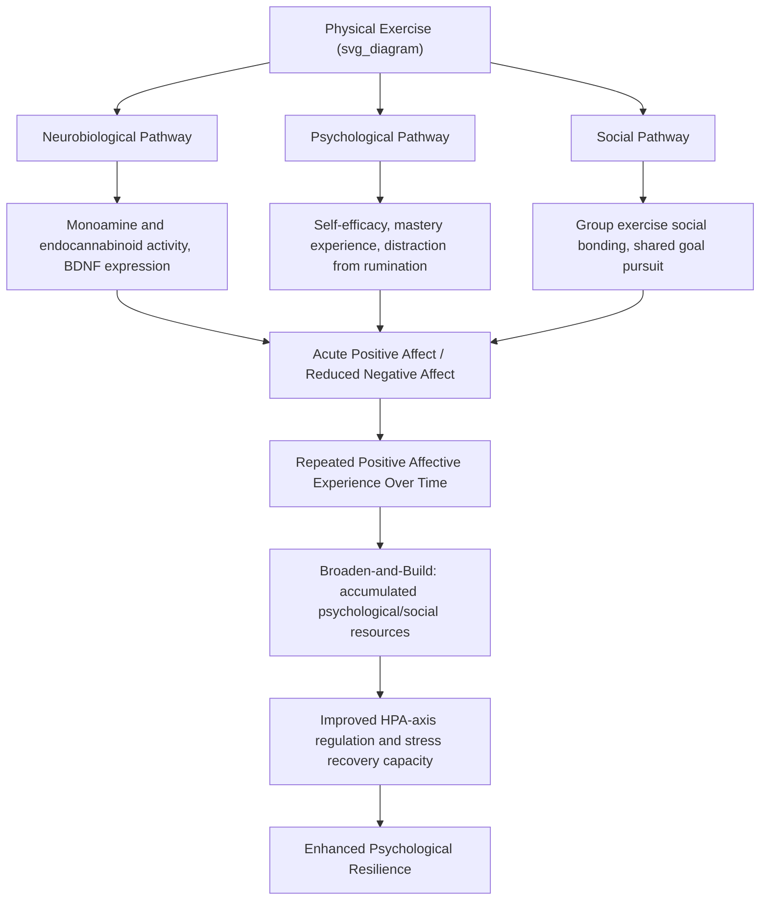

## Exercise, Positive Emotion, and Resilience

### Overview

The relationship between physical exercise, positive emotional states, and psychological resilience represents a well-established intersection of exercise psychology, affective science, and positive psychology. Regular physical activity is one of the most consistently replicated behavioral correlates of positive affect, mood regulation, and stress resilience across the psychological literature, with mechanistic pathways spanning neurobiological, psychological, and social domains. This body of research underpins exercise-based interventions used both in clinical mental health treatment and in general resilience-building and performance contexts.

### Theoretical Foundations

**Exercise and Affective Response Models**

- **Dual-Mode Theory** (Ekkekakis and colleagues): Proposes that affective responses to exercise are influenced by the interaction between exercise intensity and individual differences, with affective responses becoming more homogeneously positive at lower-to-moderate intensities (below or near the ventilatory/lactate threshold) and more variable, individually determined at higher intensities.
- **Distraction Hypothesis**: Proposes that exercise-induced mood improvement partly results from redirected attention away from stressors or ruminative thought during the activity itself, rather than solely from physiological mechanisms.

**Neurobiological Mechanisms**

- **Monoamine hypothesis**: Exercise is associated with increased availability of monoamine neurotransmitters (serotonin, dopamine, norepinephrine), implicated in mood regulation and overlapping mechanistically with pathways targeted by antidepressant pharmacotherapy.
- **Endocannabinoid system activation**: Contemporary research has increasingly implicated the endocannabinoid system (rather than solely endorphins, the earlier popularized "runner's high" explanation) in exercise-induced positive affect, particularly following moderate-intensity aerobic exercise.
- **Brain-Derived Neurotrophic Factor (BDNF)**: Exercise reliably increases BDNF expression, a neurotrophin implicated in neuroplasticity, hippocampal neurogenesis, and stress resilience at the neurobiological level.
- **HPA-axis regulation**: Regular exercise is associated with more adaptive cortisol regulation patterns and improved capacity to physiologically recover from acute stress exposure, directly relevant to resilience mechanisms.

**Exercise and the Broaden-and-Build Framework**

- Positive affect generated through exercise is theorized, consistent with Fredrickson's broaden-and-build theory, to contribute over time to the accumulation of durable psychological resources (improved self-efficacy, social connection through group exercise contexts, and enhanced coping repertoire), which in turn support resilience to future stressors.

### Mechanistic Pathway Diagram

### Exercise Modality and Affective Response

| Exercise Type | Typical Affective Association | Notes |
| --- | --- | --- |
| Moderate-intensity aerobic (e.g., brisk walking, cycling) | Consistently positive affective response across most individuals | Most robust and replicated finding in the exercise-affect literature |
| High-intensity/vigorous exercise | More variable; positive for trained/fit individuals, potentially negative during the activity for untrained individuals, often positive post-exercise (rebound effect) | Consistent with Dual-Mode Theory predictions |
| Resistance/strength training | Positive affect and self-efficacy gains, particularly with progressive mastery experiences | Less extensively studied than aerobic exercise in affective research |
| Mind-body exercise (yoga, tai chi) | Positive affect combined with reduced physiological arousal/anxiety | Combines exercise mechanisms with mindfulness/breath-regulation mechanisms |
| Outdoor/"green exercise" | Enhanced positive affect and restorative attention effects beyond exercise alone | Attributed to combined exercise and nature-exposure mechanisms |

### Assessment Instruments

| Instrument | Construct | Application |
| --- | --- | --- |
| Feeling Scale (FS) and Felt Arousal Scale (FAS) | In-task affective valence and arousal | Standard measures in exercise psychology research, administered during exercise |
| Physical Activity Enjoyment Scale (PACES) | Enjoyment of physical activity | Predictor of exercise adherence |
| Positive and Negative Affect Schedule (PANAS) | Pre/post exercise state affect | Common pre-post exercise session measure |
| Connor-Davidson Resilience Scale (CD-RISC) | General resilience | Used in studies linking exercise habits to broader resilience outcomes |

### Practical Example: Structuring Exercise for Affective and Resilience Benefit

| Goal | Recommended Approach | Rationale |
| --- | --- | --- |
| Acute mood improvement / stress relief | Moderate-intensity aerobic activity, 20–30 minutes | Aligns with Dual-Mode Theory's most reliably positive intensity zone |
| Building long-term resilience resources | Consistent, sustainable routine (3+ sessions/week) over months | Broaden-and-build resource accumulation requires repeated positive affective experience over time, not a single session |
| Supporting exercise adherence in previously sedentary individuals | Emphasize enjoyable, self-selected activities and moderate (not maximal) intensity initially | Enjoyment (PACES) is a stronger predictor of long-term adherence than prescribed high-intensity protocols |
| Social resilience-building | Group-based exercise formats (team sport, group fitness classes) | Adds social-bonding pathway alongside neurobiological/psychological mechanisms |

### Clinical and Applied Interventions

**Exercise as Adjunctive Mental Health Treatment**

- Exercise interventions (particularly structured aerobic programs) have a substantial evidence base as an adjunctive or, in some mild-to-moderate cases, standalone treatment component for depression and anxiety, with effect sizes in several meta-analyses comparable to some psychotherapeutic and pharmacological interventions for mild-to-moderate presentations.
- [Inference] Exercise is generally recommended as an adjunctive component of a comprehensive treatment plan for moderate-to-severe depression and anxiety disorders rather than a replacement for first-line evidence-based treatments, consistent with general adjunctive-intervention principles discussed in positive psychology's clinical integration.

**Exercise-Based Resilience Training Programs**

- Some structured resilience-building programs (particularly in occupational contexts such as military and first-responder training) explicitly incorporate physical training components alongside cognitive and psychoeducational resilience content, based on the premise that physical stress-inoculation and exercise-induced neurobiological adaptation contribute to broader psychological stress resilience.

**Exercise Prescription Considerations for Affective Benefit**

- Individualized intensity calibration (accounting for fitness level, given Dual-Mode Theory's individual-difference component) supports more consistently positive affective response, particularly important for exercise adherence in clinical or previously sedentary populations.
- Self-selected (rather than imposed) exercise intensity has been associated with more positive affective responses in several studies, consistent with autonomy-supportive intervention principles found across positive psychology and self-determination theory more broadly.

### Considerations and Nuance

**Key Points**

- **Individual variability**: Affective response to a given exercise type/intensity varies considerably across individuals based on fitness level, prior exercise history, and even genetic factors influencing neurobiological response; a standardized "one-size-fits-all" exercise prescription for mood/resilience benefit is not well-supported by the individual-differences literature.
- **Overtraining and negative affect risk**: Excessive training volume/intensity without adequate recovery is associated with negative mood states (as reflected in overtraining syndrome research) and can undermine rather than support resilience; the relationship between exercise and positive affect follows an optimal range rather than a purely linear "more is better" pattern.
- **Distinguishing acute vs. chronic effects**: Single-session mood improvement (well-documented, generally robust) should be distinguished from longer-term resilience-building through sustained exercise habits (requiring consistency over weeks to months for resource-accumulation mechanisms to manifest); applied recommendations should specify which timeframe and mechanism is being targeted.
- **Socioeconomic and access considerations**: Recommendations for exercise-based resilience-building should account for genuine barriers to exercise access (cost, time, safe environment availability, physical ability/disability), avoiding an implicitly privileged assumption of uniform access to exercise opportunity.
- Behavioral and affective responses to specific exercise interventions may vary based on individual health status, and specific exercise prescriptions for clinical populations should be developed in consultation with appropriate medical and mental health professionals.

**Next Steps**

- Dual-Mode Theory of exercise-affect relationships (Ekkekakis)
- BDNF and neuroplasticity mechanisms in exercise-related stress resilience
- Exercise as adjunctive treatment for depression and anxiety: dosage and evidence base
- Green exercise and nature-exposure restorative attention research
- Self-determination theory and autonomy-supportive exercise prescription
- Overtraining syndrome: mechanisms and affective/psychological markers
- Occupational resilience training programs incorporating physical conditioning
- Group exercise and social bonding mechanisms in resilience-building