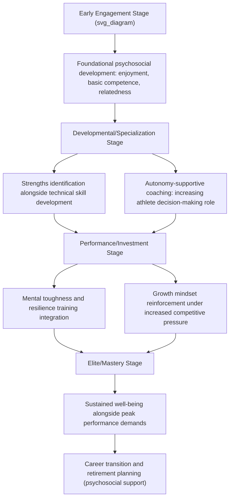

## Applying Positive Psychology in Coaching and Talent Development

### Overview

The application of positive psychology principles to coaching and athletic talent development represents an integration of well-being science with sport pedagogy and long-term athlete development (LTAD) frameworks. Rather than organizing coaching practice solely around technical/tactical skill acquisition and competitive outcome, this approach incorporates constructs such as strengths identification, autonomy support, growth-oriented feedback, and psychological well-being as integral components of both performance development and athlete welfare across the developmental pathway.

### Theoretical Foundations

**Self-Determination Theory (Deci & Ryan) in Coaching**

- Proposes three basic psychological needs whose satisfaction is associated with intrinsic motivation, well-being, and sustained engagement: **autonomy** (sense of choice and volition), **competence** (sense of mastery and effectiveness), and **relatedness** (sense of connection and belonging).
- Autonomy-supportive coaching styles (providing rationale, offering meaningful choice, acknowledging athlete perspective) are associated with more adaptive motivational profiles compared to controlling coaching styles (pressure, contingent reward/punishment, imposed solutions).
- This framework provides the dominant theoretical basis for translating positive psychology's autonomy and empowerment principles into applied coaching behavior.

**Long-Term Athlete Development (LTAD) Frameworks**

- Multi-stage models of athletic development (various national and sport-specific frameworks exist) that emphasize age-appropriate physical, technical, and increasingly psychosocial development across a pathway from early engagement through to mastery/elite performance.
- Contemporary LTAD frameworks increasingly incorporate psychological and psychosocial development explicitly as a parallel track alongside physical and technical development, rather than treating psychological skills as a late-stage addition for elite performers only.

**Positive Youth Development (PYD) Through Sport**

- A framework, distinct from but overlapping with positive psychology, emphasizing sport participation as a vehicle for developing broader life competencies (the "5 Cs": Competence, Confidence, Connection, Character, Caring, sometimes with a sixth "C" for Contribution) rather than solely athletic outcome.
- PYD-informed coaching explicitly frames athletic development as inseparable from broader psychosocial and character development, particularly relevant in youth sport contexts.

**Strengths-Based Coaching**

- Applies the character-strengths framework (VIA Classification) and general strengths-based practice principles (previously covered in strengths-based clinical practice) to athletic talent identification and development, emphasizing identification and deliberate development of individual athlete strengths rather than a uniform deficit-remediation approach to all athletes.

### Applied Coaching Behaviors Aligned with Positive Psychology Principles

| Principle | Coaching Behavior | Theoretical Basis |
| --- | --- | --- |
| Autonomy support | Offering meaningful choices in training design, explaining rationale behind decisions | Self-Determination Theory |
| Competence-building | Structuring optimally challenging tasks, providing informational (not just evaluative) feedback | Self-Determination Theory, Flow theory (challenge-skill balance) |
| Relatedness | Building genuine coach-athlete relationships, fostering team cohesion | Self-Determination Theory |
| Growth-oriented feedback | Process/effort-focused praise, framing errors as developmental information | Growth mindset theory (Dweck) |
| Strengths identification | Individualized strength assessment and deliberate strength-based role/skill development | VIA Classification, Strengths Model |
| Psychological safety | Creating an environment where mistakes and vulnerability can be expressed without excessive punitive consequence | Positive organizational/team climate research |

### Talent Development Pathway Integration Diagram

### Practical Example: Season-Long Coaching Integration

| Phase | Positive Psychology Component | Applied Activity |
| --- | --- | --- |
| Pre-season | Strengths assessment | VIA Survey or informal strengths discussion with each athlete; identify 2-3 signature strengths to leverage |
| Pre-season | Autonomy-supportive goal-setting | Collaborative goal-setting session; athlete contributes personally meaningful process goals alongside team objectives |
| In-season | Growth-oriented feedback | Post-competition debriefs framed around specific, controllable factors rather than global evaluation |
| In-season | Flow-facilitation | Training task design calibrated to individual skill levels to maintain optimal challenge-skill balance |
| In-season | Team relatedness building | Structured team-bonding activities distinct from purely competitive/technical training |
| Post-season | Well-being check-in | Structured reflection incorporating both performance review and broader well-being/burnout assessment |

### Talent Identification and Strengths-Based Selection

- Traditional talent identification models have historically emphasized early specialization and selection based on current physical/technical performance metrics, a practice increasingly critiqued in the sport science literature for potentially overlooking late-developing athletes (the relative age effect) and underweighting psychosocial resilience factors predictive of long-term success.
- Strengths-based and psychosocial-informed talent development models (e.g., drawing on Collins and MacNamara's research on psychological characteristics of developing excellence, PCDEs) emphasize identifying and developing traits such as coping skills, commitment, and the capacity to negotiate setbacks, alongside — rather than instead of — physical/technical metrics.
- [Inference] This shift reflects broader recognition in the talent development literature that early-career physical/technical superiority is an imperfect predictor of eventual elite-level success, and that psychosocial characteristics (including those emphasized in resilience and growth mindset research) may hold comparable or greater long-term predictive value in many sports.

### Coach Education and Well-Being Considerations

**Coach as a Well-Being Influence**

- Coaching behavior and coach-athlete relationship quality are consistently identified in the sport psychology literature as significant contributors to athlete psychological well-being, motivation, and burnout risk, independent of team performance outcomes.
- Coach education programs increasingly incorporate content on autonomy-supportive communication, psychological safety, and recognizing early signs of athlete burnout or mental health difficulty, reflecting the coach's dual role in both performance development and welfare.

**Coach Well-Being**

- [Inference] Positive psychology principles are increasingly applied reflexively to coaches themselves (strengths identification, resilience-building, well-being support), given documented occupational stress and burnout risk in coaching roles, though this remains a comparatively newer and less extensively researched application area relative to athlete-focused positive psychology coaching literature.

### Assessment and Evaluation Tools

| Tool/Approach | Purpose |
| --- | --- |
| VIA Survey of Character Strengths | Individual strengths identification for athletes and coaches |
| Sport Motivation Scale / Behavioral Regulation in Sport Questionnaire | Assessing autonomous vs. controlled motivation profiles |
| Basic Psychological Needs in Sport Scale | Assessing autonomy, competence, relatedness satisfaction |
| Coach-athlete relationship questionnaires (e.g., CART-Q) | Assessing closeness, commitment, complementarity in coach-athlete relationship |
| Burnout inventories adapted for athletes/coaches (e.g., Athlete Burnout Questionnaire) | Monitoring exhaustion, reduced accomplishment, sport devaluation |

### Considerations and Limitations

**Key Points**

- **Balancing performance demands with well-being focus**: Applied positive psychology coaching does not imply de-emphasizing competitive excellence or rigor; the frameworks discussed here are generally presented as complementary to, rather than in tension with, high-performance development when implemented well, though real-world organizational pressure toward short-term competitive outcomes can create tension with longer-term psychosocial development priorities.
- **Cultural and organizational context**: Autonomy-supportive coaching principles, developed substantially within Western sport psychology research traditions, may require thoughtful adaptation for coaching contexts with different cultural norms regarding authority, hierarchy, and individual versus collective orientation.
- **Developmental appropriateness**: The degree of athlete autonomy and strengths-based individualization appropriate varies considerably by age and developmental stage; young children in early engagement stages require different application than adolescent or adult athletes in specialization/investment stages.
- **Evidence base maturity**: [Unverified] While Self-Determination Theory has a substantial general evidence base in sport and exercise psychology, integrated "positive psychology coaching" as a comprehensive applied framework is less uniformly validated as a single coherent intervention package compared to its individual component theories (SDT, growth mindset, strengths-based practice), and coaches should be aware they are often integrating several distinct evidence-based principles rather than implementing one unified, fully validated protocol.
- Outcomes of positive-psychology-informed coaching practices may vary considerably based on coach training quality, sport context, athlete developmental stage, and organizational/cultural setting.

**Next Steps**

- Self-Determination Theory: full needs-satisfaction framework in sport contexts
- Positive Youth Development (PYD) through sport: the 5 Cs framework
- Psychological Characteristics of Developing Excellence (PCDEs) and talent identification
- Autonomy-supportive vs. controlling coaching styles: behavioral markers and training
- Relative age effect and critiques of early-specialization talent identification models
- Athlete and coach burnout: measurement and prevention frameworks
- VIA Character Strengths application in team and individual sport settings
- Career transition and retirement psychology in elite athletes