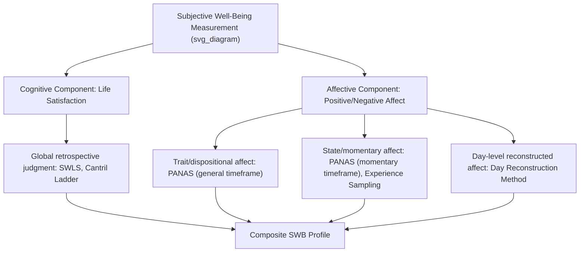

## Subjective Well-Being Scales: Life Satisfaction and Affect Measures

### Overview

Subjective well-being (SWB) is the primary construct measured within the hedonic tradition of well-being science, encompassing an individual's own cognitive and affective evaluation of their life. Ed Diener's tripartite model remains the dominant theoretical structure underlying SWB measurement, decomposing subjective well-being into three related but empirically separable components: life satisfaction (a global cognitive judgment), positive affect, and negative affect. Standardized psychometric instruments for each component are foundational tools across positive psychology research and applied assessment.

### Theoretical Foundations

**Diener's Tripartite Model of Subjective Well-Being**

1. **Life satisfaction** — a global cognitive evaluation of one's life as a whole, relative to self-generated standards
2. **Positive affect** — the frequency and intensity of pleasant emotional states experienced
3. **Negative affect** — the frequency and intensity of unpleasant emotional states experienced

- These three components are theorized and empirically demonstrated to be relatively independent (moderate, not perfect, correlations), meaning high life satisfaction does not require the complete absence of negative affect, and the components should generally be measured and reported separately rather than collapsed into a single "happiness" score without justification.

**Hedonic vs. Eudaimonic Distinction**

- SWB measures (life satisfaction, positive/negative affect) fall within the **hedonic** tradition, concerned with pleasure, positive affect, and satisfaction.
- This is conceptually distinct from the **eudaimonic** tradition (e.g., Ryff's Psychological Well-Being model, covered in the Well-Being Therapy protocol), concerned with meaning, purpose, and full functioning.
- [Inference] The two traditions are correlated but not interchangeable, and researchers/clinicians should select instruments matching their specific theoretical and clinical question rather than assuming any single SWB instrument captures the full scope of well-being.

**Bottom-Up vs. Top-Down Theories of SWB**

- **Bottom-up theories**: Propose that overall SWB is the aggregate/sum of satisfaction across specific life domains and momentary experiences.
- **Top-down theories**: Propose that a stable dispositional tendency (e.g., trait positive affectivity, personality) shapes how domain-specific experiences are interpreted and evaluated, influencing overall SWB somewhat independently of objective circumstances.
- [Unverified] Current consensus generally favors a bidirectional/interactive view incorporating both mechanisms rather than a strict either/or resolution, though the relative weighting of each pathway remains an active area of research.

### Core Instrument: Satisfaction with Life Scale (SWLS)

- Developed by Diener, Emmons, Larsen, and Griffin (1985); the most widely used global life satisfaction measure in the SWB literature.
- **Structure**: 5 items, each rated on a 7-point Likert scale (1 = Strongly Disagree to 7 = Strongly Agree).
- **Sample item content areas** (not verbatim item text): general satisfaction with life as a whole, closeness of life conditions to an ideal, satisfaction with life so far, whether important things wanted in life have been obtained, and whether the individual would change little about their life if lived again.
- **Scoring**: Items summed to produce a total score ranging from 5–35; established cutoff ranges exist for categorizing responses from "extremely dissatisfied" through "extremely satisfied," though the scale is more commonly used dimensionally (as a continuous score) in research contexts.
- **Psychometric properties**: Well-established test-retest reliability and internal consistency across numerous studies and translated versions; widely validated cross-culturally, though [Inference] as with most self-report life satisfaction measures, some degree of cultural variation in response style (e.g., differences in extreme-response tendency across cultures) should be considered when making cross-cultural comparisons.

### Core Instrument: Positive and Negative Affect Schedule (PANAS)

- Developed by Watson, Clark, and Tellegen (1988); the most widely used measure of positive and negative affect as distinct dimensions.
- **Structure**: 20 items — 10 positive affect adjectives (e.g., describing states such as enthusiastic, alert, inspired) and 10 negative affect adjectives (e.g., describing states such as distressed, upset, afraid), each rated on a 5-point intensity/frequency scale.
- **Timeframe flexibility**: The instrument can be administered with varying instructional timeframes — momentary ("right now"), daily, weekly, or general/trait-level ("in general") — making it adaptable for both state and trait affect measurement.
- **Scoring**: Two independent subscale scores (Positive Affect, Negative Affect), each summed separately; consistent with the tripartite model's emphasis on treating positive and negative affect as distinct dimensions rather than opposite poles of one scale.
- **Extended version**: The PANAS-X includes additional subscales capturing more specific affective states (e.g., fear, hostility, guilt, sadness, joviality, self-assurance, attentiveness).

### Comparative Instrument Table

| Instrument | Author(s) | Construct | Items | Typical Timeframe |
| --- | --- | --- | --- | --- |
| Satisfaction with Life Scale (SWLS) | Diener et al. (1985) | Global life satisfaction (cognitive) | 5 | General/trait |
| PANAS | Watson, Clark, Tellegen (1988) | Positive and negative affect | 20 | Flexible (momentary to general) |
| PANAS-X | Watson & Clark (1994) | Positive/negative affect + specific affective states | 60 | Flexible |
| Scale of Positive and Negative Experience (SPANE) | Diener et al. (2009) | Positive/negative feelings, designed to complement eudaimonic measures | 12 | Past 4 weeks (typical) |
| Subjective Happiness Scale (SHS) | Lyubomirsky & Lepper (1999) | Global subjective happiness | 4 | General/trait |
| Cantril Self-Anchoring Ladder | Cantril (1965) | Life evaluation (ladder of life) | 1 | Present and anticipated future |
| Day Reconstruction Method (DRM) | Kahneman et al. (2004) | Momentary affect across recalled daily episodes | Variable | Prior day, episode-based |
| Satisfaction with Life Scale for Children / Students Life Satisfaction Scale | Various adaptations | Life satisfaction in youth populations | Varies | General/trait |

### Measurement Approach Comparison Diagram

### Practical Example: Selecting and Interpreting Instruments

| Research/Clinical Question | Recommended Instrument(s) | Rationale |
| --- | --- | --- |
| "How satisfied is this population with their life overall?" | SWLS | Purpose-built global cognitive life satisfaction measure |
| "Does this intervention increase positive affect and reduce negative affect independently?" | PANAS (pre/post) | Captures both dimensions separately, avoiding conflation |
| "What does a typical day feel like for this population, moment to moment?" | Day Reconstruction Method or Experience Sampling | Captures momentary/episodic affect rather than retrospective global judgment, reducing recall bias |
| "Quick single-item well-being screening in a busy clinical intake" | Cantril Ladder | Minimal respondent burden, widely validated single-item option |
| "Assessing well-being in a child/adolescent clinical population" | Age-appropriate adapted life satisfaction scale | Adult-normed instruments may not be valid or comprehensible for younger respondents |

### Momentary and Ecological Measurement Approaches

**Experience Sampling Method (ESM)**

- Involves repeated, randomly-timed prompts (historically via pager, now typically via smartphone app) asking respondents to report their current affective state and context in real time.
- Addresses recall bias inherent in retrospective global measures (e.g., SWLS, general-timeframe PANAS) by capturing affect close to the moment of experience.

**Day Reconstruction Method (DRM)**

- Developed by Kahneman and colleagues as a less burdensome alternative to full ESM; respondents reconstruct the previous day as a series of episodes and rate affect associated with each, combining some ecological validity benefits of ESM with reduced respondent burden.

**Ecological Momentary Assessment (EMA)**

- A broader methodological term encompassing ESM and related real-time or near-real-time sampling approaches, widely used in contemporary well-being and clinical psychology research, often smartphone-app-based.

### Psychometric and Methodological Considerations

**Key Points**

- **Response scale and cultural considerations**: Cross-cultural SWB comparisons using self-report scales require attention to response-style differences (e.g., acquiescence bias, extreme-response tendency) that can vary systematically across cultural groups, potentially confounding naive cross-national score comparisons.
- **Recall bias in retrospective measures**: General-timeframe instruments (e.g., trait PANAS, SWLS) rely on retrospective judgment, which is subject to recency effects, mood-congruent recall bias, and peak-end evaluation biases (the tendency for retrospective evaluation to be disproportionately influenced by the most intense moment and the ending of an experience); momentary/EMA approaches mitigate but do not eliminate all such biases.
- **Single-item vs. multi-item measures**: Brief single-item measures (e.g., Cantril Ladder) offer practical advantages in large-scale surveys or time-constrained clinical settings but generally provide less nuanced or reliable measurement than multi-item scales; instrument selection should weigh measurement precision needs against respondent burden constraints.
- **Distinguishing SWB from clinical symptom measures**: SWB instruments (SWLS, PANAS) are not diagnostic tools and should not be used as a substitute for validated clinical symptom measures (e.g., depression/anxiety inventories) in clinical decision-making contexts; they serve a complementary, not replacement, assessment function consistent with the dual-continua model.
- **Ceiling and floor effects**: Some general population samples show relatively high average SWLS scores with limited variance (ceiling effects), which can reduce sensitivity to detect intervention effects in already well-functioning populations; researchers should consider baseline distribution when selecting instruments for intervention studies.
- Reported psychometric properties (reliability, validity coefficients) for these instruments can vary somewhat by translated version, population, and administration context, and users should consult population-specific validation literature when applying these instruments outside well-established contexts.

**Next Steps**

- Diener's tripartite model of subjective well-being: theoretical origins and critiques
- Eudaimonic well-being measurement (Ryff's PWB Scales, PERMA-Profiler) as a complementary framework
- Experience Sampling Method and Ecological Momentary Assessment: implementation considerations
- Cross-cultural validity and response-style bias in well-being self-report measures
- Peak-end rule and other retrospective evaluation biases in affect recall
- Day Reconstruction Method: administration protocol and scoring
- National and international well-being surveys (e.g., World Happiness Report methodology)
- Selecting SWB instruments for clinical vs. research applications