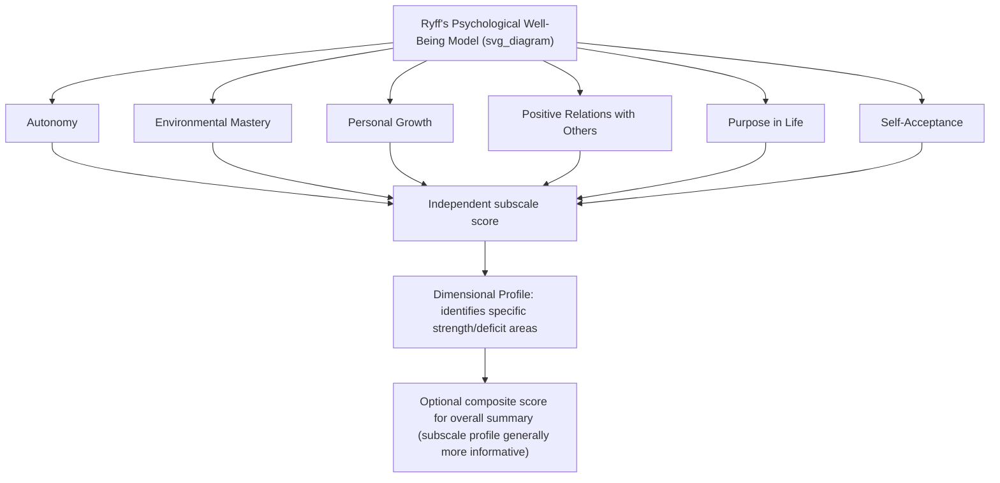

## Psychological Well-Being Measures: Ryff's Scales

### Overview

Carol Ryff's Scales of Psychological Well-Being (PWB) represent the primary standardized measurement instrument for the eudaimonic tradition of well-being research, operationalizing a six-dimensional model of positive psychological functioning derived from integrating humanistic, developmental, existential, and clinical psychological theory. Developed in the late 1980s and first published in 1989, the scales have become foundational to eudaimonic well-being research and underpin clinical protocols such as Well-Being Therapy, which structures its intervention directly around Ryff's six dimensions.

### Theoretical Foundations

**Integration of Prior Theoretical Traditions**

Ryff developed the six-dimension model by synthesizing convergent themes across several established theoretical frameworks, including:

- Maslow's theory of self-actualization
- Rogers' concept of the fully functioning person
- Jung's concept of individuation
- Erikson's stages of psychosocial development
- Allport's conception of maturity
- Jahoda's positive criteria of mental health
- Bühler's and Neugarten's life-span developmental theories
- The explicit aim was to move beyond hedonic (pleasure/satisfaction-based) conceptions of well-being toward a theoretically-grounded, multidimensional model of what it means to function well psychologically across the lifespan — distinguishing the eudaimonic tradition from the hedonic tradition represented by instruments such as the SWLS and PANAS.

**The Six Dimensions of Psychological Well-Being**

1. **Autonomy** — self-determination and independence; the capacity to resist social pressure to think/act in certain ways; ability to regulate behavior from within; self-evaluation by personal standards rather than external standards
2. **Environmental Mastery** — a sense of competence in managing the environment; capacity to choose or create contexts suitable to one's needs; effective use of surrounding opportunities
3. **Personal Growth** — a sense of continued development, openness to new experience, and a sense of realizing one's potential over time
4. **Positive Relations with Others** — warm, satisfying, trusting relationships with others; concern for others' welfare; capacity for strong empathy, affection, and intimacy
5. **Purpose in Life** — having goals and a sense of directedness; feeling there is meaning to present and past life; holding beliefs that give life purpose
6. **Self-Acceptance** — a positive attitude toward oneself; acknowledgment and acceptance of multiple aspects of self, including both good and bad qualities; positive feelings about past life

### Instrument Structure and Versions

- The original PWB scales were developed in a **120-item version** (20 items per dimension), with subsequent shorter versions developed to reduce respondent burden while attempting to preserve psychometric integrity.
- Commonly used abbreviated versions include **84-item (14 per dimension)**, **54-item (9 per dimension)**, **42-item (7 per dimension)**, and **18-item (3 per dimension)** versions.
- Items are rated on a Likert-type agreement scale (commonly 6-point, ranging from "strongly disagree" to "strongly agree"), with a mix of positively- and negatively-worded items requiring reverse-scoring for the negatively-worded items before subscale totals are calculated.
- Each dimension is scored as an independent subscale total (rather than collapsing into a single composite well-being score), consistent with the model's explicitly multidimensional structure — a total/composite score is sometimes computed for overall summary purposes but the subscale-level profile is generally considered more clinically and theoretically informative.

### Version Comparison Table

| Version | Items per Dimension | Total Items | Typical Use Case |
| --- | --- | --- | --- |
| Original long form | 20 | 120 | Full research applications requiring maximum precision |
| Medium form | 14 | 84 | Research balancing precision and respondent burden |
| Medium-short form | 9 | 54 | Common compromise version in applied research |
| Short form | 7 | 42 | Widely used in large survey and clinical research contexts |
| Very short form | 3 | 18 | Large-scale surveys, time-constrained assessment contexts |

[Unverified] Psychometric performance (particularly internal consistency reliability) of the shortest versions has drawn some critique in the measurement literature relative to the longer forms, and researchers selecting among versions should weigh the specific psychometric evidence for their chosen version and population rather than assuming equivalence across all forms.

### Dimension Structure Diagram

### Practical Example: Interpreting a Dimensional Profile

A hypothetical PWB profile illustrating the instrument's clinical utility over a single composite score:

| Dimension | Relative Score | Clinical/Applied Interpretation |
| --- | --- | --- |
| Autonomy | High | Strong capacity for independent decision-making; resistant to undue social pressure |
| Environmental Mastery | Low | Reports difficulty managing daily responsibilities and surrounding demands |
| Personal Growth | Moderate | Some sense of ongoing development, room for further cultivation |
| Positive Relations with Others | Low | Reports limited warm, trusting relationships; potential intervention target |
| Purpose in Life | Moderate-High | Reasonably clear sense of direction and meaning |
| Self-Acceptance | Low | Difficulty accepting both positive and negative aspects of self |

This profile would suggest, consistent with the WBT clinical protocol's dimensional approach, prioritizing intervention focus on Environmental Mastery, Positive Relations, and Self-Acceptance rather than applying undifferentiated well-being-building techniques across all six dimensions equally.

### Applications in Research and Practice

**Clinical Applications**

- Directly underpins **Well-Being Therapy (WBT)**, where the instrument (or its dimensional framework) is used both for treatment planning (identifying which dimension(s) require focus) and outcome measurement (pre/post subscale comparison).
- Used in various clinical populations to assess whether symptom-focused treatment (CBT, pharmacotherapy) has correspondingly improved eudaimonic functioning, addressing the dual-continua concern that symptom remission does not guarantee restored positive functioning.

**Developmental and Aging Research**

- Extensively used in lifespan developmental research, given the model's explicit integration of developmental theory; notably featured in large longitudinal studies such as the MIDUS (Midlife in the United States) study, examining how the six dimensions change across adulthood and old age.
- Research using the scales has identified differential age-related trajectories across dimensions (e.g., some dimensions such as Environmental Mastery and Autonomy showing different patterns across adulthood compared to Personal Growth, which several studies suggest may show comparatively more consistent decline in later life), though [Inference] specific trajectory findings can vary by study, cohort, and cultural context, and should not be treated as universal fixed life-course patterns.

**Cross-Cultural and Population Research**

- The scales have been translated and validated across numerous languages and cultural contexts, though factor structure replication (i.e., whether the same six-dimension structure holds) has shown some variation across cultural samples in the measurement literature, prompting ongoing psychometric refinement work.

**Positive Psychology and Well-Being Intervention Research**

- Used broadly as an outcome measure in positive psychology intervention (PPI) research beyond WBT specifically, to assess whether interventions produce eudaimonic (not solely hedonic) well-being gains.

### Comparison to Other Well-Being Frameworks

| Framework | Tradition | Structure | Primary Instrument |
| --- | --- | --- | --- |
| Ryff's PWB | Eudaimonic | 6 dimensions | Scales of Psychological Well-Being |
| Diener's Tripartite SWB | Hedonic | 3 components (life satisfaction, positive affect, negative affect) | SWLS, PANAS |
| Seligman's PERMA | Mixed hedonic/eudaimonic | 5 elements | PERMA-Profiler |
| Keyes' Mental Health Continuum | Combines hedonic + eudaimonic + social well-being | 3 categories (emotional, psychological, social well-being) | Mental Health Continuum-Short Form (MHC-SF) |

[Inference] Ryff's model and Keyes' Mental Health Continuum share conceptual overlap (Keyes explicitly incorporates Ryff's psychological well-being dimensions alongside social well-being components), while PERMA represents a somewhat distinct, though related, applied positive-psychology structure with less direct developmental-theory lineage than Ryff's model.

### Psychometric and Measurement Considerations

**Key Points**

- **Factor structure debate**: Some psychometric studies have raised questions about whether all six dimensions reliably emerge as fully distinct factors across all samples and short-form versions, with some studies finding high inter-correlations among certain dimensions (e.g., Self-Acceptance and Environmental Mastery); researchers should review current factor-analytic literature for their specific population and version before assuming clean six-factor separation.
- **Reverse-scored item complexity**: The mix of positively- and negatively-worded items (requiring reverse scoring) is a deliberate design feature intended to reduce acquiescence bias, but requires careful attention during scoring and data cleaning to avoid computational errors.
- **Selecting instrument length**: Shorter versions reduce respondent burden and are more feasible for large surveys or time-constrained clinical settings, but may sacrifice some reliability and dimensional distinctiveness relative to longer forms; the appropriate trade-off depends on the specific research or clinical application.
- **Distinguishing from hedonic measures**: Given that PWB and SWB constructs are correlated but empirically distinct, using only a hedonic instrument (e.g., SWLS) when a eudaimonic research or clinical question is actually of interest (or vice versa) risks construct-criterion mismatch; instrument selection should be driven by the specific theoretical question.
- Reported reliability and validity coefficients can vary by translated version, population, and specific short-form used, and users should consult population- and version-specific validation literature rather than assuming uniform psychometric performance across all variants.

**Next Steps**

- Well-Being Therapy: full clinical protocol built on Ryff's six dimensions
- MIDUS study: longitudinal findings on well-being across adulthood
- Keyes' Mental Health Continuum and the dual-continua model
- Factor-analytic critiques and refinements of the six-dimension structure
- Cross-cultural validation studies of the PWB scales
- Comparing eudaimonic (PWB) and hedonic (SWLS/PANAS) outcome measures in intervention research
- PERMA-Profiler as an alternative multidimensional well-being instrument
- Selecting appropriate PWB scale length for specific research/clinical contexts