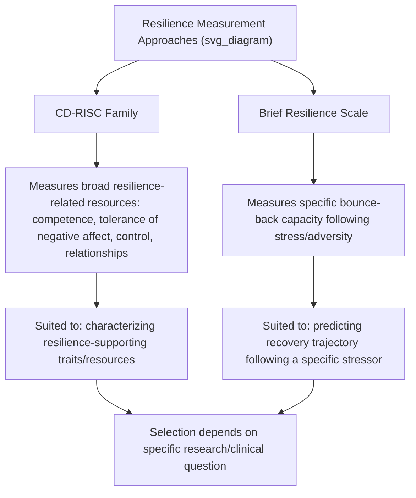

## Resilience Scales: The Connor-Davidson and Brief Resilience Scales

### Overview

Standardized psychometric measurement of resilience presents distinct conceptual and methodological challenges relative to other positive psychology constructs, given ongoing debate about whether resilience is best conceptualized as a stable trait, a dynamic process, or an outcome (successful adaptation following adversity). The Connor-Davidson Resilience Scale (CD-RISC) and the Brief Resilience Scale (BRS) represent two of the most widely used instruments in this space, reflecting somewhat different measurement philosophies: the CD-RISC assesses resilience as a multidimensional set of personal characteristics/resources, while the BRS more narrowly targets the specific capacity to recover or "bounce back" from stress.

### Theoretical Foundations

**Conceptualizing Resilience for Measurement**

- **Trait-based conceptualization**: Views resilience as a relatively stable individual difference or personal characteristic (hardiness, adaptability, personal competence) that can be measured similarly to other personality-adjacent constructs.
- **Process-based conceptualization**: Views resilience as a dynamic process of interaction between risk exposure, protective factors, and adaptive outcome over time, more naturally suited to longitudinal or process-tracking measurement approaches than a single cross-sectional score.
- **Outcome-based conceptualization**: Defines resilience post hoc as the demonstrated maintenance of, or return to, healthy functioning following documented adversity exposure, requiring a two-part measurement approach (adversity exposure + outcome) rather than a resilience score derived from a single instrument alone.

[Inference] Most widely used self-report resilience scales, including the CD-RISC and BRS, operationalize resilience primarily through the trait-based lens (measuring self-perceived resilient characteristics or capacity) rather than requiring documented adversity exposure, which represents a specific methodological choice with corresponding limitations relative to purely outcome-based definitions.

### Connor-Davidson Resilience Scale (CD-RISC)

**Development and Structure**

- Developed by Kathryn Connor and Jonathan Davidson (2003), originally designed in a clinical/research context examining resilience in populations exposed to significant stress and trauma, with attention to sensitivity for detecting treatment-related change (e.g., in PTSD treatment outcome research).
- **Original version**: 25 items, rated on a 5-point scale (0 = "not true at all" to 4 = "true nearly all the time"), typically referencing the past month.
- Items reflect a range of resilience-related content including personal competence, tolerance of negative affect, positive acceptance of change, control, spiritual influences, and secure relationships, though the precise factor structure has varied somewhat across validation studies.

**Shorter Versions**

- **CD-RISC-10**: A widely used 10-item abbreviated version, generally demonstrating a more consistent unidimensional or simplified factor structure than the original 25-item version across various validation studies.
- **CD-RISC-2**: A 2-item ultra-brief version intended for contexts with severe time constraints, capturing core resilience content with substantially reduced psychometric granularity.

**Scoring**

- Items are summed to produce a total resilience score; higher scores indicate greater self-reported resilience. The CD-RISC-10 total score range is 0–40.

### Brief Resilience Scale (BRS)

**Development and Structure**

- Developed by Smith, Dalen, Wiggins, Tooley, Christopher, and Bernard (2008), explicitly designed to address a perceived gap in the field: many existing "resilience" instruments (including some available at the time of BRS development) were argued to actually measure resilience-related resources (optimism, social support, coping style) rather than the core construct of bouncing back or recovering from stress itself.
- **Structure**: 6 items, rated on a 5-point Likert scale (1 = "strongly disagree" to 5 = "strongly agree"), with 3 positively-worded items and 3 negatively-worded items requiring reverse scoring.
- Item content is explicitly and narrowly focused on the respondent's perceived ability to recover quickly from stress, hardship, or difficult events — a deliberately narrower construct than the CD-RISC's broader resilience-resource content.

**Scoring**

- Items are averaged (not summed) to produce a mean score, typically ranging from 1–5, with published normative categories (e.g., low, normal, high resilience) available in the original validation literature.

### Instrument Comparison Table

| Feature | CD-RISC (25-item) | CD-RISC-10 | Brief Resilience Scale (BRS) |
| --- | --- | --- | --- |
| Developers | Connor & Davidson (2003) | Campbell-Sills & Stein (2007), derived from CD-RISC | Smith et al. (2008) |
| Items | 25 | 10 | 6 |
| Construct emphasis | Broad resilience resources/characteristics | Simplified/refined resilience resources | Narrow: recovery/"bounce-back" capacity specifically |
| Scoring method | Sum | Sum (range 0–40) | Mean (range 1–5) |
| Typical timeframe | Past month | Past month | General/trait |
| Common use case | Clinical/trauma research, treatment outcome studies | Research requiring brevity with retained multidimensional content | Research/clinical contexts targeting recovery capacity specifically |

### Conceptual Distinction Diagram

### Practical Example: Instrument Selection by Application

| Application Context | Recommended Instrument | Rationale |
| --- | --- | --- |
| PTSD treatment outcome study, tracking broad resilience resource change over therapy | CD-RISC-10 or full CD-RISC | Captures multidimensional resilience resources relevant to trauma recovery, with established sensitivity to treatment-related change |
| Occupational stress study examining how quickly employees recover from workplace setbacks | Brief Resilience Scale | Narrowly targets the specific bounce-back construct most relevant to the research question |
| Large-scale population survey with severe time constraints | CD-RISC-2 or BRS | Both offer very brief administration; BRS retains a cleaner theoretical focus, CD-RISC-2 retains alignment with the broader CD-RISC resilience-resource tradition |
| Athlete resilience research (see sport psychology resilience coverage) | Sport-specific adaptations, or BRS/CD-RISC-10 as general-resilience comparison measures | General instruments are often used alongside or as a comparator to sport-specific resilience measures |

### Applications in Research and Practice

**Clinical and Trauma Research**

- The CD-RISC has been extensively used in PTSD, anxiety, and depression treatment outcome research, given its original clinical development context and demonstrated sensitivity to detecting resilience-related change over the course of treatment.

**Occupational and Organizational Research**

- Both instruments are used in workplace stress and burnout research, examining employee resilience as a protective factor against occupational stress outcomes, and in resilience-training program evaluation.

**General Population and Positive Psychology Research**

- Both scales are used broadly across general population well-being research, often as one component of a multi-instrument battery alongside subjective well-being (SWLS, PANAS) and psychological well-being (Ryff PWB) measures, to examine resilience's relationship to broader well-being constructs.

**Sport and Performance Psychology**

- As referenced in sport psychology resilience coverage, these general instruments are sometimes used alongside or as validation comparators for sport-specific resilience measures (e.g., the Resilience in Sport Questionnaire).

### Psychometric and Methodological Considerations

**Key Points**

- **Factor structure inconsistency (CD-RISC)**: The original 25-item CD-RISC has shown some inconsistency in factor structure replication across different populations and cultural samples in the validation literature, contributing to the development and increasing preference for the more psychometrically consistent CD-RISC-10 in many research contexts.
- **Construct narrowness trade-off (BRS)**: The BRS's deliberately narrow focus on bounce-back capacity is a stated design strength (avoiding conflation with related-but-distinct constructs like optimism or social support) but means it captures a more limited slice of the broader resilience construct than the CD-RISC family; researchers requiring a broader resilience-resource profile may find the CD-RISC or CD-RISC-10 more appropriate.
- **Self-report limitations**: As with all self-report resilience measures, both instruments rely on the respondent's own perception of their resilience/recovery capacity rather than observed or objectively verified adaptive outcomes following documented adversity, a limitation shared by most trait-based resilience measurement approaches.
- **Absence of adversity-exposure component**: Neither instrument requires or measures actual adversity exposure as part of the scoring process; consequently, high scores reflect self-perceived resilient capacity rather than demonstrated resilient outcomes following verified stressor exposure — a distinction relevant when outcome-based resilience definitions are theoretically preferred for a given research question.
- **Cross-cultural and translated version validity**: As with other widely-used psychological instruments, translated and culturally-adapted versions of both scales should be evaluated against population-specific validation evidence rather than assumed equivalent to the original English-language validation studies.
- Reported reliability and validity coefficients, along with normative score ranges, can vary by population, translated version, and administration context; users should consult current, population-specific validation literature before clinical or high-stakes research application.

**Next Steps**

- Trait vs. process vs. outcome conceptualizations of resilience: measurement implications
- CD-RISC-10 factor structure and cross-cultural validation studies
- Resilience in Sport Questionnaire and other domain-specific resilience instruments
- Resilience measurement in PTSD and trauma treatment outcome research
- Combining resilience scales with adversity-exposure measures for outcome-based assessment
- Occupational resilience measurement and workplace intervention evaluation
- Comparing resilience measures to related constructs (hardiness, grit, self-efficacy)
- Selecting resilience instruments for longitudinal vs. cross-sectional research designs