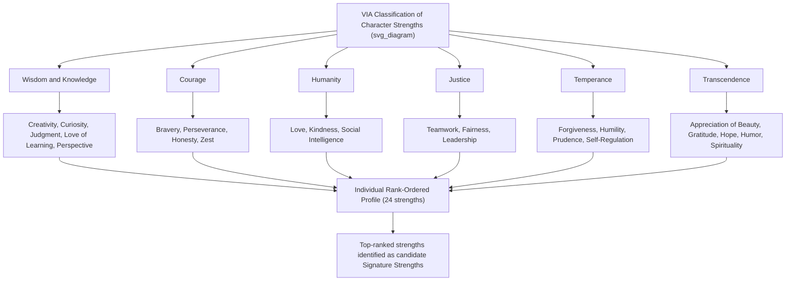

## Character Strengths Assessment: The VIA Inventory of Strengths

### Overview

The VIA Inventory of Strengths (formerly known as the VIA Survey of Character Strengths, also referred to as the VIA-IS) is the primary standardized assessment instrument developed to measure character strengths within Peterson and Seligman's Values in Action (VIA) Classification, a foundational taxonomic framework in positive psychology intended to serve as a positive counterpart to diagnostic classification systems such as the DSM. Rather than cataloguing pathology, the VIA Classification systematically catalogues positive character traits, and the associated inventory operationalizes this taxonomy into a self-report psychometric instrument widely used in both research and applied strengths-based practice across clinical, educational, organizational, and coaching contexts.

### Theoretical Foundations

**The VIA Classification of Character Strengths and Virtues**

- Developed by Christopher Peterson and Martin Seligman (published in the 2004 handbook *Character Strengths and Virtues: A Handbook and Classification*), through an extensive cross-cultural and historical review of philosophical, religious, and psychological traditions to identify traits considered universally valued across cultures.
- Organizes **24 character strengths** under **6 broad virtue categories**:

1. **Wisdom and Knowledge**: Creativity, Curiosity, Judgment (Open-Mindedness), Love of Learning, Perspective
2. **Courage**: Bravery, Perseverance, Honesty, Zest
3. **Humanity**: Love, Kindness, Social Intelligence
4. **Justice**: Teamwork, Fairness, Leadership
5. **Temperance**: Forgiveness, Humility, Prudence, Self-Regulation
6. **Transcendence**: Appreciation of Beauty and Excellence, Gratitude, Hope, Humor, Spirituality

**Criteria for Strength Classification**

- Peterson and Seligman established explicit criteria used to determine whether a given trait qualified for inclusion in the classification, including: contributing to individual and collective fulfillment, being morally valued in its own right (not merely as a means to another end), not diminishing others when displayed, having an existing taxonomic and measurement tradition, being distinctive from other strengths in the classification, being embodied in paragons (exemplary individuals), and being valued across the majority of cultures examined.

**"Signature Strengths" Concept**

- A core applied concept within the VIA framework: **signature strengths** refer to the specific character strengths that are most essential to an individual's identity, feel authentic and energizing to use, and are typically among an individual's top-ranked strengths on the inventory (commonly operationalized as the top 3–7 highest-ranked strengths for a given respondent).
- The deliberate identification and application of signature strengths in daily life is the central applied mechanism underlying most VIA-based interventions, including components of Positive Psychotherapy (PPT) and strengths-based coaching approaches.

### Instrument Structure and Versions

| Version | Items | Typical Population | Notes |
| --- | --- | --- | --- |
| VIA-IS (Adult, full version) | 240 (10 per strength) | Adults | Original full-length research and clinical version |
| VIA-IS-P (Pediatric/Youth) | 198 | Ages approximately 10–17 | Youth-adapted item content and language |
| VIA-IS-R (Revised) | 192 (8 per strength) | Adults | Psychometrically refined version addressing item overlap/redundancy identified in earlier validation research |
| Brief/short forms | Varies (e.g., 24-item, one item per strength) | Adults, time-constrained contexts | Substantially reduced precision; used primarily for rapid screening rather than in-depth profiling |

- Items are typically rated on a 5-point Likert agreement scale, and scores are calculated for each of the 24 strengths independently, producing a **rank-ordered profile** from highest to lowest strength for that individual, rather than a single composite score.
- The rank-ordered, ipsative (within-person relative ranking) nature of the profile is a defining feature: the instrument is designed primarily to identify an individual's relative strength ordering rather than to compare absolute strength levels between different individuals.

### Classification Structure Diagram

### Practical Example: From Assessment to Application

| Step | Process | Example Output |
| --- | --- | --- |
| 1. Administration | Respondent completes VIA-IS or VIA-IS-R | Ranked scores across all 24 strengths |
| 2. Identify signature strengths | Review top 3–7 ranked strengths | Curiosity, Kindness, Humor, Perspective identified as top 4 |
| 3. Strength-application planning | Collaboratively identify novel ways to use a signature strength daily | "Use Curiosity by asking a genuinely new question in a routine work meeting this week" |
| 4. Reflection and integration | Structured follow-up on the experience of application | Reflect on energy/authenticity felt when using the strength vs. non-signature strengths |
| 5. Ongoing strength-based goal alignment | Align longer-term goals (career, relationships) with signature strengths | Explore roles/projects that regularly draw on Curiosity and Perspective |

### Applications Across Contexts

**Clinical and Therapeutic Practice**

- Core assessment tool within Positive Psychotherapy (PPT), used in initial sessions to identify signature strengths that are then deliberately applied throughout the subsequent treatment protocol.
- Used within broader strengths-based clinical practice (as covered in recovery-oriented and strengths-based practice content) as a structured complement to the Strengths Model's broader life-domain strengths assessment.

**Coaching and Talent Development**

- Widely used in sport coaching, executive coaching, and life coaching contexts to structure strengths-based development conversations, as referenced in applied positive psychology coaching content.

**Educational Settings**

- Used in school-based positive education programs to help students identify and build awareness of their character strengths, often integrated into social-emotional learning curricula.

**Organizational and Workplace Applications**

- Used in organizational development, team-building, and employee engagement initiatives, with some research examining the relationship between signature-strength use at work and job satisfaction, engagement, and performance outcomes.

### Evidence Base

- Character strengths measured via the VIA-IS have shown associations across numerous studies with life satisfaction, particularly strengths within the Transcendence category (notably Hope, Zest, Gratitude, and Curiosity), which several studies have identified as showing comparatively stronger associations with well-being outcomes than other strengths.
- Interventions involving identification and deliberate novel use of signature strengths (a specific, well-studied positive psychology intervention format) have shown positive effects on well-being and reduced depressive symptoms in multiple randomized controlled studies, contributing to the VIA framework's status as one of the more empirically supported positive psychology assessment/intervention combinations.
- [Inference] Effect sizes for signature-strengths interventions, as with most positive psychology interventions, tend to be modest-to-moderate rather than large, and durability of effects across long-term follow-up varies across studies.

### Psychometric and Conceptual Considerations

**Key Points**

- **Ipsative vs. normative measurement**: Because the instrument primarily produces a within-person rank-ordering, it is less suited to between-person absolute comparison (e.g., claiming Person A has "more" Kindness than Person B in an absolute sense) than to identifying which strengths are relatively most central to a given individual; this distinction has implications for how results should and should not be interpreted or reported.
- **Overlap and factor structure debate**: Psychometric research has identified some overlap and redundancy among certain strength items in the original VIA-IS, motivating the development of the revised VIA-IS-R; ongoing psychometric work continues to examine whether all 24 strengths reliably emerge as fully independent factors versus clustering into fewer higher-order factors in various studies (some research has proposed higher-order groupings, though [Unverified] no single alternative higher-order structure has achieved universal consensus replacement of the original 6-virtue framework).
- **Self-report and self-presentation considerations**: As with all self-report character/trait measures, responses may be influenced by social desirability and self-presentation concerns; the instrument does not incorporate observer-report or behavioral-observation components by default, though observer-report adaptations exist in some research contexts.
- **Cultural universality claims**: While the classification was developed with explicit attention to cross-cultural traditions, [Inference] the degree to which all 24 strengths carry equivalent cultural salience, terminology-translation fidelity, and measurement invariance across all cultural contexts remains an area of continued cross-cultural psychometric investigation rather than a fully settled matter.
- **Distinguishing from talent/skill measures**: Character strengths as operationalized in the VIA framework are explicitly distinguished from talents, skills, or interests (e.g., musical talent, athletic skill) in the framework's theoretical literature, referring instead to morally-valued character traits; this distinction should be maintained when applying the instrument in practice to avoid conceptual conflation with skills-based assessment tools.
- Reported reliability, validity, and normative comparison data may vary by version (VIA-IS vs. VIA-IS-R vs. short forms), translated language version, and population studied.

**Next Steps**

- Positive Psychotherapy (PPT): full protocol and VIA-IS integration
- Signature strengths intervention research: novel-use paradigm and outcome studies
- VIA-IS-R psychometric refinement and factor-structure research
- Strengths-based coaching methodologies in sport, education, and organizational contexts
- Cross-cultural validation and measurement invariance of the VIA Classification
- Higher-order strength clusters: alternative factor-structure proposals
- Strengths Model (Rapp) as a complementary broader strengths-assessment framework
- Character strengths in positive education and school-based well-being curricula