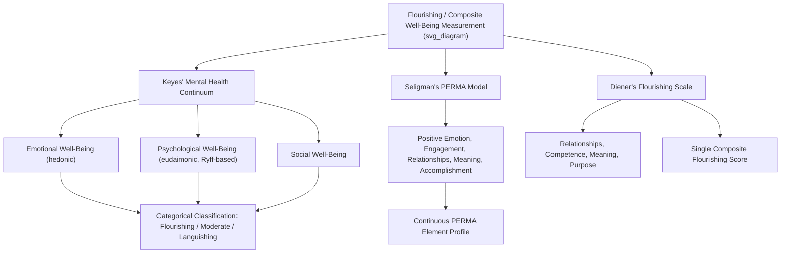

## Flourishing and Well-Being Composite Indices

### Overview

Flourishing and well-being composite indices represent a class of multidimensional assessment instruments designed to capture well-being more holistically than single-construct measures (e.g., life satisfaction alone or positive affect alone). These indices typically integrate hedonic and eudaimonic components, and in some cases social well-being, into a unified framework and scoring system, reflecting the broader positive psychology consensus that well-being is a multidimensional phenomenon not adequately captured by any single dimension in isolation. Major examples include Keyes' Mental Health Continuum, Seligman's PERMA model and its associated PERMA-Profiler, Diener's Flourishing Scale, and various national/international flourishing measurement initiatives.

### Theoretical Foundations

**Rationale for Composite Measurement**

- Single-construct instruments (SWLS for life satisfaction, PANAS for affect, Ryff's PWB for eudaimonic dimensions) each capture only part of the broader well-being construct space.
- Composite indices attempt to integrate multiple theoretically-grounded dimensions into a single assessment framework, enabling researchers and clinicians to characterize an individual's overall well-being profile ("flourishing" status) across several domains simultaneously rather than relying on a single proxy dimension.
- This approach is consistent with the dual-continua model's broader logic (previously discussed regarding mental illness and mental health) that well-being requires its own multidimensional operationalization distinct from mere symptom absence.

**Keyes' Mental Health Continuum and the Flourishing/Languishing Framework**

- Corey Keyes proposed that mental health, like mental illness, can be conceptualized as existing along a continuum ranging from **languishing** (low well-being, described as a state of emptiness and stagnation, though not equivalent to clinical depression) through **moderate mental health** to **flourishing** (high levels of well-being across multiple dimensions).
- Keyes' model explicitly integrates three well-being components: **emotional well-being** (hedonic; positive affect, life satisfaction), **psychological well-being** (eudaimonic; drawing directly on Ryff's six dimensions), and **social well-being** (a distinct component Keyes developed, encompassing social acceptance, social actualization, social contribution, social coherence, and social integration).
- The **Mental Health Continuum-Short Form (MHC-SF)** is the standard instrument operationalizing this model, using 14 items spanning the three well-being components, with respondents classified as flourishing, languishing, or moderately mentally healthy based on established scoring criteria (frequency of experiencing well-being indicators over the past month).

**Seligman's PERMA Model**

- Proposed by Martin Seligman as a framework for well-being organized around five measurable elements, each pursued for its own sake (not merely as a means to another end):
  - **P**ositive emotion
  - **E**ngagement (absorption in activities, related to flow)
  - **R**elationships (positive social connection)
  - **M**eaning (belonging to and serving something larger than oneself)
  - **A**ccomplishment (pursuit of success, mastery, and achievement)
- The **PERMA-Profiler** (developed by Butler and Kern) is the primary standardized instrument operationalizing this model, typically comprising items assessing each PERMA element plus additional items for overall happiness, health, negative emotion, and loneliness as supplementary indices.

**Diener's Flourishing Scale**

- A brief 8-item instrument developed by Diener and colleagues, distinct from the earlier SWLS, designed to capture important aspects of human functioning including positive relationships, feelings of competence, and having meaning and purpose in life — intended as a concise, general-purpose psychosocial flourishing measure complementary to (rather than replacing) hedonic SWB measures.

### Composite Framework Comparison Table

| Instrument | Framework Author(s) | Dimensions Captured | Item Count | Scoring Output |
| --- | --- | --- | --- | --- |
| Mental Health Continuum-Short Form (MHC-SF) | Keyes | Emotional, Psychological, Social well-being (3 components) | 14 | Categorical (flourishing/moderate/languishing) + continuous scores |
| PERMA-Profiler | Seligman; instrument by Butler & Kern | Positive emotion, Engagement, Relationships, Meaning, Accomplishment + supplementary items | 23 (15 core PERMA + supplementary) | Continuous subscale scores per PERMA element |
| Flourishing Scale | Diener et al. | General psychosocial flourishing (relationships, competence, meaning, purpose) | 8 | Single continuous composite score |
| Gallup-Sharecare Well-Being Index | Gallup organization | Purpose, Social, Financial, Community, Physical well-being | Varies (survey-based) | Composite index, often used in large population/national surveys |
| OECD Better Life Index | OECD | 11 topics spanning material and quality-of-life dimensions (housing, income, jobs, community, education, environment, governance, health, life satisfaction, safety, work-life balance) | N/A (aggregates national-level indicators, not individual self-report) | Country-level composite index |

### Composite Index Structure Diagram

### Practical Example: Comparing Outputs Across Instruments for One Respondent

| Instrument | Hypothetical Result | Interpretation |
| --- | --- | --- |
| MHC-SF | Classified as "Moderately Mentally Healthy" | Neither flourishing nor languishing; some but not comprehensive well-being indicators present |
| PERMA-Profiler | High Accomplishment and Engagement; low Relationships and Meaning | Well-being is domain-specific; achievement-oriented functioning present, but relational/purpose domains underdeveloped |
| Flourishing Scale | Moderate composite score | General psychosocial flourishing indicator, consistent with mixed MHC-SF and PERMA domain-level findings |

This comparison illustrates a key methodological point: composite/categorical instruments (MHC-SF) provide an efficient overall classification, while multidimensional profile instruments (PERMA-Profiler) provide more actionable, domain-specific detail — the appropriate choice depends on whether the assessment goal is screening/classification or detailed profiling for intervention planning.

### Applications in Research and Practice

**Population-Level Surveillance and Public Health**

- The MHC-SF and similar composite indices are used in population mental health surveillance to track flourishing/languishing prevalence over time and across demographic groups, complementing traditional psychiatric epidemiology (which tracks disorder prevalence) with a positive mental health surveillance dimension.

**National and International Well-Being Measurement Initiatives**

- Various national statistical agencies and international bodies (e.g., the OECD Better Life Index, the World Happiness Report, and national well-being measurement programs such as the UK's Measuring National Well-being programme) have developed composite well-being indices intended to complement or supplement GDP and other purely economic indicators in national policy contexts.
- [Inference] These larger-scale composite indices often blend individual self-report well-being data with objective socioeconomic indicators (income, health statistics, education access), differing methodologically from purely self-report psychological instruments such as the MHC-SF or PERMA-Profiler.

**Intervention Outcome Research**

- The PERMA-Profiler and MHC-SF are both commonly used as outcome measures in positive psychology intervention (PPI) trials, providing a more comprehensive well-being outcome picture than a single hedonic or eudaimonic measure alone.

**Organizational and Workplace Well-Being**

- PERMA-based assessment has been adapted for organizational contexts (sometimes termed "PERMA at work" frameworks) to assess employee flourishing across the five elements in occupational settings, informing workplace well-being initiatives.

**Educational Settings**

- Flourishing-oriented composite measures have been adapted for use in positive education initiatives to track student well-being alongside academic outcomes, consistent with the broader positive education movement's emphasis on well-being as a parallel educational goal to academic achievement.

### Methodological and Conceptual Considerations

**Key Points**

- **Categorical vs. continuous scoring trade-offs**: The MHC-SF's categorical classification (flourishing/moderate/languishing) offers intuitive population surveillance utility but sacrifices some of the nuance available in continuous, domain-specific scoring approaches (e.g., PERMA-Profiler); selection should be guided by whether the application calls for population classification or detailed individual profiling.
- **Conceptual overlap and non-independence of dimensions**: Composite frameworks necessarily draw on overlapping underlying constructs (e.g., "Positive Emotion" in PERMA overlaps substantially with "Emotional Well-Being" in the MHC-SF and with hedonic SWB more generally); researchers combining multiple composite instruments in a single study should anticipate and account for this conceptual and empirical overlap rather than treating each framework as fully independent.
- **PERMA model critiques**: Some researchers have questioned whether all five PERMA elements are empirically as distinct as the model proposes, and whether "Positive Emotion" and general life satisfaction/happiness measures are sufficiently differentiated within the framework; [Unverified] the field has not reached full consensus on optimal factor structure for the PERMA-Profiler across all populations studied.
- **National-level composite index limitations**: Broader socioeconomic composite indices (OECD Better Life Index and similar) that blend objective and subjective indicators face distinct methodological challenges around weighting different components and cross-national comparability that differ substantially from the psychometric validation concerns relevant to individual-level self-report instruments; these two categories of "composite index" (individual psychological instruments vs. national statistical composites) should not be conflated despite sharing similar terminology.
- **Cultural and translation considerations**: As with other well-being instruments discussed in this measurement chapter, composite indices require careful cross-cultural validation rather than direct translation, particularly given that constructs like "Meaning" (PERMA) or "Social Coherence" (Keyes' social well-being) may carry different cultural weight or interpretation across populations.
- Reported normative data, cutoff criteria (e.g., for MHC-SF flourishing/languishing classification), and psychometric properties may vary by population, translated version, and administration context, and users should consult current validation literature for their specific application.

**Next Steps**

- Keyes' Mental Health Continuum and the dual-continua model of mental health
- PERMA-Profiler: detailed item structure and supplementary indices (health, loneliness)
- OECD Better Life Index and national well-being measurement policy initiatives
- World Happiness Report methodology and cross-national well-being comparison
- Positive education: flourishing measurement in school-based well-being programs
- PERMA at work: organizational adaptations of the PERMA framework
- Comparing individual psychological composite indices to national statistical well-being indices
- Longitudinal tracking of flourishing/languishing classification and population mental health surveillance