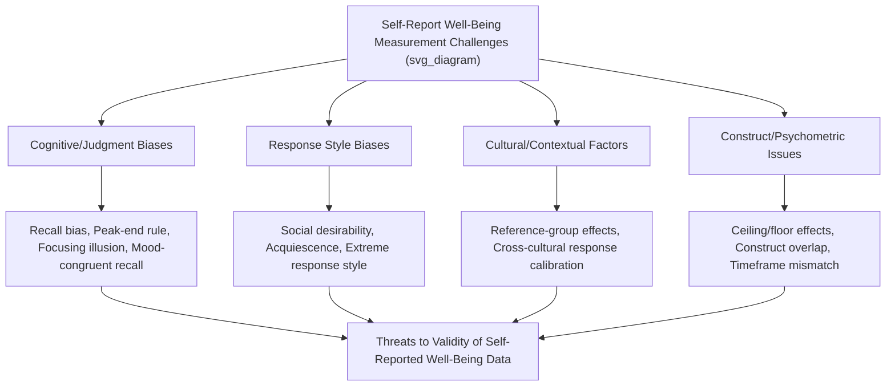

## Methodological Challenges in Self-Report Well-Being Measurement

### Overview

Self-report instruments constitute the dominant methodology across positive psychology and well-being measurement, from the SWLS and PANAS to Ryff's PWB scales, resilience instruments, and the VIA Inventory. While self-report offers direct access to subjective experience — arguably the most theoretically appropriate data source for inherently subjective constructs like life satisfaction or positive affect — this methodology carries a well-documented set of measurement challenges spanning cognitive, motivational, cultural, and psychometric domains. Understanding these limitations is essential for appropriately interpreting well-being research findings and for making sound instrument-selection and study-design decisions.

### Cognitive and Judgment-Based Biases

**Recall Bias**

- Retrospective well-being measures (e.g., general-timeframe PANAS, trait-level resilience scales) require respondents to summarize experience across an extended period, introducing dependence on memory processes that are known to be reconstructive rather than purely reproductive.
- Recent or emotionally salient events tend to be disproportionately weighted in retrospective recall relative to their actual time-weighted contribution to the period being summarized.

**Peak-End Rule**

- Derived substantially from Daniel Kahneman's research on retrospective evaluation, this principle describes the tendency for retrospective judgments of an experience to be disproportionately determined by the most intense moment (peak) and the final moments (end) of that experience, rather than by an accurate time-weighted average across the entire experience.
- [Inference] This has direct implications for well-being instruments asking for global evaluations of extended periods (e.g., "How satisfied are you with your life as a whole"), as such judgments may not accurately reflect the moment-to-moment quality of experience across the full period being evaluated.

**Focusing Illusion**

- The tendency for whatever aspect of life is currently being attended to (often because a survey item directs attention to it) to be given disproportionate weight in an overall evaluative judgment, potentially distorting global life satisfaction reports based on which specific life domains happen to be salient at the moment of assessment.

**Mood-Congruent Recall and Current-Mood Contamination**

- An individual's current mood state at the time of survey completion can bias retrospective judgments in a mood-congruent direction (e.g., completing a life satisfaction survey while in a temporarily negative mood may bias retrospective life evaluation downward, independent of actual longer-term life circumstances).

### Response Style and Social Desirability Biases

**Social Desirability Bias**

- Respondents may over-report socially valued states (e.g., high life satisfaction, strong character strengths, high resilience) or under-report socially undesirable states, particularly in contexts where responses are not fully anonymous or where evaluative stakes are perceived (e.g., employment-related assessment contexts).

**Acquiescence Bias**

- A general tendency to agree with survey items regardless of content, which can be partially addressed through balanced positively- and negatively-worded item sets (as employed in instruments like the BRS and Ryff's PWB scales) requiring reverse-scoring, though this technique introduces its own scoring complexity and potential for error.

**Extreme Response Style**

- A tendency for some respondents to disproportionately select the most extreme response options (e.g., "strongly agree"/"strongly disagree") rather than intermediate options, which has been documented to vary systematically across cultural groups, complicating cross-cultural comparison of raw self-report scores.

**Reference-Group and Cultural Calibration Effects**

- Respondents implicitly calibrate their self-report against a reference group or cultural standard for what counts as "high" or "low" on a given dimension (sometimes termed reference-group effects), meaning identical underlying experience could be reported differently depending on the respondent's implicit comparison standard, which itself may vary across cultures, cohorts, or social contexts.

### Bias Taxonomy Diagram

### Cross-Cultural Measurement Challenges

**Response Style Variation**

- Systematic cross-cultural differences in extreme-response tendency and acquiescence bias have been documented across numerous large cross-national studies, meaning raw score comparisons between cultural groups on instruments like the SWLS may partly reflect response-style differences rather than purely underlying well-being differences.

**Construct Equivalence**

- Well-being constructs themselves may carry different cultural meanings and salience; for example, individualist-oriented constructs (e.g., personal Autonomy in Ryff's PWB model) may be interpreted or valued differently in collectivist cultural contexts, raising questions about full construct equivalence across cultural translations.

**Translation and Linguistic Equivalence**

- Direct translation of well-being instrument items does not guarantee equivalent psychological meaning across languages; rigorous cross-cultural adaptation methodology (e.g., back-translation procedures, cognitive interviewing with target-population respondents, formal measurement invariance testing) is required to establish genuine cross-cultural comparability, a standard not uniformly met across all translated versions of widely-used instruments.

**Measurement Invariance Testing**

- The formal statistical standard for establishing whether an instrument measures the same underlying construct in the same way across different groups (e.g., cultures, age groups, genders); failure to establish measurement invariance means observed group differences in scores could reflect measurement artifacts rather than genuine differences in the underlying construct.

### Construct and Psychometric Considerations

**Ceiling and Floor Effects**

- Some instruments, when administered to already high-functioning or already low-functioning populations, show restricted score range (most respondents clustering near the scale's upper or lower bound), reducing the instrument's sensitivity to detect meaningful individual differences or intervention effects within that population.

**Timeframe Mismatch**

- Instruments vary in their specified reference timeframe (momentary, past week, past month, general/trait), and mismatches between the timeframe most relevant to a given research question and the timeframe actually assessed by a chosen instrument can produce misleading or imprecise results (e.g., using a general/trait-level instrument to assess the acute impact of a very recent, time-limited intervention).

**Construct Overlap and Discriminant Validity**

- As referenced across previously covered instruments (e.g., overlap between CD-RISC resilience content and general personality/optimism measures, overlap between PERMA's "Positive Emotion" element and general hedonic SWB measures), many well-being-adjacent constructs show substantial empirical overlap, complicating claims of fully independent, discriminant measurement across different named constructs.

**Single-Item vs. Multi-Item Trade-offs**

- Brief single-item measures (e.g., the Cantril Ladder) reduce respondent burden and are practical for large-scale surveys but generally sacrifice measurement precision and the ability to assess internal consistency reliability, compared to well-validated multi-item scales.

### Practical Example: Identifying Methodological Threats in a Study Design

| Study Design Element | Potential Methodological Threat | Mitigation Strategy |
| --- | --- | --- |
| Cross-national comparison of SWLS scores between two culturally distinct countries | Response-style variation (extreme response tendency) may confound genuine well-being differences | Apply statistical correction techniques for response style, or supplement with anchoring vignettes/measurement invariance testing |
| Single end-of-week retrospective PANAS administration for a multi-day intervention study | Peak-end rule and recall bias may distort accurate reflection of the full week's affective experience | Consider Experience Sampling Method or Day Reconstruction Method for more ecologically valid affect measurement |
| Life satisfaction survey administered immediately following a mood-induction task in an experimental study | Current-mood contamination of retrospective SWLS response | Introduce a time delay or neutral task between mood manipulation and life satisfaction assessment, or measure and statistically control for current mood |
| Workplace resilience survey administered by direct supervisors | Social desirability bias, particularly given evaluative stakes | Ensure genuine response anonymity/confidentiality and clarify non-evaluative research purpose to respondents |

### Complementary and Alternative Methodological Approaches

**Ecological Momentary Assessment (EMA) and Experience Sampling**

- Reduces recall-dependent bias by capturing affect and experience close to the moment of occurrence, though at the cost of increased respondent burden and potential reactivity (the act of frequent self-monitoring itself potentially altering the experience being measured).

**Day Reconstruction Method (DRM)**

- Offers a partial mitigation of both recall bias and respondent burden concerns by structuring retrospective recall around discrete recalled episodes rather than a single global judgment.

**Informant/Observer Report**

- Some well-being research incorporates informant reports (e.g., from close others) as a complement to self-report, addressing self-presentation bias concerns, though introducing its own limitations (an observer's inference about internal subjective states is itself imperfect and subject to its own biases).

**Physiological and Behavioral Indicators**

- Biological markers (e.g., cortisol patterns, heart rate variability, as discussed in positive-health correlates content) and behavioral indicators (e.g., actual health-behavior engagement, objectively measured social interaction frequency) are sometimes used as convergent or complementary measures alongside self-report, though these carry their own distinct validity considerations and do not directly substitute for subjective experience measurement.

**Mixed-Methods Approaches**

- Combining quantitative self-report instruments with qualitative interview or narrative approaches (as used, for example, in the development of the CHIME recovery framework from qualitative synthesis) can provide convergent validation and richer contextual interpretation than self-report instruments used in isolation.

### Considerations for Practice and Research Design

**Key Points**

- **No single measurement approach is bias-free**: Every methodology discussed here (traditional retrospective self-report, EMA, informant report, physiological measurement) carries its own distinct set of limitations; methodological triangulation (using multiple complementary approaches) generally provides more robust evidence than reliance on any single method.
- **Instrument selection should match the specific research/clinical question**: As emphasized throughout this measurement chapter, the appropriate instrument and methodology depends on the specific timeframe, construct, and population of interest; a "best" universal well-being measurement approach does not exist independent of the specific application.
- **Reporting transparency**: Researchers and clinicians should be transparent about the specific instrument, timeframe, and known limitations relevant to their measurement approach when interpreting or communicating well-being findings, rather than presenting self-report well-being scores as objective, bias-free indicators.
- **Cross-cultural research requires dedicated methodological rigor**: Given the documented response-style and construct-equivalence challenges outlined above, cross-cultural well-being comparison research requires specific methodological safeguards (measurement invariance testing, culturally-informed instrument adaptation) beyond simple translation.
- **Clinical application caution**: In individual clinical contexts (e.g., using well-being measures to track therapy progress), single-timepoint self-report scores should be interpreted within the context of the individual's specific circumstances and known reporting tendencies, rather than treated as fully objective indicators independent of the measurement context.
- The magnitude and specific manifestation of these methodological challenges can vary considerably depending on the specific instrument, population, cultural context, and administration setting, and researchers should consult current psychometric literature relevant to their specific application.

**Next Steps**

- Peak-end rule and Kahneman's research on retrospective evaluation
- Measurement invariance testing: statistical methods and interpretation
- Experience Sampling Method and Ecological Momentary Assessment implementation
- Day Reconstruction Method: detailed protocol and applications
- Cross-cultural adaptation methodology for psychological instruments (back-translation, cognitive interviewing)
- Response style correction techniques in cross-national survey research
- Mixed-methods approaches in well-being and positive psychology research
- Physiological and behavioral indicators as complements to self-report well-being measurement