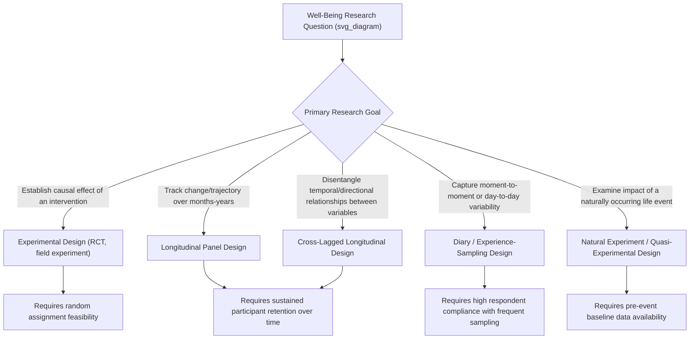

## Experimental, Longitudinal, and Diary Study Designs in Well-Being Research

### Overview

Well-being and positive psychology research draws on a range of methodological designs, each offering distinct strengths and limitations for addressing different types of research questions. Cross-sectional correlational designs, while common in early positive psychology research, cannot establish causal direction or capture within-person change over time. Experimental, longitudinal, and diary/experience-sampling designs address these limitations in complementary ways, and understanding their respective architectures, appropriate applications, and constraints is essential for both conducting and critically evaluating well-being research.

### Experimental Designs

**Core Logic and Purpose**

- Experimental designs involve the deliberate manipulation of an independent variable (e.g., random assignment to a positive psychology intervention vs. a control condition) with measurement of resulting change in a dependent variable (e.g., well-being outcome), enabling causal inference in a way correlational designs cannot.
- The randomized controlled trial (RCT) is considered the methodological gold standard for establishing causal efficacy of interventions, including positive psychology interventions (PPIs) such as gratitude exercises, Well-Being Therapy, and Positive Psychotherapy.

**Key Experimental Design Variants in Well-Being Research**

- **Randomized Controlled Trials (RCTs)**: Random assignment to intervention vs. control (waitlist, active control, or placebo-equivalent) condition; considered the strongest design for causal efficacy claims regarding specific interventions.
- **Laboratory mood-induction experiments**: Brief, tightly controlled experimental manipulations (e.g., film clips, autobiographical recall tasks, the "Best Possible Self" writing exercise) used to test specific theoretical mechanisms (e.g., testing broaden-and-build theory predictions or the undoing hypothesis) under controlled conditions, typically with immediate rather than long-term outcome measurement.
- **Field experiments**: Experimental manipulation conducted in naturalistic settings (e.g., workplace, school) rather than a laboratory, trading some experimental control for greater ecological validity.
- **Dismantling designs**: A variant comparing different components of a multi-component intervention against each other (and often against the full combined intervention) to isolate which specific component(s) drive observed effects — relevant, for example, in comparing which specific elements of Positive Psychotherapy contribute most to outcome.

**Common Comparator/Control Conditions**

| Control Type | Description | Methodological Strength |
| --- | --- | --- |
| Waitlist control | Participants receive no intervention during the study period, with intervention offered afterward | Controls for time/maturation, but not for placebo/attention effects |
| Active control | Participants receive an alternative intervention/activity of similar time/attention demand but theoretically inert content | Controls for non-specific factors (attention, expectation, therapeutic relationship) |
| Placebo-equivalent control | An intervention designed to closely mimic the surface features of the active intervention without its theorized active mechanism | Strongest control for non-specific effects, though genuine placebo-equivalence is difficult to achieve for many psychological interventions |

### Longitudinal Designs

**Core Logic and Purpose**

- Longitudinal designs involve repeated measurement of the same individuals over extended time periods (months to years or decades), enabling examination of within-person change trajectories, developmental patterns, and temporal/directional relationships between variables that cross-sectional designs cannot address.

**Key Longitudinal Design Variants**

- **Panel studies**: Repeated measurement of the same cohort at fixed intervals (e.g., annually), used extensively in major well-being research initiatives such as the MIDUS (Midlife in the United States) study, which has tracked Ryff's PWB dimensions and related constructs across multiple waves spanning decades.
- **Cross-lagged panel designs**: A specific longitudinal analytic approach examining the temporal relationship between two or more variables measured at multiple time points, used to help disentangle directionality questions (e.g., does well-being predict later health outcomes, do health outcomes predict later well-being, or both) though [Inference] cross-lagged designs address but do not fully resolve causal inference limitations inherent to non-experimental data, particularly given ongoing methodological debate regarding appropriate cross-lagged panel modeling approaches.
- **Growth curve/trajectory modeling**: Statistical modeling approaches examining individual differences in well-being trajectories over time (e.g., examining whether individuals show stable, increasing, or declining psychological well-being across the transition to retirement).
- **Natural experiment/quasi-experimental longitudinal designs**: Leveraging naturally occurring events (e.g., job loss, bereavement, disability onset, lottery winnings) with pre-event baseline data, allowing some causal inference regarding the well-being impact of significant life events without researcher-manipulated intervention — a design approach central to hedonic adaptation research.

### Diary and Experience-Sampling Designs

**Core Logic and Purpose**

- Diary and experience-sampling methods (previously introduced in the measurement chapter regarding momentary affect assessment) involve repeated, closely-spaced measurement of experience across short time intervals (within a day or across consecutive days), addressing recall bias limitations inherent in more widely-spaced retrospective measurement while capturing within-person variability that single-timepoint assessment cannot.

**Key Diary/Experience-Sampling Design Variants**

- **Experience Sampling Method (ESM)**: Random or semi-random signal-contingent prompts throughout the day requesting real-time report of current state and context.
- **Day Reconstruction Method (DRM)**: End-of-day (or next-day) structured reconstruction of the prior day as a sequence of episodes, with affect and context rated for each episode.
- **Daily diary designs**: Fixed-interval (typically once-daily, often evening) structured self-report across consecutive days, capturing day-to-day variability without the higher-frequency sampling of full ESM.
- **Event-contingent sampling**: Reporting triggered by the occurrence of a specific pre-defined event type (e.g., a social interaction, a stressful event) rather than by fixed time intervals.

### Design Selection Framework Diagram

### Practical Example: Matching Design to Research Question

| Research Question | Most Appropriate Design | Rationale |
| --- | --- | --- |
| "Does a gratitude journaling intervention causally increase life satisfaction relative to a neutral writing task?" | RCT with active control | Random assignment isolates the causal effect of gratitude content specifically, beyond general writing/attention effects |
| "How does psychological well-being change across the transition into retirement?" | Longitudinal panel design with pre/post retirement waves | Captures within-person trajectory across a specific developmental transition |
| "What does daily positive and negative affect look like for individuals with generalized anxiety disorder in their natural environment?" | Daily diary or ESM design | Captures ecologically valid, moment-to-moment variability without relying on potentially biased global retrospective judgment |
| "Does higher trait optimism predict better later-life physical health, or does better health predict higher optimism, or both?" | Cross-lagged panel design across multiple longitudinal waves | Explicitly designed to help disentangle directional/temporal relationships between the two variables |
| "What is the well-being impact of an unexpected job loss?" | Natural experiment with pre-event baseline panel data | Leverages naturally occurring adversity without researcher-induced manipulation, provided pre-event data exists |

### Strengths and Limitations by Design Type

**Key Points**

- **Experimental designs**: Strongest for causal inference regarding specific, deliverable interventions; limitations include potential artificiality (particularly for laboratory mood-induction paradigms), generalizability concerns from typically volunteer samples, and practical/ethical constraints on manipulating certain variables (e.g., researchers cannot ethically randomly assign participants to experience major adverse life events).
- **Longitudinal designs**: Strongest for capturing genuine within-person change and developmental trajectories over extended periods, and for approximating (though not fully establishing) causal directionality through techniques like cross-lagged modeling; limitations include high cost and resource demands, participant attrition over time (which can introduce selection bias if attrition is non-random relative to well-being status), and the inherent limitation that non-experimental designs cannot fully rule out unmeasured confounding variables even with sophisticated statistical modeling.
- **Diary/experience-sampling designs**: Strongest for capturing ecologically valid, within-day or day-to-day variability and reducing recall-based measurement bias; limitations include high respondent burden potentially affecting compliance and representativeness of responding occasions, potential reactivity (the sampling process itself altering the experience being measured), and generally shorter overall study duration relative to longitudinal panel designs, limiting their utility for examining longer-term developmental questions.
- **Cross-sectional designs** (not detailed above but relevant as a comparison baseline): Remain useful for initial descriptive and correlational research and for large-scale population surveys, but cannot address causal direction or within-person change, and continue to be appropriately critiqued when their correlational findings are over-interpreted as causal in either popular or academic communication.
- **Combining designs**: [Inference] Many robust research programs in well-being science combine multiple design types (e.g., an RCT with embedded daily-diary outcome assessment, or a longitudinal panel study incorporating occasional experience-sampling bursts) to leverage the complementary strengths of each approach, though such combined designs also compound the resource and complexity demands of the research.
- The appropriate design choice, sample size, and duration for any specific well-being research question depends on the specific theoretical question, resource constraints, and population studied, and researchers should consult current methodological literature and, where applicable, pre-registration/open-science best practices when designing new studies.

**Next Steps**

- Randomized controlled trial design principles applied to positive psychology interventions
- MIDUS study: longitudinal findings on well-being across adulthood
- Cross-lagged panel modeling: statistical approaches and interpretation debates
- Hedonic adaptation research using natural-experiment designs (lottery winners, disability onset)
- Experience Sampling Method and Day Reconstruction Method: implementation protocols
- Dismantling designs in multi-component positive psychology interventions (e.g., PPT)
- Attrition and missing data handling in longitudinal well-being research
- Open science practices (pre-registration, replication) in positive psychology research