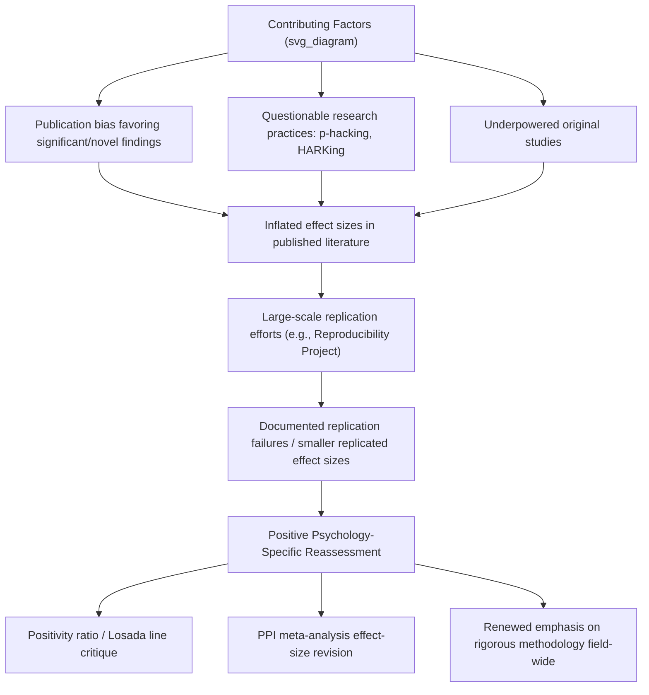

## The Replication Crisis and Its Implications for Positive Psychology

### Overview

The replication crisis refers to a broad methodological reckoning that emerged prominently in psychology (and other empirical sciences) beginning roughly in the early-to-mid 2010s, centered on the discovery that a substantial proportion of published psychological findings, including many high-profile and widely-cited effects, failed to replicate when independently re-tested using rigorous methodology and adequate sample sizes. Positive psychology, as a relatively young subfield that grew rapidly following its formal establishment in the late 1990s, has not been immune to this reckoning, and several of its most widely cited findings and intervention effects have faced direct replication challenges, methodological critique, or substantial effect-size revision.

### Origins and General Context of the Replication Crisis

**Key Contributing Factors Identified Across Psychology**

- **Publication bias**: The tendency for journals to preferentially publish statistically significant, novel, and positive findings, creating a distorted published literature that underrepresents null and non-replicating results.
- **Questionable research practices (QRPs)**: Practices such as p-hacking (selectively analyzing data or trying multiple analytic approaches until a significant result emerges), HARKing (Hypothesizing After Results are Known — presenting exploratory, post-hoc findings as if they were pre-specified confirmatory hypotheses), and selective outcome reporting.
- **Small sample sizes and low statistical power**: Many influential early studies, including in positive psychology, were conducted with sample sizes now understood to provide inadequate statistical power to reliably detect the effect sizes typically observed in psychological research, increasing the likelihood of both false-positive findings and inflated effect-size estimates in the original published studies (a statistical phenomenon known as the "winner's curse" or effect-size inflation in underpowered studies).
- **The Reproducibility Project: Psychology** (Open Science Collaboration, 2015): A large-scale, systematic effort to replicate 100 studies published in top psychology journals, finding that a substantial proportion of original effects did not replicate at conventional statistical significance thresholds, and that replicated effect sizes were, on average, substantially smaller than originally reported effect sizes. This project became a landmark reference point for the broader replication crisis discussion across psychology, including positive psychology.

### Specific Positive Psychology Findings Facing Replication Challenges

**The "Positivity Ratio" (Losada Line) Controversy**

- A widely cited claim, originally associated with Barbara Fredrickson's collaboration with Marcial Losada, proposed a specific mathematical ratio (frequently cited as approximately 2.9 positive to 1 negative emotional experiences) as a critical threshold distinguishing "flourishing" from "languishing" individuals, drawing on nonlinear dynamics modeling.
- This specific numerical claim was subject to a prominent and influential critique (Brown, Sokal, and Friedman, 2013) that identified fundamental mathematical and methodological problems with the nonlinear dynamics modeling underlying the specific ratio claim, arguing the mathematics did not support the precise numerical threshold as originally presented.
- Fredrickson subsequently acknowledged the mathematical critique regarding the specific nonlinear modeling approach while maintaining that the broader empirical evidence for the general importance of positive-to-negative affect ratios in well-being remained separately supportable; [Inference] this case is frequently cited in methodological discussions as an example of a specific, precisely-stated numerical claim receiving disproportionate popular attention relative to the strength of its underlying mathematical and empirical support.

**Positive Psychology Intervention (PPI) Effect Size Debates**

- Several influential early meta-analyses of positive psychology interventions reported effect sizes now viewed with more caution following broader methodological scrutiny of the underlying primary study quality (sample sizes, control group adequacy, pre-registration status) across the PPI literature.
- [Inference] More recent, methodologically rigorous meta-analyses and pre-registered replication attempts of specific interventions (e.g., gratitude interventions, "three good things" exercises) have in some cases found smaller effect sizes than originally reported in earlier, less methodologically rigorous studies, consistent with the broader pattern of effect-size inflation observed across psychology's replication crisis more generally.

**Ego Depletion and Self-Control Research**

- While not exclusively a positive psychology construct, ego depletion theory (the proposition that self-control relies on a limited, depletable resource) has substantial overlap with self-regulation research relevant to character strengths (e.g., Self-Regulation as a VIA strength) and has faced substantial replication challenges in large-scale, pre-registered multi-lab replication efforts, illustrating the broader pattern of replication concern extending into constructs adjacent to positive psychology's core content.

### Replication Crisis Impact Pathway Diagram

### Methodological Reforms Emerging in Response

**Pre-Registration**

- The practice of publicly documenting a study's hypotheses, design, and planned analyses before data collection begins, intended to reduce the influence of p-hacking and HARKing by making the distinction between confirmatory and exploratory analysis transparent and verifiable.

**Registered Reports**

- A publication format in which study protocols are peer-reviewed and provisionally accepted for publication before data collection, based on the quality of the research question and methodology rather than the ultimate significance or novelty of results, directly addressing publication bias.

**Increased Statistical Power Standards**

- Growing emphasis on a priori power analysis and larger sample sizes to ensure adequate statistical power to detect realistic (typically small-to-moderate) effect sizes, rather than relying on the smaller samples common in earlier positive psychology research.

**Open Data and Open Materials**

- Increased expectation (and in some journals, requirement) that researchers make raw data and study materials publicly available, enabling independent verification and re-analysis.

**Multi-Lab Collaborative Replication Efforts**

- Coordinated, large-scale replication projects involving multiple independent laboratories testing the same effect using standardized protocols, providing more robust and generalizable replication evidence than single-lab replication attempts.

**Meta-Analytic and Methodological Rigor Standards**

- Growing use of methodologically rigorous meta-analytic techniques (e.g., accounting for publication bias through methods such as funnel-plot analysis and p-curve analysis) when synthesizing positive psychology intervention literature, rather than relying on simple aggregation of published effect sizes.

### Practical Example: Evaluating a Positive Psychology Claim Post-Replication-Crisis

| Evaluation Question | Consideration |
| --- | --- |
| Is this finding based on a single small study or a well-powered replication/meta-analysis? | Single small studies (particularly from the pre-2011 era) warrant more caution than findings supported by multiple well-powered replications |
| Was the study pre-registered? | Pre-registered confirmatory studies carry stronger evidential weight than non-pre-registered studies, particularly for point-estimate effect-size claims |
| Does the claimed effect size align with typical effect sizes for comparable psychological interventions? | Unusually large effect sizes for brief, low-intensity interventions (e.g., a single gratitude exercise producing large, lasting well-being change) warrant particular scrutiny |
| Has this specific finding been the subject of any published replication attempts or critiques? | Checking for subsequent replication literature (successful or failed) provides more current evidence than relying solely on the original publication |
| Is popular/media coverage of the finding proportionate to the actual strength and consistency of the underlying evidence? | Popularized claims (such as specific numerical ratios or thresholds) sometimes receive attention disproportionate to their evidential robustness, as in the positivity ratio case |

### Implications for Clinical and Applied Practice

**Key Points**

- **Calibrating confidence in intervention claims**: Clinicians and practitioners applying positive psychology interventions (as discussed throughout the clinical, sport, and coaching content in this course) should calibrate their confidence in specific effect-size claims to the current, post-replication-crisis evidence base rather than to earlier, potentially inflated effect-size claims from the field's founding literature.
- **Preference for well-replicated, manualized protocols**: Interventions with more extensive independent replication and methodological scrutiny (e.g., core components of Well-Being Therapy and Positive Psychotherapy, which have undergone substantial independent evaluation) generally warrant greater applied confidence than newer or less-replicated specific techniques.
- **Avoiding overclaiming to clients/patients**: Consistent with the ethical considerations discussed regarding combining positive psychology and therapy, practitioners should avoid overstating the certainty or magnitude of expected benefits from specific positive psychology techniques, particularly for techniques with a thinner or more contested replication record.
- **The field's response as a positive indicator**: [Inference] Positive psychology's willingness to engage with and respond to the replication crisis (including researchers within the field publishing self-critical methodological reassessments) can itself be viewed as a sign of the field's ongoing scientific maturation, rather than evidence that the field's foundational constructs are wholly invalid; however, this does not eliminate the need for case-by-case scrutiny of specific claims and intervention effects.
- **Distinguishing robust constructs from specific contested claims**: The replication crisis has disproportionately affected certain specific, precisely-quantified claims (e.g., the Losada ratio) and some early, underpowered intervention studies, rather than uniformly invalidating the broader, more consistently replicated constructs and instruments covered elsewhere in this course (e.g., the general validity of the SWLS, PANAS, or core resilience constructs); nuanced, claim-specific evaluation is more appropriate than blanket dismissal or blanket acceptance of the field's literature.
- Ongoing methodological reassessment continues across positive psychology, and specific effect-size and replication-status claims for any given intervention or finding should be verified against current, up-to-date meta-analytic and replication literature rather than assumed static.

**Next Steps**

- The Reproducibility Project: Psychology (Open Science Collaboration, 2015): methodology and findings
- The Losada ratio/positivity ratio controversy: detailed mathematical critique
- Pre-registration and Registered Reports: implementation in well-being intervention research
- P-curve analysis and other publication-bias-correction meta-analytic techniques
- Ego depletion replication debates and their relevance to self-regulation research
- Effect-size benchmarks for brief positive psychology interventions in current meta-analyses
- Open science practices adoption within positive psychology journals
- Distinguishing well-replicated vs. contested constructs across the positive psychology literature