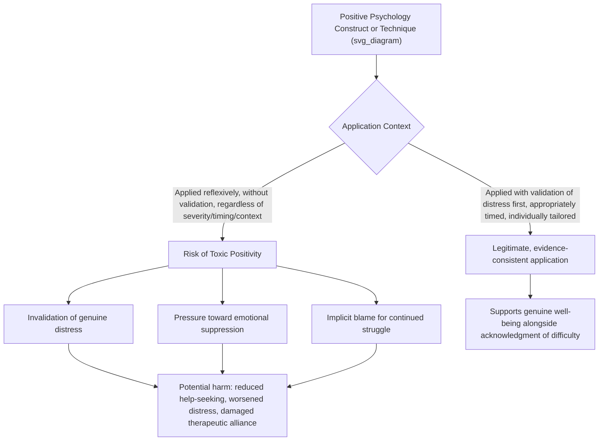

## The Toxic Positivity Critique and Its Boundaries

### Overview

The toxic positivity critique represents one of the most prominent popular and academic critiques directed at positive psychology and adjacent self-help culture, describing the phenomenon whereby the promotion of positive thinking or positive emotion becomes excessive, inappropriately generalized, or applied in ways that dismiss, minimize, or pathologize legitimate negative emotional experience. While the term itself emerged substantially from popular and clinical discourse rather than as a formal academic construct originating within positive psychology, it has generated meaningful scholarly engagement regarding where genuine risks lie, where the critique is well-founded, and where it may overreach or mischaracterize the field's actual theoretical commitments.

### Defining Toxic Positivity

**Core Definition**

- Toxic positivity refers to the overgeneralization of a positive, optimistic outlook across all situations, including those involving genuine hardship, loss, or distress, in a manner that results in the denial, minimization, or invalidation of authentic negative human emotional experience.
- Commonly cited surface manifestations include reflexive phrases directing a distressed person toward immediate positive reframing without first acknowledging the legitimacy of their difficulty, pressure to suppress or hide negative emotional expression, and an implicit or explicit suggestion that experiencing prolonged negative emotion reflects a personal failing or lack of effort.

**Distinguishing Toxic Positivity from Legitimate Positive Psychology Constructs**

| Legitimate Construct | Toxic Positivity Distortion |
| --- | --- |
| Optimism (a general tendency to expect favorable outcomes, per Life Orientation Test research) | Denial of realistic negative possibilities or refusal to acknowledge genuine risk/difficulty |
| Positive reframing/cognitive restructuring (evidence-based CBT technique) | Premature or forced reframing applied before adequate emotional processing, invalidating the person's current experience |
| Gratitude practice | Using gratitude prompts to suggest a person "shouldn't" feel distress because "things could be worse" |
| Resilience (effective adaptation to adversity) | Implying that any expression of struggle or need for support reflects insufficient resilience |
| Growth mindset (belief that abilities can be developed) | Implying that all negative outcomes are attributable to insufficient effort or wrong mindset, ignoring structural, circumstantial, or biological factors |
| The broaden-and-build theory (positive emotion building long-term resources) | Suggesting positive emotion should be manufactured or performed regardless of genuine internal state |

### Theoretical and Empirical Basis for the Critique

**Emotional Suppression and Avoidance Research**

- A substantial body of research in emotion regulation science, largely predating and independent of positive psychology specifically, has documented that habitual emotional suppression (deliberately inhibiting the outward expression of emotion) is associated with poorer psychological and even physiological outcomes compared to acceptance-based or approach-oriented emotion regulation strategies.
- This research provides a genuine theoretical and empirical foundation for concern about interventions or cultural norms that implicitly or explicitly encourage suppression of negative emotion in the name of positivity.

**Acceptance-Based Approaches as a Counterpoint**

- Therapeutic approaches such as Acceptance and Commitment Therapy (ACT) explicitly emphasize psychological acceptance of difficult internal experiences (rather than avoidance or suppression) as a component of psychological flexibility and well-being, offering a theoretically distinct but complementary framework to more narrowly hedonic positive-emotion-focused approaches.
- [Inference] The rise of acceptance-based approaches within and alongside positive psychology (e.g., increasing integration of mindfulness and acceptance-based techniques in sport psychology and clinical positive psychology applications, as referenced in earlier coverage of MAC and mindfulness-based approaches) reflects, in part, the field's own theoretical response to concerns underlying the toxic positivity critique.

**The Dual-Continua Model as a Counter-Framework**

- As covered extensively in this course's clinical content, the dual-continua model (mental illness and mental health as related but distinct continua) does not, on its own theoretical terms, support the idea that well-being requires the absence or suppression of negative emotion or symptoms; rather, it holds that both distress and well-being resources can coexist.
- [Inference] Properly applied, this framework is arguably incompatible with toxic positivity's implicit assumption that negative emotion must be eliminated or hidden for well-being to be achieved; the critique is thus most accurately aimed at popularized misapplications and superficial adoption of positive psychology language, rather than at its core theoretical architecture.

### Critique Pathway Diagram

### Where the Critique Is Well-Founded

**Key Points**

- **Premature reframing in acute distress or grief**: As discussed in the ethical considerations chapter, applying meaning-making, gratitude, or benefit-finding techniques before a person has had adequate space to process acute loss or trauma is a genuine, well-supported risk, consistent with phase-based trauma and grief processing models.
- **Popularized self-help oversimplification**: Much of the toxic positivity critique is more accurately aimed at diluted, popularized self-help and social-media-driven content (e.g., simplified motivational messaging divorced from clinical context) than at rigorously developed clinical protocols like Well-Being Therapy or Positive Psychotherapy, which explicitly incorporate sequencing, validation, and individualized clinical judgment.
- **Workplace and organizational contexts**: Toxic positivity concerns have particular documented relevance in occupational wellness contexts, where organizationally-mandated positivity (e.g., wellness programs emphasizing individual resilience/positivity while leaving structural stressors such as excessive workload unaddressed) can function to shift responsibility for systemic problems onto individual employees, a critique with specific relevance to the workplace wellness applications discussed in the positive-health content.
- **Cultural and individual invalidation risk**: As discussed in the ethical considerations content, positive psychology techniques applied without attention to a person's specific cultural context, values, or actual circumstances (e.g., genuine socioeconomic hardship) risk a specific form of invalidation distinct from, but related to, the general toxic positivity concern.

### Where the Critique May Overreach

**Key Points**

- **Conflating rigorous protocols with popularized distortions**: The critique sometimes fails to distinguish between manualized, evidence-informed clinical approaches (WBT, PPT, Meaning-Centered Psychotherapy) that explicitly incorporate validation, sequencing, and clinical judgment, versus decontextualized popular self-help content; treating these as equivalent risks throwing out well-supported clinical tools alongside legitimately problematic superficial applications.
- **Positive psychology's own explicit theoretical commitments**: As noted above, core theoretical frameworks within positive psychology (the dual-continua model, broaden-and-build theory's emphasis on building resources rather than eliminating negative states) do not, on their own terms, require or endorse emotional suppression; [Inference] much of the toxic positivity critique may be more accurately characterized as a critique of misapplication and cultural dilution rather than of the field's foundational scientific claims.
- **Risk of an opposite overcorrection**: [Inference] An overly cautious response to the toxic positivity critique could, in principle, discourage appropriate and well-timed use of genuinely evidence-supported techniques (e.g., appropriately sequenced gratitude or meaning-making work following adequate processing of acute distress), representing a potential overcorrection rather than a resolution of the underlying tension between validating distress and building positive resources.
- **Not all positive reframing is toxic**: Standard, well-established CBT cognitive restructuring techniques (challenging demonstrably distorted negative automatic thoughts) are not inherently a form of toxic positivity; the critique applies specifically to reframing that denies or minimizes genuinely valid negative experience, not to evidence-based correction of cognitive distortion.

### Practical Example: Distinguishing Legitimate Support from Toxic Positivity

| Scenario | Toxic Positivity Response | Evidence-Consistent Response |

|---|---||

| A friend shares they were recently laid off | "Everything happens for a reason — this will turn out to be a blessing!" | "That's really difficult and stressful. How are you doing with it, and is there anything you need right now?" |

| A patient in early grief expresses persistent sadness at a therapy session | "Let's focus on three good things that happened today instead" | Validate the grief experience as an appropriate response to genuine loss; defer meaning-making/positive-focused work to a later, patient-paced phase if and when clinically appropriate |

| An athlete expresses genuine anxiety about an upcoming high-stakes competition | "Just think positive, you'll be fine!" | Acknowledge the anxiety as a normal response to a genuinely high-stakes situation, then collaboratively work on specific coping and preparation strategies (consistent with mental toughness/resilience frameworks) |

| An employee raises a legitimate workload/burnout concern in a workplace wellness context | Redirect toward individual resilience training without addressing the workload itself | Address the specific structural/workload concern directly, while offering resilience-building resources as a complement, not a substitute |

### Applied Guidance for Practitioners

- **Validate before reframing**: Across clinical, coaching, and everyday supportive contexts, the general sequencing principle of validating genuine distress before introducing positive-psychology-oriented content is consistently supported across the frameworks discussed in this course (WBT's sequential model, trauma-informed meaning-making timing, ethical considerations content).
- **Match intervention intensity and timing to clinical severity**: As discussed extensively in the ethical considerations content, positive psychology techniques require careful matching to the person's current state, cultural context, and readiness, rather than uniform application regardless of circumstance.
- **Distinguish structural from individual-level intervention needs**: Particularly in organizational contexts, practitioners should be attentive to whether a given situation calls for addressing genuine external/structural stressors versus (or in addition to) individual-level positive-psychology-informed support.
- Perception of whether a given intervention or interaction constitutes toxic positivity can vary based on individual context, relationship, cultural background, and the specific manner and timing of delivery, and no single technique is universally toxic or universally appropriate independent of this context.

**Next Steps**

- Emotional suppression vs. acceptance-based emotion regulation research
- Acceptance and Commitment Therapy (ACT): theoretical overlap with positive psychology
- Ethical considerations when combining positive psychology and therapy (companion topic)
- Phase-based grief and trauma processing models and appropriate intervention timing
- Workplace wellness programs and the individual-vs-structural responsibility debate
- Dual-continua model as a counter-framework to toxic positivity assumptions
- Cultural variation in the expression and validation of negative emotion
- Distinguishing evidence-based cognitive restructuring from invalidating positive reframing