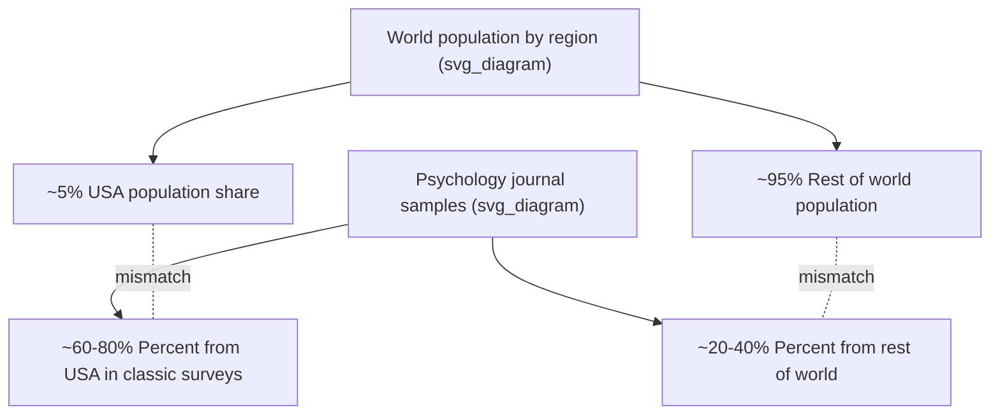
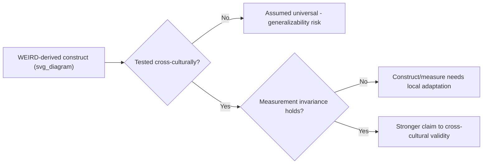

## WEIRD Samples and Generalizability Concerns

### Definition and Core Concept

**WEIRD** is an acronym coined by Henrich, Heine, and Norenzayan (2010) standing for **Western, Educated, Industrialized, Rich, and Democratic** populations. It describes a systematic sampling bias in psychological research, including positive psychology and resilience research, wherein the vast majority of study participants are drawn from a narrow demographic slice of humanity that is not representative of the species as a whole.

The core empirical claim is twofold:

1. WEIRD populations are statistical outliers on numerous psychological, behavioral, and cognitive dimensions (self-concept, moral reasoning, visual perception, fairness judgments, spatial cognition, and more) when compared against the full range of human societies studied by anthropologists and cross-cultural psychologists.
2. Despite this, WEIRD samples — and disproportionately American undergraduate students — make up the overwhelming majority of participants in published psychological research, yet findings are routinely generalized as if they reflect universal human nature.

### Historical Origin and Key Findings

The term was introduced in a 2010 target article in *Behavioral and Brain Sciences* titled "The weirdest people in the world?" The authors reviewed comparative databases across multiple domains (visual perception, e.g., susceptibility to the Müller-Lyer illusion; fairness and cooperation, e.g., behavior in the Ultimatum Game and Dictator Game; self-concept and independence vs. interdependence; moral reasoning frameworks; spatial reasoning strategies) and found that WEIRD subjects were frequently the most statistical outliers, not the central or "default" case.

**Key Points:**

- American undergraduates specifically have historically constituted a very large share of behavioral science samples, largely due to convenience sampling through university subject pools.
- The critique is not merely "samples are Western" — it is that the *direction and magnitude* of WEIRD deviation from the global human range is often extreme, making WEIRD findings poor proxies for "human universals."
- Subsequent bibliometric analyses of top psychology journals have repeatedly confirmed the overrepresentation of North American and European samples relative to their share of world population.

### Relevance to Positive Psychology and Resilience Research

Positive psychology as a field emerged substantially from research conducted in WEIRD contexts (primarily the United States), which raises specific generalizability concerns:

**Construct-level concerns:**

- **Well-being and happiness constructs** — Subjective well-being measures often emphasize individual affect and self-evaluation (e.g., life satisfaction scales), which reflects an individualist, self-focused cultural model. Collectivist cultures may weight relational harmony, social duty, or family/group flourishing more heavily than individual positive affect.
- **Resilience as a construct** — Western resilience models often frame resilience as an individual trait or capacity (e.g., "bouncing back," personal grit, individual coping resources). Cross-cultural resilience scholarship (e.g., Michael Ungar's work) argues resilience is frequently a *socio-ecological* process dependent on community resources, collective coping, and culturally specific protective systems, not solely an internal psychological trait.
- **Character strengths (VIA classification)** — The VIA Institute's 24 character strengths were derived partly from a review of virtue traditions but were operationalized and validated predominantly in WEIRD samples; the relative weighting, expression, and even desirability of specific strengths (e.g., individual assertiveness vs. modesty) can vary substantially across cultures.
- **Optimism and explanatory style** — Seligman's learned optimism and explanatory style research, foundational to positive psychology, was built largely on American samples; attributional styles linked to well-being outcomes in the U.S. do not necessarily transfer with the same valence or effect size elsewhere.

**Measurement and validity concerns:**

- Self-report scales developed and validated in English with WEIRD populations may not have equivalent psychometric properties (construct validity, factor structure, response style) when translated and administered elsewhere.
- Response biases (e.g., acquiescence bias, extreme response style, social desirability) vary systematically by culture, distorting cross-cultural comparisons of well-being or resilience scores if uncorrected.

### Mechanisms Underlying the WEIRD Bias in Research Practice

Several structural factors reproduce WEIRD sampling in the literature:

- **Convenience sampling** — University psychology departments recruit from subject pools of enrolled students (predominantly young, WEIRD, and educated).
- **Funding and infrastructure concentration** — Research funding, universities, and publishing infrastructure are concentrated in North America, Europe, and a small number of other wealthy nations.
- **Publication and citation gatekeeping** — Leading journals are headquartered in and edited from WEIRD countries, and this shapes which research questions and populations are seen as "mainstream" versus "cross-cultural" (the latter often othered as a special sub-field rather than integrated into general theory).
- **Online crowdsourced samples** — Even the shift toward platforms like Amazon Mechanical Turk or Prolific, intended to diversify sampling beyond undergraduates, still draws heavily from English-speaking, internet-connected, WEIRD-adjacent populations.

### Illustration of Sampling Skew

The diagram represents the frequently cited mismatch pattern (Arnett, 2008; Henrich et al., 2010): the population share of the United States and other WEIRD nations is disproportionately small relative to their share of published psychological samples, while the reverse mismatch holds for the rest of the world.

### Consequences for Theory and Practice

**Key Points:**

- **False universalism** — Findings derived from WEIRD samples are sometimes presented as general "human" psychological laws rather than culturally-bounded patterns, a form of overgeneralization threat to external validity.
- **Intervention transfer risk** — Positive psychology interventions (PPIs) such as gratitude journaling, best-possible-self exercises, or savoring techniques, validated in WEIRD contexts, may show different effect sizes, or even null/negative effects, when transplanted into non-WEIRD cultural contexts without adaptation.
- **Policy and clinical application risk** — Resilience-building programs (e.g., school-based or disaster-response resilience curricula) designed on WEIRD assumptions about individual coping may underperform or misfire in collectivist, non-Western, or low-resource settings if they ignore community-level and structural determinants of resilience.
- **Underrepresentation harms** — Populations excluded from foundational samples (Indigenous communities, Global South populations, non-literate societies, subsistence communities) are then further underrepresented in "evidence-based" applications that claim universal validity.

### Example

**Example:**

A gratitude intervention (writing weekly gratitude letters) shows a robust boost to self-reported well-being in U.S. college student samples. When the same protocol is applied in a cultural context emphasizing interdependence and relational modesty, some studies find attenuated effects or discomfort with the individually-focused public expression format, illustrating that intervention efficacy is not construct-invariant across cultural samples. [Inference: the direction and magnitude of such cross-cultural attenuation effects vary by specific study design, intervention format, and population, and should not be treated as a fixed universal finding.]

### Methodological Responses and Correctives

**Sampling-level correctives:**

- **Deliberate cross-cultural and cross-national sampling** — Actively recruiting from diverse socioeconomic, national, linguistic, and cultural groups rather than relying on convenience samples.
- **Community-based participatory research (CBPR)** — Involving target communities in study design to ensure constructs and measures are locally meaningful rather than imported wholesale.
- **Large-scale cross-cultural collaborations** — Multi-site, multi-lab replication networks (e.g., Psychological Science Accelerator) explicitly designed to sample beyond WEIRD-dominant labs.

**Measurement-level correctives:**

- **Emic vs. etic approaches** — Distinguishing between culture-specific (emic) constructs and purportedly universal (etic) constructs; developing measures that start from local conceptions of well-being/resilience rather than assuming Western scales translate directly.
- **Measurement invariance testing** — Statistically testing (e.g., via multi-group confirmatory factor analysis) whether a scale measures the same underlying construct with the same structure across cultural groups before comparing scores.
- **Back-translation and cognitive interviewing** — Rigorous translation protocols and piloting with target populations to check conceptual equivalence, not just linguistic equivalence.

**Theoretical correctives:**

- **Socio-ecological resilience models** — Reframing resilience as a product of interacting individual, relational, community, and systemic resources (Ungar's social-ecological model of resilience) rather than a purely internal trait, explicitly designed to travel better across cultural contexts.
- **Indigenous and non-Western positive psychology frameworks** — Incorporating constructs such as Ubuntu (Southern African relational personhood), Confucian relational harmony, or Buddhist-derived equanimity frameworks as parallel, non-derivative contributions to well-being science rather than "exotic variants" of a Western baseline.

### Illustrative Framework Diagram

### Critical Perspectives and Debates

**Key Points:**

- Some scholars caution against an overcorrection that treats all WEIRD findings as invalid; the critique targets *unwarranted generalization*, not the inherent worthlessness of WEIRD-derived research. Effects found in WEIRD samples can still be real and useful *within* those populations.
- There is ongoing debate about whether "WEIRD vs. non-WEIRD" is itself an oversimplified binary, since enormous psychological and cultural heterogeneity exists *within* both categories (e.g., variation across European nations, or across urban vs. rural, religious vs. secular subgroups within a single non-Western country).
- Practical constraints (funding, logistics, language access, ethical review infrastructure) mean full remediation of WEIRD bias is a resource-intensive, long-term structural project rather than a simple methodological fix. [Inference: the pace and completeness of this remediation across the field is a matter of ongoing disciplinary debate rather than settled fact.]
- Journals such as *Behavioral and Brain Sciences* and funding bodies have increasingly requested sample diversity statements and justification for generalizability claims, but this is an evolving editorial norm, not yet a universal mandatory standard across all journals. [Unverified: specific journal policies vary by outlet and change over time; consult a given journal's current author guidelines for its present requirement.]

### Practical Checklist for Evaluating Generalizability in a Study

**Key Points:**

- Where was the sample recruited (country, institution type)?
- What is the demographic composition (age, education level, socioeconomic status, urban/rural)?
- Was the measurement instrument validated in this specific population, or merely translated?
- Does the paper explicitly limit its claims to the sampled population, or does it use universal language ("people," "humans") unsupported by the sample?
- Are cultural or structural alternative explanations considered for observed effects?

### Related Topics

- Cross-cultural psychology and emic/etic methodology
- Measurement invariance and psychometric equivalence testing
- Ungar's socio-ecological model of resilience
- Replication crisis and open science reforms in psychology
- Indigenous psychology and non-Western well-being frameworks (Ubuntu, Confucian relational well-being, Buddhist psychology)
- Sampling bias and external validity in behavioral science more broadly
- Positive psychology interventions (PPIs): cross-cultural adaptation and efficacy
- Global mental health and culturally adapted intervention design