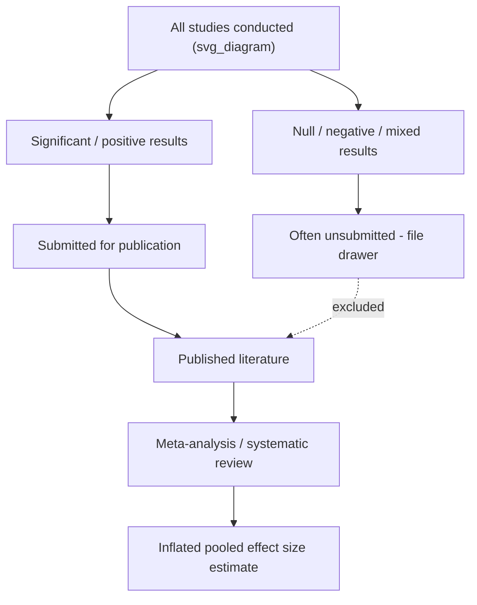

## Publication Bias and Effect-Size Inflation in Intervention Research

### Definition and Core Concept

**Publication bias** refers to the systematic tendency for studies with statistically significant, positive, or novel findings to be published at higher rates than studies with null, negative, or unremarkable findings. **Effect-size inflation** is a downstream consequence: because the published literature overrepresents significant results, meta-analytic and narrative summaries of "average effect size" for an intervention are biased upward relative to the true population effect.

In positive psychology and resilience intervention research specifically, this is a central methodological concern because much of the field's applied credibility rests on claims like "gratitude interventions produce a moderate effect on well-being" or "resilience training programs reduce burnout by X%" — claims that are only as trustworthy as the underlying evidence base is complete and unbiased.

### Mechanisms Producing the Bias

**Key Points:**

- **File-drawer problem** — A term coined by Rosenthal (1979) describing null or non-significant studies that researchers never submit for publication, leaving them figuratively "in the file drawer." These missing studies are invisible to meta-analyses unless proactively sought out.
- **Journal selection bias** — Editors and peer reviewers historically favored novel, positive, statistically significant findings as more "interesting" or publishable, particularly in higher-impact journals.
- **Researcher degrees of freedom / p-hacking** — Flexibility in analytic choices (which covariates to include, which outcome measures to report, when to stop data collection, which subgroups to analyze) that, even without deliberate intent, inflates the false positive rate and the average magnitude of reported effects.
- **HARKing (Hypothesizing After Results are Known)** — Presenting a post-hoc finding as though it were the a priori hypothesis, which conceals the exploratory, higher-noise nature of the result.
- **Outcome-reporting bias** — Selectively reporting only the subset of measured outcomes that reached significance, while omitting non-significant outcomes from the same study.
- **Small-study effects** — Small-sample studies have higher sampling variance; combined with publication bias, only the small studies that happen to produce large effects (by chance) get published, creating a spurious inverse relationship between sample size and effect size in the literature.

### Illustration of the File-Drawer Mechanism

### Detection Methods in Meta-Analysis

**Key Points:**

- **Funnel plots** — A scatter plot of individual study effect sizes (x-axis) against a measure of precision, typically standard error or sample size (y-axis). In the absence of bias, plots should be roughly symmetric, resembling an inverted funnel, since small studies scatter widely around the true effect while large studies cluster tightly near it. Asymmetry — particularly a gap in the region representing small studies with null or negative effects — is suggestive of publication bias.
- **Egger's regression test** — A statistical test for funnel plot asymmetry, regressing the standardized effect size against its precision; a significant intercept suggests asymmetry consistent with publication bias, though it can also reflect genuine heterogeneity or small-study effects unrelated to bias.
- **Trim-and-fill method** (Duval & Tweedie, 2000) — An algorithm that imputes hypothetical "missing" studies to restore funnel plot symmetry and recalculates a bias-adjusted pooled effect estimate; treated as a sensitivity analysis rather than a definitive correction, since it relies on assumptions about the missingness mechanism.
- **P-curve analysis** (Simonsohn, Nelson, & Simmons) — Examines the distribution of statistically significant p-values across a set of studies; a right-skewed distribution (more p-values near .01 than near .05) is consistent with genuine effects, while a flat or left-skewed distribution suggests p-hacking or selective reporting.
- **PET-PEESE** (Precision-Effect Test and Precision-Effect Estimate with Standard Error) — Meta-regression techniques that model the relationship between effect size and standard error to estimate the effect size expected at infinite precision (i.e., zero standard error), often producing more conservative bias-corrected estimates than naive averaging.
- **Prospective trial registries** (e.g., ClinicalTrials.gov, OSF Registries, PROSPERO) — Comparing the number of registered trials/studies against the number that ultimately appear in the published literature provides a direct empirical estimate of the file-drawer rate, though this method only covers studies registered after the registry existed and gained adoption in a field.

### Relevance to Positive Psychology Intervention (PPI) Research

**Sivo, Fredrickson, and other foundational program evaluations**, along with subsequent meta-analyses of positive psychology interventions, have been specifically scrutinized for publication bias risk:

- Sin and Lyubomirsky's (2009) influential meta-analysis of positive psychology interventions reported a moderate mean effect size on well-being; subsequent reanalyses and later meta-analyses (e.g., Bolier et al., 2013; Hendriks et al., 2020) applying more rigorous bias-correction methods and stricter inclusion criteria (e.g., limiting to randomized controlled trials with active or waitlist control groups) generally found **smaller, though still often significant, effect sizes** than earlier, less bias-corrected estimates. [Inference: the precise magnitude of downward correction varies by meta-analysis, inclusion criteria, and correction method used, and should be checked against the specific meta-analytic source rather than treated as a single fixed number.]
- Resilience-training program evaluations (e.g., workplace resilience programs, military resilience training such as the U.S. Army's Comprehensive Soldier Fitness program) have faced similar critiques: initial published evaluations reported robust positive effects, while later independent reviews and meta-analyses applying stricter methodological standards found more modest or mixed effects, partly attributable to publication and reporting bias in the earlier evidence base. [Unverified: specific effect-size figures and criticisms are drawn from a body of ongoing methodological debate; consult the primary meta-analyses and subsequent commentaries for exact figures.]
- Gratitude intervention research has similarly seen a pattern where early, smaller studies reported large effects, while larger, preregistered, and better-powered replications have tended to find smaller effects — a classic signature of publication-bias-driven effect-size inflation combined with the winner's curse (see below).

### Related Statistical Phenomena

**Key Points:**

- **Winner's curse** — In a literature with many small, underpowered studies, the subset that reach statistical significance by chance will, on average, overestimate the true effect size, because only the (partly noise-driven) larger observed effects clear the significance threshold. This compounds publication bias even absent any selective reporting.
- **Decline effect** — The empirical pattern in which an effect's estimated magnitude shrinks across successive replication attempts over time, often attributed to a combination of regression to the mean, publication bias in the original finding, and increasing methodological rigor in later studies.
- **Low statistical power interacting with bias** — Underpowered original studies combined with a publication system that only rewards significant findings mechanically forces the published effect sizes from that literature to be larger than the true effect, since only inflated-by-chance results survive the filter (Button et al., 2013, "Power failure" in neuroscience, with parallel implications for psychology).

### Example

**Example:**

A meta-analysis pools 20 published studies on a workplace resilience-training intervention and reports a pooled Cohen's $d = 0.55$ (moderate effect). A funnel plot reveals a conspicuous absence of small studies with $d$ near zero or negative in the bottom-left region of the plot. Applying trim-and-fill imputes 6 hypothetical missing studies, and the bias-adjusted pooled estimate drops to $d = 0.31$ (small-to-moderate effect). This illustrates how the naive pooled estimate, uncorrected for publication bias, can substantially overstate the intervention's true population effect. [Inference: this is an illustrative worked example, not a report of a specific named meta-analysis's actual figures.]

### Methodological and Field-Level Correctives

**Key Points:**

- **Preregistration** — Publicly registering hypotheses, design, sample size, and analysis plan before data collection (e.g., via OSF, AsPredicted) prevents HARKing and constrains researcher degrees of freedom.
- **Registered Reports** — A publishing format in which the study design and analysis plan are peer-reviewed and provisionally accepted *before* results are known, removing the outcome from the publication decision entirely and directly attacking the root cause of publication bias.
- **Mandatory trial/study registration** — Requiring registration in a public database prior to data collection so that the full population of conducted studies (not just published ones) can eventually be audited.
- **Open data and open materials** — Facilitating independent reanalysis and detection of selective reporting or analytic flexibility.
- **Multi-site replication initiatives** — Large, well-powered, preregistered, multi-lab replication efforts (e.g., through networks like the Psychological Science Accelerator) that are less susceptible to small-study and winner's-curse distortions.
- **Journals accepting null results** — Outlets and initiatives explicitly welcoming null/negative findings (e.g., some journals' "negative results" sections) to directly counteract file-drawer dynamics.
- **Statistical reform in reporting** — Requiring effect sizes with confidence intervals (not just p-values), and encouraging Bayesian or equivalence-testing frameworks that can positively support a null-effect conclusion rather than only failing to reject the null.

### Practical Checklist for Evaluating an Intervention Effect-Size Claim

**Key Points:**

- Is the cited number from a single study or a meta-analysis, and if the latter, did it test for and correct for publication bias (funnel plot, Egger's test, trim-and-fill, PET-PEESE)?
- Was the original study or trial preregistered?
- What is the typical sample size in this sub-literature, and is there a plausible power/winner's-curse concern?
- Do independent, large-sample, or registered replications exist, and do they converge with or diverge from the original effect size?
- Does the meta-analysis include unpublished dissertations, conference abstracts, or registry data as part of its literature search (a partial safeguard against the file-drawer problem)?

### Related Topics

- Preregistration and Registered Reports as publishing formats
- Meta-analytic methods: funnel plots, Egger's test, trim-and-fill, PET-PEESE
- The replication crisis in psychology and open science reform movements
- P-hacking, researcher degrees of freedom, and HARKing
- Statistical power and the winner's curse in underpowered research
- WEIRD samples and generalizability concerns (related sampling/validity threat)
- Evidence hierarchies and critical appraisal of intervention research (e.g., GRADE framework)
- Effect size interpretation standards (Cohen's $d$, conventions and critiques)