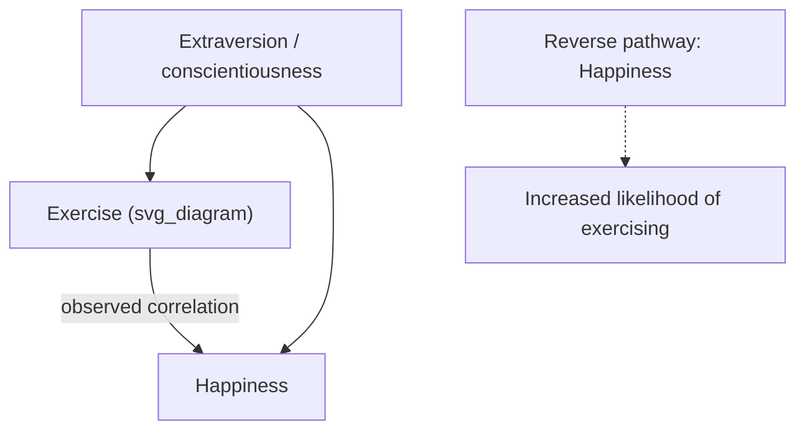

## Distinguishing Correlational Claims from Causal Claims About Happiness

### Definition and Core Concept

A **correlational claim** asserts that two variables (e.g., happiness and income, happiness and marital status, happiness and exercise) covary — that is, they are statistically associated such that knowing the value of one improves prediction of the other. A **causal claim** asserts that a change in one variable produces a change in the other — that manipulating $X$ would change $Y$. The central methodological problem in happiness and well-being research is that the vast majority of the evidence base is correlational (typically cross-sectional survey data), yet findings are frequently communicated, interpreted, or acted upon as though they were causal.

This distinction matters practically: correlational findings support description and prediction ("happier people tend to be married"), while causal findings are required to justify intervention ("getting married will make you happier" or "this resilience program will increase resilience").

### The Three Classic Criteria for Causal Inference

**Key Points:**

- **Covariation** — The two variables must be statistically associated. This is the only criterion that correlational data alone can establish.
- **Temporal precedence** — The purported cause must precede the purported effect in time. Cross-sectional data cannot establish this; longitudinal or experimental designs are needed.
- **Elimination of alternative explanations (non-spuriousness)** — The association must not be fully explained by a third variable or reverse pathway. This is the criterion most often violated in observational happiness research.

### Common Threats to Causal Interpretation in Happiness Research

**Reverse causation:**

A frequently cited example is the income–happiness literature: cross-sectional correlations between income and subjective well-being are often interpreted as "money causes happiness," but the reverse pathway is equally plausible — happier, more optimistic, or more energetic individuals may perform better at work, network more effectively, and consequently earn more. Longitudinal and quasi-experimental designs (e.g., studies exploiting lottery winnings as an exogenous income shock) are needed to disentangle direction.

**Third-variable confounding:**

- **Personality traits** — Trait extraversion and low neuroticism are robustly associated with both higher subjective well-being and with outcomes like larger social networks, better health behaviors, and career success. A raw correlation between, say, social activity and happiness may be substantially confounded by underlying personality.
- **Health status** — Physical health confounds many happiness correlates (e.g., exercise, social participation, employment status), since illness can independently reduce both activity levels and well-being.
- **Socioeconomic status** — SES can confound relationships between, for example, "green space access and happiness" or "leisure time and happiness," since wealthier individuals differ systematically on many unmeasured dimensions.

**Selection effects:**

- Individuals who are already happier or more resilient may selectively enter into circumstances associated with happiness (e.g., seeking out marriage, choosing to volunteer, self-selecting into exercise routines), meaning the circumstance did not cause the happiness — a prior disposition drove both the circumstance and the outcome.

**Common-method bias:**

- When both the predictor and outcome are measured via the same self-report instrument at the same time point, shared method variance (e.g., current mood coloring recall of both variables) can inflate the observed correlation independent of any true underlying relationship.

### Illustration of Confounding vs. Genuine Causation

The diagram represents two rival explanations for an observed exercise–happiness correlation: (1) a confounding personality trait driving both, and (2) reverse causation, in contrast to the causal claim "exercise increases happiness."

### Research Designs and Their Causal Inference Strength

**Key Points:**

- **Cross-sectional survey** — Weakest for causal inference; establishes covariation only; cannot establish temporal precedence.
- **Longitudinal / panel design** — Repeated measurement of the same individuals over time allows temporal precedence to be established and permits techniques like cross-lagged panel models, which examine whether $X$ at Time 1 predicts $Y$ at Time 2 controlling for Y at Time 1 (and vice versa), offering some purchase on directionality, though still vulnerable to unmeasured time-varying confounders.
- **Natural experiments / quasi-experimental designs** — Exploit naturally occurring, plausibly exogenous variation (e.g., lottery winnings, sudden widowhood, natural disasters, policy changes) to approximate random assignment without a researcher manipulating the variable directly. These provide stronger causal leverage than pure observational designs but rely on the "exogeneity" assumption holding (that the natural event is unrelated to unmeasured confounders).
- **Randomized controlled trials (RCTs)** — The strongest design for causal inference; random assignment to intervention vs. control balances both measured and unmeasured confounders in expectation, isolating the causal effect of the manipulated variable. Positive psychology intervention (PPI) research (e.g., randomized gratitude-journaling trials) draws its causal legitimacy specifically from this design feature.
- **Instrumental variable (IV) analysis** — A quasi-experimental statistical technique using a variable that affects the outcome only through its effect on the predictor of interest, used to approximate causal estimates from observational data when RCTs are infeasible or unethical.

### Example

**Example:**

A cross-sectional survey finds that people who report volunteering regularly also report higher life satisfaction ($r = 0.25$). This is a purely correlational claim. To test a causal claim ("volunteering increases life satisfaction"), a researcher could randomly assign participants to a volunteering condition versus a waitlist control and measure life satisfaction pre- and post-intervention. If the volunteering group shows a significantly greater increase than the control group, this supports (though does not conclusively prove, due to potential demand characteristics or placebo-like effects) a causal interpretation that the correlational design alone could not.

### Statistical Language Precision

**Key Points:**

- Phrases such as "associated with," "linked to," "correlated with," and "predicts" (in the statistical, not necessarily causal, sense) should be reserved for correlational findings.
- Phrases such as "causes," "leads to," "increases," "produces," or "results in" should be reserved for designs that satisfy temporal precedence and adequately rule out confounding (experimental or strong quasi-experimental designs).
- Mediation and moderation analyses conducted on cross-sectional data are frequently mislabeled as demonstrating causal mechanisms; without temporal or experimental design elements, statistical mediation models test a pattern *consistent with* a hypothesized causal chain but do not establish it. [Inference: this critique reflects a widely held methodological position in the literature on mediation analysis, e.g., critiques by Maxwell and Cole (2007) regarding cross-sectional mediation, though not every use of mediation modeling is equally vulnerable to this critique.]

### Why This Matters for Applied Positive Psychology and Resilience Work

**Key Points:**

- **Intervention justification** — Designing and funding a well-being or resilience intervention presupposes a causal claim (e.g., "increasing gratitude will increase well-being"). Relying on correlational evidence alone risks investing resources in interventions that target a correlate rather than a cause.
- **Public communication risk** — Popular science and media coverage of happiness research routinely convert correlational findings into causal-sounding headlines (e.g., "Marriage makes you happier," based on cross-sectional data), which can mislead public expectations and policy decisions.
- **Resilience-building programs** — Claims that specific individual traits (e.g., optimism, self-efficacy) "build" resilience are often based on correlational data linking the trait to better outcomes under adversity; without experimental manipulation of the trait itself, reverse causation (resilient outcomes reinforcing optimism) and third-variable confounds (e.g., stable temperament) remain live alternative explanations.

### Practical Checklist for Evaluating a Happiness-Related Claim

**Key Points:**

- Is the underlying study design cross-sectional, longitudinal, quasi-experimental, or a true RCT?
- Does the language used ("causes" vs. "is associated with") match the actual causal inference strength the design supports?
- Have plausible confounders (personality, health, SES) been measured and statistically controlled, and if so, are unmeasured confounders still plausible?
- Could the relationship run in the reverse direction, and has the study design ruled this out (e.g., via temporal ordering)?
- If a mediation or "mechanism" claim is made, was it tested with a design capable of supporting causal-process inference, or only with cross-sectional data?

### Related Topics

- Cross-lagged panel models and other longitudinal causal-inference techniques
- Randomized controlled trial (RCT) design principles in intervention research
- Publication bias and effect-size inflation in intervention research
- WEIRD samples and generalizability concerns
- Mediation and moderation analysis: statistical assumptions and causal interpretation limits
- Natural experiments and instrumental variable methods in social science
- Set-point theory and hedonic adaptation (a domain rife with correlational-vs-causal confusion)
- Confounding variables and third-variable problems in observational research