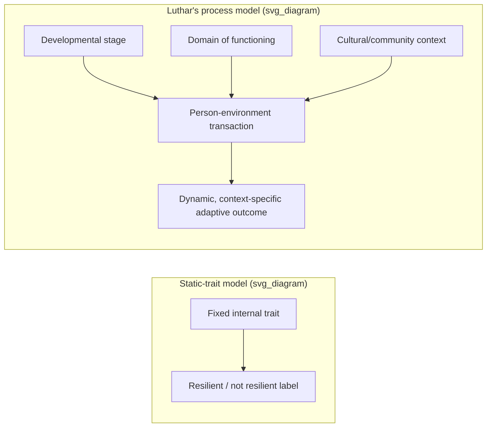

## Luthar's Critique of Resilience as a Static Trait and the Call for Developmental Specificity

### Core Source and Definition

The foundational reference for this critique is Suniya S. Luthar, Dante Cicchetti, and Bronwyn Becker's 2000 *Child Development* paper, "The Construct of Resilience: A Critical Evaluation and Guidelines for Future Work," which presents a critical appraisal of resilience as a construct connoting the maintenance of positive adaptation by individuals despite experiences of significant adversity. The paper addresses criticisms that have generally focused on ambiguities in definitions and central terminology, heterogeneity in risks experienced and competence achieved by individuals viewed as resilient, instability of the phenomenon of resilience, and concerns regarding the usefulness of resilience as a theoretical construct. [ResearchGate](https://www.researchgate.net/publication/12366925_The_Construct_of_Resilience_A_Critical_Evaluation_and_Guidelines_for_Future_Work)[ResearchGate](https://www.researchgate.net/publication/12366925_The_Construct_of_Resilience_A_Critical_Evaluation_and_Guidelines_for_Future_Work)

Luthar's central reconceptualization, echoed across the field, is that resilience is not a personal trait but a product of the environment and the interaction between the child and the environment. By 2000, Luthar had explicitly reframed resilience as "a dynamic process encompassing positive adaptation within the context of significant adversity." [Vichealth](https://www.vichealth.vic.gov.au/sites/default/files/Current-theories-relating-to-resilience-and-young-people.pdf)[Vichealth](https://www.vichealth.vic.gov.au/sites/default/files/Current-theories-relating-to-resilience-and-young-people.pdf)

### The Static-Trait Model Being Critiqued

**Key Points:**

- The trait model treats resilience as a fixed, enduring internal characteristic possessed (or not) by an individual — akin to a stable personality dimension — such that "resilient children" are conceptually separable from "non-resilient children" as a matter of inherent disposition.
- This framing implicitly attributes both success and failure under adversity to the individual's internal makeup, independent of context, timing, or environmental support.
- The focus centralized on personality traits or individual characteristics implies that a person who is unable to thrive and produce positive outcomes under stressors or when facing severe adversity is responsible for his or her plight. [Sage Journals](https://journals.sagepub.com/doi/10.1177/0044118X211029309)

### Why the Trait Model Is Considered Problematic

**Key Points:**

- **Attributional/blame problem:** Considering resilience as a static individual trait places the blame on adolescents for failing to overcome adversity. [Sage Journals](https://journals.sagepub.com/doi/10.1177/0044118X211029309)
- **Non-malleability implication:** This casts doubt on the usefulness of prevention programs, because individual traits may not be amenable to change or alteration (Fergus & Zimmerman, 2005). [Sage Journals](https://journals.sagepub.com/doi/pdf/10.1177/0044118X211029309)
- **Barrier to actionable research:** This conception provides no guidance for further research, practice, and policy to design appropriate interventions (Luthar et al., 2000). [Sage Journals](https://journals.sagepub.com/doi/pdf/10.1177/0044118X211029309)
- **Logical dead end for developmental science:** If researchers believe that "an individual consists of a set of unchanging traits then there is no need for developmental research" (Sameroff, 2010, p. 12). [Sage Journals](https://journals.sagepub.com/doi/pdf/10.1177/0044118X211029309)
- **Field-wide consensus against the trait view:** Leading theorists — Garmezy, Luthar, Masten, Ungar, and Werner — have agreed that resilience is not an inherent or unique personal quality that only some children are born with. [Sage Journals](https://journals.sagepub.com/doi/pdf/10.1177/0044118X211029309)

### The Process/Transactional Reframing

Rather than a fixed trait, Luthar's framework positions resilience as an emergent outcome of ongoing person–environment transactions:

- Resilience and the processes that engender it are not static; protective processes will vary in predictable ways across time and context, as noted by Sameroff. [Encyclopedia on Early Childhood Development](https://www.child-encyclopedia.com/resilience/according-experts/resilience-early-age-and-its-impact-child-development-comments-luthar)
- Consistent with this, interventions themselves must be dynamic, flexible, and culturally specific to ensure that they are integrated into the structure of the target community. [Encyclopedia on Early Childhood Development](https://www.child-encyclopedia.com/resilience/according-experts/resilience-early-age-and-its-impact-child-development-comments-luthar)
- Even seemingly individual "protective attributes" are not fixed internal properties: children's own protective attributes, such as self-efficacy, are themselves continually shaped by salient socializing influences. [Wiley Online Library](https://onlinelibrary.wiley.com/doi/10.1002/9781118963418.childpsy307)
- Contextual forces are not symmetric in strength: forces inimical to psychological and physical survival, such as maltreatment and violence, are much more powerful than positive influences, such as affection or support — implying resilience processes cannot be modeled as a simple additive balance of risk versus protective factors. [Wiley Online Library](https://onlinelibrary.wiley.com/doi/10.1002/9781118963418.childpsy307)

### The Call for Developmental Specificity

This is the constructive core of Luthar's critique: resilience cannot be studied, measured, or promoted as a single undifferentiated phenomenon across all ages, domains, and contexts. Instead, research and intervention must specify:

**Key Points:**

- **Age/developmental stage specificity** — What counts as a competent, adaptive outcome differs substantially across infancy, childhood, adolescence, and adulthood; a protective factor at one developmental stage (e.g., strong parental control in early childhood) may not function protectively, or may even become a risk factor, at another stage (e.g., adolescence, where autonomy needs differ).
- **Domain specificity** — Luthar's framework insists that competence is multidimensional (academic, social, emotional, behavioral), and a person can show resilient functioning in one domain (e.g., academic achievement) while showing continued difficulty in another (e.g., internalizing symptoms such as depression or anxiety), which the earlier unidimensional trait model obscured.
- **Risk-modifier specificity** — Future research and interventions must prioritize attention to risk-modifiers that are broadly deterministic, with large effect sizes and generative of other assets, gender-specific patterns, and developmental contexts including mores, needs, and existing resources. [Wiley Online Library](https://onlinelibrary.wiley.com/doi/10.1002/9781118963418.childpsy307)
- **Contextual/cultural specificity** — Resilience must be assessed with respect to particular cultural and contextual features, extending beyond traditional single-level analyses to address interactions and transactions within and among multiple developmental systems that shape pathways toward and away from competence in the face of adversity. [Encyclopedia on Early Childhood Development](https://www.child-encyclopedia.com/resilience/according-experts/resilience-early-age-and-its-impact-child-development-comments-luthar)
- **Multi-systemic and biological integration** — Attention must be directed to transactions between biological and psychosocial influences on adaptation, echoing calls for greater attention to the biological correlates of and contributors to resilience. [Encyclopedia on Early Childhood Development](https://www.child-encyclopedia.com/resilience/according-experts/resilience-early-age-and-its-impact-child-development-comments-luthar)

### Illustration: Static-Trait Model vs. Developmental-Process Model

### Empirical Illustration of Domain and Context Specificity

**Example:**

In Luthar's own inner-city adolescent research, she investigated six characteristics of "social competence" alongside moderator variables such as intelligence, social skills, lack of control, and ego development, and internalizing symptoms such as depression and anxiety. This design deliberately separated multiple competence and symptom domains rather than assigning a single global "resilient/non-resilient" label, operationalizing the developmental-specificity principle: an adolescent could show strong social competence and academic performance while simultaneously exhibiting significant internalizing distress — a pattern invisible to a unidimensional trait model. [Vichealth](https://www.vichealth.vic.gov.au/sites/default/files/Current-theories-relating-to-resilience-and-young-people.pdf)

### Implications for Intervention Design and Policy

**Key Points:**

- Interventions targeting resilience should be designed as **process-oriented and relational**, not trait-implanting; Luthar's own applied suggestion is that successful interventions will strengthen core relational systems by targeting the quality and consistency of the early caregiving environment. [Encyclopedia on Early Childhood Development](https://www.child-encyclopedia.com/resilience/according-experts/resilience-early-age-and-its-impact-child-development-comments-luthar)
- Effective application requires ecological, multi-level design: effective applications of resilience research must begin at the level of the community, target multiple developmental systems, and promote community participation and empowerment. [Encyclopedia on Early Childhood Development](https://www.child-encyclopedia.com/resilience/according-experts/resilience-early-age-and-its-impact-child-development-comments-luthar)
- A **reverse-translation loop** is called for: there must be a reverse translation such that practice can inform resilience research, rather than research flowing one-way into practice. [Encyclopedia on Early Childhood Development](https://www.child-encyclopedia.com/resilience/according-experts/resilience-early-age-and-its-impact-child-development-comments-luthar)
- Because resilience is not static, single-timepoint interventions or one-size-fits-all program models are theoretically mismatched to a construct that varies in predictable ways across time and context and therefore requires ongoing recalibration. [Encyclopedia on Early Childhood Development](https://www.child-encyclopedia.com/resilience/according-experts/resilience-early-age-and-its-impact-child-development-comments-luthar)

### Relationship to Broader Positive Psychology and Resilience Debates

**Key Points:**

- This critique is foundational to the shift, discussed across resilience scholarship (e.g., Masten, Ungar), from an individual-differences paradigm toward a socio-ecological or transactional paradigm — directly informing later developments such as Michael Ungar's social-ecological model of resilience, which similarly rejects resilience-as-fixed-trait in favor of resource-dependent, context-embedded process models.
- It intersects with the correlational-versus-causal distinction in happiness/resilience research: cross-sectional studies that identify a "protective trait" correlate of good outcomes cannot, on their own, establish that the trait is a stable causal driver rather than a context-dependent, malleable process — reinforcing why Luthar's critique pushes toward longitudinal, multi-wave, and multi-domain designs.
- It also intersects with generalizability concerns (e.g., WEIRD sampling): a developmentally- and culturally-specific model of resilience directly undercuts the plausibility of universal, trait-like resilience constructs derived from narrow samples.
- Masten's parallel definitional evolution is illustrative of the field's move away from static framing: Masten's definition described resilience as the capacity of a dynamic system to adapt successfully to disturbances that threaten system function, viability, or development, and in 2014 Masten revised the definition to replace "withstand" with "adapt successfully," further emphasizing process over static endurance. [Vichealth](https://www.vichealth.vic.gov.au/sites/default/files/Current-theories-relating-to-resilience-and-young-people.pdf)

### Practical Checklist for Applying Developmental Specificity

**Key Points:**

- Does the study or program specify the developmental stage/age range for which its resilience claims are intended, rather than generalizing across all ages?
- Are multiple competence domains (academic, social, emotional/internalizing, behavioral) assessed separately, rather than collapsed into a single "resilient" label?
- Are protective/risk factors tested for context-dependence (e.g., does the same factor function differently across cultural or socioeconomic contexts)?
- Is resilience treated as a repeatedly-assessed, potentially shifting process across the study's timeframe, rather than a single baseline classification?
- Does the intervention model target relational/ecological systems (caregiving quality, community resources) rather than assuming a trait can be installed directly in the individual?

### Related Topics

- Ungar's socio-ecological model of resilience
- Masten's "ordinary magic" framework and evolving definitions of resilience
- Multidimensional models of competence in developmental psychopathology
- Cross-lagged panel and longitudinal designs for studying developmental processes
- WEIRD samples and generalizability concerns (cultural specificity intersection)
- Distinguishing correlational claims from causal claims about happiness (trait-vs-process evidentiary standards)
- Risk and protective factor frameworks in developmental psychopathology
- Reverse-translation models linking practice and resilience theory