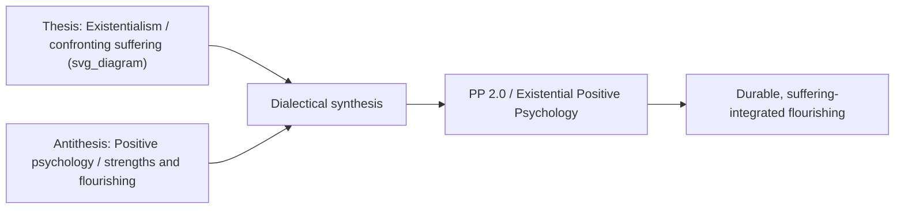

## Paul Wong's PP 2.0 and Existential Positive Psychology

### Definition and Core Concept

**PP 2.0**, also called **second wave positive psychology**, is a paradigm developed by Paul T. P. Wong that emerges as a complement to the limitations of positive psychology as championed by Martin Seligman ("first wave" or "PP 1.0"). Second wave positive psychology (PP 2.0) consists of two pillars: existential positive psychology and indigenous psychology. Wong is described as a pioneer of existential positive psychology, also known as second wave positive psychology (PP 2.0), and is regarded as one of the most cited existential and positive psychologists, having originated Meaning Therapy and served as editor of the *International Journal of Existential Positive Psychology*. [Taylor & Francis Online](https://www.tandfonline.com/doi/abs/10.1080/09515070.2019.1671320)

The book-length treatment of this paradigm frames PP 2.0 as focusing on the importance of transcending or transforming negative experiences and emotions to achieve durable flourishing, positioning it explicitly as a paradigm shift within counselling psychology and positive psychology more broadly. [Routledge](https://www.routledge.com/A-Second-Wave-Positive-Psychology-in-Counselling-Psychology-A-Paradigm/Wong/p/book/9781032441207)

### The Core Thesis: Confronting the Dark Side

**Key Points:**

- PP 2.0, as conceptualized by Wong (2011), proposes that the most promising strategy to accomplish the mission of positive psychology is to confront the dark side of human existence and understand the unique experience and expression of wellbeing in different cultures. [Dr. Paul Wong](http://www.drpaulwong.com/second-wave-positive-psychologys-contribution-to-counselling-psychology/)
- Thus, PP 2.0 emphasizes the existential universal on one hand, and indigenous cultural expression on the other hand. [Dr. Paul Wong](http://www.drpaulwong.com/second-wave-positive-psychologys-contribution-to-counselling-psychology/)
- PP 2.0 asserts that it is only through embracing the dark side of human existence and wrestling with ultimate concerns that we can uplift humanity and improve the human condition. [Dr. Paul Wong](http://www.drpaulwong.com/second-wave-positive-psychologys-contribution-to-counselling-psychology/)
- PP 2.0 deals with human beings' deepest fears and yearnings and captures the triumph of the defiant human spirit over the dark abyss of existential pain. [Dr. Paul Wong](http://www.drpaulwong.com/second-wave-positive-psychologys-contribution-to-counselling-psychology/)

### Motivating Rationale

Wong's own account of why he developed this framework centers on a perceived gap in the first-wave literature:

**Key Points:**

- In Wong's long clinical experience, he does not know a single individual who has not suffered from some kind of existential pain, be it the loss of a loved one, fear of personal demise, or an overwhelming sense of meaninglessness and hopelessness, with some clients having gone through unimaginable horrors of life. [Dr. Paul Wong](http://www.drpaulwong.com/second-wave-positive-psychologys-contribution-to-counselling-psychology/)
- Yet he could not find anything in the positive psychology literature on how to achieve sustainable meaning and joy in the midst of suffering — which motivated the development of PP 2.0. [Dr. Paul Wong](http://www.drpaulwong.com/second-wave-positive-psychologys-contribution-to-counselling-psychology/)
- This directly targets the critique that first-wave positive psychology's emphasis on positive emotions, strengths, and optimal functioning risked bypassing or minimizing genuine suffering, trauma, and existential adversity rather than integrating them.

### The Two Pillars

**Pillar 1 — Existential Positive Psychology (EPP):**

- The two pillars of PP 2.0 are existential positive psychology (Wong, 2009, 2016a) and indigenous psychology (Chang, Downey, Hirsch, & Lin, 2016; Wong, 2013, 2016b), which are complementary to each other, resulting in a positive psychology with greater depth by including the existential dimension. [Dr. Paul Wong](http://www.drpaulwong.com/second-wave-positive-psychologys-contribution-to-counselling-psychology/)
- EPP draws on existentialist philosophy and clinical traditions — explicitly including logotherapy — treating confrontation with mortality, freedom, isolation, and meaninglessness as necessary rather than incidental to flourishing.
- The mission of Wong's International Network on Personal Meaning (INPM) is to advance the vision of Viktor Frankl and Paul Wong through meaning research, meaning-centered practice, and meaningful-living groups, advocating a big-tent approach of extending existential psychology — particularly logotherapy — by integrating it with positive psychology research. [Dr. Paul Wong](https://www.drpaulwong.com/)

**Pillar 2 — Indigenous Psychology:**

- This pillar results in a positive psychology with greater breadth by including the indigenous view of happiness, addressing the cross-cultural generalizability problem in well-being science (paralleling WEIRD-sample critiques) by insisting that wellbeing must be understood through culturally embedded, non-Western conceptions rather than a single universal Western model. [Dr. Paul Wong](http://www.drpaulwong.com/second-wave-positive-psychologys-contribution-to-counselling-psychology/)

### The Dialectical Principle (the Second-Wave / Positive-Negative Dialectic)

This is the theoretical mechanism that most directly defines "second wave" thinking and gives the chapter its name:

**Key Points:**

- Existential positive psychology represents a unique kind of second wave positive psychology because it embraces the human complexity of existentialism and Taoism. [nih](https://www.ncbi.nlm.nih.gov/pmc/articles/PMC8699172/)
- PP2.0 goes beyond mere recognition of polarity, making the bold assumptions that (a) suffering is necessary for flourishing and (b) enduring happiness and wellbeing can only be achieved through the dialectical integration of opposites. [nih](https://www.ncbi.nlm.nih.gov/pmc/articles/PMC8699172/)
- The metaphor of a piano keyboard best illustrates the unique nature of PP2.0: beautiful music can only be produced by engaging both the black and white keys. [nih](https://www.ncbi.nlm.nih.gov/pmc/articles/PMC8699172/)
- In formal terms, PP2.0 represents the synthesis between thesis (existentialism) and antithesis (positive psychology) — an explicitly Hegelian dialectical structure, distinguishing PP 2.0 from simple additive models that just append "negative psychology" content onto PP 1.0. [nih](https://www.ncbi.nlm.nih.gov/pmc/articles/PMC8699172/)

### Illustration of the Dialectical Structure

### Applied Principles for Counselling Practice

**Key Points:**

- PP 2.0's contributions to counselling psychology include, as a first principle, accepting and confronting the reality that life is full of evil and suffering with existential courage. [Dr. Paul Wong](http://www.drpaulwong.com/second-wave-positive-psychologys-contribution-to-counselling-psychology/)
- Practically, this translates into meaning-centered therapeutic approaches (Wong's Meaning Therapy) that do not treat symptom reduction or positive-affect induction as sufficient goals, but instead work with clients to construct meaning through and alongside adversity rather than only after it has been resolved.
- An applied program illustrating this approach in a special issue collection is the D.R.E.A.M. program (developing resilience through emotions, attitudes, and meaning) — a second wave positive psychology approach, showing how PP 2.0 principles are operationalized into structured intervention design rather than remaining purely theoretical. [Routledge](https://www.routledge.com/A-Second-Wave-Positive-Psychology-in-Counselling-Psychology-A-Paradigm/Wong/p/book/9781032441207)

### Contemporary Application: COVID-19 as Case Study

Wong and colleagues used the COVID-19 pandemic as an applied illustration of PP 2.0 principles:

**Key Points:**

- This special issue of Frontiers, focused on COVID-19 and Existential Positive Psychology, provides an introduction to a "new science of flourishing through suffering" and a new vista of meaning-centered global wellbeing. [Dr. Paul Wong](http://www.drpaulwong.com/existential-positive-psychology-pp-2-0-and-the-new-science-of-flourishing-through-suffering/)
- At the cultural level, the pandemic was framed as a wake-up call to the weaknesses of an individualist and pleasure-seeking society, such as America, in combating the coronavirus. [Dr. Paul Wong](http://www.drpaulwong.com/existential-positive-psychology-pp-2-0-and-the-new-science-of-flourishing-through-suffering/)
- The anti-vaccination movement, framed in the name of personal freedom and liberty, was analyzed as revealing a fault-line in democracy: freedom without personal and social responsibility may endanger public health. [Note: this reflects a specific interpretive/political argument advanced by the cited authors, not an empirically settled claim, and readers should treat it as one perspective within a contested policy debate rather than a consensus finding.] [Dr. Paul Wong](http://www.drpaulwong.com/existential-positive-psychology-pp-2-0-and-the-new-science-of-flourishing-through-suffering/)
- This application demonstrates the PP 2.0 method in practice: treating a collective existential crisis (mass death, isolation, meaninglessness) as the necessary "dark" material through which renewed meaning and social flourishing must be dialectically forged, rather than something to be positioned outside the scope of positive psychology.

### Relationship to First-Wave Positive Psychology (PP 1.0)

**Key Points:**

- PP 1.0 (Seligman-era positive psychology) is characterized in this literature as valuable but limited in scope — historically criticized for emphasizing positive emotions, strengths, and flourishing somewhat independently of, or in insufficient dialogue with, suffering, trauma, and mortality.
- PP 2.0 does not reject PP 1.0's constructs (positive emotion, engagement, meaning, relationships, accomplishment) but reframes them as requiring integration with negative/existential material to produce what the framework calls **durable flourishing**, as opposed to flourishing that is fragile because it excludes engagement with suffering.
- This directly connects PP 2.0 to the broader "second wave" critique discussed across this chapter: that a purely additive, positivity-emphasizing first wave risks superficiality or fragility when confronted with genuine adversity, loss, or existential threat — the dialectical model is offered as the corrective.

### Institutional and Publishing Infrastructure

**Key Points:**

- Wong is a Fellow of APA and CPA and President of the International Network on Personal Meaning and the Meaning-Centered Counselling Institute Inc., and editor of the International Journal of Existential Positive Psychology. [Dr. Paul Wong](http://www.drpaulwong.com/second-wave-positive-psychologys-contribution-to-counselling-psychology/)
- He has edited two influential volumes on The Human Quest for Meaning and is the recipient of the Carl Rogers Award from the Society for Humanistic Psychology (Division 32 of the APA). [Dr. Paul Wong](http://www.drpaulwong.com/second-wave-positive-psychologys-contribution-to-counselling-psychology/)
- This institutional apparatus (dedicated journal, dedicated network, dedicated international conferences) signals PP 2.0's status as an organized sub-field/movement within positive psychology rather than a single paper's argument, which is relevant context for understanding its influence and reach in the discipline.

### Critical Considerations

**Key Points:**

- As with other "second wave" or dialectical positive psychology frameworks, empirical validation of specific mechanistic claims (e.g., that suffering is *necessary*, not merely common or often co-occurring, for durable flourishing) is harder to test experimentally than first-wave constructs like discrete positive emotions, and much of the supporting literature is theoretical, philosophical, or qualitative/clinical rather than experimental. [Inference: this is a general methodological observation about the empirical maturity of existential and dialectical wellbeing frameworks relative to more experimentally tractable first-wave constructs, not a claim made explicitly in the cited sources.]
- The integration of Taoist philosophy and dialectical (thesis-antithesis-synthesis) reasoning situates PP 2.0 partly outside the standard quantitative-empirical tradition dominant in mainstream positive psychology, which is a deliberate feature of the framework but also a point of methodological distinction worth noting when comparing it to PP 1.0's typically hypothesis-testing, effect-size-driven research program.
- The indigenous-psychology pillar directly intersects with, and can be read as a partial response to, WEIRD-sample generalizability concerns discussed elsewhere in this course, since it explicitly seeks non-Western, culturally embedded accounts of wellbeing rather than assuming universality of Western-derived well-being constructs.

### Related Topics

- Second-wave positive psychology and the positive-negative dialectic (broader chapter theme)
- Logotherapy and Viktor Frankl's meaning-centered psychology
- Meaning Therapy and meaning-centered counselling interventions
- Indigenous psychology and cross-cultural conceptions of wellbeing
- Post-traumatic growth and adversarial growth models
- Tragic optimism and meaning-making under suffering
- WEIRD samples and generalizability concerns (cross-cultural intersection)
- Dialectical models of wellbeing (thesis-antithesis-synthesis frameworks in psychology)