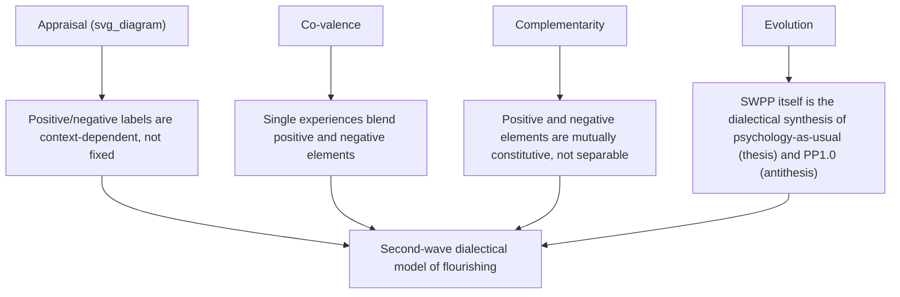

## The Dialectical Principles: Appraisal, Co-Valence, Complementarity, Evolution

### Definition and Core Concept

Second-wave positive psychology (SWPP), developed principally by Tim Lomas and Itai Ivtzan, is underpinned by four dialectical principles: appraisal, co-valence, complementarity, and evolution. This framework, articulated across works including Lomas and Ivtzan (2015, 2016), provides the conceptual architecture for how SWPP reframes wellbeing as a dialectical balance between positive and negative phenomena rather than the simple maximization of positive states pursued by first-wave positive psychology.

If the "first wave" incarnation of the field can be defined by valorization of the positive, SWPP recognizes that flourishing instead involves a complex balance, a subtle, dialectical interplay between ostensibly positive and negative phenomena. This second wave is still very much positive psychology: its overarching concern remains with "positive" meta-constructs and goals such as flourishing and wellbeing — it simply acknowledges that the routes towards these luminous destinations can be complicated, and sometimes lead through "darker" realms of human experience.

### Principle 1: Appraisal

**Key Points:**

- The principle of appraisal states that it is difficult to categorically identify phenomena as either positive or negative, since such appraisals are fundamentally contextually-dependent.
- The principle of appraisal means that we cannot appraise something as either positive or negative without taking context into account.
- **Illustrative research example:** James McNulty and Frank Fincham showed that pro-social emotions like forgiveness can be harmful if it means one tolerates a situation that one might otherwise resist; conversely, "anti-social" emotions like anger can impel one to resist injustice and drive progressive social change.
- As such, clear-cut determinations of "positive" and "negative" become harder to make — the same emotion, trait, or behavior can function adaptively or maladaptively depending on the situational, relational, and temporal context in which it occurs.
- Contemporary elaborations of this principle note further examples: the positive is not always beneficial — excessive happiness can be counterproductive, happiness is not universally appropriate, and its pursuit can paradoxically decrease happiness; conversely, negative approaches like anger can serve as a useful motivator.

### Principle 2: Co-Valence

**Key Points:**

- The principle of co-valence reflects the idea that many situations and experiences comprise positive and negative elements simultaneously (drawing on Richard Lazarus's work), rather than phenomena being purely positively or negatively valenced.
- **Illustrative case: love.** This is so even for arguably the most cherished of all human emotions: love. While there are many forms of love — from the passion of eros to the selflessness of agape — all are a dialectical blend of light and dark. Even while love contains pleasure, joy, and bliss, it also harbours worry, anxiety, and fear.
- This is often anchored to C.S. Lewis's observation that to love at all is to be vulnerable, and that loving anything means one's heart will be wrung and possibly broken — used as a literary illustration of co-valence rather than an empirical citation.
- **Other cited co-valenced phenomena:** post-traumatic growth and love are described as "co-valenced," involving intricate interplays of positive and negative aspects — and gratitude has been observed to sometimes induce guilt, another example of a nominally positive state carrying a negative co-valent element.

### Principle 3: Complementarity

**Key Points:**

- The principle of complementarity posits that not only are such phenomena co-valenced, but that their dichotomous elements are in fact co-creating — two intertwined sides of the same coin.
- This is a stronger and more structurally specific claim than co-valence: co-valence says positive and negative elements coexist within a phenomenon; complementarity says these elements are *mutually constitutive* — the negative element is not incidental to the positive one but is part of what generates or sustains it.
- **Illustrative case: love (continued).** The potential dysphoria inherent in love is not an aberration, but the very condition of it — the vulnerability and possibility of loss are not a flaw in love that a "purer" version could eliminate; they are structurally what makes the attachment meaningful in the first place.
- This principle underlies the broader SWPP claim (echoed in the definition of PP 2.0 discussed elsewhere in this chapter) that wellbeing and flourishing depend upon a complex balance of light and dark aspects of life — the "dark" aspects are not merely tolerated obstacles on the way to flourishing but functionally necessary components of it.

### Principle 4: Evolution

**Key Points:**

- The principle of evolution allows us to understand second-wave positive psychology as itself being an example of a dialectical process — SWPP is not merely a theory *about* dialectics; it is offered as a live instance of one.
- SWPP itself was seen as the manifestation of this fourth dialectical principle, in that it is a synthesis, emerging from the interaction of "psychology as usual" (the thesis) and positive psychology (the antithesis).
- This maps onto a formal Hegelian structure: thesis → antithesis → synthesis. "Psychology as usual" (with its historic emphasis on pathology, deficit, and disorder) is the thesis; positive psychology (with its corrective emphasis on strengths, virtue, and flourishing) is the antithesis; and SWPP, integrating both while transcending the limitations of each, is the synthesis.
- Crucially, this evolutionary/dialectical move does not necessarily mean an abandonment of positive psychology or a reversion back to the original thesis (psychology-as-usual). Rather, the next stage in this process is ideally synthesis, in which the truths of both thesis and antithesis are preserved, while their flaws are overcome.
- This principle is self-referential and future-oriented: it implies SWPP itself is not a final, static endpoint but a stage in an ongoing dialectical evolution — implying further syntheses may follow as new critiques of SWPP emerge over time.

### Illustration of the Four-Principle Dialectical Structure

### Logical Progression Among the First Three Principles

**Key Points:**

- The three experiential principles are typically presented as building on one another in increasing strength of claim: appraisal establishes that valence judgments are context-dependent and thus unstable; co-valence establishes that a single phenomenon can carry both valences at once; complementarity establishes that those co-present valences are not merely coincidental but functionally interdependent.
- This progression is explicitly signalled in the literature: this recognition of co-valence leads us inexorably to the third principle: complementarity — presenting complementarity as the natural deepening of co-valence rather than an independent, unrelated claim.
- Evolution operates at a different level of analysis than the first three: while appraisal, co-valence, and complementarity describe properties of individual emotional/experiential phenomena (love, forgiveness, anger, gratitude), evolution describes a property of the *field of positive psychology itself* as a historically developing body of theory.

### Relationship to Other Second-Wave Concepts in This Chapter

**Key Points:**

- This four-principle framework (Lomas & Ivtzan) is complementary to, but analytically distinct from, Paul Wong's PP 2.0 framework covered elsewhere in this chapter: both are labeled "second wave" and both reject a simple positive/negative dichotomy, but Wong's PP 2.0 centers on existential and indigenous-psychology pillars and a suffering-is-necessary-for-flourishing thesis, while Lomas and Ivtzan's SWPP centers on this specific four-principle dialectical taxonomy (appraisal, co-valence, complementarity, evolution) as an analytic toolkit for examining any given wellbeing-related phenomenon.
- The complementarity and co-valence principles directly inform therapeutic and applied reframings discussed under Wong's PP 2.0 (e.g., post-traumatic growth, meaning-making through suffering), providing a more granular, phenomenon-level vocabulary for the same broader second-wave shift.
- SWPP's critique also explicitly intersects with the WEIRD-sample generalizability concerns discussed earlier in this course: positive psychology's conceptualizations of wellbeing have been criticized as culturally specific, reflecting the North American context in which the field emerged, since concepts in positive psychology have largely been derived from research with WEIRD participants while the field has often tended to presume these findings can be generalized to other cultures — situating the cultural-relativity critique as a further motivating pressure behind the second-wave "evolution."

### Example

**Example:**

Consider the emotion of anxious anticipation before a major personal achievement (e.g., defending a dissertation). Under a first-wave lens, this anxiety might be classified simply as a negative state to be minimized or regulated away. Applying the four principles: (1) **Appraisal** — this anxiety cannot be labeled purely negative without context; it may reflect appropriate stakes-sensitivity rather than dysfunction. (2) **Co-valence** — the same anticipatory state likely blends dread with excitement and hope. (3) **Complementarity** — the sharpness of the anxiety may be inseparable from, and even partly generative of, the heightened focus and preparation that produce a strong performance; eliminating the anxiety might also blunt the motivational drive. (4) **Evolution** — this reframing itself exemplifies the SWPP move: rather than either pathologizing the anxiety (psychology-as-usual thesis) or simply prescribing positive reframing to eliminate it (PP1.0 antithesis), the dialectical synthesis retains and integrates the anxiety as functionally meaningful.

### Critical Considerations

**Key Points:**

- Because the four principles are primarily conceptual/theoretical contributions rather than a specific measurable construct or intervention protocol, they are harder to operationalize for direct empirical testing (e.g., there is no single "complementarity scale"); their primary use in the field has been as an interpretive and critical lens applied to existing findings and constructs (love, forgiveness, gratitude, post-traumatic growth) rather than as a generator of new standalone quantitative research programs. [Inference: this is a general observation about the theoretical, meta-level nature of the framework as described in the cited sources, rather than an explicit claim made by Lomas and Ivtzan themselves.]
- As with Wong's PP 2.0, the framework's philosophical grounding (dialectical/Hegelian structure, drawing on thinkers like Lazarus and literary sources like C.S. Lewis) situates it partly outside the standard quantitative-empirical tradition dominant in first-wave positive psychology, which is a deliberate and stated feature of the second-wave project rather than a shortcoming, but is worth noting when comparing evidentiary standards across first- and second-wave literatures.

### Related Topics

- Paul Wong's PP 2.0 and existential positive psychology
- The LIFE model (Lomas, Hefferon, & Ivtzan) as a meta-theoretical map for applied positive psychology
- Post-traumatic growth and adversarial growth models
- WEIRD samples and generalizability concerns (cultural-specificity critique)
- Distinguishing correlational claims from causal claims about happiness (methodological contrast with theoretical/dialectical frameworks)
- Hedonic vs. eudaimonic models of wellbeing
- Mindfulness and Buddhist-influenced contributions to second-wave positive psychology
- Contextual models of psychological processes (McNulty & Fincham's critique of positive psychology)