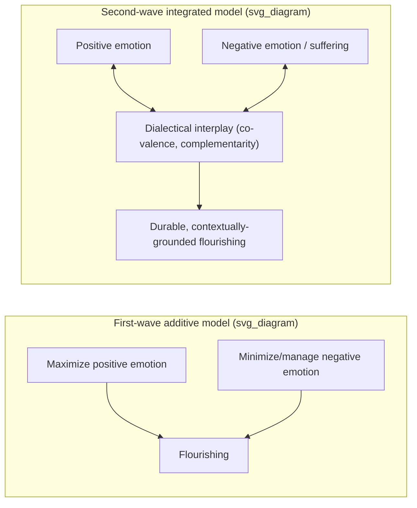

## Integrating Negative Emotions and Suffering into Flourishing Models

### Definition and Core Concept

Integrating negative emotions and suffering into flourishing models refers to the theoretical and applied project, central to second-wave positive psychology, of treating negative affect, distress, and adversity not as obstacles external to wellbeing but as functionally significant, sometimes necessary, components of a fuller model of human flourishing. This stands in contrast to earlier framings of flourishing that emphasized the cultivation and maximization of positive emotion, engagement, relationships, meaning, and accomplishment (e.g., Seligman's PERMA model) with comparatively less theoretical attention to the constitutive role of negative states.

This topic draws together several threads already introduced in this chapter — Wong's PP 2.0 thesis that suffering is necessary for flourishing, and Lomas and Ivtzan's dialectical principles of co-valence and complementarity — and extends them into specific flourishing models, functional theories of negative emotion, and applied/clinical integration strategies.

### Theoretical Rationale for Integration

**Key Points:**

- **Functional theories of emotion** hold that negative emotions evolved because they serve adaptive functions (e.g., fear promotes threat avoidance, sadness promotes social support-seeking and withdrawal from unproductive effort, guilt promotes relationship repair) — under this view, a flourishing model that treats all negative emotion as dysfunction misdescribes normal, adaptive psychological functioning.
- **The co-valence principle** (Lomas & Ivtzan) holds that many phenomena central to flourishing, such as love, inherently combine positive and negative elements, meaning a model of flourishing that only tracks positive valence will systematically mischaracterize such phenomena.
- **The complementarity principle** goes further, positing that the negative elements of a co-valenced phenomenon are not incidental but co-creating — structurally necessary to the phenomenon's positive aspects, not separable from them.
- **Wong's PP 2.0 thesis** makes the strongest claim in this space: that suffering is necessary for flourishing, and that enduring happiness and wellbeing can only be achieved through the dialectical integration of opposites, illustrated by the piano-keyboard metaphor in which both black and white keys are required to produce music.
- Critics of a purely positivity-maximizing model have also pointed out that the positive is not always beneficial — for instance, excessive happiness can be counterproductive, happiness is not universally appropriate, and its pursuit can paradoxically decrease happiness — which motivates integration on the negative side of the ledger for the opposite reason: unconstrained pursuit of positive affect can itself be maladaptive.

### Mechanisms by Which Suffering Contributes to Flourishing

**Key Points:**

- **Meaning-making through adversity** — Consistent with Wong's Meaning Therapy and existential positive psychology, confronting rather than avoiding suffering (mortality, loss, meaninglessness) with existential courage is framed as a precondition for durable, rather than fragile, flourishing.
- **Post-traumatic growth (PTG)** — A body of research (distinct from resilience, which concerns return to baseline functioning) documents that some individuals report positive psychological change — in areas such as relating to others, new possibilities, personal strength, spiritual change, and appreciation of life — as a result of struggling with highly challenging life circumstances, not merely despite them. Post-traumatic growth and love have both been described as "co-valenced" phenomena, involving intricate interplays of positive and negative aspects.
- **Motivational function of negative emotion** — Contemporary second-wave commentary notes that negative approaches like anger can serve as a useful motivator, and that gratitude — an ostensibly positive state — can induce guilt, illustrating bidirectional crossover between valence categories rather than a clean positive/negative separation.
- **Emotional granularity and appropriate affect** — The appraisal principle implies that negative emotions are not simply tolerable but can be *appropriate and adaptive* responses to genuine threats or losses; forcing a positive reframe onto a situation that calls for grief, anger, or fear can itself be a maladaptive response, since pro-social emotions like forgiveness can be harmful if it means one tolerates a situation that one might otherwise resist.

### Illustration: From Additive to Integrated Flourishing Models

### Contrast with First-Wave Flourishing Models

**Key Points:**

- First-wave models (e.g., PERMA: Positive emotion, Engagement, Relationships, Meaning, Accomplishment) are not rejected outright by second-wave theorists but are viewed as incomplete without dialectical qualification — the components remain valid targets, but each must be understood as potentially co-valenced or context-dependent rather than uniformly positive.
- The recognition that wellbeing is not coterminous with constructs like "happiness" is a key second-wave move: wellbeing becomes a more expansive term, one that includes negative emotions if these serve some broader sense of "being/doing well" — for instance, prudent anxiety could subserve a larger goal of successful performance across the life course integrating physical, cognitive, and social-emotional function (drawing on Pollard and Davidson's definition of wellbeing).
- This reframing directly displaces a simple valence-based definition of flourishing (more positive affect = more flourishing) with a functional definition (affect, whatever its valence, that serves adaptive life functioning = flourishing-relevant).

### Applied and Clinical Integration Strategies

**Key Points:**

- **Meaning-Centered Counselling / Meaning Therapy (Wong)** — Rather than treating symptom or negative-affect reduction as the therapeutic endpoint, this approach works with clients to construct sustainable meaning through and alongside suffering, explicitly rejecting the idea that flourishing requires suffering's absence.
- **Structured resilience-through-emotion programs** — Applied models such as the D.R.E.A.M. program (developing resilience through emotions, attitudes, and meaning) operationalize second-wave principles into intervention design, working directly with emotional material (including negative affect) rather than around it.
- **Self-compassion frameworks** — Approaches that explicitly frame "embracing suffering with kindness" (rather than avoiding or suppressing it) as a wellbeing-promoting stance are cited within the second-wave literature as consonant with this integrative project.
- **Mindfulness-based integration** — Contemplative approaches (with roots partly in Buddhist psychology, discussed in relation to second-wave positive psychology's Taoist and existentialist influences) emphasize non-judgmental awareness of both positive and negative internal states rather than selective attention toward positive states alone, operationalizing the appraisal and co-valence principles in a practice-based form.

### Example

**Example:**

A grief researcher studying bereaved spouses finds that those who report the most "successful" long-term adaptation are not those who suppressed grief fastest or reported the least negative affect, but those who integrated grief-related meaning-making (e.g., continued bonds with the deceased, reconstructed life narratives) alongside gradually returning positive affect. Under a first-wave, positivity-maximizing model, persistent grief responses might be coded simply as poor adjustment. Under a second-wave, integrative model, the co-presence of grief and renewed meaning is read as an instance of complementarity: the depth of the loss and the depth of the meaning constructed from it are treated as mutually constitutive rather than as competing outcomes to be traded off. [Inference: this is an illustrative synthesis consistent with the theoretical principles described (co-valence, complementarity, meaning-making through adversity) rather than a report of a specific named study's findings.]

### Boundary Conditions and Cautions

**Key Points:**

- Integration of suffering into flourishing models is not equivalent to romanticizing or mandating suffering; the literature is careful to distinguish between suffering that is dialectically integrated into a meaning-making process and suffering that is simply harmful, unprocessed, or clinically significant distress requiring standard treatment (e.g., major depressive disorder, PTSD) — the framework does not imply withholding conventional clinical care in favor of "meaning-making."
- The appraisal principle cuts both ways: just as ostensibly negative emotions can serve adaptive functions, ostensibly positive framings of suffering (e.g., insisting a client find growth in trauma) can be harmful if imposed without regard to context, individual readiness, or the severity of the adversity — premature or coercive "growth" narratives are a recognized risk in post-traumatic growth research and practice. [Inference: this caution reflects a broader, well-documented concern in the post-traumatic growth literature about distinguishing genuine growth from socially-desirable self-presentation or premature closure, rather than a claim drawn directly from the specific second-wave sources cited above.]
- As with other second-wave and PP 2.0 constructs, much of the theoretical case for integration rests on conceptual argument, philosophical grounding (existentialism, Taoism, dialectical reasoning), and qualitative/clinical observation rather than large-scale experimental designs, meaning the *strength* (versus the plausibility) of claims like "suffering is necessary for flourishing" remains harder to establish with the same evidentiary rigor as, for example, discrete positive-emotion intervention effect sizes. [Inference: general methodological observation about relative empirical maturity, consistent with the theoretical/philosophical framing evident in the cited PP 2.0 and SWPP sources.]

### Related Topics

- Paul Wong's PP 2.0 and existential positive psychology
- The dialectical principles: appraisal, co-valence, complementarity, evolution
- Post-traumatic growth and adversarial growth models
- PERMA model and first-wave flourishing frameworks
- Self-compassion and mindfulness-based approaches to suffering
- Meaning-Centered Counselling and Meaning Therapy
- Functional theories of emotion (adaptive roles of fear, sadness, anger, guilt)
- Distinguishing correlational claims from causal claims about happiness (evidentiary contrast)