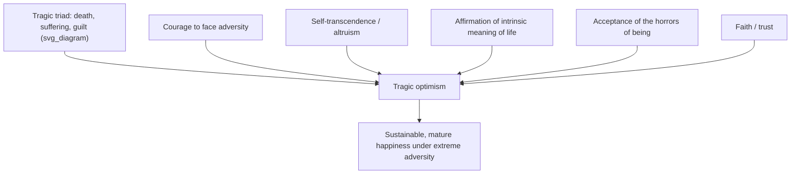

## Self-Transcendence and Meaning Under Adverse Conditions

### Definition and Core Concept

Self-transcendence and meaning under adverse conditions refers to the theoretical claim, central to Paul Wong's existential positive psychology (PP2.0), that suffering triggers the search for meaning, or self-transcendence, which in turn functions as a buffer against the adverse effects of suffering. Self-transcendence here denotes moving beyond narrow self-interest toward something larger — service to others, values, faith, or purpose — as the mechanism through which adversity is metabolized into meaning rather than simply endured or avoided.

This concept operationalizes the broader PP2.0 thesis (covered earlier in this chapter) that suffering is necessary for flourishing, moving it from a general philosophical claim into a specific, partially measurable psychological construct with associated theory (tragic optimism), an operationalized model, and validated assessment instruments.

### Theoretical Origins: Frankl's Logotherapy and the Tragic Triad

**Key Points:**

- The construct is rooted in Viktor Frankl's logotherapy. Frankl believed that the three basic tenets of logotherapy — freedom of will, will to meaning, and meaning of life, also called the Light Triad — could overcome the **tragic triad** of death, suffering, and guilt, thus maintaining optimism in the darkest hours.
- Frankl was able to endure unimaginable suffering and the prospect of the gas chamber at the Nazi death camps because he accepted the horrors of living and a tragic sense of life, but still affirmed the intrinsic meaning and values of life and had faith in transforming trauma into human achievement through the meaning of self-transcendence.
- Wong's foundational conference presentation extending this framework laid the groundwork for what later became known as existential positive psychology, or second-wave positive psychology (PP2.0).

### Tragic Optimism (TO): The Five-Component Model

Wong (2009) conceptualized and operationalized Frankl's concept of tragic optimism (TO) into five interlocking components:

**Key Points:**

1. **Courage to face adversity**
2. **Self-transcendence (altruism) in serving others**
3. **Affirmation of the intrinsic meaning and value of life**
4. **Acceptance of the horrors of being**
5. **Faith or trust** (in a larger order, purpose, or possibility of transformation, even absent evidence)

**Key rationale for departing from mainstream optimism models:** According to Wong, none of the models of optimism developed by American psychologists is applicable to prolonged traumas like the Holocaust, because they are based on a positivity bias toward overestimating an individual's agency or unrealistic expectations that good things will happen. He proposed that only a faith-based tragic optimism can sustain an individual's hope in situations beyond human control.

### Illustration of the Tragic Optimism Model

### The Yin-Yang / Dual-Systems Framework

**Key Points:**

- Wong situates self-transcendence within a broader dialectical structure drawn from the ancient Yin-Yang dialectic, or the contemporary dual-systems model, which provides a blueprint for navigating between opposite forces, such as good and evil, and self and other, prevalent in life.
- To succeed in life or achieve wellbeing, one needs to find the right balance between Yin and Yang; PP2.0 represents the complete circle or the wholeness of wellbeing in which Yin and Yang co-exist in optimal balance and harmony, as shown in the Yin-Yang symbol.
- This connects directly to the dialectical principles (appraisal, co-valence, complementarity, evolution) covered earlier in this chapter: self-transcendence is the applied, existential-level instantiation of complementarity — suffering (Yin) and meaning/joy (Yang) are treated as co-creating rather than opposed.

### Mechanism: Suffering as Trigger for Meaning-Seeking

**Key Points:**

- The central mechanistic claim is that suffering triggers the search for meaning, or self-transcendence, which in turn functions as a buffer against the adverse effects of suffering — positioning meaning-seeking as a mediating psychological process between adversity exposure and outcome.
- PP2.0 posits that the development of a resilient mindset and the cultivation of inner resources represent a proactive way of coping with trauma, leading to true grit and resilience — distinguishing this from passive endurance or denial-based coping.
- This approach involves a more realistic and existential way of viewing the world as full of suffering, but also full of overcoming; the framework's stated position is that all the good things people value and cherish are on the other side of suffering, such that a resilient mindset to embrace sacrifice and go through the gates of fear and suffering is necessary to fulfill one's aspirations.
- Suffering is framed as pedagogically productive: suffering teaches life intelligence and calm-based mature happiness as an antidote to a shallow view of life.
- Suffering can increase resilience by deepening character strengths and broadening capacity to cope — an explicit steeling/inoculation-type claim about adversity's functional role.

### The Ethical/Agentic Dimension: Choosing Response to Adversity

**Key Points:**

- Wong's framework emphasizes universal applicability alongside individual agency in response: it does not matter whether one lives a privileged and luxurious life or a life of poverty or traumatic stress — everyone has the capability to react to adversity with self-transcendence or with anger and despair.
- This is framed as a responsibility to choose: people have the responsibility to choose to become better or bitter in a traumatic situation, which the framework offers as the explanation for why not all people experience post-traumatic growth despite facing comparable adversity.

### Empirical Operationalization: Measurement Instruments

**Key Points:**

- **Life Attitudes Scale — Brief version (LAS-B):** developed and psychometrically validated as a measure of tragic optimism, used specifically as a buffer construct against COVID-19-related suffering in empirical studies.
- **Self-Transcendence Measure — Brief version (STM-B):** has shown good psychometric properties and has demonstrated positive associations with psychological wellbeing, meaning in life, gratitude, hope, and optimism, and negative associations with depression, anxiety, stress, and loneliness. The STM-B can be used as a tool to measure and promote self-transcendence as a buffer against COVID-19 suffering.
- These instruments mark a methodological bridge between PP2.0's largely philosophical/existential framing and standard quantitative positive-psychology measurement practice, allowing self-transcendence and tragic optimism to be studied with correlational and moderation designs.

### The Meaning Mindset

**Key Points:**

- Wong introduced the meaning dimension as a necessary spiritual orientation for the good life of virtue, happiness, and meaning, arguing for a meaning mindset representing a fundamental perspective change from a success orientation to a meaning orientation, framed as the cognitive aspect of self-transcendence.
- A meaning mindset facilitates the discovery of meaning in all situations, especially in times of crisis and adversity — positioning it as a trainable cognitive orientation rather than a fixed trait, with implications for intervention design (echoing the developmental-specificity and process-based reframing of psychological constructs discussed elsewhere in this course).

### Empirical Illustration: COVID-19 Research Program

**Example:**

A Frontiers special issue on COVID-19 and Existential Positive Psychology examined self-transcendence empirically during the pandemic. One study found that the degree and change in food insecurity over time were positively associated with both anxiety and depression symptoms, whereas the degree and change in optimism were negatively correlated; optimism was found to moderate the association between food insecurity and anxiety symptoms over time, but not the association with depression symptoms, with a subgroup analysis revealing that this moderation effect held for women but not men, and for married/coupled individuals but not singles. This illustrates an applied, quantitative test of the broader self-transcendence/tragic-optimism thesis: a meaning/optimism-related construct functioning as a statistical buffer against an objective adversity exposure, with population-specific boundary conditions. [Note: this is a single study's subgroup findings and should not be generalized beyond its sample and adversity context without further replication.]

### Applied Extension: Self-Transcendence Model of Servant Leadership

**Key Points:**

- Wong has extended the self-transcendence model beyond individual coping into organizational contexts, proposing that self-transcendence is the core of existential positive psychology and is needed for implementing servant leadership, integrating servant-leadership literature under this existential framework.
- This model frames the best possible leadership in turbulent times as a visionary, competent leader who serves others with the combined power of faith and sacrificial love, illustrating how the individual-level construct is theorized to scale to interpersonal and institutional levels (relevant given the framework's broader claims about institutional-level suffering, e.g., pandemic-driven strain on medical and government systems).

### Practical Principles ("Seven Principles of Self-Transcendence")

**Key Points:**

- Wong's applied writing on self-transcendence includes practical guidance such as gratitude for everything in life, including the lessons from suffering — meaning not just grudging acceptance of reality, but gratitude for painful-but-beneficial experience as well as for the gift of life itself.
- Hope is likened to oxygen — necessary to move forward — but under conditions that seem hopeless from a purely human standpoint, the framework calls for tragic optimism specifically, requiring faith as confidence in what is hoped for and assurance about what is not yet seen.

### Critical Considerations

**Key Points:**

- The explicit incorporation of faith and religious/spiritual constructs (e.g., citing Hebrews 11:1) situates this framework partly outside secular positive psychology's typical evidentiary and construct base, which is a deliberate feature of Wong's existential-spiritual integration but is worth flagging when comparing evidentiary standards or applicability across belief systems and cultural-secular contexts.
- The claim "not all people experience post-traumatic growth" because of a choice to "become better or bitter" risks an attributional framing similar to the static-trait critique discussed earlier in this course (Luthar): if outcome differences after trauma are attributed primarily to individual choice, this could understate the role of contextual, structural, and resource-based determinants of post-traumatic outcomes (e.g., social support availability, material resources, prior trauma history) — a tension worth holding alongside the framework's own emphasis on universal applicability regardless of circumstance. [Inference: this is an analytical observation connecting this topic to the developmental-specificity/process critique covered earlier in the course, not a claim made explicitly in the Wong-authored sources cited.]
- As with other PP2.0 constructs, while specific instruments (STM-B, LAS-B) provide quantitative operationalization, the broader existential claims (suffering as *necessary* for flourishing, self-transcendence as a universal buffering capacity) remain difficult to test via randomized designs, given the ethical and practical impossibility of experimentally assigning adversity; most supporting evidence is correlational, cross-sectional, or drawn from real-world adversity exposure (e.g., the pandemic), which bears directly on the correlational-versus-causal distinction covered earlier in this course.

### Related Topics

- Paul Wong's PP 2.0 and existential positive psychology
- The dialectical principles: appraisal, co-valence, complementarity, evolution
- Integrating negative emotions and suffering into flourishing models
- Post-traumatic growth and adversarial growth models
- Frankl's logotherapy and the Light Triad (freedom of will, will to meaning, meaning of life)
- Distinguishing correlational claims from causal claims about happiness
- Meaning-Centered Counselling and Meaning Therapy
- Servant leadership and organizational applications of existential positive psychology