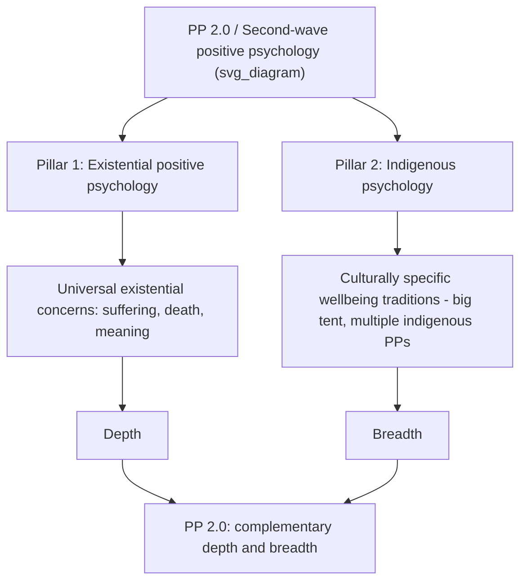

## Indigenous Psychology as a Pillar of Second-Wave Thought

### Definition and Core Concept

Indigenous psychology is one of the two foundational pillars of Paul Wong's second-wave positive psychology (PP 2.0), standing alongside existential positive psychology. Second wave positive psychology (PP 2.0), consisting of two pillars — existential positive psychology and indigenous psychology — emerges as a complement to the limitations of positive psychology as championed by Martin Seligman. Where existential positive psychology supplies PP 2.0's depth (confronting universal existential concerns such as suffering, death, and meaning), indigenous psychology supplies its breadth: attention to the culturally specific, non-Western ways wellbeing is conceived, experienced, and pursued.

PP 2.0 emphasizes the existential universal on one hand, and indigenous cultural expression on the other hand — the two pillars are explicitly framed as complementary rather than competing orientations within the same paradigm.

### Rationale: Why Indigenous Psychology Is Necessary

**Key Points:**

- PP 2.0, as conceptualized by Wong (2011), proposes that the most promising strategy to accomplish the mission of positive psychology is to confront the dark side of human existence *and* understand the unique experience and expression of wellbeing in different cultures — indigenous psychology is thus positioned as equally necessary to, not merely supplementary to, the existential pillar.
- Wellbeing may be shaped by cultural differences, and PP 2.0 explicitly values contributions from indigenous psychology on this basis.
- One of the four core principles and practices introduced by PP2.0 is explicitly framed as learning from indigenous psychology, such as the ancient wisdom of finding deep joy in bad situations — situating indigenous, non-Western wisdom traditions as a direct source of psychological insight, not merely an object of cross-cultural study.
- This pillar directly addresses a documented empirical failure mode of first-wave interventions: some empirical evidence supported the notion that brief happiness-inducing positive psychology strategies performed poorly for people who seemed to have the greatest need — suggesting that PP 1.0's largely Western-derived intervention toolkit does not transfer uniformly across populations or circumstances of need.

### Theoretical and Cultural Sources

**Key Points:**

- Indigenous psychology as a pillar draws on and formally incorporates the dialectical principles of Chinese psychology, alongside a bio-behavioral dual-system model of adaptation and cross-cultural positive psychology more broadly.
- The Yin-Yang symbol, discussed in relation to self-transcendence and tragic optimism earlier in this chapter, is itself drawn from this indigenous-Chinese philosophical tradition and functions as PP 2.0's core visual/conceptual emblem, replacing the "positivity smiley face" often associated with PP 1.0.
- Wong's own scholarly grounding for this pillar includes references such as Chang, Downey, Hirsch, and Lin (2016) and his own prior work (Wong, 2013, 2016b), alongside comparative work such as Chang (1996) on cultural differences in optimism, pessimism, and coping between Asian American and Caucasian American college students — used as an empirical anchor for the claim that wellbeing-relevant processes are culturally variable rather than uniform.

### The "Big Tent" Structure: Multiple Indigenous Positive Psychologies

**Key Points:**

- Rather than proposing a single alternative (non-Western) model to replace the Western one, PP 2.0 provides a big tent that allows for multiple indigenous positive psychologies — the pillar is pluralistic by design, accommodating distinct culturally embedded wellbeing traditions (e.g., Chinese, other Asian, and potentially other non-Western frameworks) rather than substituting one universalism for another.
- This produces a much broader list of variables that contribute to wellbeing and flourishing than a Western-only model would generate, directly expanding PP 2.0's empirical and conceptual scope relative to PP 1.0.
- Structurally, this pluralism is the disciplinary analogue of the "second-wave" dialectical move discussed earlier in this chapter: rather than a single synthesis displacing all prior frameworks, indigenous psychology is folded into PP 2.0 as one of potentially many parallel, mutually informing traditions.

### Illustration of the Two-Pillar Structure

### Methodological Implications: Beyond Positivist Quantification

**Key Points:**

- A distinctive methodological consequence of incorporating indigenous psychology is that PP 2.0 no longer only focuses on quantitative research grounded in the epistemology of positivism.
- Instead, it favours a humble science that values qualitative research and valuable knowledge from the humanities, such as philosophy, literature, and religion — explicitly widening the acceptable evidentiary base beyond the experimental/psychometric tradition dominant in PP 1.0.
- This methodological pluralism is presented as a strength rather than a dilution of rigor: PP 2.0 incorporates both more recent research findings and criticisms of PP 1.0 from both within and outside the PP community, making it capable of accounting for a larger database of empirical research and generating new research and interventions.

### Relationship to Broader Second-Wave Themes in This Chapter

**Key Points:**

- Indigenous psychology's inclusion is one of the concrete mechanisms by which PP 2.0 operationalizes the dialectic-over-dichotomy principle discussed earlier in this chapter: PP 2.0 recognizes that it is scientifically and experientially indefensible to only focus on positive emotions, positive traits, and positive institutions, since positives and negatives are related in a dynamic manner — and that dynamic relationship is itself understood differently across cultural traditions (e.g., Yin-Yang complementarity versus a Western light/dark opposition).
- If the smiley face symbolizes PP 1.0, the Yin-Yang symbol represents PP 2.0 — a symbolic encapsulation of how the indigenous-psychology pillar reshapes the field's core representational metaphor, not just its content.
- Wong frames the overall justification for PP 2.0's dual-pillar structure in strong terms: PP 2.0 is necessary because neither positive psychology nor humanistic-existential psychology can adequately understand such complex human phenomena as meaning, virtue, and happiness on their own; such deep knowledge can only be achieved by an integrative and collaborative endeavor — with indigenous psychology supplying part of that necessary integration.

### Direct Connection to WEIRD-Sample Generalizability Concerns

**Key Points:**

- This pillar functions as PP 2.0's direct theoretical response to the WEIRD-sample generalizability problem discussed earlier in this course: rather than treating non-Western findings as a peripheral "cross-cultural" subfield correcting a Western-derived core, indigenous psychology is architecturally embedded as one of PP 2.0's two co-equal foundational pillars.
- This reframing shifts the field's default assumption: instead of asking "does this Western-derived construct generalize to other cultures," the indigenous-psychology pillar asks what wellbeing-relevant constructs and practices *originate* within specific cultural traditions on their own terms, only secondarily asking how these might integrate with or complement Western constructs.

### Example

**Example:**

A first-wave (PP 1.0) positive psychology intervention might introduce a Western-derived gratitude-journaling protocol into a community with a strong collectivist, ancestor-honoring cultural tradition and assess success purely by change scores on an individually-oriented life-satisfaction scale. An indigenous-psychology-informed approach under PP 2.0, by contrast, would first ask what culturally embedded practices and concepts of "the good life" or "deep joy in adversity" already exist within that tradition (echoing the stated PP2.0 principle of learning from indigenous psychology, such as the ancient wisdom of finding deep joy in bad situations), and would favor qualitative and philosophically-informed inquiry into those existing frameworks over immediately importing and measuring a Western intervention protocol.

### Critical Considerations

**Key Points:**

- The "big tent" pluralism that is indigenous psychology's core strength (accommodating multiple culturally specific traditions) also creates a coherence challenge: a framework aiming to synthesize Chinese Yin-Yang dialectics, Western existentialism, Taoism, and potentially other traditions risks producing a loosely integrated collection of frameworks rather than a single, empirically unified theory — a tension inherent to "big tent" approaches generally. [Inference: this is a general structural observation about pluralistic theoretical frameworks, not a critique stated explicitly in the cited sources.]
- The explicit move away from exclusively positivist, quantitative methodology toward qualitative research and humanities-derived knowledge (philosophy, literature, religion) represents a significant departure from mainstream psychology's dominant methodological norms, which may affect how findings framed under this pillar are received, evaluated, or integrated by researchers trained primarily in the quantitative experimental tradition. [Inference: general methodological observation, not a claim made explicitly by the cited sources.]
- As with the existential pillar, most illustrative examples of "indigenous psychology" contributions in the literature reviewed here draw predominantly on Chinese and broader Asian philosophical traditions (Yin-Yang, Chang's Asian American/Caucasian American comparative work); the framework's stated aspiration toward a "big tent" of multiple indigenous positive psychologies is broader than the specific traditions most prominently illustrated in the available sources. [Unverified: the full breadth of cultural traditions actively incorporated under this pillar across Wong's wider body of work is not established by the sources reviewed here.]

### Related Topics

- Paul Wong's PP 2.0 and existential positive psychology
- The dialectical principles: appraisal, co-valence, complementarity, evolution
- Self-transcendence and meaning under adverse conditions
- WEIRD samples and generalizability concerns
- Cross-cultural psychology and emic/etic methodology
- Chinese Yin-Yang dialectics and the bio-behavioral dual-systems model of adaptation
- Qualitative and humanities-informed methods in wellbeing research
- Cultural variation in optimism, coping, and subjective wellbeing (Chang, 1996)