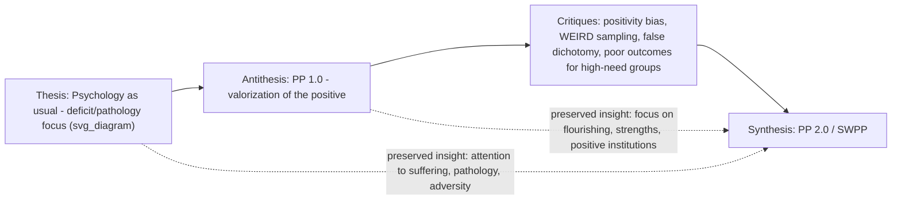

## Reconciling First-Wave and Second-Wave Positive Psychology

### Definition and Core Concept

Reconciling first-wave and second-wave positive psychology refers to the theoretical project of integrating the original, Seligman-era positive psychology (PP 1.0) — characterized by valorization of the positive and a focus on positive emotions, positive traits, and positive institutions — with the critiques and expansions introduced by second-wave positive psychology (SWPP/PP 2.0), without treating the two as mutually exclusive or requiring the wholesale rejection of either. This reconciliation is not merely an academic courtesy; it is built into the second wave's own self-understanding via the principle of evolution (Lomas & Ivtzan), which frames SWPP as a dialectical *synthesis* rather than a replacement.

### The Dialectical Framing: Synthesis, Not Rejection

**Key Points:**

- SWPP itself was seen as the manifestation of the fourth dialectical principle, evolution, in that it is a synthesis, emerging from the interaction of "psychology as usual" (the thesis) and positive psychology (the antithesis).
- Crucially, the move from thesis-antithesis to synthesis does not necessarily mean an abandonment of positive psychology, a reversion back to the original thesis. Rather, the next stage in this process is ideally synthesis, in which the truths of both thesis and antithesis are preserved, while their flaws are overcome.
- This second wave is still very much positive psychology: its overarching concern remains with "positive" meta-constructs and goals such as flourishing and wellbeing — it simply acknowledges that the routes towards these can be complicated, and sometimes lead through "darker" realms of human experience.
- Consistent with this, Wong's PP 2.0 is explicitly described as an umbrella term for a more nuanced and more balanced approach to positive psychology, not a rival discipline positioned against positive psychology.

### Illustration of the Reconciliation Structure

### What First-Wave Positive Psychology Contributes That Is Preserved

**Key Points:**

- The overarching *goals* of PP 1.0 — flourishing, wellbeing, positive emotion, engagement, meaning, relationships, accomplishment — remain the shared target of both waves; SWPP does not propose new terminal goals so much as a more complex account of the paths toward them.
- The empirical and applied momentum PP 1.0 generated — establishing wellbeing as a legitimate, dedicated field of scientific study distinct from a purely pathology-focused psychology-as-usual — is treated as foundational infrastructure that SWPP builds upon rather than discards; PP 1.0 created the conceptual space where previously disparate topics united by their "family resemblance" (à la Wittgenstein) to wellbeing could be brought together and considered collectively, as a novel branch of scholarship focused specifically and entirely on the science and practice of improving wellbeing.
- Standard PP 1.0 constructs (e.g., character strengths, positive emotion research, PERMA-style flourishing models) remain valid components within PP 2.0's broader model — they are recontextualized as one part of a more complex, dialectically-balanced picture, not eliminated.

### What Second-Wave Critique Adds and Corrects

**Key Points:**

- **Correcting the false dichotomy** — Researchers and practitioners cannot create a false dichotomy of positive vs. negative; the second wave's evolution into a more dialectical stance highlighted the need to move beyond simple dichotomies between positive and negative and incorporate complexity.
- **Correcting positivity-maximization overreach** — The positive is not always beneficial: excessive happiness can be counterproductive, happiness is not universally appropriate, and its pursuit can paradoxically decrease happiness; some positive states may lead to negative outcomes (e.g., gratitude inducing guilt), while negative approaches like anger can serve as a useful motivator.
- **Correcting outcome and equity gaps** — Some empirical evidence supported the notion that brief happiness-inducing positive psychology strategies performed poorly for people who seemed to have the greatest need, directly motivating both the existential pillar's engagement with suffering and the indigenous-psychology pillar's engagement with cultural variability.
- **Correcting cultural specificity** — Positive psychology's conceptualizations of wellbeing have been criticized as culturally specific, reflecting the North American context in which the field emerged, since concepts have largely been derived from research with WEIRD participants while the field has often tended to presume these findings can be generalized to other cultures; indigenous psychology (as a PP 2.0 pillar) is the corrective response.
- **Correcting methodological narrowness** — PP 2.0 no longer only focuses on quantitative research grounded in the epistemology of positivism, but favours a humble science that also values qualitative research and knowledge from philosophy, literature, and religion.

### The Formal Basis Offered by Wong for Necessary Integration

**Key Points:**

- Wong frames the reconciliation as more than additive convenience: PP 2.0 is necessary because neither positive psychology nor humanistic-existential psychology can adequately understand such complex human phenomena as meaning, virtue, and happiness on their own — such deep knowledge can only be achieved by an integrative and collaborative endeavor.
- Wong's specific principles and practices for PP 2.0 are themselves framed as additions to, not replacements of, first-wave concerns: (1) accepting and confronting with courage the reality that life is full of evil and suffering; (2) sustainable wellbeing can only be achieved through overcoming suffering and the dark side of life; (3) recognizing that everything in life comes in polarities and the importance of achieving an adaptive balance through dialectics; (4) learning from indigenous psychology, such as the ancient wisdom of finding deep joy in bad situations — each principle presupposes, rather than discards, the underlying first-wave concern with achieving wellbeing and flourishing.
- Wong has also called for an existential positive psychology built on a realistic presumption that all people face suffering, that suffering can be accepted, and that a willingness to face and transcend suffering is part of the foundation of a deep and stable form of wellbeing — explicitly making the second-wave contribution a foundation *for* wellbeing (a first-wave goal) rather than a competing goal.

### PP 2.0 as Scientific Progress Rather Than Rupture

**Key Points:**

- SWPP/PP 2.0 is explicitly framed in the literature as a maturing of PP that is more nuanced, balanced, and inclusive, and can be regarded as an inevitable or necessary scientific progress towards integration and a more general theory of PP — language that frames the relationship between waves as developmental continuity rather than paradigm rupture.
- This is consistent with an evolutionary (small "e") reading of Lomas and Ivtzan's principle of evolution: the field's dialectical self-correction is itself presented as a normal, expected feature of a maturing science, not evidence that the earlier stage was simply mistaken.

### Practical Reconciliation in Applied Work

**Key Points:**

- Applied programs illustrate integration directly, e.g., the D.R.E.A.M. program (developing resilience through emotions, attitudes, and meaning) is explicitly described as a second wave positive psychology approach used within a book collection on counselling psychology that also draws on first-wave-style structured, skills-based intervention design — showing first- and second-wave elements coexisting within a single applied program rather than segregated into rival camps.
- Clinically, Meaning Therapy (Wong) does not discard standard positive-psychology techniques (e.g., strengths identification, gratitude practices) but recontextualizes their use within a broader existential framework that also makes room for grief, fear, and confrontation with mortality — an applied instance of reconciliation rather than replacement.

### Example

**Example:**

A workplace wellbeing program initially designed under a first-wave model might train employees in gratitude journaling and strengths-spotting exercises, measuring success purely via increases in positive affect. A reconciled, second-wave-informed version retains these first-wave tools (they are not discarded) but adds: (a) appraisal-sensitivity — recognizing that forced positivity may be inappropriate during a period of organizational crisis or grief (e.g., layoffs, a colleague's death); (b) co-valence awareness — allowing employees to express legitimately mixed feelings about workplace changes rather than coding ambivalence as a program failure; and (c) space for meaning-making around genuine workplace hardship, consistent with the existential pillar. The program's ultimate goal — employee flourishing — is unchanged from the first-wave version; what changes is the theoretical sophistication and cultural/contextual sensitivity of the path taken to reach it.

### Points of Ongoing Tension

**Key Points:**

- Despite the stated reconciliatory intent, tension remains between PP 2.0's expanded methodological pluralism (qualitative research, humanities-derived knowledge, philosophy, religion) and PP 1.0's historically strong identity as an empirical, quantitative science; full reconciliation requires the field to develop shared standards for evaluating claims across these different evidentiary traditions, which is not a fully solved problem. [Inference: this is a structural observation about integrating divergent methodological traditions under one theoretical umbrella, not an explicit claim in the cited sources.]
- Some second-wave claims (e.g., "suffering is necessary for flourishing," under Wong's PP 2.0) are stronger and more specific than the general dialectical-balance claims associated with Lomas and Ivtzan's SWPP framework (co-valence, complementarity); reconciling first-wave positive psychology with these two different strands of "second wave" thought may itself require further internal reconciliation work, since Wong's existential/necessity claim and Lomas & Ivtzan's more general "complex balance" claim are not identical in strength. [Inference: this is an analytical distinction drawn from comparing the two second-wave sources covered earlier in this chapter, not a claim made explicitly by either author regarding the other's framework.]
- The equity-motivated critique (interventions performing poorly for those with the greatest need) points to a practical, not just theoretical, reconciliation task: applied programs must be redesigned, not merely reinterpreted, to address this gap — reconciliation at the level of theory does not automatically resolve reconciliation at the level of intervention design and delivery.

### Related Topics

- Paul Wong's PP 2.0 and existential positive psychology
- The dialectical principles: appraisal, co-valence, complementarity, evolution
- Integrating negative emotions and suffering into flourishing models
- Indigenous psychology as a pillar of second-wave thought
- Self-transcendence and meaning under adverse conditions
- PERMA model and first-wave flourishing frameworks
- WEIRD samples and generalizability concerns
- Publication bias and effect-size inflation in intervention research (relevant to evaluating "brief PPI" equity critique)