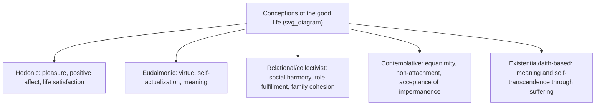

## Cross-Cultural Conceptions of Happiness and the Good Life

### Definition and Core Concept

Cross-cultural conceptions of happiness and the good life examine how the meaning, structure, and pursuit of wellbeing vary systematically across cultural, linguistic, and philosophical traditions, challenging the assumption — common in early positive psychology — that constructs like "happiness," "life satisfaction," or "flourishing" are culturally invariant. This topic sits at the intersection of the WEIRD-sample critique (covered earlier in this course) and the indigenous-psychology pillar of second-wave positive psychology, extending both into a broader comparative survey of how different societies conceptualize the good life.

### Individualist vs. Collectivist Frameworks of Wellbeing

**Key Points:**

- **Individualist conceptions** (dominant in Western, particularly North American, contexts) tend to define happiness and the good life around individual achievement, self-expression, personal autonomy, and internally experienced positive affect — a self-focused model consistent with the independent self-construal documented in cross-cultural psychology.
- **Collectivist conceptions** (more common across East Asian, South Asian, African, and Latin American contexts, among others) tend to define wellbeing more relationally — emphasizing social harmony, fulfillment of role obligations, family cohesion, and the wellbeing of the group as inseparable from individual wellbeing, consistent with an interdependent self-construal.
- This distinction directly parallels the resilience-as-individual-trait versus resilience-as-socio-ecological-process debate covered under Luthar's critique earlier in this course: happiness, like resilience, is contested between individual-internal and relational-contextual framings.
- Cultural differences in optimism, pessimism, and coping have been documented as predictors of subsequent adjustment when comparing groups such as Asian American and Caucasian American college students, providing empirical grounding for the claim that culturally-linked cognitive and coping styles shape wellbeing trajectories differently across groups.

### Philosophical and Religious Traditions Shaping Conceptions of the Good Life

**Key Points:**

- **Aristotelian eudaimonia** — A Western philosophical tradition defining the good life around virtue, the actualization of one's true nature or potential, and living in accordance with reason and excellence, rather than the mere experience of pleasant affect (hedonia). This tradition underlies the eudaimonic/hedonic distinction widely used in positive psychology's wellbeing measurement.
- **Confucian relational harmony** — A tradition centering the good life around fulfilling one's roles and obligations within a web of relationships (family, community, state), with individual flourishing understood as inseparable from, and partly derivative of, relational and social harmony.
- **Buddhist frameworks** — Traditions (drawn on explicitly within second-wave positive psychology's engagement with Taoism and mindfulness) that locate wellbeing in the reduction of attachment and craving, acceptance of impermanence, and the cultivation of equanimity, offering a model of the good life structurally distinct from both hedonic pleasure-maximization and eudaimonic self-actualization.
- **Ubuntu (Southern African relational personhood)** — A philosophical-ethical framework in which personhood and flourishing are constituted through relationship with others (captured in formulations such as "a person is a person through other persons"), presenting a model of wellbeing fundamentally structured around communal interdependence rather than individual psychological states.
- **Faith-based and existential frameworks** — As discussed under Wong's PP 2.0 and tragic optimism, some traditions locate the good life not in the absence of suffering but in meaning, faith, and self-transcendence achieved through and alongside suffering, a model that departs sharply from purely hedonic conceptions of happiness.

### Illustration of Divergent Conceptions of the Good Life

### Linguistic and Conceptual Untranslatability

**Key Points:**

- Many cultures possess wellbeing-related concepts that resist direct translation into English "happiness," which risks distorting the construct when cross-cultural research relies on translated Western instruments.
- This is a direct extension of the measurement-validity concerns discussed under WEIRD samples: instruments developed and validated in English with WEIRD populations may not have equivalent psychometric properties when translated and administered elsewhere, particularly when the target construct itself does not map cleanly onto the source-language concept.
- The emic/etic distinction (introduced under WEIRD-sample correctives) is directly applicable here: emic approaches would seek to identify a culture's own indigenous wellbeing vocabulary and conceptual structure first, before attempting any etic (cross-culturally comparable) measurement.

### Measurement and Methodological Implications

**Key Points:**

- **Differential item functioning and measurement invariance** — Even when a wellbeing scale is carefully translated, statistical testing (e.g., multi-group confirmatory factor analysis) is required to verify that the same underlying construct, with the same factor structure, is being measured across cultural groups before mean scores can be meaningfully compared.
- **Response style confounds** — Cross-cultural comparisons of self-reported happiness are vulnerable to systematic differences in acquiescence bias, extreme response style, and modesty/social-desirability norms, which can create apparent cross-cultural differences in reported happiness that do not reflect true differences in underlying wellbeing.
- **Individual-level versus aggregate national measures** — Widely cited cross-national happiness rankings (e.g., international wellbeing indices) aggregate individual self-reports into national scores; interpreting these comparisons requires caution given the response-style and construct-validity concerns above, particularly when comparing individualist and collectivist societies with different norms around self-report and self-presentation. [Inference: this is a methodological caution consistent with established measurement-invariance concerns in cross-cultural survey research generally, rather than a claim tied to a specific named index in the sources reviewed for this course.]

### Convergences Amid Divergence

**Key Points:**

- Despite conceptual variation, certain broad categories recur across many traditions in some form: social connection/relationship quality, a sense of meaning or purpose, physical and material security, and some form of positive affective experience appear, in varying configurations and relative weightings, across a wide range of cultural conceptions of the good life. [Inference: this is a general synthesis observation about recurring thematic categories across the traditions discussed above, rather than a specific empirical finding drawn from a cited source in this response.]
- What differs most sharply across traditions is not necessarily the presence or absence of these broad categories, but their relative weighting, the unit of analysis (individual versus relational/collective), and whether suffering and adversity are treated as external obstacles to the good life or as integral, even necessary, components of it (as in Wong's tragic optimism and existential positive psychology).

### Example

**Example:**

A life-satisfaction survey item such as "I am satisfied with my life" may be answered quite differently by a respondent from an individualist culture, who evaluates the item against personal achievement and internal affective state, compared to a respondent from a collectivist culture, who may implicitly evaluate the same item against family harmony and fulfillment of relational obligations — even though both respondents are answering the identical translated item. A raw cross-national comparison of mean scores on this item, without measurement-invariance testing, risks conflating genuine wellbeing differences with differences in what "life satisfaction" is understood to reference in each cultural context.

### Applied and Policy Implications

**Key Points:**

- National and international wellbeing policy initiatives that adopt a single, typically Western-derived, wellbeing framework risk imposing a culturally specific model of the good life onto populations whose own conceptions differ substantially — a policy-level instantiation of the WEIRD generalizability concern.
- Cross-cultural intervention design (e.g., adapting a positive psychology intervention for use outside its culture of origin) benefits from first establishing the target population's own conception of the good life (an emic starting point) before importing or adapting an existing protocol, consistent with the community-based participatory research approach discussed under WEIRD-sample correctives.
- This directly informs the applied rationale for PP 2.0's indigenous-psychology pillar: rather than assuming a Western-derived intervention protocol merely needs translation, it may need conceptual redesign around a fundamentally different model of what flourishing consists of.

### Related Topics

- WEIRD samples and generalizability concerns
- Indigenous psychology as a pillar of second-wave thought
- Hedonic vs. eudaimonic models of wellbeing
- Self-transcendence and meaning under adverse conditions
- Emic and etic approaches in cross-cultural psychology
- Measurement invariance and psychometric equivalence testing
- Ubuntu and relational personhood frameworks
- International wellbeing indices and national happiness rankings (methodological critique)