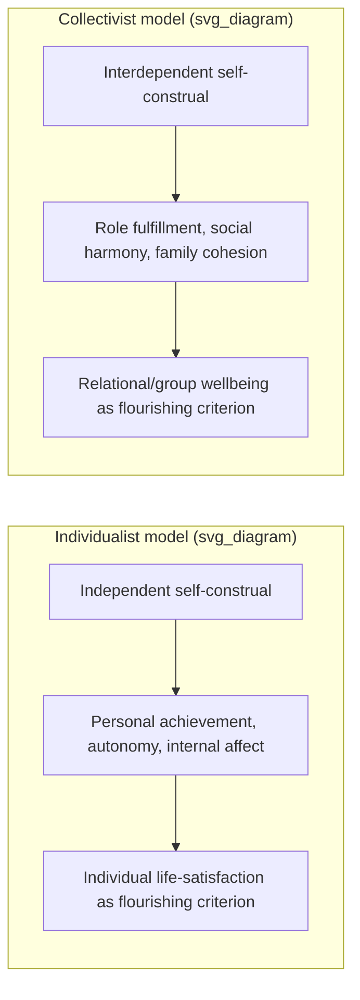

## Individualist versus Collectivist Models of Well-Being

### Definition and Core Concept

Individualist versus collectivist models of wellbeing describe two broad, empirically documented orientations toward the self and social relationships that shape how wellbeing is defined, experienced, pursued, and measured across cultures. This distinction, rooted in cross-cultural psychology (notably Hofstede's cultural dimensions and Markus and Kitayama's self-construal theory), provides the conceptual backbone for much of the cross-cultural happiness research introduced in the previous topic and for the indigenous-psychology pillar of second-wave positive psychology.

### The Independent versus Interdependent Self-Construal

**Key Points:**

- **Independent self-construal** (associated with individualist cultures, prototypically North American and Western European) conceives of the self as a bounded, autonomous entity whose defining attributes are internal — traits, preferences, abilities, and internally experienced emotions — relatively stable across social contexts and relationships.
- **Interdependent self-construal** (associated with collectivist cultures, prototypically East Asian, though also documented across South Asian, African, and Latin American contexts) conceives of the self as fundamentally relational — defined significantly through roles, relationships, and group memberships, with the self's boundaries and even its coherence understood as context-dependent and co-constituted with significant others.
- This self-construal distinction is the psychological mechanism underlying the individualist/collectivist wellbeing divide introduced under cross-cultural conceptions of happiness: how the self is structured shapes what counts as flourishing for that self.

### Individualist Models of Wellbeing

**Key Points:**

- Wellbeing is typically operationalized around personal achievement, autonomy, self-expression, and internally experienced positive affect — consistent with a self-focused model in which the individual's subjective evaluation of their own life is the primary criterion for flourishing.
- Standard positive psychology constructs originating largely from WEIRD (and specifically American) research contexts — life satisfaction scales, discrete positive-emotion measures, individual character-strengths inventories — reflect this individualist orientation in their item content and theoretical assumptions.
- Interventions consistent with this model (e.g., individually-focused gratitude journaling, personal best-possible-self exercises, individual strengths-spotting) target internal cognitive and affective processes within a single person, with success typically measured via that same individual's self-report.

### Collectivist Models of Wellbeing

**Key Points:**

- Wellbeing is defined more relationally — emphasizing social harmony, fulfillment of role obligations, family cohesion, and group wellbeing as inseparable from individual wellbeing, rather than as an external constraint upon individual flourishing.
- Under Confucian relational-harmony traditions (introduced under cross-cultural conceptions of the good life), individual flourishing is understood as inseparable from, and partly derivative of, relational and social harmony — the unit of flourishing is arguably the relationship or family system rather than the isolated individual.
- Under Ubuntu and related relational-personhood frameworks, personhood itself — not merely wellbeing — is constituted through relationship with others, making the very notion of an "individual's wellbeing" analytically inseparable from the wellbeing of their community.
- Interventions consistent with this model would logically emphasize relational and community-level processes (family functioning, role fulfillment, collective ritual and support systems) rather than purely intrapsychic change in a single individual, though the evidentiary base for such intervention adaptations depends on the specific applied research reviewed. [Inference: this intervention-design implication follows logically from the collectivist wellbeing framework described above, rather than being drawn from a specific intervention-outcome study cited in this response.]

### Illustration of the Two Models

### Empirical Evidence for Divergent Coping and Adjustment Patterns

**Key Points:**

- Cultural differences in optimism, pessimism, and coping have been documented as predictors of subsequent adjustment when comparing Asian American and Caucasian American college students, indicating that culturally-linked cognitive and coping styles are not merely stylistic variations but have measurable downstream consequences for adjustment outcomes.
- This finding directly informed Wong's rationale for the indigenous-psychology pillar of PP 2.0: wellbeing may be shaped by cultural differences, motivating PP 2.0's valuation of contributions from indigenous psychology rather than assuming a single universal coping or optimism model applies uniformly.

### Measurement Implications

**Key Points:**

- Self-report wellbeing instruments developed within an individualist framework (asking respondents to rate their own personal satisfaction, achievement, or positive affect) may not adequately capture a collectivist respondent's actual criteria for evaluating their own flourishing, since the instrument's item content presupposes an individualist definitional frame.
- Measurement invariance testing (introduced under WEIRD-sample correctives and cross-cultural happiness conceptions) is particularly critical when comparing individualist and collectivist populations, since these groups may differ not only in their level of wellbeing but in the very factor structure of what "wellbeing" comprises for them.
- Response-style confounds (acquiescence bias, modesty norms, social-desirability effects) have been documented to vary systematically between individualist and collectivist cultural contexts, creating a further layer of measurement complexity beyond construct-definition differences alone. [Inference: this is a well-established methodological caution in cross-cultural survey research generally, consistent with concerns raised earlier in this course regarding WEIRD-sample measurement validity, rather than a claim specific to a named study cited in this response.]

### Relevance to Resilience Research

**Key Points:**

- This individualist/collectivist distinction directly parallels, and substantiates, Luthar's critique of resilience as a static individual trait covered earlier in this course: a purely individualist model of resilience (internal coping capacity, personal grit) reflects an individualist wellbeing framework, while socio-ecological models of resilience (Ungar) reflect a more collectivist, relationally embedded framework in which resilience is a property of the person-environment-community system rather than the individual alone.
- This suggests that the trait-versus-process debate in resilience research and the individualist-versus-collectivist debate in wellbeing research are, at least partially, two applications of the same underlying theoretical tension: whether psychological flourishing (broadly construed) is best modeled as residing within the individual or as distributed across a relational and community system. [Inference: this is an analytical synthesis connecting two distinct literatures covered in this course, rather than a claim made explicitly in either literature.]

### Example

**Example:**

Consider two individuals recovering from a job loss. Under an individualist wellbeing model, successful adaptation might be assessed via that individual's personal self-esteem recovery, reemployment satisfaction, and internally experienced optimism. Under a collectivist wellbeing model, successful adaptation for a comparable individual might instead be assessed via the restoration of the individual's ability to fulfill family provider roles, the maintenance of social standing and harmony within their extended family or community network, and the community's collective support response — with the individual's personal affective state treated as one component embedded within, rather than separate from, this larger relational picture.

### Critical Considerations and Nuance

**Key Points:**

- The individualist/collectivist distinction, while empirically well-established at the level of population averages, should not be applied as a rigid binary to individuals: substantial within-culture heterogeneity exists, and many individuals and subcultures within nominally "individualist" or "collectivist" societies show mixed or context-dependent self-construal patterns. [Inference: this is a standard caution in cross-cultural psychology regarding ecological-to-individual-level inference, consistent with the broader critique of treating cultural categories as monolithic, rather than a claim drawn from a specific source cited in this response.]
- The distinction should be treated as a dimensional and probabilistic tendency at the population level rather than a deterministic classification of any given culture or person, consistent with the general caution against overgeneralizing correlational, group-level findings to fixed individual traits (paralleling the correlational-versus-causal and trait-versus-process cautions raised elsewhere in this course).
- As with other cross-cultural constructs discussed in this chapter, most of the applied intervention-design implications described here are logical extensions of the theoretical framework rather than confirmed by extensive experimental intervention research directly comparing individualist- and collectivist-tailored intervention designs; this remains, in part, a promising but still-developing area of applied cross-cultural positive psychology research. [Inference: general statement about the relative empirical maturity of this specific applied research area, not a claim drawn from a specific cited source.]

### Related Topics

- Cross-cultural conceptions of happiness and the good life
- Indigenous psychology as a pillar of second-wave thought
- Luthar's critique of resilience as a static trait and the call for developmental specificity
- Ungar's socio-ecological model of resilience
- Self-construal theory (Markus & Kitayama) and Hofstede's cultural dimensions
- WEIRD samples and generalizability concerns
- Measurement invariance and psychometric equivalence testing
- Confucian relational harmony and Ubuntu relational-personhood frameworks