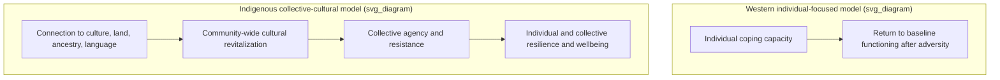
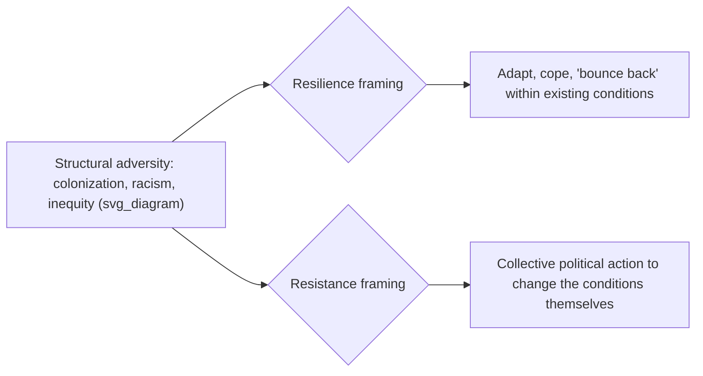

## Indigenous and Non-Western Resilience Frameworks

### Definition and Core Concept

Indigenous and non-Western resilience frameworks refer to conceptions of resilience developed by, with, or specifically for Indigenous and non-Western communities that depart from mainstream Western resilience theory in unit of analysis, protective mechanisms, and underlying political and historical assumptions. This topic extends the socio-ecological reframing of resilience (Luthar's critique, Ungar's model) into explicitly cultural and, in some formulations, political territory — asking not only whether resilience is a trait or a process, but *whose* definition of resilience, adversity, and a positive outcome is being applied, and to what end.

### The Core Critique: Uncritical Imposition of Western Constructs

**Key Points:**

- A central methodological challenge identified in this literature is that the central concept of resilience is rarely questioned in extant research: current understandings of resilience and adversity, largely framed in Western understandings, are unquestioningly accepted, reframed *for*, yet not *by*, Indigenous peoples, and then are unchallenged when imposed on Indigenous peoples.
- This is described as a form of cultural imposition: one of the challenges of this body of work is that the central concept of resilience is rarely questioned, and neither are other closely related concepts such as adversity and risk — these Western-framed definitions are unquestioningly accepted and imposed on Indigenous peoples.
- This critique is a direct extension of both the WEIRD-sample generalizability concern and Luthar's developmental-specificity critique covered earlier in this course, but adds an explicitly political and historical dimension not present in those more general methodological critiques.

### Collective and Community-Level Conceptions of Resilience

**Key Points:**

- Most Indigenous conceptions of resilience involve a collective focus, including community-wide cultural revitalization, activism, support, and group agency — attributes of resilience that remain underexplored, particularly in action-oriented health-promotion research.
- Resilience has been shown to look and operate differently across diverse socio-environmental and cultural contexts (Ungar, 2013), and in the case of Indigenous communities, traditional Indigenous culture — including identity and enculturation — is a frequently cited protective factor and stimulator of both individual and collective resilience.
- Indigenous communities have expressed resilience through stories and metaphors, often connecting wellbeing and resistance to history, healing, relationships with land, and cosmo-centric understandings of the self — a conception of resilience embedded in narrative, land, and cosmology rather than measured primarily through individual psychometric instruments.

### Illustration: Western Individual-Trait Model vs. Indigenous Collective-Cultural Model

### Australian Aboriginal Resilience Research

**Key Points:**

- A scoping review of Aboriginal resilience research, conducted in line with PRISMA-ScR guidelines and involving the participation of local Aboriginal Research Cultural Advisory Groups who participated in and approved the analysis and collaborated on the design and writing of the paper, found that eight publications drew on Aboriginal constructs of resilience in examining programs, processes, and practices to promote individual and/or collective resilience and wellbeing.
- Most studies emphasized the need for strategies to strengthen individual or community connection to culture to foster resilience; six studies used culturally validated strength-based tools to measure resilience, while two relied on Western constructs — indicating a partial but incomplete methodological shift toward culturally specific measurement in this body of work.
- The review's findings link adversity directly to historical and structural causes: many studies confirm adversity is linked to the enduring legacies of colonization, continuous and cumulative transgenerational grief and loss, structural inequities, racism, and discrimination — framing adversity itself as historically and politically specific rather than a generic risk-factor category.
- Correspondingly, protective factors identified as unique to Aboriginal populations include strengthening connection to culture (including language reclamation), community, ancestry, and land (including land management and economic development), which together contribute to individual and collective resilience.

### Māori and Aotearoa New Zealand Frameworks

**Key Points:**

- Research applying Ungar's social-ecological model within Aotearoa New Zealand describes resilience as the capacity of individuals, families, and communities to navigate their way to health-sustaining resources, extending the socio-ecological model into a specifically Māori research partnership context.
- A key methodological and ethical principle emerging from this research is that Indigenous communities can be supported to lead the design of research, own the data, and decide how widely and to whom to disseminate findings — echoing the community-based participatory research (CBPR) corrective introduced under WEIRD-sample methodology, and treated here as an ethical necessity rather than merely a best practice.
- A direct participant observation illustrates the individualist/collectivist tension discussed in the previous topic: one participant noted that "you can't pull individual happiness and whānau [family] happiness apart," illustrating some limits of Western therapeutic models that treat individual and family/collective wellbeing as separable constructs.
- This produces a direct practical tension for mental health service delivery: findings highlight tensions between individualistic therapeutic models and collective wellbeing, with direct implications for how resilience-oriented mental health services are structured and delivered in this context.

### Resistance as a Complement to (or Critique of) Resilience

A distinct and more explicitly political strand of Indigenous resilience scholarship, particularly within Māori scholarship, positions "resistance" as a necessary complement to, or corrective of, "resilience":

**Key Points:**

- This scholarship explores the development of Māori and Indigenous frameworks of resilience, considering the impact of engaging with largely state-led notions of resilience on Māori development, and highlights the closely linked notion of resistance, asserting the necessity of a firm political analysis from Indigenous researchers engaged in this discourse.
- The core critique is that resilience theories, by definition, assume an acceptance of responsibility for one's position as disadvantaged individuals — that is, by examining and developing theories and models of resilience, researchers and communities buy into the idea that "this is the way it is" and that individuals or communities need simply to get better at bouncing back and being resilient.
- Resistance, by contrast, represents an approach of collective fight-back, exposing the inequitable distribution of power and actively opposing negative social, political, and economic influences — reframing the appropriate response to structural adversity as political and collective action rather than individual or even community-level adaptation to an unchanged status quo.
- This critique substantially extends and sharpens Luthar's static-trait critique: where Luthar's critique targets the individual-blame implication of trait models, the resistance critique targets a further layer — that even *process* or *socio-ecological* resilience models can function to naturalize and depoliticize structural injustice by locating the appropriate response in adaptation rather than in challenging the conditions that produce the adversity in the first place.

### Illustration of the Resilience-Resistance Distinction

### Example

**Example:**

A Western-model resilience program for an Indigenous community experiencing high rates of youth mental health difficulty might focus on individual coping-skills training and cognitive-behavioral strategies, measuring success via reduction in individual symptom scores. An Indigenous and non-Western-informed alternative, consistent with the findings summarized above, would instead center language reclamation, land-based cultural practices, and community-led cultural revitalization programs, measuring success partly through community-level indicators (e.g., participation in cultural practice, intergenerational knowledge transmission) alongside individual wellbeing measures — and would explicitly locate the youth mental health difficulty within its historical and structural context (the enduring legacies of colonization and structural inequity) rather than treating it as an individual or even a purely local-community adaptation problem.

### Practical and Research-Ethics Implications

**Key Points:**

- Given the identified risk of cultural imposition, methodologically credible research and program design in this space depends on genuine Indigenous leadership and ownership of the research process — not merely consultation — as reflected in practices such as Aboriginal Research Cultural Advisory Group involvement in study design, analysis, and write-up, and Māori research partnerships in which communities lead research design and own the resulting data.
- This has direct implications for intervention evaluation: since resilience itself is a contested construct in this context, evaluation frameworks that assume a single universal definition of "positive outcome" risk reproducing the same imposition critique leveled at the underlying resilience construct — outcome measures themselves may need to be co-developed with the community rather than imported from existing Western instruments.
- This body of work substantially deepens, rather than merely restates, the WEIRD-sample and cultural-specificity critiques introduced earlier in this course: it demonstrates not just that Western constructs may fail to generalize, but that their application without modification can actively function to depoliticize and individualize responses to structural and historical injustice.

### Critical Considerations

**Key Points:**

- The tension between "resilience" and "resistance" framings identified in the Māori scholarship raises a broader unresolved question for the field: whether socio-ecological resilience models (e.g., Ungar's), despite their explicit rejection of individual-trait framing, still retain an implicit adaptation-to-existing-conditions orientation that resistance-oriented Indigenous scholarship finds insufficient — this is presented in the literature as an open point of scholarly and political debate rather than a settled methodological consensus. [Unverified: the degree to which Ungar's model itself has been revised or extended in direct dialogue with this resistance critique is not established by the sources reviewed for this response.]
- The finding that six of eight reviewed Aboriginal resilience studies used culturally validated tools while two relied on Western constructs indicates this is a body of research still in active methodological transition, not one where culturally-specific measurement has been fully or universally adopted.
- As with other topics in this cross-cultural chapter, conclusions drawn here are specific to the Indigenous and non-Western communities and contexts documented in the cited literature (Australian Aboriginal and Torres Strait Islander communities, Māori/Aotearoa New Zealand); generalizing these specific findings to other Indigenous or non-Western communities without independent supporting research would itself risk repeating the overgeneralization problem this literature critiques. [Inference: this caution follows directly from the same generalizability-scrutiny standard the reviewed literature applies to Western constructs, applied reflexively to the findings themselves.]

### Related Topics

- Luthar's critique of resilience as a static trait and the call for developmental specificity
- Ungar's socio-ecological model of resilience
- Individualist versus collectivist models of well-being
- WEIRD samples and generalizability concerns
- Cross-cultural conceptions of happiness and the good life
- Indigenous psychology as a pillar of second-wave thought
- Community-based participatory research (CBPR) methodology
- Historical and structural trauma and its relationship to adversity frameworks