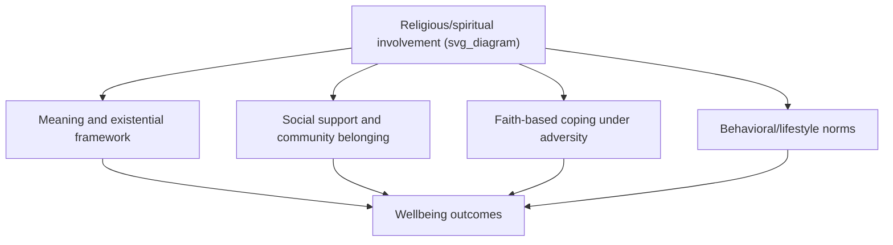

## Religion, Spirituality, and Well-Being Across Cultures

### Definition and Core Concept

Religion, spirituality, and wellbeing across cultures examines the empirical relationship between religious and spiritual involvement and dimensions of wellbeing (life satisfaction, meaning, resilience, mental health outcomes), while attending to how this relationship varies across religious traditions, cultural contexts, and levels of secularization. This topic connects the existential/faith-based conceptions of the good life introduced earlier in this chapter (Wong's tragic optimism, faith as a component of self-transcendence) with a broader empirical and comparative literature on religiosity and wellbeing.

### Distinguishing Religion from Spirituality

**Key Points:**

- **Religion** typically refers to an organized system of beliefs, practices, rituals, and communal structures oriented around the sacred or transcendent, usually embedded within institutional structures (churches, temples, mosques, synagogues) and often including shared doctrine and communal identity.
- **Spirituality** is typically defined more broadly and individually — a personal sense of connection to something greater than oneself, meaning, or transcendence, which may or may not be embedded within organized religious institutions or doctrine.
- This distinction matters methodologically: measures of "religiosity" (attendance, doctrinal belief, denominational affiliation) and measures of "spirituality" (subjective transcendence, sense of the sacred, spiritual practices outside institutional contexts) can diverge substantially, particularly in increasingly secularized societies where individuals may report high spirituality with low institutional religious involvement.

### Proposed Mechanisms Linking Religion/Spirituality to Wellbeing

**Key Points:**

- **Meaning and existential framework provision** — Religious and spiritual traditions typically supply a coherent framework for understanding suffering, mortality, and purpose, directly connecting to the existential positive psychology and tragic optimism material covered earlier in this chapter, where faith is explicitly identified as one of the five interlocking components of tragic optimism, alongside courage, self-transcendence, affirmation of life's intrinsic meaning, and acceptance of the horrors of being.
- **Social support and community** — Religious institutions frequently provide dense social networks, mutual aid, and communal ritual, which may confer wellbeing benefits through social-relational pathways rather than, or in addition to, purely doctrinal or spiritual mechanisms — this raises a persistent methodological question of whether religiosity's association with wellbeing is attributable to belief content, communal belonging, or both.
- **Coping resources under adversity** — Faith-based coping (e.g., prayer, religious reappraisal, trust in divine providence) has been proposed as a resource particularly salient under conditions of extreme or uncontrollable adversity, directly paralleling Wong's argument that conventional American models of optimism are inapplicable to prolonged traumas such as the Holocaust, and that only a faith-based tragic optimism can sustain hope in situations beyond human control.
- **Behavioral and lifestyle pathways** — Many religious traditions prescribe behavioral norms (e.g., restrictions on substance use, prescribed rest days, dietary practices) that may indirectly influence wellbeing and health outcomes through behavioral rather than purely psychological or spiritual channels.

### Illustration of Proposed Pathways

### Cross-Cultural and Cross-Traditional Variation

**Key Points:**

- The strength and even the direction of religion-wellbeing associations is not uniform across religious traditions, national contexts, or levels of societal secularization; a given religious practice's wellbeing relevance is shaped by the surrounding cultural and normative context in which it is embedded (paralleling the appraisal principle from second-wave positive psychology, which holds that valence judgments about a phenomenon depend on context). [Inference: this is a general synthesis consistent with the broader cross-cultural wellbeing literature discussed in this chapter, rather than a specific finding drawn from a single cited source in this response.]
- Faith-based frameworks intersect distinctly with the individualist/collectivist distinction introduced earlier in this chapter: in more collectivist religious contexts, religious identity and practice may be inseparable from family and community role fulfillment, such that religiosity's wellbeing benefits may operate substantially through relational/collective pathways; in more individualist contexts, religiosity or spirituality may be pursued and experienced as a more personally chosen, internally oriented practice.
- Non-Western contemplative traditions (e.g., Buddhist frameworks, discussed under cross-cultural conceptions of the good life) offer wellbeing models structurally distinct from Abrahamic faith traditions — locating wellbeing in reduction of attachment, acceptance of impermanence, and cultivation of equanimity rather than primarily in faith, doctrine, or divine relationship — indicating that "religion/spirituality and wellbeing" is not a single relationship but a family of related, tradition-specific relationships.
- PP 2.0's engagement with Taoism and the Yin-Yang dialectic (introduced under indigenous psychology as a pillar of second-wave thought) represents a further distinct spiritual-philosophical tradition informing wellbeing theory, oriented around balance and complementarity of opposites rather than either faith-based transcendence or contemplative non-attachment.

### Faith and Tragic Optimism Under Extreme Adversity

**Key Points:**

- As detailed under self-transcendence and meaning under adverse conditions earlier in this course, Wong's tragic optimism model explicitly incorporates faith or trust as one of its five components, alongside courage, self-transcendence, affirmation of life's meaning, and acceptance of the horrors of being — situating faith not as incidental to wellbeing under extreme adversity but as structurally necessary to it within this framework.
- This model was explicitly informed by Viktor Frankl's experience and theorizing during the Holocaust, in which Frankl affirmed the intrinsic meaning and values of life and had faith in transforming trauma into human achievement through the meaning of self-transcendence, despite accepting the horrors of living and a tragic sense of life.
- Faith in this framework is explicitly characterized as hope grounded in what is not yet visible: hope is likened to oxygen, necessary to move forward, but under conditions that seem hopeless from a purely human standpoint, tragic optimism specifically requires faith, described as confidence in what is hoped for and assurance about what is not yet seen.

### Methodological Considerations

**Key Points:**

- Research on religion/spirituality and wellbeing is subject to the same correlational-versus-causal cautions introduced earlier in this course: cross-sectional associations between religiosity and wellbeing are vulnerable to reverse causation (wellbeing may facilitate religious engagement, e.g., through social capacity and energy for communal participation) and third-variable confounding (social support, socioeconomic stability, and health status may independently drive both religiosity and wellbeing).
- Measurement instruments for religiosity/spirituality developed within one tradition (e.g., Christian-normed scales assessing church attendance and belief in a personal God) may not validly transfer to traditions with substantially different structures (e.g., non-theistic Buddhist practice, ancestor-veneration traditions, or Indigenous cosmo-centric spiritual frameworks referenced under Indigenous resilience research), raising the same construct-validity and measurement-invariance concerns discussed under WEIRD-sample and cross-cultural happiness research.
- As with other second-wave and existential-positive-psychology constructs, much of the theoretical case for faith's role in wellbeing under extreme adversity rests on qualitative, clinical, and philosophical argument (e.g., Frankl's own testimony and logotherapeutic theory) rather than large-scale experimental designs — a reflection of the practical and ethical impossibility of experimentally manipulating exposure to extreme adversity, a limitation already noted in relation to self-transcendence research earlier in this chapter.

### Example

**Example:**

A quantitative study comparing bereaved individuals across a religious and a secular sample might find that religious affiliation predicts higher long-term meaning-in-life scores. A purely correlational reading might conclude religion directly causes better bereavement adjustment. Applying the cautions above: the religious sample may also have had denser pre-existing social support networks (a confound), individuals with greater baseline coping capacity may have been more likely to remain religiously engaged through the bereavement process (a selection effect), and the very meaning-in-life instrument used may better capture religiously-framed meaning constructs than secular equivalents (a measurement-validity concern) — all of which must be considered before drawing a causal or universally generalizable conclusion about religion's wellbeing benefits.

### Applied and Clinical Implications

**Key Points:**

- Clinical and counselling approaches consistent with second-wave positive psychology (e.g., Wong's Meaning-Centered Counselling) explicitly draw on faith and spiritual/existential frameworks as legitimate resources within a broader meaning-making therapeutic approach, rather than treating religious and spiritual content as outside the scope of psychological intervention.
- Given the cross-cultural and cross-traditional variation documented above, culturally and religiously responsive practice would require clinicians to understand a client's specific tradition's framework for meaning, suffering, and transcendence, rather than assuming a generic "spirituality" construct applies uniformly — directly paralleling the emic, tradition-specific approach recommended under indigenous psychology and cross-cultural conceptions of the good life.

### Critical Considerations

**Key Points:**

- Findings and frameworks reviewed in this topic draw substantially on Abrahamic (particularly Christian) faith traditions and on Wong's Frankl-derived tragic optimism model; the specific applicability of the faith-as-necessary-component claim to non-theistic or non-Abrahamic traditions (e.g., Buddhist, Confucian, Indigenous cosmo-centric frameworks discussed elsewhere in this chapter) is not established by the sources reviewed here and should be treated as a distinct, tradition-specific question rather than assumed to generalize. [Unverified: cross-traditional applicability of the specific "faith or trust" component of tragic optimism, as distinct from the broader existential-meaning components, is not established by the sources reviewed for this response.]
- As with other constructs in this course reliant on self-report and cross-sectional designs, causal claims about religion or spirituality "improving" wellbeing should be treated with the same scrutiny applied throughout this course to happiness-related causal claims generally.

### Related Topics

- Self-transcendence and meaning under adverse conditions
- Paul Wong's PP 2.0 and existential positive psychology
- Cross-cultural conceptions of happiness and the good life
- Indigenous psychology as a pillar of second-wave thought
- Indigenous and non-Western resilience frameworks
- Distinguishing correlational claims from causal claims about happiness
- Meaning-Centered Counselling and Meaning Therapy
- WEIRD samples and generalizability concerns (measurement transfer across traditions)