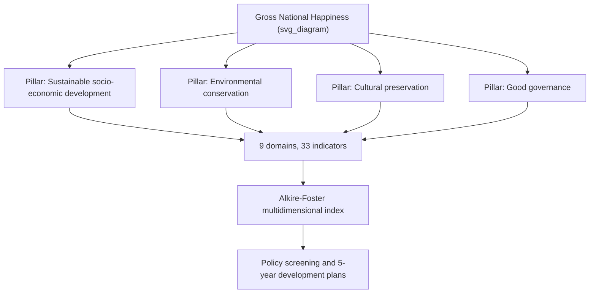
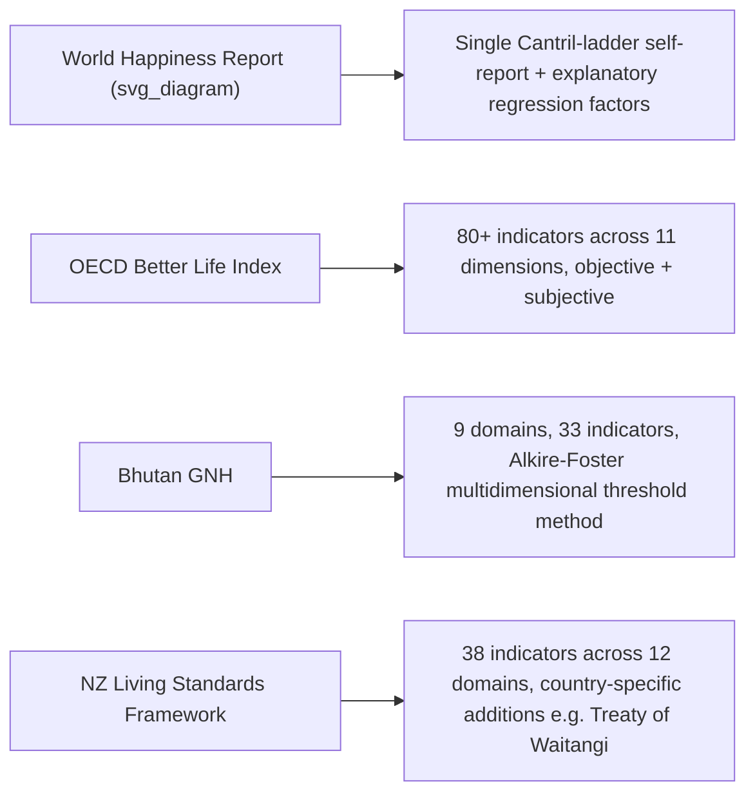

## Gross National Happiness and Other National Well-Being Frameworks

### Definition and Core Concept

National wellbeing frameworks are government-adopted measurement systems that use multidimensional indicators of population wellbeing — rather than, or alongside, Gross Domestic Product (GDP) — to assess national progress and inform policy. The most historically prominent of these is Bhutan's **Gross National Happiness (GNH)**, but the approach has since been extended and adapted by numerous other national and international bodies, including the OECD Better Life Index, the World Happiness Report, and New Zealand's Living Standards Framework. This topic connects the cross-cultural conceptions of the good life covered earlier in this chapter to the concrete policy and measurement instruments through which nations have operationalized those conceptions at scale.

### Gross National Happiness (GNH): Origins and Philosophy

**Key Points:**

- The term "Gross National Happiness" was coined by Bhutan's Fourth King, Jigme Singye Wangchuck, in the late 1970s, who famously declared that Gross National Happiness is more important than Gross Domestic Product.
- Gross National Happiness is inspired by the Buddhist concept of "The Middle Path" and seeks to balance multiple goals, directly connecting to the Buddhist contemplative traditions discussed under cross-cultural conceptions of the good life earlier in this chapter — the framework is explicitly rooted in a non-Western, non-hedonic philosophical tradition rather than adapted from Western wellbeing science.
- The Gross National Happiness Index was formally instituted as a goal of the government of Bhutan in the Constitution of Bhutan, enacted on 18 July 2008, giving it constitutional rather than merely programmatic status.
- The GNH Index moves beyond a mere subjective psychological ranking of "happiness," instead offering a holistic reflection of the overall wellbeing of the Bhutanese population, integrating both traditional socio-economic concerns and less traditional aspects of culture, community vitality, and psychological wellbeing.

### The Four Pillars and Nine Domains

**Key Points:**

- According to the Bhutanese government, the four pillars of GNH are: sustainable and equitable socio-economic development; environmental conservation; preservation and promotion of culture; and good governance.
- These four pillars have been further classified into **nine domains**: psychological wellbeing, health, time use, education, cultural diversity and resilience, good governance, community vitality, ecological diversity and resilience, and living standards.
- Each domain is composed of both subjective (survey-based) and objective indicators, combining self-reported experience with measurable external conditions — methodologically distinguishing GNH from purely subjective-wellbeing measures like a single life-satisfaction question.
- The GNH Index incorporates nine domains and 33 indicators, and is evaluated through national surveys undertaken every three to five years, representative at both national and regional (rural and urban) levels.

### Measurement Methodology: The Alkire-Foster Method

**Key Points:**

- The GNH Index is calculated using the **Alkire-Foster method**, a multidimensional measurement method originally developed for, and known for its comprehensive and robust assessment of, poverty measurement — repurposed here to assess multidimensional happiness/wellbeing rather than deprivation alone.
- For policy purposes, the methodology identifies "happy people" as those achieving sufficient attainment in 66% of the weighted indicators, regardless of which domains those achievements come from — this threshold approach distinguishes between people who are "deeply" or "extensively" happy (making up the officially "happy" population) versus "narrowly" happy or "unhappy" people (classified as "not-yet-happy," presumed to lack some causes and conditions of wellbeing).
- According to the 2022 GNH Index, 48.1% of those aged 15 years and above were classified as happy, an increase from 40.9% in 2010 — providing a concrete, trackable national time-series metric distinct from GDP growth figures.
- This thresholded, multidimensional structure is explicitly different from — and more complex than — a single self-reported happiness score, reflecting the framework's aim to combine subjective experience with objective, policy-actionable indicators.

### Illustration of the GNH Structure

### Application to Policy

**Key Points:**

- The Bhutanese government uses a policy screening tool to help the GNH Commission assess policy proposals against the Gross National Happiness framework and set conditions for businesses to add value to society and the environment — GNH functions as an active gatekeeping mechanism for government and business decision-making, not merely a retrospective measurement exercise.
- Bhutan's GNH survey results are used directly for five-year development plans and for reporting on budgets tied to those plans, embedding the index into the core machinery of national planning rather than treating it as a supplementary statistic.

### Other National and International Wellbeing Frameworks

**OECD Better Life Index / "How's Life?" framework:**

- The OECD Better Life Index is architecturally different from single-question happiness measures: it combines more than 80 statistical indicators across 11 dimensions, mixing objective data (e.g., actual homicide rates, actual hours worked, actual air pollution levels) with survey responses, covering domains including housing, income, jobs, education, the environment, quality of social support network, governance, health, life satisfaction, safety, and work-life balance.

**World Happiness Report:**

- The World Happiness Report ranks countries annually on their subjective wellbeing, relying primarily on a single self-reported measure — the Cantril ladder, where respondents rate their life from 0 (worst possible) to 10 (best possible) — and then models how much of that score can be statistically explained by factors such as GDP per capita, social support, healthy life expectancy, freedom, generosity, and corruption, relative to a hypothetical baseline country ("Dystopia").
- This report has proposed further refined units such as "wellbys," a unit of wellbeing combining length of life with average happiness per year, analogous to quality-adjusted life years already used in health economics, intended to allow wellbeing impact to be assessed across all policy areas, not just health.

**New Zealand's Living Standards Framework and "Wellbeing Budget":**

- New Zealand's Living Standards Framework (LSF) bears close similarities to the OECD's Better Life Index; the LSF dashboard comprises 38 indicators across 12 wellbeing domains, with measurements of inequalities across different population groups for nine of those domains.
- In 2019, the New Zealand government introduced what it called a "well-being budget," explicitly allocating resources based on which investments would most improve life satisfaction and mental health outcomes rather than GDP growth — one of the most cited real-world applications of a national wellbeing framework directly to fiscal policy.
- New Zealand's parallel Stats NZ wellbeing indicator framework, Indicators Aotearoa New Zealand (IANZ), includes measures of how New Zealand interacts with the wellbeing of the rest of the world, and the LSF explicitly incorporates considerations unique to New Zealand, such as Treaty of Waitangi obligations — directly illustrating the cultural-specificity principle discussed earlier in this chapter, since the framework is deliberately adapted rather than imported wholesale from an international template.
- Notably, despite the "well-being budget" branding, life satisfaction did not, as of the cited 2022 report, have any formal role in New Zealand's budgeting process or wellbeing objectives beyond a mention of "mental well-being" — illustrating a documented gap between a wellbeing framework's stated philosophy and its concrete operational integration into policy mechanics.

**Broader movement:**

- Beyond Bhutan and New Zealand, Scotland, Iceland, Finland, and Wales have joined what researchers describe as an emerging wellbeing economy movement, formally committing to governance frameworks that prioritize population wellbeing alongside economic metrics; the United Arab Emirates has also incorporated happiness into governance via a Minister of State for Happiness and a National Programme for Happiness and Positivity, built on three pillars: inclusion of happiness in the policies, programmes, and services of all government bodies and at work; promotion of positivity and happiness as a lifestyle; and development of benchmarks and tools to measure happiness.

### Illustration Comparing Framework Architectures

### Methodological and Political Considerations

**Key Points:**

- Selecting a national wellbeing framework involves both technical and political credibility considerations: political credibility is enhanced when a measure is designed by internationally well-respected, apolitical bodies (such as the OECD or UN), while technical credibility depends on criteria such as comprehensiveness and methodological robustness — this is an explicit consideration documented in New Zealand Treasury's own framework-selection discussion paper.
- The Social Progress Index, by contrast, is not backed by a major international governmental organization like the OECD or UN, illustrating that not all competing wellbeing frameworks carry equivalent institutional backing, which can affect their political adoption and durability even when methodologically comparable.
- The UN Sustainable Development Goals (SDGs) are explicitly distinguished from measurement frameworks in this literature: the SDGs are goals rather than measures and, as such, do not make a good measurement framework on their own — a relevant distinction for understanding why countries often pair SDG commitments with a separate wellbeing measurement instrument like GNH or the LSF.
- Whether wellbeing-economy governance commitments (e.g., by Scotland, Iceland, Finland, and Wales) translate into durable policy change is still being evaluated, indicating that adoption of a national wellbeing framework does not, on its own, guarantee sustained implementation or policy impact.

### Relationship to Broader Themes in This Chapter

**Key Points:**

- GNH's explicit Buddhist philosophical grounding, and its integration of cultural diversity and resilience as a named domain, directly instantiates the indigenous-psychology and cross-cultural conceptions of the good life material covered earlier in this chapter at the level of national policy rather than individual-level theory or intervention.
- The persistent methodological question of whether a single summary wellbeing number (as GDP arguably provided, even if narrowly) should exist for these multidimensional frameworks parallels the measurement-validity tensions discussed under cross-cultural happiness research: multidimensional frameworks capture more nuance but sacrifice the simple comparability that single-indicator measures (like GDP or the Cantril ladder) provide.
- These frameworks are also subject to the same correlational-versus-causal caution introduced earlier in this course: a national wellbeing framework demonstrating that, say, higher community vitality scores correlate with higher overall GNH attainment does not by itself establish that policy interventions targeting community vitality will causally raise national happiness, particularly given the complex, multidimensional, and interacting nature of the underlying indicators.

### Example

**Example:**

A hypothetical policy proposal to build a new highway through a rural region might, under a GDP-only framework, be evaluated purely by projected economic output gains. Passed through Bhutan's GNH policy screening tool, the same proposal would additionally be assessed against its effects on the ecological diversity and resilience domain (environmental impact of construction), the cultural diversity and resilience domain (potential disruption to traditional community practices or land use), and the community vitality domain (effects on existing social networks and local governance structures) — potentially altering or blocking a policy that would pass a purely GDP-based cost-benefit test.

### Related Topics

- Cross-cultural conceptions of happiness and the good life
- Indigenous psychology as a pillar of second-wave thought
- Religion, spirituality, and well-being across cultures
- Individualist versus collectivist models of well-being
- WEIRD samples and generalizability concerns
- Distinguishing correlational claims from causal claims about happiness
- The Alkire-Foster multidimensional poverty and wellbeing measurement method
- OECD Better Life Index and World Happiness Report methodology comparisons