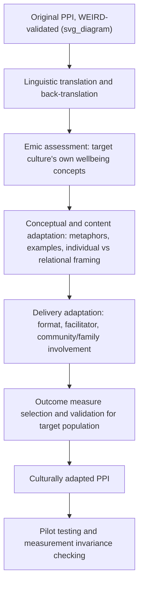

## Adapting Positive Psychology Interventions Across Cultural Contexts

### Definition and Core Concept

Adapting positive psychology interventions across cultural contexts refers to the systematic process of modifying positive psychology interventions (PPIs) — originally developed and validated predominantly in WEIRD populations — so that their content, delivery, and outcome measurement remain valid, acceptable, and effective when applied in different cultural, linguistic, and socioeconomic contexts. This topic synthesizes and operationalizes several threads developed earlier in this course: the WEIRD-sample generalizability critique, the individualist/collectivist wellbeing distinction, indigenous psychology as a PP 2.0 pillar, and cross-cultural conceptions of happiness and the good life.

### Why Adaptation Is Necessary

**Key Points:**

- Positive psychology's conceptualizations of wellbeing have been criticized as culturally specific, reflecting the North American context in which the field emerged, since concepts have largely been derived from research with WEIRD participants while the field has often tended to presume these findings can be generalized to other cultures — direct transplantation of an intervention without adaptation risks importing this bias into new populations.
- Documented equity gaps in intervention efficacy provide a direct empirical motivation: some evidence has shown that brief happiness-inducing positive psychology strategies performed poorly for people who seemed to have the greatest need, suggesting standard PPI protocols may not transfer uniformly even within a single cultural context, let alone across cultures.
- Individualist-oriented intervention content (e.g., personal gratitude journaling, individual best-possible-self exercises, individual strengths-spotting) reflects a self-focused model of wellbeing; in collectivist contexts, where wellbeing and flourishing depend on role fulfillment and social harmony as inseparable from individual wellbeing, such interventions may target a construct that is not the primary locus of wellbeing for that population.
- Measurement-validity concerns compound intervention-design concerns: self-report scales developed and validated in English with WEIRD populations may not have equivalent psychometric properties when translated and administered elsewhere, meaning even a well-adapted intervention could appear ineffective (or effective) due to outcome-measurement artifacts rather than true intervention effects.

### Levels of Cultural Adaptation

**Key Points:**

- **Surface-level (linguistic) adaptation** — Direct translation and back-translation of intervention materials and instructions into the target language, checking for accurate literal meaning. This is necessary but insufficient on its own, since linguistic accuracy does not guarantee conceptual or cultural equivalence.
- **Deep-level (conceptual/cultural) adaptation** — Modifying the intervention's underlying content, metaphors, examples, and theoretical framing to align with the target culture's own values, norms, and conception of the good life, consistent with the emic approach introduced under WEIRD-sample correctives (starting from local conceptions of wellbeing rather than assuming imported constructs translate directly).
- **Structural/delivery adaptation** — Modifying how the intervention is delivered (individual vs. group format, involvement of family or community members, integration with existing cultural or religious practices, choice of facilitator) rather than only its content.
- **Outcome-measurement adaptation** — Selecting or developing outcome measures that are validated for, and conceptually appropriate to, the target population, rather than defaulting to the original instrument used in the source-culture validation study.

### Illustration of the Adaptation Process

### Community-Based and Participatory Approaches

**Key Points:**

- **Community-based participatory research (CBPR)** — Involving target communities in study and intervention design to ensure constructs and measures are locally meaningful rather than imported wholesale, a corrective introduced under WEIRD-sample methodology and directly applicable to intervention adaptation.
- Genuine community leadership in this process is treated as an ethical necessity, not merely good practice, in the Indigenous resilience research covered earlier in this chapter: Indigenous communities can be supported to lead the design of research, own the data, and decide how widely and to whom to disseminate findings — a principle directly transferable to PPI adaptation and evaluation.
- Cultural Advisory Group involvement — where local community representatives participate in and approve the design, analysis, and interpretation of intervention research — represents a concrete institutional mechanism for operationalizing this participatory principle, as documented in the Aboriginal resilience research discussed under Indigenous and non-Western resilience frameworks.

### Structural Reframing for Collectivist Contexts

**Key Points:**

- Interventions originally framed around individual self-focus (e.g., "identify your own top strengths") can be restructured around relational or family units (e.g., identifying strengths within the family system, or exercises performed collectively with family or community members), consistent with the collectivist wellbeing model in which "you can't pull individual happiness and family happiness apart," as documented in Māori wellbeing research discussed earlier in this chapter.
- Gratitude-based interventions can be reframed from an individually expressive format (e.g., writing a personal gratitude letter to be read aloud) toward formats consistent with cultural norms around modesty and indirect expression, where public individual emotional expression may be less normatively comfortable than in the originating cultural context.
- Meaning-centered and existential interventions (drawing on Wong's PP 2.0 and tragic optimism, covered earlier in this course) may require particular attention to the specific faith, spiritual, or philosophical tradition of the target population — a Buddhist-influenced population's framework for meaning-making through suffering (rooted in non-attachment and impermanence) differs structurally from a Christian population's framework (rooted in faith and divine providence), and intervention content should reflect this rather than assuming a generic "meaning" construct applies uniformly.

### Measurement Adaptation: Beyond Translation

**Key Points:**

- **Measurement invariance testing** — Statistically testing (e.g., via multi-group confirmatory factor analysis) whether an adapted instrument measures the same underlying construct with the same factor structure across the source and target cultural groups before treating pre/post intervention score changes as directly comparable to the original validation population's results.
- **Response-style correction** — Given documented cross-cultural variation in acquiescence bias, extreme response style, and social-desirability norms, adapted PPI evaluations should account for these response-style differences rather than treating raw score changes as directly interpretable in the same way across cultural groups.
- **Emic outcome supplementation** — Alongside adapted versions of standard instruments, incorporating culturally specific outcome indicators (e.g., family harmony indices, community-connectedness measures, culturally validated strength-based tools as documented in Aboriginal resilience research) can capture wellbeing changes that a translated Western instrument alone might miss.

### Example

**Example:**

A gratitude-journaling intervention, originally validated in a U.S. undergraduate sample (individual weekly letters expressing personal gratitude, outcome measured via an individual life-satisfaction scale), is being adapted for delivery in a collectivist, extended-family-oriented cultural context. A surface adaptation would simply translate the instructions and the life-satisfaction scale into the target language. A deep adaptation would instead: reframe the exercise as a family gratitude practice performed collectively rather than individually; adjust the format from written letters (which may feel unusually direct or individually self-focused) toward an oral or ritual practice consistent with existing cultural norms of expressing appreciation within family gatherings; supplement the translated life-satisfaction scale with a locally validated family-harmony or community-connectedness measure; and pilot-test the adapted protocol with community input before full-scale evaluation, checking for measurement invariance between the adapted outcome measure and its original-language counterpart.

### Evaluating Adapted Intervention Efficacy

**Key Points:**

- Adapted PPIs should ideally be evaluated using the same evidentiary standards discussed under publication bias and effect-size inflation earlier in this course: preregistration, adequate statistical power, and attention to whether reported effect sizes in adaptation studies might themselves be subject to publication bias (e.g., successful, novel cultural adaptations may be more likely to be published than adaptations that showed no improvement over the unadapted version).
- Distinguishing correlational from causal claims (covered earlier in this course) remains equally relevant here: a culturally adapted intervention showing pre/post improvement in a target population does not, without a proper control condition, establish that the adaptation itself (rather than time, regression to the mean, or general intervention-contact effects) caused the improvement.
- Because developmental specificity (Luthar's critique) applies within cultures as much as across them, adaptation should also consider age, socioeconomic status, and other within-population moderators — a PPI adapted successfully for one demographic subgroup within a target culture may still require further adaptation for other subgroups within that same culture.

### Critical Considerations

**Key Points:**

- There is a risk of superficial ("checkbox") cultural adaptation — translating language and inserting culturally familiar imagery or examples without addressing the deeper conceptual and structural mismatches (individualist vs. collectivist framing, differing conceptions of the good life) discussed throughout this chapter; genuine adaptation requires engaging with the target culture's own emic conception of flourishing, not merely localizing surface content. [Inference: this is a general methodological caution consistent with the emic/etic distinction and community-based participatory research principles discussed throughout this course, rather than a claim drawn from a specific named study.]
- Adaptation work should avoid essentializing entire cultures as uniformly collectivist or individualist; as noted under individualist versus collectivist models of wellbeing, substantial within-culture heterogeneity exists, and adapted interventions may still need further tailoring for subpopulations that diverge from a culture's modal orientation.
- Much of the specific empirical evidence base for PPI cultural adaptation efficacy remains less developed than the evidence base for the original, WEIRD-validated interventions, given the field's historically WEIRD-centered research infrastructure; this is itself a direct consequence of the funding, infrastructure, and publication concentration patterns discussed under WEIRD-sample generalizability concerns earlier in this course. [Inference: general observation about the relative empirical maturity of this research area, consistent with previously covered structural factors, rather than a specific figure or study finding.]

### Related Topics

- WEIRD samples and generalizability concerns
- Individualist versus collectivist models of well-being
- Indigenous psychology as a pillar of second-wave thought
- Cross-cultural conceptions of happiness and the good life
- Indigenous and non-Western resilience frameworks
- Religion, spirituality, and well-being across cultures
- Publication bias and effect-size inflation in intervention research
- Measurement invariance and psychometric equivalence testing
- Luthar's critique of resilience as a static trait and the call for developmental specificity